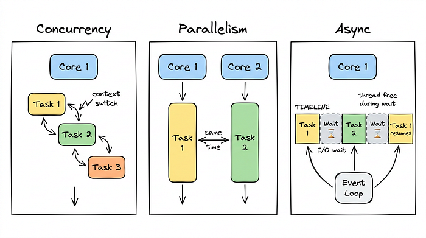
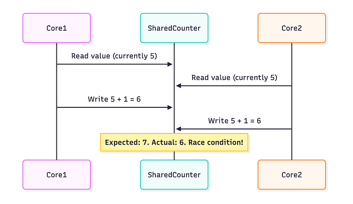
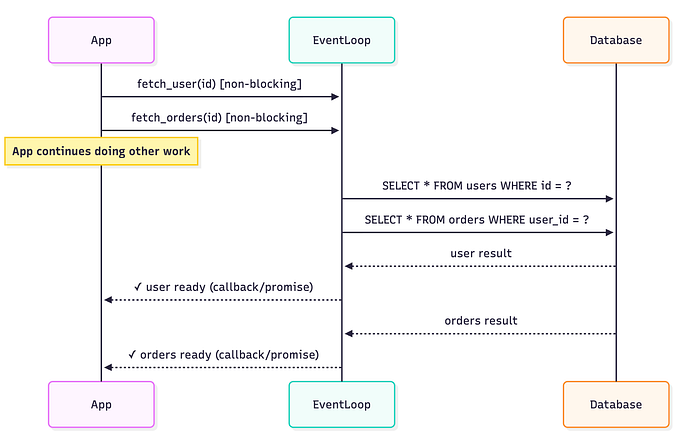
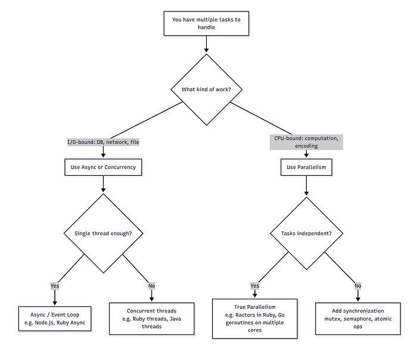
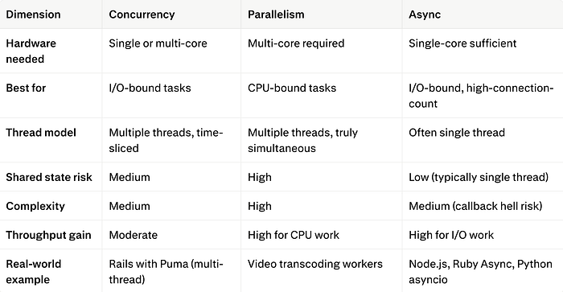

# Concurrency, Parallelism, and Async: Three Ideas That Sound the Same But Aren’t

*A guide to how modern software handles multiple tasks — with diagrams, code, and zero hand-waving.*

*Published Mar 26, 2026 · Updated Apr 21, 2026 · Free: No*

Every developer has heard these three words. Most have used them in the same sentence. Many use them interchangeably. But concurrency, parallelism, and asynchronous programming are three distinct ideas, and confusing them leads to real bugs, bad architecture decisions, and interviews gone wrong.

This article takes each concept apart, builds it back up from scratch, and shows you exactly when and why you would reach for one over another.

> **Not a Medium member?** Read the full article for free [here](https://medium.com/code-like-a-girl/concurrency-parallelism-async-47312e0be553?sk=13913c7a76e61b4910f6539d217ae954).| [Git handbook](https://alinakovtun.gumroad.com/l/git-handbook) | [Auth basics](https://alinakovtun.gumroad.com/l/auth-basics) | [Career bundle](https://alinakovtun.gumroad.com/l/career-cv)



### Why This Confusion Exists?

The root problem is that all three concepts deal with the same surface-level question: **_"How do I make my program handle more than one thing?"_** But the answers they give are fundamentally different.

Think of it this way. A chef is preparing a three-course dinner alone. She can start boiling the pasta, then chop vegetables while the water heats — that is **concurrency**. If the restaurant hires a second chef who works simultaneously on the salad — that is **parallelism**. And when she puts a timer on the oven and goes to serve another table instead of standing there watching — that is the essence of **async**. Same kitchen, but very different strategies.

### Concurrency: Juggling, not doing two things at once

Concurrency means that multiple tasks are **_in progress_** at the same time, but not necessarily **_executing_** at the same time. On a single CPU core, the processor switches between tasks so rapidly that it _feels_ simultaneous — but only one instruction runs at any given clock cycle.

This is called **time-slicing** or **context switching**. The operating system assigns small time slots to each task, pauses it, saves its state, and switches to the next. From the outside, it looks like parallel work. Under the hood, it is extremely fast turn-taking.


Notice that at no moment do both tasks run together — they take turns. The total wall-clock time is not reduced — but the system _feels_ more responsive because neither task waits in line while the other finishes completely.

Concurrency is ideal for **I/O-bound tasks**: reading files, querying a database, or waiting for a network response. In all these cases, the CPU sits idle during the wait — concurrency lets you use that idle time productively.

### Parallelism: Truly doing things simultaneously

Parallelism is when multiple tasks execute **_at the exact same moment_**_,_ each on its own CPU core. There is no turn-taking. Two cores mean two instructions per clock cycle.


This is the actual speedup people imagine when they say "I'll just make it multi-threaded." But there is a crucial condition: **you must have more than one physical CPU core**, and the tasks must not depend on each other (otherwise they still have to wait).

Parallelism shines for **CPU-bound tasks**: image processing, video encoding, matrix multiplication, machine learning inference. These problems can be divided into independent chunks and processed simultaneously with linear (or near-linear) speed gains.

### The Price of Parallelism

Parallelism introduces **shared state problems**. When two cores write to the same memory location simultaneously, the result is undefined — this is called a **race condition**. Managing it requires synchronization primitives like mutexes, semaphores, or atomic operations, which add complexity and can themselves become bottlenecks (a phenomenon called **lock contention**).



This is why parallel code is harder to write correctly than concurrent code — and why many bugs in multi-threaded systems are subtle and non-deterministic.

### Async I/O: Waiting Without Blocking

Asynchronous programming is a **_programming model_**, not a hardware property. It answers a different question: **_how can a single thread handle many tasks efficiently by never sitting idle?_**

The core idea is the **event loop**. Instead of blocking a thread while waiting for a response (say, a database query), an async system registers a callback or a continuation, releases the thread, and picks up where it left off when the response arrives.



Both queries were initiated almost simultaneously, even though there is only one thread. The total wait time is roughly `max(t_user, t_orders)` instead of `t_user + t_orders`. This is the key efficiency gain.

Async code uses special syntax in most languages — `async/await` in JavaScript, Python, and Rust; fibers in Ruby; goroutines in Go. The runtime transforms your linear-looking code into a state machine that pauses and resumes at `await` points.

Here is an example in Ruby using fibers to simulate async behavior:

```ruby
require 'fiber'

fetch_user = Fiber.new do
  puts "Fetching user..."
  sleep(1) # simulates DB wait
  Fiber.yield "User: Alice"
end

fetch_orders = Fiber.new do
  puts "Fetching orders..."
  sleep(1) # simulates DB wait
  Fiber.yield "Orders: [#1, #2, #3]"
end

# Both fibers run cooperatively — neither blocks the other
user   = fetch_user.resume
orders = fetch_orders.resume

puts user
puts orders
```

In production Ruby on Rails applications, the Async gem or Falcon web server enables true async I/O using this fiber-based model, allowing a single Rails process to handle many simultaneous requests without spawning thousands of threads.

### How They Relate?

These three concepts are not mutually exclusive. In fact, real-world systems combine all three.



**_<mark class="bg-emerald-300 dark:bg-emerald-700 dark:text-white">Concurrency is about structure</mark>_**<mark class="bg-emerald-300 dark:bg-emerald-700 dark:text-white"> (how you design the program to handle multiple tasks), while </mark><mark class="bg-emerald-300 dark:bg-emerald-700 dark:text-white">**_parallelism is about execution_**</mark><mark class="bg-emerald-300 dark:bg-emerald-700 dark:text-white"> (whether those tasks physically run at the same time). </mark><mark class="bg-emerald-300 dark:bg-emerald-700 dark:text-white">**_Async_**</mark><mark class="bg-emerald-300 dark:bg-emerald-700 dark:text-white"> is a specific technique that achieves concurrency without requiring multiple threads at all.</mark>

Rob Pike, co-creator of Go, captured this perfectly: _"Concurrency is about dealing with lots of things at once. Parallelism is about doing lots of things at once."_



### Decision Framework

When you face a performance or scaling problem, ask these four questions in order:

**1. Is the bottleneck CPU or I/O?**
Profile first. Most web applications are I/O-bound — the database, the cache, and external APIs account for 80–95% of response time. Adding parallelism to an I/O-bound problem often changes nothing.

**2. How many tasks are running simultaneously?**
Dozens of threads are fine. Thousands of threads are expensive — each Ruby or Java thread consumes ~1–8 MB of stack memory. If you expect thousands of simultaneous connections, async is far more memory-efficient.

**3. Do tasks share state?**
If yes, every option becomes more complex. Async with a single event loop naturally avoids this problem. Parallelism requires careful locking or immutable data structures.

**4. What does your runtime support well?**
Ruby's GVL (Global VM Lock) prevents true parallelism for Ruby threads — but Ractors, introduced in Ruby 3.0, allow true parallel execution with isolated state. Node.js is single-threaded with async I/O by design. Go was built from day one for concurrent goroutines with cheap thread-like primitives.

### What Ruby gets right and where it struggles

Ruby is a useful lens here because its evolution mirrors the industry's understanding of these concepts.

Classic Ruby (MRI) uses a **GVL** (Global VM Lock, also called GIL): only one Ruby thread runs at a time, even on multi-core machines. This eliminates race conditions in most cases — but it also means Ruby threads give you concurrency, not parallelism. For I/O-bound Rails apps, this is fine: the GVL is released during I/O operations, so threads _do_ run concurrently during database waits.

Ruby 3.x introduced **Ractors** for true parallelism with actor-model isolation — each Ractor has its own heap, and they communicate via message passing. This eliminates shared state entirely, at the cost of stricter constraints on what objects can cross Ractor boundaries.

```ruby
# Ruby 3.x Ractor example — true parallel execution
ractor1 = Ractor.new { (1..10_000).reduce(:+) }
ractor2 = Ractor.new { (10_001..20_000).reduce(:+) }

result = ractor1.take + ractor2.take
puts result  # => 200_010_000
# Both Ractors run on separate OS threads, truly in parallel
```

Meanwhile, the `async` gem brings cooperative concurrency (event-loop style) to Ruby, letting you write async code that looks synchronous — a pattern Ruby developers familiar with Rails will find natural.

### The Amdahl's Law

Before you rush to parallelize everything, there is one inconvenient truth: [Amdahl's Law](https://en.wikipedia.org/wiki/Amdahl%27s_law).

If only a fraction `p` of your program can be parallelized, the maximum theoretical speedup `S` with `N` processors is:

$$
S(N)=\frac{1}{(1-p)+\frac{p}{N}}
$$

If 50% of your code is inherently sequential (serial), the maximum speedup you can ever achieve — with infinite cores — is **2x**. Not 100x. Not even 10x.

This is why profiling matters before optimizing. A program that spends 90% of its time in a serial bottleneck will never benefit meaningfully from parallelism, no matter how many cores you throw at it.

### Common misconceptions

**_"Multi-threading always makes things faster."_**
Only if the work is CPU-bound, the tasks are truly independent, and you have spare cores. For I/O-bound code on a properly configured async server, multi-threading adds overhead with no benefit.

**_"Async means parallel."_**
No. A Node.js or Ruby Async server uses a single thread. Two requests are handled concurrently (interleaved), but never simultaneously. For CPU-intensive work, async offers zero advantage.

**_"Concurrency is dangerous."_**
It depends on how you implement it. Async with a single event loop is remarkably safe. Shared-state multi-threading is where the danger lives. Actor models (like Ractors or Erlang processes) eliminate shared state and make concurrent systems much safer.

**_"The GVL makes Ruby threads useless."_**
For I/O-bound work — which describes most Rails applications — threads are very useful. The GVL is released during I/O waits, so threads genuinely run concurrently during database queries and HTTP calls. The limitation only matters for CPU-bound computation.

The three concepts form a layered mental model. **_Async_** is a programming technique for squeezing maximum I/O efficiency from a single thread. **_Concurrency_** is a broader design approach — multiple tasks making progress, whether through async or through time-sliced threads. **_Parallelism_** is the hardware-level power that lets you break CPU-bound problems into independent pieces and solve them simultaneously.

Most real systems use all three. A web server handles 10,000 concurrent connections via async I/O. It spawns a thread pool for blocking operations that cannot be made async. And it sends CPU-heavy jobs (image resizing, PDF generation) to a background worker pool that distributes the work across all available cores.

Understanding which tool belongs in which layer — and why — is the difference between a system that scales gracefully and one that crushes under load.

✔️ If you like my blog, you can [Buy Me a Coffee here](http://www.buymeacoffee.com/akovtun).
✔️ Connect with me on [Linkedin](http://www.linkedin.com/in/alina-kovtun).
✔️ Press and hold the 👏 button to give up to 50 claps to this article!