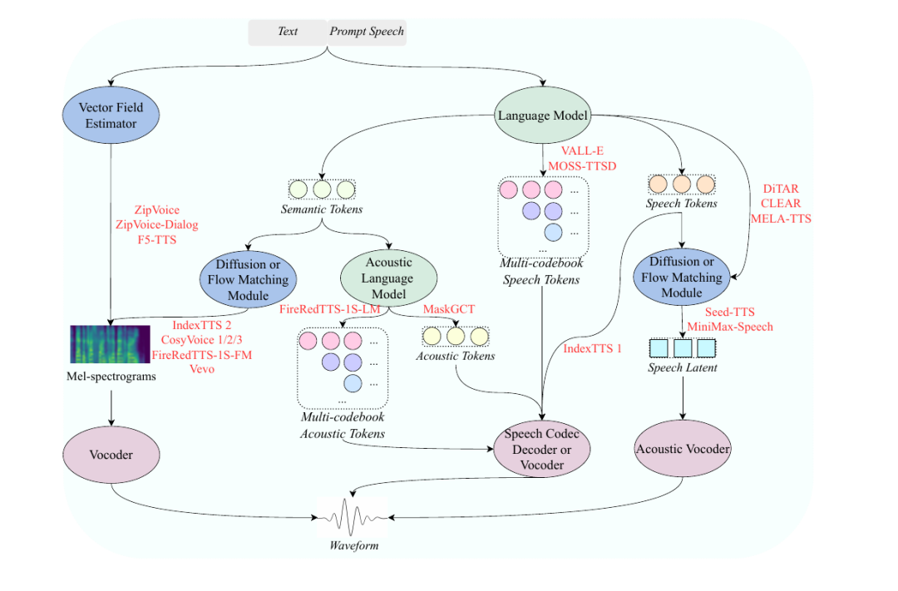
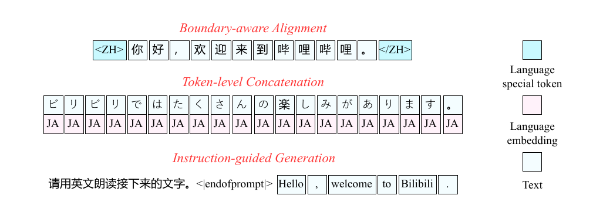
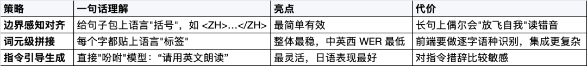
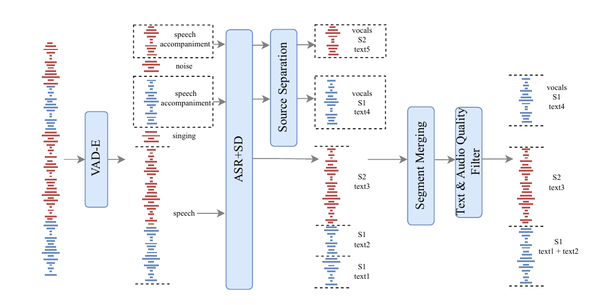
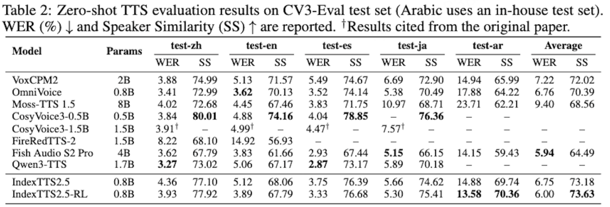
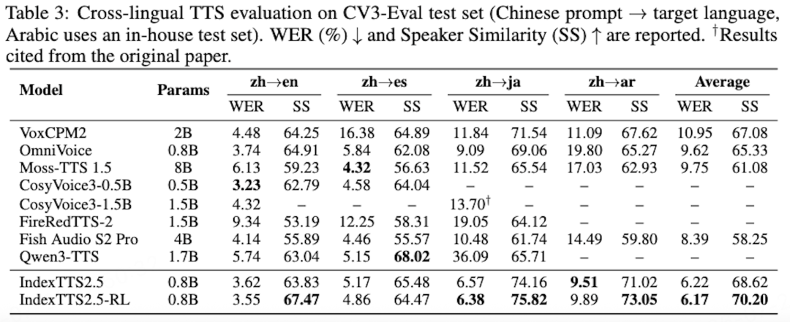
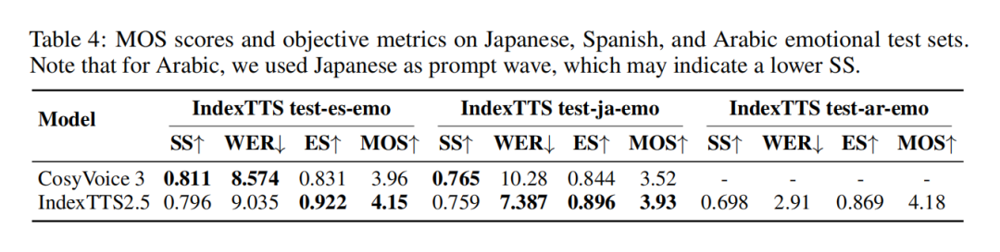
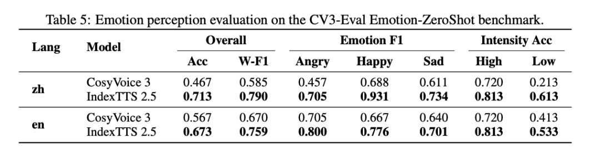

# IndexTTS 2.5  让声音跨越语言

> 发布时间：2026年8月17日 15:00， 原文地址： https://mp.weixin.qq.com/s/30e0qSPbdj06H_gap78Qqw?scene=1&click_id=1594969601

不赶进度、专注打磨！今天想和大家聊聊我们最新发布的 IndexTTS 2.5，支持中 / 英 / 日 / 西 / 阿五国语言零样本配音，推理速度翻倍升级，跨语言情绪还原更自然，同时也支持原声的语速控制能力，补齐上代模型短板。在 AI 语音合成领域，B 站自研的 IndexTTS 系列一直以高情绪还原度、可落地性强著称。这次新版 IndexTTS 2.5 并没有快速迭代更新，而是团队进行了长时间、全方位的深度打磨。宁愿推迟发布，也要把速度、音质、多语种适配、情绪自然度全部优化到位，最终给大家带来更成熟、更好用的全新版本。

👉 仓库地址 (记得 Star🌟)：_https://github.com/index-tts/index-tts_

👉 官方宣传片 (求三连🎉)：_https://www.bilibili.com/video/BV1uvMk6ZEdK/_

👉 论文地址：_https://arxiv.org/abs/2601.03888_

👉 Demo 展示地址：_https://github.com/index-tts/index-tts2-5.github.io_

视频详情

<video src="https://mpvideo.qpic.cn/0bc3fudgiaaglmailq3ynnvfmlodmqwqmzaa.f10002.mp4?dis_k=bbcbc2acd75b62fa9142e65256f74c65&dis_t=1786954026&play_scene=10120&auth_info=VrX8s74sTlcatOjLwV1fRSY7QwpJenRnAWxOQjsBJW5vFxplY01kZTQbNDhNMhsCLmxKBRBoHhhWLEEdYVozOnAd&auth_key=3c3a155e2fd9491aacb7b7d357eee0af&format_id=10002&support_redirect=0&mmversion=false" controls width="600"></video>

**为什么要做 2.5？**

去年 IndexTTS 2 发布后，非常受社区小伙伴们喜爱，情感和音色解耦组合的能力，让不少创作者在有声书、视频配音场景里玩出了花。

但我们也收到了很多真实的反馈，其中最集中的两条是：

-  **“只会中英双语不够用啊”**——想让自己的声音说日语、说西语；
    
-  **“好是好，就是有点慢”**——实时性场景里等得着急。
    

这两条反馈，成了 IndexTTS 2.5 的立项初心。经过大半年的打磨，我们交出的答卷是：

- 🔥 跨语种情感复刻：进一步打磨情绪韵律表现与音色还原效果，整体稳定性大幅提升；
    
- 🌍 多语言升级：一站式支持中文、英语、日语、西班牙语、阿拉伯语五大语种，满足语种多样化的配音需求；
    
- ⚡ 更快更轻：对推理架构进行轻量化重构，有效提升推理运行效率；
    
- 🎙️ 灵活语速：开放语速控制能力，满足创作需求
    

下面和大家展开聊聊我们是怎么做的。

**先站在巨人的肩膀上看看路**

语音合成这两年发展很快，技术路线也几经分化。我们在报告里梳理了一张主流零样本 TTS 的技术全景图：

目前最主流的范式是：语言模型先生成承载发音和韵律的 "语义 token"，再由流匹配模块还原声学细节，最后经声码器输出波形。IndexTTS 2.5 沿用了 IndexTTS 2 验证过的这条主干，把火力集中在四个关键升级点上。

**升级一：多语言，难在 "同一个字两种读法"**

做多语言 TTS，最头疼的问题之一是**跨语言共享字符**。举个最典型的例子：日语里大量使用的汉字，模型看到它，到底该按中文读还是按日文读？

为了系统地回答这个问题，我们设计并公平对比了三种建模策略：

一个重要的发现是：**没有银弹，三种策略各有擅长且互补**。我们把完整的对比结论写进了报告，希望能给同行们做多语言系统时提供一些可直接参考的设计原则。

巧妇难为无米之炊。为了喂饱多语言模型，我们还搭了一条自动化数据管线—带事件分类的 VAD 切分（区分语音 / 歌唱 / 伴奏 / 噪声比例）、一体化 ASR（识别 + 说话人日志 + 标点恢复）、选择性音源分离（仅伴奏片段用 Demucs 抽人声，避免音质劣化）、基于说话人一致性与文本连贯性的片段合并（单说话人、≤25s）、音频质量 + 文本质量双重过滤。

最终我们攒下了约**15 万小时**的多语言语料，外加 135 小时情感语音。

**升级二 & 三：瘦身组合拳——**

**序列砍半 + 换个更轻的 "心脏"**

提速这块，我们打了套组合拳：

**第一拳：语义 Codec 帧率从 50Hz 压到 25Hz。**语义 token 序列长度直接减半，训练和推理的计算量、显存占用都大幅下降，而语言信息几乎无损。

**第二拳：S2M 模块主干从 U-DiT 换成 Zipformer。** 参数更少、生成更快。有意思的是，主观盲测里 Zipformer 版本反而以 56% vs 40% 的偏好率赢下了更复杂的 U-DiT——大道至简。

两拳叠加，效果直接看数据（相同 A10 硬件环境）：

T2S 模块 RTF 从 0.232 降到 0.119，S2M 模块从 0.078 降到 0.017，**整体提速约 2.28 倍**，主观听感无可感知下降。对实时交互场景来说，这是从 "能用" 到 "好用" 的一步。

**升级四：让模型自己 "卷" 自己——**

**GRPO 后训练**

我们把 GRPO 强化学习引入了 T2S 模块的后训练：同一段文本让模型随机生成 4 个候选语音，用 ASR 词错误率和说话人相似度当 "裁判" 打分，让模型自己朝着 "读得对、像本人" 的方向进化。

收获是实打实的：五语言平均 WER 从 6.75% 降到**6.00%**，平均说话人相似度从 73.18 升到**73.63**，英、日、阿语的提升尤其明显。

**效果怎么样？上数据**

**零样本语音克隆：**在五种语言的评测中，IndexTTS 2.5 平均说话人相似度最高，但 WER 比 4B 模型 Fish Audio S2 Pro 略差一单，整体处于第一梯队：

注：图中仅列入五种语言均有完整结果并报告平均值的模型；带 † 的数据引用自各模型原论文，WER 越低越好，SS 越高越好

**跨语言合成：**用一段中文语音做参考，让同一个音色开口说英、日、西、阿语，IndexTTS 2.5 综合成绩全场最佳：

**情感迁移：**情感训练只用了中文和英文数据，但模型把 "情绪" 带到了所有语言——阿语情感测试（还是用日语 prompt 的极限设定）MOS 达到 4.18/5；在 CV3-Eval 情感零样本基准上，中文情感识别准确率 0.713，比 CosyVoice3 的 0.467 高出一大截。

**多语言情感合成对比**（IndexTTS 2.5 vs CosyVoice3）：

**情感感知评测**（CV3-Eval Emotion-ZeroShot 基准）：

简单说： **你给它一段开心的中文，它能让一个西班牙语的声音同样开心。** 情感，音色，语种被明显解耦了。

**写在最后**

从 IndexTTS 1 到 2 再到 2.5，这个系列的每一步成长都离不开社区的关注和反馈。这一次，我们希望 IndexTTS 2.5 能让 "用任何声音、说任何语言、带任何情绪" 这件事，离每一位创作者更近一点。也欢迎在评论区聊聊你的使用场景和建议——你们的每一条反馈，都是下一个版本的立项书。
