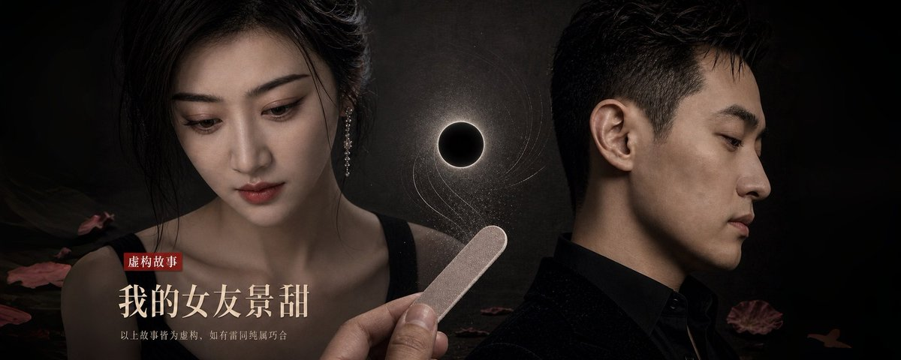

# 我的女友景甜

> post by [H.E. Justin Sun 👨‍🚀 🌞](https://x.com/justinsuntron), original link: https://x.com/justinsuntron/status/2092932777612390850

一颗卵子的重量，三点五微克。

五千万美元现金的重量，两点五吨。

景甜在蒙太奇拉古纳海滩的电话里向我要的是后者，抵押的是前者。

她去那里是为了取卵。代孕的孩子预计2027年出生，快一点的话还能属马。这是她主动提的。到了诊所，她说没有五千万，不取。

蒙太奇拉古纳海滩在海崖上，底下是太平洋。那一层包下来，三十天，一百万美元，为了她的隐私。她住了八天就走了。

剩下的二十二天，酒店的清洁工每天照常上去。是我的助理讲的，她去交钥匙的时候撞见过一次：一个墨西哥女人推着车，一间一间进，换毛巾，擦台面，把被角掖好，退出来把门带上。做完一整层，两个小时。

助理问她，没人住，为什么还要做。

她说，登记上写着有人。

一座失去皇后的凡尔赛宫。

我突然意识到，景甜喜欢这个。景甜喜欢一个地方因为她而空着。什么都不发生。

与蒙太奇拉古纳海滩一起空置的，还有一架湾流G700尴尬地停在Van Nuys，机组每天照常报到。

第八天她打了那个电话。之后没有人再见过她。

---

2007年，已经有人替她烧钱了。那年我刚进北大。

当然，烧钱的不是我。

QQ弹出一个窗口，代言人是她。就在那台联想IBM的老机器上，分辨率糊得很。我把图片存下来了。

我在一年房租一千块的北大宿舍上网，在校内网上找到她，发了好友申请。校内网要填一句留言，我写了删，删了写，弄了大概四十分钟，最后发出去一句“你好”。

她没有通过。

她也许根本没用过校内网。

后来这些年，我做每一件事的时候都在想一个问题：到了什么程度，她会通过。第一个十亿的时候我想过，一百亿的时候我想过。

后来我不想了。人人网早就倒闭了。

我没有再申请第二次。

2011年，北京冷。我买了一件羽绒服，一百五十块。我记得这个价格，因为我犹豫了三天。

同一年她拍了一部一亿五千万的电影《战国》。孙红雷、吴镇宇、金喜善、中井贵一、姜武就像十九年后的蒙太奇拉古纳海滩与湾流G700一样被请来做了陪衬，他们不知道自己为什么出现在这里，来都来了，总得发生些什么，但是什么都没有发生。

再后来是一亿五千万美元的《长城》。张艺谋，刘德华，马特·达蒙。再后来是成龙。景甜宇宙的名单越来越长。

我那时已经在美国了，读书，创业，越来越忙。唯一没变的是，每换一台设备，无论多麻烦，我都把那张QQ图片导过去。

十九年后，名单上加了我。

---

瑰丽酒店我们见了第一面。我一直以为见到她那天我会紧张。

我没有。

她比照片上瘦，穿得很随意，靠在沙发上。我看着她，忽然想不起来我等的到底是什么。

我带她去看卡特兰的香蕉。她看了很久，问我，这个多少钱。

六百二十万美元。

她说，那它烂了怎么办。

我沉默了。她说，不管了，我们去看电影吧。

我说好。

她说放映厅里除了我们两个，不能有任何人。

我说好。

我出去打了个电话。回来的时候她还站在那根香蕉前面。

那部电影是《疯狂动物城2》。

两个人的放映厅，这种场景一般用于中宣部审片。

我让助理把电影院所有的座位都买下来。

我看过批判刷假票房的文章，说票买光了只有两个人看。现在我明白了，也许不全是为了票房。

把座位全买下来不难，麻烦的是已经卖出去的票。助理和保镖提前到影院门口，遇到买了票的观众，把现金递过去。

一对带孩子的夫妻来了，孩子已经在门口高高举着爆米花。

助理递上一沓钱，孩子不懂为什么不能进去，大人接过钱，道谢，什么也没问，走了。

那天领钱的有二十六个人。

看完她把微信头像换成了朱迪警官。

晚上我用手揉她的奶子，被她推开了。

我以为她不愿意。我把手收回来，准备说点什么。

她没说话。她坐起来，从包里翻出一个小袋子，拉开，里面一排东西，像一套很小的工具。

她说，你的指甲扎得我痛。

我看了一眼。我一直是拿指甲刀随便剪两下，边上是尖的，平时不觉得。

她说，过来。

她把我的手放在她腿上，一根一根磨。

先是粗的那一面，磨完换一面，再换一面。磨一会儿举起来对着灯看看，再接着磨。

我说这个要磨多久。

她说，磨到不刮人为止。

十个手指，她花了快一个小时。

中间她教我，这一面磨形状，这一面抛光，最后一面不要来回蹭，要顺着一个方向。

我说好。

磨完她把我的手翻过来看了看，摸了一下。

她说，行了。

摸吧，想摸哪都行。

中间她说过一句话。她说，要是以后我不在了，就再没有人给你抛指甲了。

我笑了一下，没说话。

认识她三个月的时候，我让人做了一份东西。她那些年的项目、合作方、公司股权、景国庆，田心爱，所有的几个关联账户，北京租的房，上海买的房，还有一些别的。一周就做完了，一共四十几页。还有些男男女女的事情，我觉得这是最不重要的。

里面有一些事她后来跟我讲过，讲的和上面写的不太一样。我没有说。

有一些事她一直没讲。我也没有问。

我全部相信她说的。

那份东西我留着，一直留到现在。

但是我一个字也不信。

---

她说，香港人太多，会被认出来，我们出去走走。

我说好。

她在地图上指了一下特纳里费。

我说好。

我出去打了个电话，回来才知道那个地方位于非洲西北海岸外的大西洋上。第二天中午，我们一行三十个人出发了，A330在机场等着。

飞机的卧室里她问我，我的名字好听吗。

我说好听。

她说，我爸爸的姓和我妈妈的姓拼在一起的，是不是很巧。

我说我第一天就记住了。

她抱着我说，以后别叫我景甜了，叫我妈妈吧。

好，妈妈。

落地以后机长过来告诉我，老板，岛上一开始不让降，他们没见过这么大的私人飞机。

岛上规矩一样，周围不能有人。助理去处理了，没有人问为什么，这次我没问多少人。

丽兹卡尔顿正对着大西洋，落地窗太大。她睡觉不能有一丝光。助理用黑胶带把整个房间贴起来，外面亮如白昼，里面黑得像禁闭室。胶带一晒就掉，每天要重贴。

助理一共十一个人，早上六点半到，等我们睡了才走。贴胶带的是两个女孩，一个负责窗框，一个负责空调和插座的指示灯，贴完再检查三遍。胶带买了三十卷，后来又补了二十卷。她们发现下午三点以后贴的最容易掉，因为那时候玻璃最烫，后来改成早上贴。这件事没有人教她们，是她们自己试出来的。她们互相之间会讨论，像讨论一项工艺。

她知道那两个女孩叫什么。我不知道。

我们在泰德公园的公路边停下看日落，助理从车上搬下来玫瑰花，开了香槟。

妈妈看着云海说，好美。不过不如青海德令哈的日落。

我是青海人。

我没有说。

夜晚我们在山顶看星星，穿着棉袄还是冷。

妈妈说，许个愿吧。

我问，你许了什么。

妈妈说，不告诉你。

妈妈说，太美了。但就是太冷了，我们去马尔代夫好不好。

我说，好吧。

特纳里费零下十五度，马尔代夫二十七度，直线距离九千五百公里，飞十一个小时。不过马尔代夫的机场太小了，我们宽体客机中途得换成小飞机。

妈妈说，小飞机声音好吵。还是大飞机好。

去马尔代夫的飞机卧室里，妈妈跟我说，她许的愿是，和我要一个孩子。必须代孕。

我没有问过为什么。我以为她怕疼。

中途妈妈突然坐起来找手机，连上星链，说糟了。

我问怎么了。

她说，有个人要威胁我，问了三天了，我一直没回。

我说要多少。

她说不用你管。

她打字打了很久，删了改，改了删。打完把手机扣在腿上，过一会儿又翻过来看。

我问那人是谁。

她说，以前跟我一起的，财务，进去了，扛了事。

出来走投无路，一定要找我。

我说，干脆报警抓了。

她看了我一眼。你不懂。

我说你给了吗。

她说给了。

多少。

八万。

我说这个也用得着想三天。

她没说话。

那天剩下的时间她一直没怎么说话。落地了才睡着。

最早到索尼娃贾尼的是妈妈的箱子。三十个人的行李，小飞机装不下，分了三架。妈妈只有一只箱子，单独一架，她说不要和别人的放在一起。

索尼娃贾尼是出了名的no news, no shoes，妈妈放心了。

酒店管家，保镖，助理，一共配了二十六个人，还有两个无人机手远远跟着。助理们又开始贴胶带了，空调的灯，插座的灯，一遍又一遍。

晚上我们像交换暗号一样交换了彼此的前任，就像一个王朝在核对年号。妈妈不愿意有任何差池，不过妈妈有个禁忌词，那个运动员不能提。

我没提，虽然我知道，妈妈背上的纹身是因为运动员纹的。

可能因为太大了洗不掉。

她说，现在我们是一家人了。我爸妈把我养这么大不容易，你得给彩礼。

我说好。

她报了两个名字，景国庆、田心爱，和两个账号。

三千万，人民币。

我转了。那两个名字，我是在那四十几页里第一次见到的。

过了一会儿，她把手机递过来给我看。田心爱回了两个字：收到。

有一次妈妈说，你知道我要这些东西的时候在想什么吗。

我说什么。

她说，我在想，你会不会有一次说不。

我说不会。

她说，那就没意思了。

我想，我又有什么做不到吗？

太无聊的时候，我在摆弄那张2007年的QQ图片，想传到新设备上。妈妈把头凑过来，你怎么背着我存别的女人的照片，这是谁。

我沉默了。什么也没说。

她看图太糊了，就去忙别的了。

那天晚上我把那张图删了。

第二天又从旧手机里找回来了。

妈妈手机也刷个不停，我问她看什么。

她说没什么，就是撕番位的那些破事。

撕番位，一部戏只能有一个明星排第一。男一女一也只能有一个人排第一。

我说无聊啊。

她说，是啊。更难的是，有时候剧组夫妻，一进组四五十天，一般和一个男的拍戏，晚上做爱，白天还要撕番位。

我说太反人性了。

她说是啊。

不过拍完戏了，无论之前做过多少次爱，就当一切都没发生。

然后她又看了半个小时。

2026年1月2日，索尼娃贾尼，新的一年，我向妈妈求婚了。

是1月1日早上决定的。戒指在香港。岛上没有卖戒指的地方，助理坐水上飞机去了马累，下午回来，戒指装在一个酒店的信封里。

妈妈说，钻戒太小了。

妈妈说，没事，以后补个大的。

另外，你能来北京吗？

我沉默了。

她以为我不想去。

妈妈说，你为什么对我这么好。

我说因为我喜欢你。

她说，那你以前对别人也这样吗。

我说没有。

她笑了一下，没说话。

有一天早上我醒得早，她不在床上。

我出去看，她坐在露台上，对着海，整个海是黑的。没开灯，天还没亮。

我问她怎么起这么早。

她说，我在算日子。

我说算什么。

她说，你回去睡吧。

我在她旁边坐了一会儿，不知道说什么。后来我回去睡了。

我再醒过来的时候她已经化好妆了。

在马尔代夫待了十四天，没有一个人认出她。

第十三天晚上在餐厅，她把墨镜摘了。过了一会儿，帽子也摘了，放在桌上。她就那样坐了一顿饭。隔壁桌是一对德国老夫妻，服务生是斯里兰卡人，没有人多看她一眼。

吃完她把帽子戴回去了。

妈妈说，我们回去吧。

我说不是还没住够吗。

她说，太安静了。

回到香港，妈妈见了我父母。

当天晚上她说，家里要筹备两家见面和婚事，尽可能多打点。还是景国庆和田心爱。

我没问为什么。

我说一天一张卡限额一百万。

妈妈说太慢了。

转五张。

五张卡，两个账号，轮着转。转到第三张的时候，我犹豫了一下。我还是转完了。

妈妈说，效率太低了。

我说，过年把咱爹妈接到香港来一起过吧。

妈妈说，今年已经定好在海南过年了。明年吧。

春节，维港放烟花，来了一百万人。没有她。

凌晨三点，我把父母送回去。

路上很空，红灯没有一辆车在等，我还是停了。

妈妈说先不见了，马上去洛杉矶取卵了。手头的事情要先处理完。

妈妈又问，能来北京吗？

我沉默了。

她没有说北京有什么。我也没问。

妈妈说，香港必须买一套房子，写她的名字。

我说，好吧。

情人节也没见面。

有一次她在电话里说，今天早上抽了八管血。

我说这么多。

她说还好。

我说辛苦了。

然后我们聊了别的。

后来我才知道，那种抽血要空腹，要在月经周期的第二天或者第三天，日子不能错。她那天早上大概六点就出门了，北京的冬天，天还没亮。后来的检查越来越多。我知道这件事，是因为助理每月的汇总付款单里多了一项。第一次出现是去年，金额不大，几千块。后来每个月都有，有时候两三笔。我批得很快。这类金额不需要我看明细。后来才知道那些是抽血、激素六项、B超、AMH。要看她还有多少储备，能取出来几个，值不值得往下走。

这些都是在北京做的。

我不知道是哪家医院。我也不知道她是自己去的，还是有人陪。

2月25日她落地香港。

她说不去洛杉矶了，除非先看到香港的房子。

我把过去半年看的十几套房都发给她。她都嫌不好看。那十几套房我一套也没去过，是助理花了半年一间一间挑的，助理转给我，我转给她。有一套在半山，视频里能看见维港，拍的是傍晚。有一个瞬间镜头晃了一下，拍到了拍视频的人的影子在墙上。我看着那个影子想，这个人是谁，他今天走了多少路，看了多少房，他知不知道这套房是给谁看的。

时间太紧，她还是上了去洛杉矶的G700，2月28日飞到蒙太奇拉古纳海滩。

---

第八天妈妈打了电话。她那边是下午，我这边是凌晨。

她说，五千万，美元。

我说，让我想想。

她没有说话。我听见她那边有海。

过了一会儿她说，好。

她挂了。

我认识她以来，没有对她说过“让我想想”。

我用Claude Code读API把所有现金资产跑了一遍，结论是对我不会有任何影响。我又核了一遍。我在Claude Code里输入了问题，Claude说，不要把这五千万美元给她。

我问，她不再爱我了吗？

Claude说，对于爱情，我不关心，也不理解。但是你不能把这五千万美元给她。

我从来没有拒绝过她，不是慷慨，是害怕。害怕下一秒的答案。

而现在有人替我说了。

我盯着那行字看了很久。让我毛骨悚然的不是它聪明，是Claude一点犹豫都没有。

它不为难。

我当时想，这大概是更高的一种东西。人做不到这样。

她不再爱我了吗。

第二天她打回来。

妈妈说，海很大。

我说是吗。

她说，这层楼太大了，有回声。早上有人来打扫，我躲在卫生间里等她们走。

我说可以不让她们来。

她说不用。

她说，诊所问我，孩子的父亲什么时候到。

我说我可以派人过去。

她说，不用。

然后她说，想好了吗。

我没有说话。不是在想，我没有在想任何事。电话里她那边有海，我这边是维港，两边都没有人说话。我数了一下，十一秒。

景甜说，行。

景甜说，我知道了。

她挂了。

我后来无数次回想过，那两天她除了五千万还说了什么。海很大，这层楼太大，她躲在卫生间里。就这些，我全记得，一个字不差。我记不起来的是她的声音——她说“我知道了”的时候，是什么语气。

我想不起来。后来我就不想了。

我把手机放在床头柜上，屏幕朝下。然后我做了一件事，至今不知道为什么：我把手放在胸口，数了一下。

心跳很稳。

我又数了一遍，还是很稳。一分钟六十几下，和平时没有区别。我坐在那里，手按着自己的胸口，像一个医生在给别人做检查。

我想，原来是这样。

那天剩下的时间我什么也没干。我在房间里待到天黑又到天亮，看着维多利亚港从蓝色变成灰色再变成黑色。早晨六点，维港对面的金融中心一栋一栋地开始亮灯。中间助理敲过一次门，问晚餐怎么安排，我说不用了。

我没有哭。我一直在等我哭。

---

后来助理跟我结账，里面还有一项是特纳里费的酒店赔偿。我们走了以后，胶带又贴了几天，没人告诉她们不用贴了。酒店说贴得太久，次数太多，窗框上的胶痕清不掉，那面玻璃要整块换掉。

我说批了。

那面玻璃朝着大西洋。

账单里飞机燃油那一项，比蒙太奇那一层楼还贵。我问了一下。助理说，A330是按两百人设计的，我们只有三十个人，太轻了，起飞的配平不对。所以每次都要多加油，加到够重为止。到了地方，多加的那些又不能留着，得放掉。

我说，每次都这样？

他说，每次都这样。

还有洛杉矶诊所寄回来的一个箱子。八天的促排针，要冷藏的，一支没拆。

还有代孕机构的定金，二十万美元，不退。代孕的人一月就定好了，加州人，三十四岁，生过两个。档案里有她的照片，我没看过。她一月就准备好了。

景甜走后，我把那张2007年的照片翻出来看了一次。十九年了，设备像素越来越高，而这张图，仿佛像素越来越低，脸都是糊的。我放大看了很久，想找出她和后来有哪里不一样。一处也没找出来。因为那张照片本来就看不清。

有一天我用指甲刀剪指甲，剪完摸了一下，是尖的。

我想起来抽屉里还有那个东西，她留下的。

我拿出来磨了两下，不对。她说过要顺着一个方向，我忘了是哪个方向。

我把它放回去了。

我的指甲现在还是磨人的。

有一天早上手机弹出一个提醒，是助理去年排日程的时候设的：预产期前三个月，准备房间。

我把它划掉了。

她走了以后，我一直在想一个问题。

如果那天我给了，她会留下来吗。

我想了很久。

后来我把那份东西拿出来，又看了一遍。四十几页。

然后我想起春节那天晚上，在顶楼俯瞰香港维港的烟花。

一百万人像潮水一样涌来，烟花结束，一百万人退去。

一百万人。

每年都是这样。

凌晨三点的香港，

什么都没有发生。

本文纯属虚构，如果雷同实属巧合
不设版权，请随意转发分享

后续记录与版本：

hejustinsun.com

github.com/HEJustinSun
