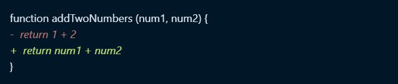
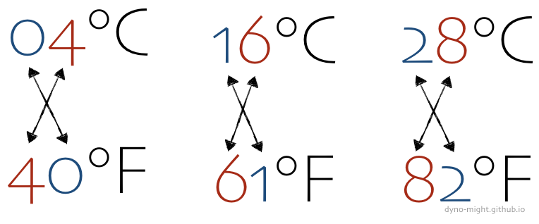

> @Author  : Lewis Tian (taseikyo@gmail.com)
>
> @Link    : github.com/taseikyo
> 
> @Range   : 2020-11-01 - 2020-11-07

# Weekly #1

[readme](../README.md) | [next](202011W2.md)


\**Photo by Clay Banks on Unsplash*

## Table of Contents

- [algorithm](#algorithm-)
	- 1356.根据数字二进制下 1 的数目排序
- [review](#review-)
	- Python 的 eval() 函数很危险
- [tip](#tip-)
	- 如何在 Markdown 文档显示 diff 效果（英文）
	- 华氏度与摄氏度的简单估算（英文）
- [share](#share-)
	- 你的头脑是二值逻辑，还是三值逻辑？

## algorithm [⬆](#weekly-1)

### 1. [1356. 根据数字二进制下 1 的数目排序](https://leetcode-cn.com/problems/sort-integers-by-the-number-of-1-bits/)

20/11/6 的每日一题，将数组中的元素按照其二进制表示中数字 1 的数目升序排序。思路很简单，直接将数组按照 1 的个数分组，然后排序即可。

```C++
/**
 * @date    2020-11-06 ‏‎16:15:32
 * @authors Lewis Tian (taseikyo@gmail.com)
 * @link 	github.com/taseikyo
 */

class Solution {
  public:
	vector<int> sortByBits(vector<int>& arr) {
		vector<int> ret;
		map<int, vector<int>> mp;
		for (auto& num : arr) {
			int cnt = 0;
			int tmp = num;
			while (tmp != 0) {
				if (tmp & 1)
					cnt++;
				tmp >>= 1;
			}
			mp[cnt].push_back(num);
		}
		for (auto& iter : mp) {
			sort(iter.second.begin(), iter.second.end());
			for (auto& it : iter.second)
				ret.push_back(it);
		}
		return ret;
	}
};
```

## review [⬆](#weekly-1)

### 1. [Python 的 eval() 函数很危险（英文）](https://nedbatchelder.com/blog/201206/eval_really_is_dangerous.html)

Python 中的 eval() 函数用来执行一个字符串表达式，并返回表达式的值。它的语法如下：

```Python
eval(expression[, globals[, locals]])
```

- expression -- 表达式。
- globals -- 变量作用域，全局命名空间，如果被提供，则必须是一个字典对象。
- locals -- 变量作用域，局部命名空间，如果被提供，可以是任何映射对象。

它并不会进行检查，所以即使你传入一个 "os.system('rm -rf /')" 这类命令它也会执行，所以这个函数是很危险的。

文中介绍了使用 eval 的 "攻防"，先是给出一段代码无法运行，似乎是保证了 eval 函数的安全，但是紧接着立马给出破解的方法，使得 eval 能跑出结果，挺有趣的。


本来是边看边跑文中给出的代码，然而文中的下面这段代码现在无法运行，文中介绍说需要提供 12 个参数，但是放到 ipython 中运行提示说参数不够，需要 14 个，不太懂这段代码的展开，以后有机会再看吧。

```Python
s = """
(lambda fc=(
    lambda n: [
        c for c in
            ().__class__.__bases__[0].__subclasses__()
            if c.__name__ == n
        ][0]
    ):
    fc("function")(
        fc("code")(
            0,0,0,0,"KABOOM",(),(),(),"","",0,""
        ),{}
    )()
)()
"""
eval(s, {'__builtins__':{}})
```

能够直接解析字符串运行的函数似乎都挺危险的，之前了解到 js 中也有这样的问题。算是个双刃剑吧，看使用者如何使用，用在恰当的地方就是好的 feature，被利用来干坏事就是 bug 了。

## tip [⬆](#weekly-1)

### 1. [如何在 Markdown 文档显示 diff 效果（英文）](https://blog.alispit.tel/create-a-git-diff-in-markdown/)

挺有趣的一个小技巧，之前也有想过怎么显示 diff 效果，后面就忘记去研究了。



其实也简单，本身就是 md 支持的，用 `diff` 标记语言类型，然后用 `+/-` 表示修改的代码行即可：

```
\`\`\`diff
function addTwoNumbers (num1, num2) {
-  return 1 + 2
+  return num1 + num2
}
\`\`\`
```

### 2. [华氏度与摄氏度的简单估算（英文）](https://dyno-might.github.io/2020/10/30/temperature-conversion-for-the-lazy-and-simple-minded/)

华氏度与摄氏度的转换，有一个简单的估算方法。有三个华氏度，颠倒个位数和十位数，等于对应的摄氏度。



因此，记住这三个数字（40、61、82），就可以简单估算：

| 摄氏度范围   | 华氏度范围   | 描述 |
|-------------|-------------|------|
| < 4°C       | < 40°F      | Cold |
| 4°C ~ 16°C  | 40°F ~ 61°F | Cool |
| 16°C ~ 28°C | 61°F ~ 82°F | Warm |
| > 28°C      | > 82°F      | Hot  |


## share [⬆](#weekly-1)

### 1. 你的头脑是二值逻辑，还是三值逻辑？

这个话题来自阮一峰的 [第 131 期](https://github.com/ruanyf/weekly/blob/master/docs/issue-131.md#%E6%9C%AC%E5%91%A8%E8%AF%9D%E9%A2%98%E4%BD%A0%E7%9A%84%E5%A4%B4%E8%84%91%E6%98%AF%E4%BA%8C%E5%80%BC%E9%80%BB%E8%BE%91%E8%BF%98%E6%98%AF%E4%B8%89%E5%80%BC%E9%80%BB%E8%BE%91) 科技爱好者周刊，他文中写道：

> 我现在的看法是，这可以区分一个人的世界观是否成熟深刻。有些年轻朋友就是二值逻辑的头脑，一看到不赞成、不理解、不喜欢的言论，就认定对方是错误的，完全否定，这其实是思想不成熟的表现。世界太复杂，很难用两分法来判断，三值逻辑会让你的心态好很多，而且有利于个人的进步：正确和错误之间，存在一个广阔的中间地带，任何一种言论都可能有正确的成分，要学会从中间地带去看待事物，吸收对自己有用的部分，摒弃无用的部分。

我比较赞成阮一峰老师的观点，为人处事不是做数学题，在你做完某道数学题后，结果就已经确定了，要么对要么错，但人不是，对于一个陌生人，你能用一个简单标准划分他是好人还是坏人吗？在对与错中间应该还有一个区域，就拿我们学过的牛顿力学一样，在某种条件下它是对的，在另外一种条件下，它又变成错的了。我们得发散地去看待事物，不要非黑即白，应该看到它中间的灰色地带。

两值世界观的人是没长大的小屁孩吧（指特定人群），轻易就能被人煽动，因为他们的思维是非黑即白的，一旦接受白变黑或者黑变白的设定，他们会很有认同感，然后就被牵着鼻子走。令人厌恶的网络喷子大概也是这类人吧。

[readme](../README.md) | [next](202011W2.md)
