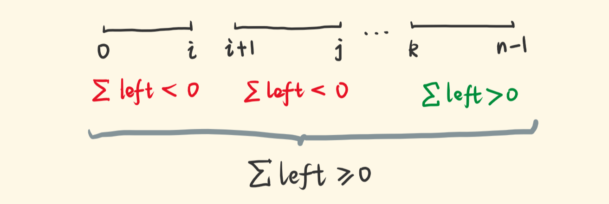
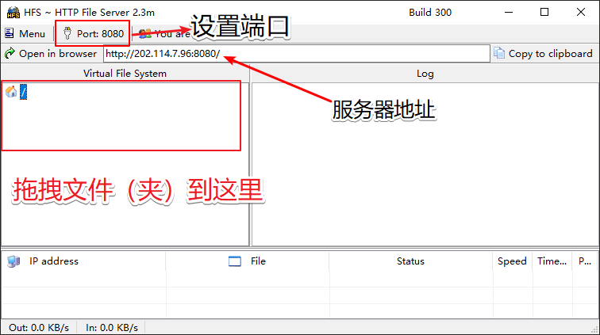

> @Author  : Lewis Tian (taseikyo@gmail.com)
>
> @Link    : github.com/taseikyo
>
> @Range   : 2020-11-22 - 2020-11-28

# Weekly #4

[readme](../README.md) | [previous](202011W3.md) | [next](202012W1.md)

总字数：2079 个（汉字：1278，英文单词：302，数字：79，中文标点：160，英文标点：260），阅读时长约：4 分 6 秒。


\**Photo by Lala Azizli on Unsplash*

## Table of Contents

- [algorithm](#algorithm-)
	- 134.加油站
- [review](#review-)
	- 哪种编程语言用电量最少？（英文）
- [tip](#tip-)
	- 从（无穷）可迭代对象中获取匹配条件的第一项（StackOverflow）
	- 搭建最简单的 Windows http web 服务器（中文）
	- git commit 格式正确书写方式（中文）
- [share](#share-)
	- 有时候，精英主义是可以接受的（英文）

## algorithm [⬆](#weekly-4)

### 1. [134.加油站](https://leetcode-cn.com/problems/gas-station/)

环路，N 个加油站，每个有汽油 gas[i] 升，从 i 到 i+1 消耗 cost[i]，初始油箱为 0（容量无限），问从哪点出发能绕一圈，否则返回 0。

这个 [题解](https://leetcode-cn.com/problems/gas-station/solution/shou-hua-tu-jie-liang-ge-guan-jian-jie-lun-de-jian/) 写的很清楚，只要总加油量比总耗油量大就一定有解，关键在于找到出发点。



上图中，若从 0 出发到 i 的剩余油量小于 0，那么 0 ~ i 都不能作为起点，类似地 i+1 ~ j 也不能，由于总剩余为正，那么必然有一段为正，图中 k 就为起点，后面一段能加到足够的油补充前面两段不足，从而绕一圈。

简单说明一下 0 ~ i 都不能作为起点的原因，比如 a-b-c-d，到 c 的时候剩余为负，此时我们能得到啥？

- 显然 a 是不能作为起点的：(gas[a]-cost[a])+(gas[b]-cost[b])+(gas[c]-cost[c])<0 => left(a)+left(b)+left(c)<0
- 由于过了 a，所以 left(a) >= 0 => left(b)+left(c)<0，所以 b 也做不了起点
- 同理能到 c 肯定过了 b，即，left(a)+left(b)>=0 => left(c)<0，所以 c 也做不了起点

> [code/leetcode_0134.go](../code/leetcode_0134.go)

```Golang
func canCompleteCircuit(gas []int, cost []int) int {
	left := 0
	start := 0
	totalGas, totalCost := 0, 0
	for i := 0; i < len(gas); i++ {
		totalGas += gas[i]
		totalCost += cost[i]
		left += gas[i] - cost[i]
		if left < 0 {
			start = i + 1
			left = 0
		}
	}
	if totalGas < totalCost {
		return -1
	}
	// 总加油>=总耗油，必然有解。当遍历结束时，最新的start指向成功的起点
	return start
}
```

## review [⬆](#weekly-4)

### 1. [哪种编程语言用电量最少？（英文）](https://thenewstack.io/which-programming-languages-use-the-least-electricity/)

很有趣的一篇文章，他们比较了 27 种编程语言的能耗、速度和内存情况。

可能我们的直觉来看编译型语言运行快，他们的能耗少，事实确实如此，但是没有一个语言能在三种情况中都居榜首，如下如所示，C 在内存方面被 Pascal 和 Go 打败了，这个我还挺奇怪的，我以为 C 会屠榜来着，但总的来说编译型快于虚拟机型快于解释型（图中 c 表示 compiled，i 表示 interpreted，v 表示 virtual machine）。


## tip [⬆](#weekly-4)

### 1. [从（无穷）可迭代对象中获取匹配条件的第一项（StackOverflow）](https://stackoverflow.com/questions/2361426/get-the-first-item-from-an-iterable-that-matches-a-condition)

简单一点我们可以这样做：

```Python
def first(the_iterable, condition=lambda x: True):
	for i in the_iterable:
		if condition(i):
			return i

>>> first(range(10))
0
>>> first(range(10), lambda i: i > 3)
4
```

但其实我们可以使用内置的 next 函数完成这件事，并且可以设置默认值：

```Python
def first(the_iterable, condition=lambda x: True, default_value=0):
	return next((x for x in the_iterable if condition(x)), default_value)

>>> first(range(10))
0
>>> first(range(10), lambda i: i > 3)
4
>>> first(range(10), lambda i: i > 30, -1)
-1
```

### 2. [搭建最简单的 Windows http web 服务器（中文）](https://blog.csdn.net/Cinderella___/article/details/88697062)

[HFS ~ Http File Server](http://www.rejetto.com/hfs/?f=dl)，一个很小的可执行文件，双击运行即可。hfs 对于需要一个临时的 web 服务器是一个不错的选择。



### 3. [git commit 格式正确书写方式（中文）](https://www.jianshu.com/p/7f4572b88c84)

正如我做了 Markdown 的约定一样，git commit 也得有个约定，不然每次书写都以不同格式写看得人眼花缭乱，所以搜了一下，这篇文章写得挺简单，够我使用了。

格式：

```Markdown
<type>(scope): desc
```

- type 用来说明类型，常用的有以下几种：
	- feat：完成新功能的开发
	- fix：代码 BUG 的修复
	- style：样式的修改
	- refactor：代码重构
	- docs：文档
	- chore：构建工具
- scope 用来说明此次变动影响的范围或文件
- desc 用来简短描述此次的变动，描述只要简明易理解就好，没必要写很多

如：`feat(deployment.js): add app deploy function`

## share [⬆](#weekly-4)

### 1. [有时候，精英主义是可以接受的（英文）](https://www.arp242.net/elitist.html)

*It’s fine to be elitist, sometimes*，作者写这篇文章的起因是他参加一个 go 测试风格的会议并做报告，结果会上有个不会 go 的人一直提问 go 的基本语法，使得作者很恼火，作者认为与会人员应对 go 有基本了解。这个其实很多人深有体会，一图以蔽之：


没有人有义务为你解释基本的东西，这些明明自己动动手就能查到，也许别人心情好会解释给你，但是别人并不总是闲的，正如作者所言：*I will gladly go out of my way to try and explain things to new programmers. But not always, not at every place. I want to do it on my terms, when I feel like it, and reject that I have an obligation to do so all the time.*

毕竟对于要讨论的话题，你跟一个很/有所了解的人，跟一个完全不了解的人交谈是完全不同的，与后者肯定很费劲，你需要解释很多基本概念；但是与前者交流就很愉悦，或许对某个点更深入理解，或许对一个点颠覆认知（横看成岭侧成峰，每个人看待事物角度跟方式不同）。所以作者说有时候，精英主义是可以接受的，有些社区就是为专业人士设立的，新手还是不要一头撞进去，比如你想为开源社区做贡献，你可以先尝试为一些简单的项目修修 bug，不要一上来就想为 Linux 贡献代码，当然对于大佬这句话当我没说。

怎么说呢，我自己也是深有体会，进大学对计算机是一片空白，编程啥也不懂，也不会搜索引擎的一些技巧，开始也会问白痴问题，后来也就学会自己动手，慢慢积累基础嘛。如果实在查不到（应该是少数），再去问别人，这样过滤了大量基本辣鸡问题，对于难处理的问题别人或许会更容易接受一些，至少我是这么觉得。

很简单的一个例子，两个问题：

1. vector 怎么遍历/插入/删除元素？
2. vector 怎么边遍历边删除元素？

我可能更乐意回复第二个问题，第一个我可能会说去百度吧；

[readme](../README.md) | [previous](202011W3.md) | [next](202012W1.md)
