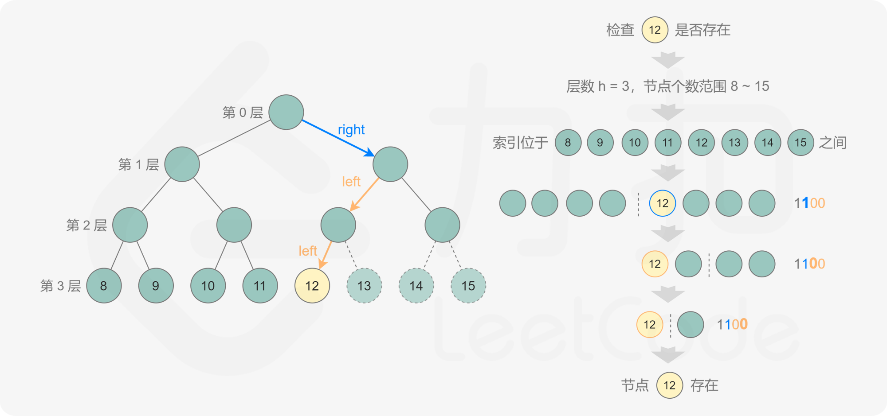

> @Author  : Lewis Tian (taseikyo@gmail.com)
>
> @Link    : github.com/taseikyo
>
> @Range   : 2020-11-29 - 2020-12-05

# Weekly #5

[readme](../README.md) | [previous](202011W4.md) | [next](202012W2.md)


\**Photo by Lewis Tian on Unsplash*

## Table of Contents

- [algorithm](#algorithm-)
	- 222.完全二叉树的节点个数
- [review](#review-)
- [tip](#tip-)
	- go 的 \[\] rune 和 \[\] byte 区别（中文）
	- Win10 无敌输入法诞生：微软拼音+搜狗词库（中文）
	- Windows 上是否有 `/dev/null`？（中文）
- [share](#share-)

## algorithm [⬆](#weekly-5)

### 1. [222.完全二叉树的节点个数](https://leetcode-cn.com/problems/count-complete-tree-nodes/)

给出一个完全二叉树，求出该树的节点个数。

直接递归挺简单的：

```Go
func countNodes(root *TreeNode) int {
	if root == nil {
		return 0
	}
	return 1 + countNodes(root.Left) + countNodes(root.Right);
}
```

官方题解给出了一个二分查找+位运算的解法，好是好，但是面试的时候肯定想不出来：

规定根节点位于第 0 层，完全二叉树的最大层数为 h。

如果第 k 个节点位于第 h 层，则 k 的二进制表示包含 h+1 位，其中最高位是 1，其余各位从高到低表示从根节点到第 k 个节点的路径，0 表示移动到左子节点，1 表示移动到右子节点。通过位运算得到第 k 个节点对应的路径，判断该路径对应的节点是否存在，即可判断第 k 个节点是否存在。

如果第 k 个节点存在，则节点个数一定大于或等于 k，如果第 k 个节点不存在，则节点个数一定小于 k，由此可以将查找的范围缩小一半，直到得到节点个数。



> 注：sort 包中的 func Search(n int, f func(int) bool) int 解释
>
> Search 采用二分法搜索找到 [0, n) 区间内最小的满足 f(i)==true 的值 i

```Go
func countNodes(root *TreeNode) int {
	if root == nil {
		return 0
	}
	level := 0
	for node := root; node.Left != nil; node = node.Left {
		level++
	}
	return sort.Search(1<<(level+1), func(k int) bool {
		if k <= 1<<level {
			return false
		}
		bits := 1 << (level - 1)
		node := root
		for node != nil && bits > 0 {
			if bits&k == 0 {
				node = node.Left
			} else {
				node = node.Right
			}
			bits >>= 1
		}
		return node == nil
	}) - 1
}
```

## review [⬆](#weekly-5)

## tip [⬆](#weekly-5)

### 1. [go 的 \[\] rune 和 \[\] byte 区别（中文）](https://learnku.com/articles/23411/the-difference-between-rune-and-byte-of-go)

原文是英文，但是对应链接打不开了。

在 go 中，byte 占一个字节，类似 c 中的 char（go 没有 char 这个类型），而 rune 占四个字节，所以 `[]rune(s)` `[]byte(s)` 这俩有啥区别？

```Go
first := "fisrt"
fmt.Println([]rune(first))
fmt.Println([]byte(first))
```

> [102 105 115 114 116] // 输出结果 [] rune  
> [102 105 115 114 116] // 输出结果 [] byte

由于字母根据 ASCII 编码都是一个字节，看不出什么，下面中文就可以看出区别了。

```Go
first := "社区"
fmt.Println([]rune(first))
fmt.Println([]byte(first))
```

> [31038 21306] // 输出结果 [] rune  
> [231 164 190 229 140 186]// 输出结果 [] byte

中文字符串每个占三个字节，当我们像截取若干中文该怎么办？

```Go
s := "截取中文"
//试试这样能不能截取?
fmt.Println(s[:2])
```

> ?? // 输出 在预料之中， 输出了常见的？？

```Go
s := "截取中文"
//试试这样能不能截取?
res := []rune(s)
fmt.Println(string(res[:2]))
```

> 截取 // 输出，顺利截取了

当你直接使用 `s[:2]` 进行截取的时候，底层会将中文转化成 **[]byte**， 而不是 **[]rune**，当我尝试 `fmt.Println(s[:3])` 的时候正常打印出 "截"。

### 2. [Win10 无敌输入法诞生：微软拼音+搜狗词库（中文）](https://baijiahao.baidu.com/s?id=1659926342373074716)

在苦恼于微软自带输入法瘠薄的词库时发现了这篇文章，主要就是使用 [studyzy/imewlconverter](https://github.com/studyzy/imewlconverter) 这个转换工具，将下载好的搜狗词库转化为微软输入法的**自学词汇**或者**自定义短语**，由于自学词汇有长度限制，而自定义短语没有，当词库过大时可以转短语，但是导入大量短语后设置界面会卡住（别问我怎么知道的），所以感觉还是自学词库好一点，然鹅有长度限制，各有利弊吧。

另外还学到了一个技巧：**英文提示**。微软输入法只有在中文输入时，才会有英文单词提示，但是使用效果并不是很理想，可能输了好多字母才开始提示，而且提示的那个单词并不是我想要的。

这个好用的技巧是在输入第一个字母时按住 shift，也就是第一个字母大写，然后就转为一种类似英文的提示输入了，虽然每次需要把第一个字母改回小写，但是英文提示功能大大增强了，算是一个不错的技巧了。

### 3. [Windows 上是否有 `/dev/null`？（中文）](https://www.imooc.com/wenda/detail/578468)

今天在 Python 脚本中调用 7z 时会输出中间过程，但我并不想要看到这些信息，于是搜了一下，在慕课这个问答找到答案：


> @慕容4345310：我想你想要NUL，至少在命令提示符或批处理文件中。
>
> 例如：
> type c:\autoexec.bat > NUL
>
> 不创建文件。
> （我相信如果您尝试以编程方式创建文件也是如此，但我还没有尝试过。）
>
> 在 PowerShell 中，您需要 $null：
>
> echo 1 > $null

> @德玛西亚99：NUL 在 Windows 中似乎实际上是任何文件夹中的虚拟路径。就像..，.在任何文件系统。
>
> 使用NUL后面的任何文件夹都可以。
>
> 例，
>
> echo 1 > nul
>
> echo 1 > c:\nul
>
> echo 1 > c:\users\nul
>
> echo 1 > c:\windows\nul
>
> 与/dev/nullLinux上的效果相同。
>
> 这是在 Windows 7，64 位上测试的。

而我将 `os.system(f"7z x {filename} -o{folder}")` 改为 `os.system(f"7z x {filename} -o{folder} > nul")` 之后果然没有输出了！太舒服了！

## share [⬆](#weekly-5)

[readme](../README.md) | [previous](202011W4.md) | [next](202012W2.md)
