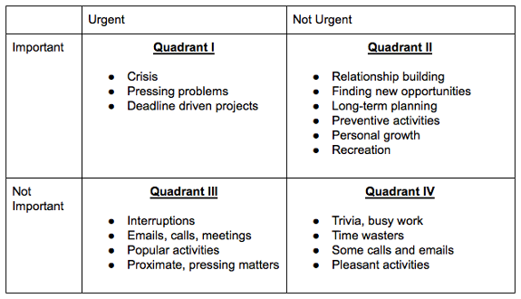

> @Author  : Lewis Tian (taseikyo@gmail.com)
>
> @Link    : github.com/taseikyo
>
> @Range   : 2020-12-06 - 2020-12-12

# Weekly #6

[readme](../README.md) | [previous](202012W1.md) | [next](202012W3.md)

总字数：3533 个（汉字：1786，英文单词：586，数字：183，中文标点：206，英文标点：772），阅读时长约：6 分 57 秒。


\**Photo by JUNHØ on Unsplash*

有时候会提前将本周的 weekly 提交，所以可能会导致本周的事计入下周的 weekly，问题不大，重点是事情，时间只是个 tag，了解到这一点就行。

## Table of Contents

- [algorithm](#algorithm-)
	- 767.重构字符串
	- 321.拼接最大数
- [review](#review-)
    - Windows Linux 子系统 1 和 2 的区别（英文）
- [tip](#tip-)
	- go 中三个点的四处用法（英文）
	- 修改微软应用商店的应用安装位置（中文）
- [share](#share-)
    - 你也可以做大事，前提是你有时间（英文）

## algorithm [⬆](#weekly-6)

### 1. [767.重构字符串](https://leetcode-cn.com/problems/reorganize-string/)

给定一个字符串S，检查是否能重新排布其中的字母，使得两相邻的字符不同。若可行，输出任意可行的结果。若不可行，返回空字符串。

@[wuyudi](https://github.com/wuyudi) 给出了一个极为精简的 Python 做法，首先根据字符出现次数排序，然后间隔填空，由于相同的字符被移到一起了，在输出重排的时候会间隔一个不一样的。我觉得最妙的是 zip 的运用，由于它会根据最短的那个 Iterator 来停止，所以相当于只迭代了一半，所以最后有个判断。

```QQ
===Seminar@2020/11/30===

@wuyudi(0:34:35):

class Solution:
    def reorganizeString(self, S: str) -> str:

        lst = sorted(sorted(S), key=lambda x: S.count(x), reverse=True)
        n = int(len(S) / 2 + 0.5)  # 奇数位数时取中间右边一位

        if lst[0] == lst[n]:  # 最多的字符超过半数
            return ""
        else:
            return "".join(f"{i}{j}" for i, j in zip(lst, lst[n:])) + (
                "" if len(S) % 2 == 0 else lst[n - 1]
            )


@wuyudi:

借鉴了别人的思路，修改了一下

@salient(1:23:53):

nb，迪哥现在是十二点蹲点刷题吗

@wuyudi(1:51:20):

是断电后玩gal，玩到12点顺路刷一下，不会做就抄题解

...


@taseikyo(8:47:39):

[截图][1:54:34], [截图][3:20:29], [截图][4:54:20]
这合理吗

@hansimov(10：17：20):
[图片][流泪猫猫头]

@taseikyo(11:32:57):
回复@wuyudi(0:34:35)
最后的zip太帅了

@wuyudi:
这个是基操吧，比如算逐差法，zip(li,li[1:])

@wuyudi:
j-i for i,j in zip(l,l[1:])

@taseikyo:
[图片][流泪猫猫头]没咋用过

@taseikyo:
主要是我觉得它的“截断”很妙
```

后面参考（抄）题解整了个 go 版本的解法，这个解法好快，直接 100%。

> tip: for range string
>
> 从 string 里使用索引值得到的数据是 byte 类型的，而使用 `for _, v range s` 却是 rune 类型，这里注意下。

```Go
type pair struct {
	char  rune
	count int
}

func reorganizeString(S string) string {
	// a-z
	bucket := make([]pair, 26)
	maxCount := 0
	// 统计各个字符出现次数
	for _, char := range S {
		offset := char - 'a'
		if bucket[offset].count == 0 {
			bucket[offset].char = char
		}
		bucket[offset].count++
		if bucket[offset].count > maxCount {
			maxCount = bucket[offset].count
		}
	}
	if maxCount > (len(S)+1)/2 {
		// 超过一半，无解
		return ""
	}
	// 出现次数从大到小排序
	sort.Slice(bucket, func(i, j int) bool {
		return bucket[i].count >= bucket[j].count
	})

	// 从最多的字符开始按照下标先偶后奇填
	chars, index := make([]rune, len(S)), 0
	for i := 0; i < 2; i++ {
		for j := i; j < len(S); j += 2 {
			if bucket[index].count == 0 {
				// 消耗完当前字符
				index++
			}
			chars[j] = bucket[index].char
			bucket[index].count--
		}
	}
	return string(chars)
}
```

### 2. [321.拼接最大数](https://leetcode-cn.com/problems/create-maximum-number/)

给定长度分别为 m 和 n 的两个数组，其元素由 0-9 构成，表示两个自然数各位上的数字。现在从这两个数组中选出 k (k <= m + n) 个数字拼接成一个新的数，要求从同一个数组中取出的数字保持其在原数组中的相对顺序。

挺难的一道题（毕竟是困难），看了题解懂了，自己写恐怕难写，把 k 分成 m 和 n，分别挑出两个数组的最大值，然后合并成一个"最大值"，遍历所有情况（m，n 分别从 0 到各自数组的最大长度），返回最大的"最大值"。

下面首先是 Python 版本，由于存在 max 函数，会使得代码短不少，而且可读性也很高。

```Python
class Solution:
    def maxNumber(self, nums1, nums2, k):
        def pick_max(nums, k):
            stack = []
            drop = len(nums) - k
            for num in nums:
                while drop and stack and stack[-1] < num:
                    stack.pop()
                    drop -= 1
                stack.append(num)
            return stack[:k]

        def merge(A, B):
            ans = []
            while A or B:
                bigger = A if A > B else B
                ans.append(bigger.pop(0))
            return ans

        return max(
            merge(pick_max(nums1, i), pick_max(nums2, k - i))
            for i in range(k + 1)
            if i <= len(nums1) and k - i <= len(nums2)
        )
```

这段代码让我大开眼界，对于一个 Go 新手来说 merge 函数中间的赋值让我只呼牛皮，lexicographicalLess 函数的复用也是让我眼前一亮，果然是内行。

```Go
func maxSubsequence(a []int, k int) (s []int) {
    for i, v := range a {
        for len(s) > 0 && len(s)+len(a)-1-i >= k && v > s[len(s)-1] {
            s = s[:len(s)-1]
        }
        if len(s) < k {
            s = append(s, v)
        }
    }
    return
}

func lexicographicalLess(a, b []int) bool {
    for i := 0; i < len(a) && i < len(b); i++ {
        if a[i] != b[i] {
            return a[i] < b[i]
        }
    }
    return len(a) < len(b)
}

func merge(a, b []int) []int {
    merged := make([]int, len(a)+len(b))
    for i := range merged {
        if lexicographicalLess(a, b) {
            merged[i], b = b[0], b[1:]
        } else {
            merged[i], a = a[0], a[1:]
        }
    }
    return merged
}

func maxNumber(nums1, nums2 []int, k int) (res []int) {
    start := 0
    if k > len(nums2) {
        start = k - len(nums2)
    }
    for i := start; i <= k && i <= len(nums1); i++ {
        s1 := maxSubsequence(nums1, i)
        s2 := maxSubsequence(nums2, k-i)
        merged := merge(s1, s2)
        if lexicographicalLess(res, merged) {
            res = merged
        }
    }
    return
}
```

## review [⬆](#weekly-6)

### 1. [Windows Linux 子系统 1 和 2 的区别（英文）](https://jmmv.dev/2020/11/wsl-lost-potential.html)

这篇文章解释了 wsl1 和 wsl2 的区别。

wsl1 和 win32 相对于 NT 内核来说是类似的，都是环境子系统（environment subsystem），wsl1 提供了运行 Linux 的环境，因此它需要实现 Linux 的所有 ABI 接口。给我的感觉就是在用户与 NT 内核之间加了一层，负责识别 Linux 命令，然后转化为 NT 内核可识别的原语从而执行，跟 Shell 有点像？

wsl2 则是一个虚拟机，运行着一个完整的 Linux 系统（内核，文件系统和网络堆栈），这样就不需要重新实现 Linux 所有的 ABI 了，减少了工程实现压力。

目前使用 wsl2 比 wsl1 舒服，但是文件系统还是有问题，访问 Windows 的文件夹（C、D 盘）的权限是 777，还有个是命令的问题，当使用 Windows 的程序时，需要加 `.exe` 才能跑起来，比如运行 sublime，在 Windows 完全可以在运行或者 cmd 中输入 `subl`，但是在 wsl2 中不行，必须使用 `subl.exe`，感觉有点蠢。

作者提到在 wsl1 中可以使用 ps/top/kill 查看和杀死 Windows 进程、可以用命令管理 Windows 服务、用 ifconfig 管理网卡，这些为啥我之前没注意到？

## tip [⬆](#weekly-6)

### 1. [go 中三个点的四处用法（英文）](https://yourbasic.org/golang/three-dots-ellipsis)

1. 变长的函数参数

如果函数的最后一个参数类型是 `...T`，那么在调用的时候，我们可以在参数列表的最后使用若干个类型为 T 的参数。这里，`...T` 在函数内部的类型实际是 `[]T`，如下，我们可以调用 Sum(1, 2, 3) 或者 Sum()

```Go
func Sum(nums ...int) int {
    res := 0
    for _, n := range nums {
        res += n
    }
    return res
}
```

2. 调用拥有变长参数列表的函数

上面调用 Sum 函数时，是将变长参数分开写的。如果我们有一个 slice，那么我们调用时不必将 slice 拆开再调用，直接在 slice 后跟 `...` 即可：

```Go
primes := []int{2, 3, 5, 7}
fmt.Println(Sum(primes...)) // 17
```

3. 标识数组元素个数

在数组字面量中，`...` 表示长度等于数组中元素的数量。

```Go
stooges := [...]string{"Moe", "Larry", "Curly"} // len(stooges) == 3
```

4. Go 命令行中的通配符

在描述包列表时，go 命令使用三个点作为通配符。下面的命令测试当前目录及其子目录中的所有包。

```Go
$ go test ./...
```

### 2. [修改微软应用商店的应用安装位置（中文）](https://ithelp.ithome.com.tw/articles/10254562)

貌似是台湾的技术网站，都是繁体，一些技术词跟我们这边不太一样，"程序" -> "程式"，"磁盘" -> "磁碟"。

- 修改默认安装位置
	- 「设置」-「系统」-「存储」
	- 更多存储设置下的「更改新内容的保存位置」
	- 「新的应用将保存到」修改位置，选择应用
- 移动已安装应用程序位置
	- 「设置」-「应用」-「应用和功能」
	- 选择一个应用，点击「移动」，选择磁盘（但是在我电脑上按钮是灰的，也就是说移动不了）

## share [⬆](#weekly-6)

### 1. [你也可以做大事，前提是你有时间（英文）](https://medium.com/the-ascent/you-can-do-amazing-things-but-only-if-you-have-time-to-do-them-31c07ab5b04e)

*You can do amazing things — but only if you have time to do them.*

学会对一些不重要的事情说不，因为一旦答应一件事，相应的就会错过其他的事情，学会拒绝，从一系列事情中挑选出最重要的事情，即使需要等待一些时间。

人们经常说忙，但其实大多忙于琐事，没有将时间这一重要的东西分配在真正重要的事情上面。James Covery 有一个时间管理矩阵，如下图所示。



\**James Covery Time Management Matrix*

作者提到大多数人将大多数时间花在左下角那个第三象限，也即紧急但不重要的事情；虽然作者文中提到巴菲特和乔布斯，但是一般人可能并不会放这么长的线，敢于做出他们那样的决定，而且...很多琐事并不由自己选择啊...

就跟我在前一篇（[在你感觉准备好之前采取行动](202012W1.md#share-)）说过类似，并不是所有人都有决心能放弃当前的工作追梦，大多数所求不过是安稳罢了。大事？amazing things? can you? 不过每个人对这个的定义不同，也不太好说，一份能长久做下去的理想工作就算是搞定了一件大事了吧。

> 人生碌碌，竞短论长，却不道荣枯有数，得失难量。

<details>
<summary></summary>

（为什么在每篇 Share 的部分，我的想法怎么都这么消极？我不是一个乐观的人吗？对自己的认识有误？）
</details>

[readme](../README.md) | [previous](202012W1.md) | [next](202012W3.md)
