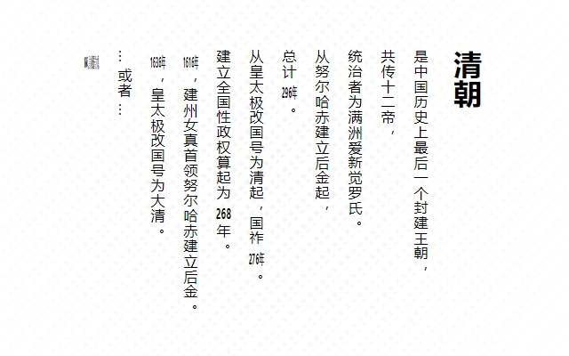
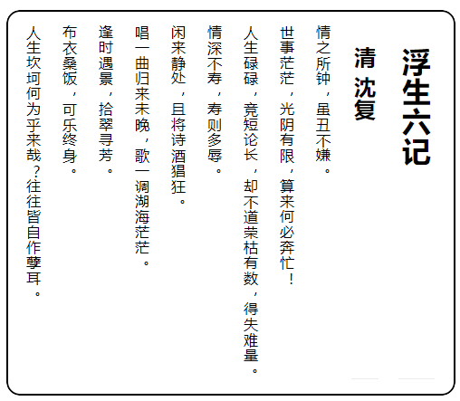

> @Author  : Lewis Tian (taseikyo@gmail.com)
>
> @Link    : github.com/taseikyo
>
> @Range   : 2020-12-13 - 2020-12-19

# Weekly #7

[readme](../README.md) | [previous](202012W2.md) | [next](202012W4.md)

总字数：4391 个（汉字：2521，英文单词：727，数字：325，中文标点：303，英文标点：515），阅读时长约：8 分 25 秒。


\**Photo by [Bruce Tang](https://unsplash.com/@brucetml) on [Unsplash](https://unsplash.com/photos/W7mPIKBN108)*

何时仗尔看南雪，我与梅花两白头。

## Table of Contents

- [algorithm](#algorithm-)
  - 62.不同路径
- [review](#review-)
  - 20 个有争议的编程观点（英文）
- [tip](#tip-)
  - CSS text-combine-upright 竖行横书组合（中文）
  - Linux 下查看系统启动/运行/安装时间（中文）
  - 使用 jupyter 食用 markdown（中文）
- [share](#share-)
  - 我们应该掌握的三门编程语言

## algorithm [⬆](#weekly-7)

### 1. [62.不同路径](https://leetcode-cn.com/problems/unique-paths/)

对于一个棋盘，从左上到右下一共有多少条路径（每次只能下或者右）？

很简单的一道动态规划的题目，只需要初始化一个二维矩阵的第一行第一列为 1，其他格子填空就行。对于格子 `m[i][j]`，能到它的路径数为到它上面格子的路径数与到左边格子的路径数之和（`m[i][j] = m[i-1][j] + m[i][j-1]`），右下角格子的值即是答案。

> [leetcode_0062.go](../code/leetcode_0062.go)

```Go
func uniquePaths(m int, n int) int {
	board := make([][]int, m, m)
	for i := 0; i < m; i++ {
		col := make([]int, n, n)
		board[i] = col
	}
	for i := 0; i < n; i++ {
		board[0][i] = 1
	}
	for i := 0; i < m; i++ {
		board[i][0] = 1
	}
	for i := 1; i < m; i++ {
		for j := 1; j < n; j++ {
			board[i][j] = board[i-1][j] + board[i][j-1]
		}
	}
	return board[m-1][n-1]
}
```

## review [⬆](#weekly-7)

### 1. [20 个有争议的编程观点（英文）](https://programmers.blogoverflow.com/2012/08/20-controversial-programming-opinions/)

1. Programmers who don’t code in their spare time for fun will never become as good as those that do（不利用业余时间编写代码来取乐的程序员永远不会像那些这样做的程序员一样优秀）

正如那句谚语所说，*熟能生巧*，对于编程来说，可能 coding 越多，越熟练，遇到的问题越多，然后思维和见识更开阔？

2. Unit testing won’t help you write good code（单元测试不会帮助你写出好的代码）

确实，就我目前知道的所谓的单元测试是为了检测代码的 bug，只要逻辑没问题，代码即使很烂也能通过测试吧？

3. The only "best practice" you should be using all the time is "Use Your Brain"（你应该一直使用的唯一最好的练习是使用你的大脑）

*Too many people jumping on too many bandwagons and trying to force methods, patterns, frameworks, etc. onto things that don’t warrant them.*

我理解作者提出这一点大概是培养自己的思维，而不是落入方法、模式和框架的桎梏之中，毕竟计算机技术更新迭代太快了，但是一些基础想法是不会变的，比如算法，数据结构这些。

4. Most comments in code are in fact a pernicious form of code duplication（大多数代码注释都是有害的代码重复形式）

注释不可以没有，但也别写没用的重复注释（`int a; // 变量 a`）。之前在哪看到说最好的代码都是自注释的，确实如此。

5. “Googling it” is okay

这一点跟第四期的 Share 主题（[有时候，精英主义是可以接受的](202011W4.md#share-)）不谋而合。

6. Not all programmers are created equal（并非所有的程序员都是生而平等的）

*In actual fact, the performance of one developer can be 10x or even 100x that of another.*

7. I fail to understand why people think that Java is absolutely the best “first” programming language to be taught in universities （我不明白为什么人们认为Java绝对是大学中教授的最好的“第一”编程语言）

并不，我们学校都没教过 :)

8. If you only know one language, no matter how well you know it, you’re not a great programmer（如果你只会一种语言，那么无论你多么了解它，你都不是一个优秀的程序员）

确实，只会一种根本不够，不同语言的设计哲学与应用场景都不完全相同，编译型与解释型，面向过程与面向对象的语言就差别很大，多会一种语言，就如同多登过一座山，看到的风景会大不相同。

9. It s OK to write garbage code once in a while（偶尔写一些垃圾代码是可以的）

能跑就行嘛（

10. Print statements are a valid way to debug code（打印语句是调试代码的有效方法）

确实，print 是一种虽然蠢但是有效的 debug 手段。

11. Your job is to put yourself out of work（你的工作就是让自己失业）

作者的意思是将自己的代码写得清晰易懂，换一个人上来也可以很快接手。*Interestingly, I ve found that having that goal has made me more valuable to my employers. The more I strive to be disposable, the more valuable I become to them*，有意思，作者是公司管理层故意来带节奏的吧（大雾

12. Getters and Setters are highly overused

听说 Java 里面很多 getter 和 setter，但是在 C++/Python 中貌似挺少的？

13. SQL is code. Treat it as such（SQL是代码，像代码一样对待它）

统一书写 SQL 的风格，毕竟我接触过的 SQL 都是不区分大小写的，所以经常看到大小写混写的 :O

14. UML diagrams are highly overrated（UML 图被高估了）

我个人是非常讨厌思维导图的，以前刷知乎看到有思维导图立马快速刷过去。

15. Readability is the most important aspect of your code（可读性是代码中最重要的方面）

强烈同意，可读性比使用各种技巧更重要，可能你当前学到某种看起来很酷的技巧，写下了代码，后面回头看估计会头大。

16. XML is highly overrated

我觉得 JSON 比 XML 好用，解析 XML 真的脑阔痛。

17. Software development is just a job

*I think sometimes a lot of developers forget that developing is just something that allows us to have the more important things in life (and to have them by doing something we enjoy) rather than being the end goal in itself.*

18. If you’re a developer, you should be able to write code

19. Design patterns are hurting good design more than they’re helping it（设计模式对好的设计的伤害大于对设计的帮助）

没用过，只知道在准备面试的时候设计模式挺难记的（我最讨厌背书了）。

20. Less code is better than more!

可能这就是 Python 的魅力所在？很多工作几行代码就能解决，换成其他的语言可能会很麻烦。

## tip [⬆](#weekly-7)

### 1. [CSS text-combine-upright 竖行横书组合（中文）](http://www.deathghost.cn/article/css/86)

很有趣的一个 CSS 技巧，利用 `writing-mode` 这个属性就可以实现古时候的竹简文字效果（从上而下，从右而左），作者给出效果图：



因为阿拉伯数字也跟着旋转效果会很怪，所以作者对阿拉伯数字改了下样式，代码如下所示，

```CSS
div{
  writing-mode: vertical-rl;
  letter-spacing: 1px;
}
div b{
  text-combine-upright: all;
  margin: 5px 0;
}
```

```HTML
<div>
  <h1>清朝</h1>
  <p>是中国历史上最后一个封建王朝，</p>
  <p>共传十二帝，</p>
  <p>统治者为满洲爱新觉罗氏。</p>
  <p>从努尔哈赤建立后金起，</p>
  <p>总计<b>296</b>年。</p>
  <p>从皇太极改国号为清起，国祚<b>276</b>年。</p>
  <p>建立全国性政权算起为<b>268</b>年。</p>
</div>
```

我试了下在 md 中尝试这种样式，本地展示效果不错，如预期所料那样，不知道放到 GitHub 会怎样。

<div style="writing-mode: vertical-rl;letter-spacing: 1px;border:2px solid;border-radius:15px;padding-top: 15px;">
  <h1>浮生六记</h1>
  <h2>清 沈复</h2>
  <p>情之所钟，虽丑不嫌。</p>
  <p>世事茫茫，光阴有限，算来何必奔忙！</p>
  <p>人生碌碌，竞短论长，却不道荣枯有数，得失难量。</p>
  <p>情深不寿，寿则多辱。</p>
  <p>闲来静处，且将诗酒猖狂。</p>
  <p>唱一曲归来未晚，歌一调湖海茫茫。</p>
  <p>逢时遇景，拾翠寻芳。</p>
  <p>布衣桑饭，可乐终身。</p>
  <p>人生坎坷何为乎来哉？往往皆自作孽耳。</p>
</div>

果然 GitHub 显示不了，还是贴一下本地的效果吧：



### 2. [Linux 下查看系统启动/运行/安装时间（中文）](https://www.cnblogs.com/nulige/p/7742928.html)

主要是最近用到了，于是查了下才知道有这么多种方法，算是个记录但是不会记的技巧吧（人话：下次要用还是直接查）。

一、启动与运行时间

这俩是联系到一块的，因为文中给出的基本都是根据运行时间反推启动时间。

1. uptime 命令

```Bash
taseikyo@localhost ~> uptime
16:11:40 up 59 days, 4:21, 2 users, load average: 0.00, 0.01, 0.00
```

2. 读取 `/proc/uptime` 文件

```Bash
taseikyo@localhost ~> cat /proc/uptime
5113396.94 575949.85
```

第一数字即是系统已运行的时间，运用系统工具 date 即可算出系统启动时间。

```Bash
taseikyo@localhost ~> cat /proc/uptime | awk -F. '{run_days=$1 / 86400;run_hour=($1 % 86400)/3600;run_minute=($1 % 3600)/60;run_second=$1 % 60;printf("系统已运行：%d天%d时%d分%d秒",run_days,run_hour,run_minute,run_second)}'
系统已运行：0天0时24分34秒
```

3. who 命令

`who -b` 查看最后一次系统启动的时间；

4. last reboot 命令

```Bash
taseikyo@localhost ~> last reboot
....
taseikyo@localhost ~> last reboot | head -1
```

5. top 命令

up 后表示系统到目前运行了多久时间，反过来推算系统重启时间。

```Bash
taseikyo@localhost ~> top
top - 15:00:29 up 27 min,  2 users,  load average: 0.00, 0.01, 0.05
Tasks:  99 total,   1 running,  98 sleeping,   0 stopped,   0 zombie
%Cpu(s):  0.0 us,  0.2 sy,  0.0 ni, 99.8 id,  0.0 wa,  0.0 hi,  0.0 si,  0.0 st
KiB Mem :  8176008 total,  7892856 free,   131764 used,   151388 buff/cache
KiB Swap:  8257532 total,  8257532 free,        0 used.  7868548 avail Mem
```

6. w 命令

```Bash
taseikyo@localhost ~> w
 15:00:56 up 28 min,  2 users,  load average: 0.00, 0.01, 0.05
USER     TTY      FROM             LOGIN@   IDLE   JCPU   PCPU WHAT
taseikyo     tty1                      14:33   25:52   0.07s  0.07s -bash
taseikyo     pts/0    10.0.100.55      14:37    0.00s  0.10s  0.00s w
```

二、系统安装时间

下面两个命令对我都不好使，第一个显示 bad magic number xxx，第二个时间不对；后面去查了下，这个命令可以 `ls -ld /var/log/installer` 因为这个目录是放系统的安装日志，输出结果还比较合理。

1. tune2fs 命令

```Bash
[root@control1 ~]# tune2fs -l /dev/sda1 | grep create
Filesystem created: Tue Aug 15 16:52:06 2017
```

2. 查看系统创建账号时间来判断系统安装日期

```Bash
[root@zabbix-server ~]# passwd -S zabbix
zabbix LK 2017-06-28 -1 -1 -1 -1 (密码已被锁定。)
```

### 3. [使用 jupyter 食用 markdown（中文）](https://www.cnblogs.com/liaohuiqiang/p/9380458.html)

由于 ipynb 会存很多信息导致文件很大，我一直很抗拒使用，今天发现了一个技巧可以用 jupyter 打开 markdown，然后运行其中的代码。

主要使用了一个名为 [notedown](https://github.com/aaren/notedown) 的工具，在其 GitHub 主页上写着可以使得 md 与 ipynb 互转，通过对 jupyter 进行简单配置即可食用。

1. 安装 notedown

```Bash
pip install notedown
# or
pip install https://github.com/aaren/notedown/tarball/master
```

2. 修改 jypyter 配置

临时配置，每次运行都需要加后面一长串命令，比较麻烦。

```Bash
jupyter notebook --NotebookApp.contents_manager_class='notedown.NotedownContentsManager'
```

修改配置文件，不用每次都加那么长一串命令。

```Bash
# 生成配置文件（C:\Users\taseikyo\.jupyter\jupyter_notebook_config.py）
jupyter notebook --generate-config
# 在配置文件末尾加下面命令
c.NotebookApp.contents_manager_class = 'notedown.NotedownContentsManager'
```

然后去到一个你想以 ipynb 食用的 md 文件夹运行 `jupyter notebook`，然后就可以在网页运行 md 文件中的代码了。对于一个纯文本，打开就是一个 cell，如果包含代码就会拆成多个 cell，自己一试便知。

这下就很舒服了，既可以用 md 进行轻量级的写笔记，还可以用 ipynb 运行嵌入其中的代码，这正是我写 md 文档的风格啊。像我在 [markdown-guide](https://github.com/taseikyo/markdown-guide) 中所写的，从知道 md 之后就彻底投向 md 的怀抱，不管是纯文字笔记，还是关于一些技术文档都是用 md 格式存的。

后记，安装好对应交互式环境，jupyter 甚至能跑 c/c++，golang 代码，离谱；

## share [⬆](#weekly-7)

### 1. 我们应该掌握的三门编程语言

这是我之前看到过的一个投票，大概是*你觉得最应该掌握的三门编程语言*或者是*你最推荐的三门编程语言*，忘了具体在哪看到的，大概的内容差不多，分享一下我自己的看法。

如果要选出必须掌握的三门编程语言（显然就会一种是不太够的，见本期 View（20 个有争议的编程观点）中的第 8 点），我的观点是 Python、JavaScript 和 你工作需要的语言（C++？Go？Java？）。

首先是 Python，这个是首选，因为它真的很有用，无论是获取数据还是分析数据，亦或是做一些小脚本都很方便。在我看来，掌握 Python 能大大提高做事的效率，甚至能提高个人的幸福指数。所以那句名言（人生苦短，我用 Python）是很有道理的。

其次是 JavaScript，由于现代人基本都会跟浏览器打交道，无论是看视频还是刷 GitHub，掌握 JavaScript 让我们的浏览器增加一些功能能让我们的浏览体验大大提升。

这让我想起来去年大概是 618 的时候，小米手环 4 新品发布会，有个发弹幕抽奖的活动，我当时写了个简单脚本，每隔 10 秒发一个弹幕，然后就去另一个 tab 页面了，当时是不知道中奖了，后来是因为打开小米商城看新手机有通知说小米手环 4 中奖了，那个优惠券即将过期，于是我赶紧下单使用优惠券（价格：0），这大概是我第一次用代码中奖。

最后一个是工作所使用的语言，这个跟个人具体相关，所以我没限定死是哪一门语言，可能你要使用 Java，那么就是 Java。那我自己来说，如果不出意外，基本是 Go 了。

其实话说回来，编程语言基本大多还是相通的，熟练掌握了某一门语言，再转其他的也不算太难。

[readme](../README.md) | [previous](202012W2.md) | [next](202012W4.md)
