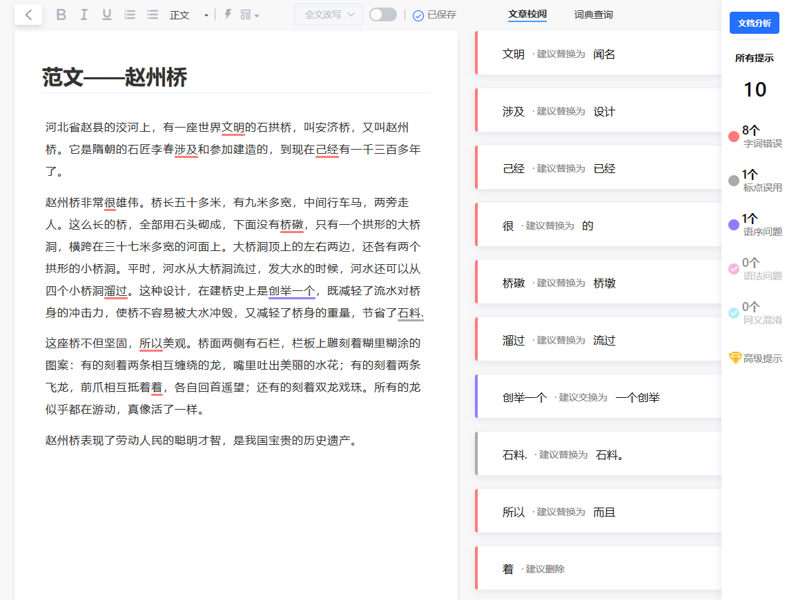

> @Author  : Lewis Tian (taseikyo@gmail.com)
>
> @Link    : github.com/taseikyo
>
> @Range   : 2020-12-20 - 2020-12-26

# Weekly #8

[readme](../README.md) | [previous](202012W3.md) | [next](202012W5.md)


\**Photo by [Lerone Pieters](https://unsplash.com/@thevantagepoint718) on [Unsplash](https://unsplash.com/photos/CBcRHEuY7PA)*

人生如逆旅，我亦是行人。

## Table of Contents

- [algorithm](#algorithm-)
	- 数字颠倒
- [review](#review-)
- [tip](#tip-)
	- AI 写作智能纠错
	- 将 os.popen 的默认编码由 ascii 修改为 utf-8
	- Python 波浪号运算符 `~`（StackOverflow）
	- Markdown 代码块内使用斜体（知乎）
- [share](#share-)
	- 停止追求完美 —— 过你想要的生活（英文）

## algorithm [⬆](#weekly-8)

### 1. [数字颠倒](https://www.nowcoder.com/practice/ae809795fca34687a48b172186e3dafe)

输入一个整数，将这个整数以字符串的形式逆序输出，程序不考虑负数的情况，若数字含有 0，则逆序形式也含有 0，如输入为 100，则输出为 001。

题目不难，如果用 Python 可能一行就解决，但是 Go 的话我还是不太会，一些库，语法不太熟悉，甚至连输入都不知道怎么玩 2333，还是查了下才知道是 fmt，之前只用来 输出来着。

后面一个代码是提交通过排行第一的代码，算是取巧了，直接用 string 类型接收，少了一步转换。

> [nowcoder_ae809795fca34687a48b172186e3dafe.go](../code/nowcoder_ae809795fca34687a48b172186e3dafe.go)

```Go
func main() {
	var num int
	fmt.Scanf("%d", &num)
	s := strconv.Itoa(num)
	end := len(s) - 1
	for i := end; i >= 0; i-- {
		fmt.Printf("%c", s[i])
	}
}
```

```Go
func main() {
	for {
		var str string
		_, err := fmt.Scan(&str)
		if err != nil {
			return
		}
		for j := len(str) - 1; j >= 0; j-- {
			fmt.Print(string(str[j]))
		}
		fmt.Println()
	}
}
```

## review [⬆](#weekly-8)

## tip [⬆](#weekly-8)

### 1. [AI 写作智能纠错](https://xiezuocat.com)

偶然发现的一个名为*写作猫*的网站，自称是新一代的 AI 写作伴侣，帮助推敲用户、斟酌文法、改良文风还能实时同步翻译。

看了下给出的实例，感觉还挺靠谱，错别字、标点也会指出来。麻烦的是需要登录，我很烦这一点，我大概不会用。



\**范文《赵州桥》的校队建议*

### 2. [将 os.popen 的默认编码由 ascii 修改为 utf-8（知乎）](https://www.zhihu.com/question/279037180)

今天遇到这么个问题，需要获取执行命令的输出，结果一直报错 "UnicodeDecodeError: 'gbk' codec can't decode byte 0x8b..."，部分代码如下：

```Python
r = os.popen(f"git log -p {file}")
for line in r:
	if line.find("Date") >= 0:
		print(line)
```

然后搜到知乎的这个问题，[骷髅垮](https://www.zhihu.com/people/kang-ze-nan) 的回答完美解决问题，包装成一个函数（其实无所谓）返回输出的结果，我这边调用 exec 函数拿到返回值，以 '\n' 切割就可以拿到每一行了。

```Python
def exec(cmd: str):
	pip = os.popen(cmd)
	return pip.buffer.read().decode(encoding='utf8')
```

### 3. [Python 波浪号运算符 `~`（StackOverflow）](https://stackoverflow.com/questions/8305199/the-tilde-operator-in-python)

`~` 是一个很有趣的运算符，对于整数，`~x` = `(-x) - 1`，所以判断一个列表是不是回文的有另一种写法：

```Python
def foo(lst: list):
	for i in range(len(lst)//2):
		if lst[i] != lst[-i]:
			return False
	return True
```

### 4. [Markdown 代码块内使用斜体（知乎）](https://www.zhihu.com/question/56472352/answer/1631761942)

遇到的问题，没找到答案，自己解答，答案也放到知乎了。

说来也简单，一般代码块都是用三个 "\`" 包起来，在里面用其他的样式都会失效，所以不能使用它，用 `pre` 标签就 ok 了，见下面代码块与效果：

```
<pre>
$ python3 apple.py <em>arg1</em>
</pre>
```

<pre>
$ python3 apple.py <em>arg1</em>
</pre>

## share [⬆](#weekly-8)

### 1. [停止追求完美 —— 过你想要的生活（英文）](https://medium.com/live-your-life-on-purpose/stop-trying-to-be-perfect-live-your-life-as-you-want-4735768055df)

从这篇文章，我学到一个词：遗愿清单（Bucket List）。购物清单是 Shopping List，愿望单是 Wish List，当我第一眼看到 Bucket List 我还诧异，桶列表是个什么鬼，搜了一下才知道是遗愿清单，其实我觉得翻译不太对，它的英语解释是：

*a number of experiences or achievements that a person hopes to have or accomplish during their lifetime.*

希望在活着的时候完成的事，跟 todo list 有那么点类似，我觉得翻译成遗愿清单欠妥。

文章想说是接受不完美做你自己会使你活得更快乐，这也是我前面 Share 一直以来传达的思想。

作者提到在 18 岁认为自己 25 岁的生活将达到一个完美的状态，于是在 15 年建了一个有 23 个目标的 Bucket List，结果只完成了 5 个；当他写这篇文章时，已经快 30 岁了，也没达到他当年的设想那般。给自己定了太多目标（很多还是通过观察别人的做法定制的），一直在 push 自己，这样做其实是在过别人定义的生活，追随别人的想法来寻找幸福/快乐是大错特错的（I was so wrong!）。

这篇文章短且简单易懂，很快就能看完，没啥好总结的，以作者一句话结尾吧：

*Striving for perfection is stressful. You push yourself beyond the limits and the goal still appears far away. You never seem to get to the destination.*

[readme](../README.md) | [previous](202012W3.md) | [next](202012W5.md)
