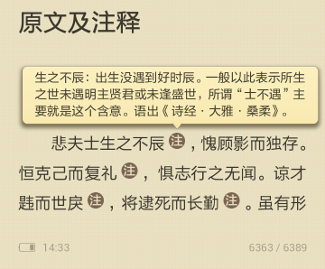

> @Author  : Lewis Tian (taseikyo@gmail.com)
>
> @Link    : github.com/taseikyo
>
> @Range   : 2020-12-27 - 2021-01-02

# Weekly #9

[readme](../README.md) | [previous](202012W4.md) | [next](202101W1.md)

## Table of Contents

- [algorithm](#algorithm-)
- [review](#review-)
	- 保护你的 `.env` 文件（英文）
- [tip](#tip-)
	- Linux 下防止文件被删（中文）
	- 用 pandoc 制作带弹出式注释的 EPUB 和 MOBI 电子书（中文）
	- 在 GitHub 风格的 Markdown 中添加脚注（StackOverflow）
- [share](#share-)

## algorithm [⬆](#weekly-9)

## review [⬆](#weekly-9)

### 1. [保护你的 `.env` 文件（英文）](https://tatooine-sunset.botond.online/2020-12-06-protect-your-dotenv/)

作者上线了一个小网站，10 个小时内就收到了许多可疑请求：

- /config/getuser?index=0
- /vendor/phpunit/phpunit/src/Util/PHP/eval-stdin.php
- /api/jsonws/invoke
- /solr/admin/info/system?wt=json
- /index.php?s=/Index/\x5Cthink\x5Capp/invokefunction &function=call_user_func_array&vars[0]=md5&vars[1][]=HelloThinkPHP21
- /console/
- /wp-content/plugins/wp-file-manager/readme.txt
- /Autodiscover/Autodiscover.xml
- /vendor/phpunit/phpunit/src/Util/PHP/eval-stdin.php
- /.env

最后一个请求尝试读取环境变量 `.env` 文件，`.env` 文件通常包含密码、密钥等敏感信息，所以作者提醒保护好该文件。

关键作者并不是一个名人（*I'm a nobody on the internet*），这样都收到了很多机器人请求（或者说是攻击也不为过），想象一下知名网站得收到多少奇奇怪怪的请求，网络安全确实是一个值得注意的大问题。

## tip [⬆](#weekly-9)

### 1. [Linux 下防止文件被删（中文）](http://smilejay.com/2020/06/linux-prevent-files-from-accidental-deletion/)

有时我们的一些重要的文件或目录，不希望被误删除或者修改，我们可以对其加上特殊的属性使其不可修改。

如果在 root 权限下，删除文件也被提示无权限 “Operation not permitted”，那么你可以查看一下文件是否被设置为不可修改的属性。

chattr（Change Attribute 的缩写）命令就是 Linux 改变文件属性的命令。对应地，lsattr 命令可以列出文件的属性。

```Bash
taseikyo@ubuntu ~> touch a.txt
taseikyo@ubuntu ~> sudo chattr +i a.txt
taseikyo@ubuntu ~> rm -rf a.txt
rm: cannot remove 'a.txt': Operation not permitted
taseikyo@ubuntu ~> sudo rm -rf a.txt
rm: cannot remove 'a.txt': Operation not permitted
taseikyo@ubuntu ~> lsattr a.txt
----i---------e--- a.txt
# 可以看到这里有一个 i 属性
taseikyo@ubuntu ~> sudo chattr -i a.txt
taseikyo@ubuntu ~> lsattr a.txt
--------------e---- a.txt
taseikyo@ubuntu ~> rm -rf a.txt
```

chattr 提供不同的属性，也就是 aAcCdDeijsStTu，每个字符代表一个特定文件属性，具体如下：

- a：只能向文件中添加数据
- A：不更新文件或目录的最后访问时间
- c：将文件或目录压缩后存放
- C：不适用写入时复制机制（CoW）
- d：设定文件不能成为 dump 程序的备份目标
- D：同步目录更新
- e：extend 格式存储
- i：文件或目录不可改变
- j：设定此参数使得当通过 mount 参数：data=ordered 或者 data=writeback 挂载的文件系统，文件在写入时会先被记录在日志中
- P：project 层次结构
- s：安全删除文件或目录
- S：即时更新文件或目录
- t：不进行尾部合并
- T：顶层目录层次结构
- u：不可删除

### 2. [用 pandoc 制作带弹出式注释的 EPUB 和 MOBI 电子书（中文）](http://fromwiz.com/share/s/2yNneO1LOQap2-bdmA21_AH12-kyXg1YMABU2rGeUT14mwnz)

寒假的时候（二月份）基本看完了《史记》，后面本来想着看《世说新语》，结果下载的电子书格式没有前面《史记》那么友好（没记错的话《世纪》好像是一段一翻译，还有注释，《世说新语》是一篇一翻译，好多年不学文言文，有些字、词可能还有印象，但是大部分谁还记得），于是放弃了。

偶然看到这个感觉还不错，主要是用到了 a 标签，因为实际上 epub 就是 html 页面打包成的 zip 压缩包，然后加了一些格式，下面为主要过程：

1. 利用 Markdown 源文件生成原始的 EPUB 文件

> shiji.md

```Markdown
# 十二本纪 五帝本纪第一
bla bla bla
# 十二本纪 夏本纪第二
bla bla bla
```

> title.txt

```Markdown
---
title: 史记注译
author: 司马迁
language: zh-CN
...
```

```Bash
pandoc shiji.md title.txt -o shiji.epub
```

这样就生成了带有目录的 EPUB 文件。EPUB 文件实质上是一个 zip 的压缩包，可以利用 unzip 命令来解压。解压之后，我们可以看到，使用pandoc生成的 EPUB 文件每一章实际都是一个 XHTML 文件。

2. 制作弹出式注释

```Markdown
用户可以通过单击文内脚注的图标，弹出显示脚注内容的窗口。文内注可以支持复杂的内容描述，
比如多段落，带有样式的文本等等，具体描述如下：
在需要插入注的位置插入如下代码：
<a class="duokan-footnote"href="#df-1"></a>
在文章的末尾插入如下代码：
<ol class="duokan-footnote-content">
   <li class="duokan-footnote-item"id="df-1"><p>这是一个注释文本。</p></li>
</ol>
注和内容之间使用id链接，通过这样的扩展方式，可以将整个章节的所有文内注内容集中在一个有序列表中，
这部分内容不会直接在页面上渲染出来，而是通过应用层的交互来呈现。
```



对于 Kindle，我没有直接去看规范，而是参考现有的带弹出式的 MOBI 文件，利用 Calibre 转为 EPUB 文件之后参考其组织方式总结的。一个示例如下所示：

```Markdown
悲夫士生之不辰<a id="fnref1" href="#fn1"><span><sup>[1]</sup></span></a>，愧顾影而独存。
<p><span><a id="fn1" href="#fnref1"><span>[1]</span></a>生之不辰：出生没遇到好时辰。
一般以此表示所生之世未遇明主贤君或未逢盛世，
所谓“士不遇”主要就是这个含意。语出《诗经·大雅·桑柔》。</span></p>
```

利用搜索替换操作，将相应的注和内容修正之后，把所有的文件压缩为一个 zip 压缩文件，在把压缩文件的文件名后缀改为 shiji.epub 即可。对于 Kindle 原生系统，由于不支持 EPUB，还需要我们利用 Calibre 将 EPUB 文件转化为 MOBI 文件。

作者还用此方法制作了一本 [带注释的《史记》](https://github.com/sadhen/shiji) 详情可以去 GitHub 主页查看。

### 3. [在 GitHub 风格的 Markdown 中添加脚注（StackOverflow）](https://stackoverflow.com/a/32119820/7669794)

之前记得蛤蛤分享过，当时没做记录，去群里搜记录没找到，今天又找一次，果然啊，**好记性不如烂笔头**，多做笔记总是好的。

```Markdown
正文，引用脚注：
Bla bla <sup id="a1">[1](#f1)</sup>

脚注，并且能返回正文的引用处
<b id="f1">1</b> Footnote content here. [↩](#a1)
```

## share [⬆](#weekly-9)

[readme](../README.md) | [previous](202012W4.md) | [next](202101W1.md)
