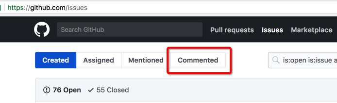

> @Author  : Lewis Tian (taseikyo@gmail.com)
>
> @Link    : github.com/taseikyo
>
> @Range   : 2021-01-03 - 2021-01-09

# Weekly #10

[readme](../README.md) | [previous](202012W5.md) | [next](202101W2.md)

## Table of Contents

- [algorithm](#algorithm-)
- [review](#review-)
	- Bash 测试和比较函数（英文）
- [tip](#tip-)
	- Bash 脚本中 `(`、`((`、`[`、`[[` 的区别（知乎）
	- PDF 转 EPS（StackOverflow）
	- 提高 GitHub 浏览体验的插件、脚本
- [share](#share-)

## algorithm [⬆](#weekly-10)

## review [⬆](#weekly-10)

### 1. [Bash 测试和比较函数（英文）](https://developer.ibm.com/tutorials/l-bash-test/)

一直觉得 https://developer.ibm.com 这个网站的博客质量很高，不过我看过的基本都是 200x 的博客了，一直想将那些网页保存为 Markdown，一直拖到现在也没做，该死的拖延症。

这篇文章是承接 [Tip#1](#tip-) 中讲 Bash 的各种括号的，[Tip#1](#tip-) 不是给了个 *全网最全的 bash 速查表* 吗，在该表中说 "# 如果不考虑兼容 posix sh 和 dash 这些的话，可用 bash 独有的 ((..)) 和 [[..]]: https://www.ibm.com/developerworks/library/l-bash-test/index.html" ，给出的链接就是此博客，于是顺便康康。

*Understanding the various tests and knowing that the shell can also interpret some operators as shell metacharacters is an important step to becoming a power shell user.*

确实，现在大多 Linux 发行版的默认 Shell 基本都是 Bash，虽然我会将默认 Shell 改成 Zsh，但是有时候命令不支持我还是得切回 Bash，不得不说 Bash 还是最强大（在我用过的几个 Shell 中）。

在 Bash 中 `test expr` 和 `[ expr ]` 是等价的，可以使用 `$?` 获取返回值（0 (True)、1 (False)），也可以在 `&&` `||` 中使用返回值：

```Bash
[ian@pinguino ~]$ test 3 -gt 4 && echo True || echo false
false
[ian@pinguino ~]$ [ "abc" != "def" ];echo $?
0
[ian@pinguino ~]$ test -d "$HOME" ;echo $?
0
```

可以使用 `-eq -ne -lt -le -gt -ge` 来进行算数比较，`= != < >` 来比较字符串（注意等于是 `=`），`-z` 测试空字符串，`-n` 或者不适用运算符测试非空字符串（`[ "a" ] && echo True` `[ -n "a" ] && echo True`）

```Bash
[ian@pinguino ~]$ test "abc" = "def" ;echo $?
1
[ian@pinguino ~]$ [ "abc" != "def" ];echo $?
0
[ian@pinguino ~]$ [ "abc" \< "def" ];echo $?
0
[ian@pinguino ~]$ [ "abc" \> "def" ];echo $?
1
[ian@pinguino ~]$ [ "abc" \<"abc" ];echo $?
1
[ian@pinguino ~]$ [ "abc" \> "abc" ];echo $?
1
```

> 文件测试

| Operator | Characteristic                                                                                      |
|----------|-----------------------------------------------------------------------------------------------------|
| -d       | Directory                                                                                           |
| -e       | Exists (also -a)                                                                                    |
| -f       | Regular file                                                                                        |
| -h       | Symbolic link (also -L)                                                                             |
| -p       | Named pipe                                                                                          |
| -r       | Readable by you                                                                                     |
| -s       | Not empty                                                                                           |
| -S       | Socket                                                                                              |
| -w       | Writable by you                                                                                     |
| -N       | Has been modified since last being read                                                             |
| -nt      | Test if file1 is newer than file 2. The modification date is used for this and the next comparison. |
| -ot      | Test if file1 is older than file 2.                                                                 |
| -ef      | Test if file1 is a hard link to file2.                                                              |

文件权限也可以检查，这里没列出来，毕竟能测读写，其他应该都能测。

`-o` 操作符允许您测试可以使用 `set -o` 选项设置的各种 shell 选项：

```Bash
[ian@pinguino ~]$ set +o nounset
[ian@pinguino ~]$ [ -o nounset ]; echo $?
1
[ian@pinguino ~]$ set -u
[ian@pinguino ~]$ test  -o nounset; echo $?
0
```

-a 和 -o 选项分别表示逻辑 "与" 和 "或"，"非" 则是 `!`，可以使用括号对表达式进行分组并覆盖默认优先级。

shell 通常会在子 shell 中的括号之间运行一个表达式，因此需要转义括号，或者使用单引号或双引号将括号包起来：

```Bash
[ian@pinguino ~]$ test "a" != "$HOME" -a 3 -ge 4 ; echo $?
1
[ian@pinguino ~]$ [ ! \( "a" = "$HOME" -o 3 -lt 4 \) ]; echo $?
1
[ian@pinguino ~]$ [ ! \( "a" = "$HOME" -o '(' 3 -lt 4 ')' ")" ]; echo $?
1
```

Test 命令非常强大，但是考虑到它对转义的要求以及字符串和算术比较之间的差异，这个命令有些笨拙。

`(( ))` 复合命令计算算术表达式的值，如果表达式的值为 0，则将退出状态设置为 1，如果表达式的值为非零，则将退出状态设置为 0，不需要在 `(( ))` 之间转义操作符，可以执行通常的 c 语言算术、逻辑和位操作。

Let 命令还可以执行一个或多个算术表达式，它通常用于给算术变量赋值。

```Bash
[ian@pinguino ~]$ let x=2 y=2**3 z=y*3;echo $? $x $y $z
0 2 8 24
[ian@pinguino ~]$ (( w=(y/x) + ( (~ ++x) & 0x0f ) )); echo $? $x $y $w
0 3 8 16
[ian@pinguino ~]$ (( w=(y/x) + ( (~ ++x) & 0x0f ) )); echo $? $x $y $w
0 4 8 13
```

与 `(())` 一样，`[[ ]]` 复合命令允许你对文件名和字符串测试使用更自然的语法，可以使用括号和逻辑运算符组合 test 命令所允许的测试。

```Bash
[ian@pinguino ~]$ [[ ( -d "$HOME" ) && ( -w "$HOME" ) ]] && echo "home is a writable directory"
home is a writable directory
```

当使用 = 或 != 的时候，`[[` 命令也可以在字符串上做模式匹配，匹配的行为与通配符全局化相似：

```Bash
[ian@pinguino ~]$ [[ "abc def .d,x--" == a[abc]*\ ?d* ]]; echo $?
0
[ian@pinguino ~]$ [[ "abc def c" == a[abc]*\ ?d* ]]; echo $?
1
[ian@pinguino ~]$ [[ "abc def d,x" == a[abc]*\ ?d* ]]; echo $?
1
```

你甚至可以在 `[[ ]]` 中做算术测试，但要小心。除非在 `(())` 中，否则 < 和 > 操作符将比较操作数作为字符串，并测试它们在当前排序序列中的顺序。

```Bash
[ian@pinguino ~]$ [[ "abc def d,x" == a[abc]*\ ?d* || (( 3 > 2 )) ]]; echo $?
0
[ian@pinguino ~]$ [[ "abc def d,x" == a[abc]*\ ?d* || 3 -gt 2 ]]; echo $?
0
[ian@pinguino ~]$ [[ "abc def d,x" == a[abc]*\ ?d* || 3 > 2 ]]; echo $?
0
[ian@pinguino ~]$ [[ "abc def d,x" == a[abc]*\ ?d* || a > 2 ]]; echo $?
0
[ian@pinguino ~]$ [[ "abc def d,x" == a[abc]*\ ?d* || a -gt 2 ]]; echo $?
-bash: a: unbound variable
[ian@pinguino ~]$ [[ "abc def d,x" == a[abc]*\ ?d* || c < b ]]; echo $?
1
[ian@pinguino ~]$ [[ "abc def d,x" == a[abc]*\ ?d* || a < b ]]; echo $?
0
```

虽然可以使用上面的测试以及 `&&` 和 `||` 控制操作符完成大量编程，但是 bash 包含了更为熟悉的 if，then，else 和 case 结构。

虽然上面的测试只返回 0 或 1 个值，但命令可能返回其他值。

Bash 中的 if 命令有一个 then 子句，其中包含当 test 或 command 返回 0 时将执行的命令列表，一个或多个可选的 elif 子句，每个子句都带有一个额外的测试和 then 子句和一个相关的命令列表，一个可选的最终 else 子句和一个如果 if 或 elif 测试都不为真将执行的命令列表，以及一个标记结构结束的终端 fi。

```Bash
[ian@pinguino ~]$ function mycalc ()
> {
>   local x
>   if [ $# -lt 1 ]; then
>     echo "This function evaluates arithmetic for you if you give it some"
>   elif (( $* )); then
>     let x="$*"
>     echo "$* = $x"
>   else
>     echo "$* = 0 or is not an arithmetic expression"
>   fi
> }
[ian@pinguino ~]$ mycalc 3 + 4
3 + 4 = 7
[ian@pinguino ~]$ mycalc 3 + 4**3
3 + 4**3 = 67
[ian@pinguino ~]$ mycalc 3 + (4**3 /2)
-bash: syntax error near unexpected token `('
[ian@pinguino ~]$ mycalc 3 + "(4**3 /2)"
3 + (4**3 /2) = 35
[ian@pinguino ~]$ mycalc xyz
xyz = 0 or is not an arithmetic expression
[ian@pinguino ~]$ mycalc xyz + 3 + "(4**3 /2)" + abc
xyz + 3 + (4**3 /2) + abc = 35
```

看了上面的函数，深感 Bash 牛逼，为什么是这样的结果，因为 `(( ))` 命令会执行算数操作，而 "$\* <sup id="a1">[注 1](#f1)</sup>会将参数展开为 "$1 $2 $3 ..." 这样，所以第一条命令为 `(( 3 + 4 ))` 所以为 7。

local 声明 x 为局部变量，let/declare 有若干选项。

可以看到最后两个例子，将 xyz 传递给 mycalc 并不是一个错误，而是计算为 0，这个函数不够聪明，无法识别最终使用示例中的字符值，因此无法向用户发出警告，你可以使用一个字符串/模式匹配测试：

```Bash
[[ ! ("$*" == *[a-zA-Z]* ]]

[ ! ("$*" = * [ a-zA-Z ] * ]]
```

shell 允许基数最多为 64（bash#value），因此您可以在输入中合法地使用任何字母字符，以及 _ 和 @

```Bash
[ian@pinguino ~]$ mycalc 015
015 = 13
[ian@pinguino ~]$ mycalc 0xff
0xff = 255
[ian@pinguino ~]$ mycalc 29#37
29#37 = 94
[ian@pinguino ~]$ mycalc 64#1az
64#1az = 4771
[ian@pinguino ~]$ mycalc 64#1azA
64#1azA = 305380
[ian@pinguino ~]$ mycalc 64#1azA_@
64#1azA_@ = 1250840574
[ian@pinguino ~]$ mycalc 64#1az*64**3 + 64#A_@
64#1az*64**3 + 64#A_@ = 1250840574
```

可以使用 `$((expression))` 和 echo 命令执行 shell 算法。这样你不会学到任何关于函数或者测试的东西，但是请注意，shell 在内部 `((expression))` 或者 `[[ expression ]]` 时不会解释元字符，比如 \*。

```Bash
[ian@pinguino ~]$  echo $((3 + (4**3 /2)))
35
```

更多可以阅读：https://developer.ibm.com/tutorials/l-lpic1-map/

## tip [⬆](#weekly-10)

### 1. [Bash 脚本中 `(`、`((`、`[`、`[[` 的区别（知乎）](https://www.zhihu.com/question/266787434/answer/333712290)

这是个老问题了，老是查了忘，忘了查。。。

@[韦易笑](https://www.zhihu.com/people/skywind3000)：一句话说清楚：只有单中括号 [ ] 是兼容 posix shell 标准的，比如 Bourne shell（/bin/sh），ash，dash 这些，而**_其他一切双方括号，双圆括号都不兼容 posix shell 标准，而是 bash 特有的语法扩展。_**

所以如果你不当要使用 bash，有时候还需要看懂或者修改各种系统管理脚本的话，你需要先把 [ ] 了解清楚。标准的 if 语句格式为：

```Bash
if {command1}
then
    {command list}
fi
```

```Bash
test "abc" ！= "def"   # 判断字符串不相等，不相等返回0，相等返回1
echo $?                # 查看上一条命令的返回码
```

条件为真，结果输出 0，否则输出 1，更多用法用 man test 查看：

```Bash
exp1 -a exp2              # exp1 和 exp2 同时为真时返回真
exp1 -o exp2              # exp1 和 exp2 有一个为真就返回真
( expression )            # 如果 expression 为真时返回真，输入注意括号前反斜杆
! expression              # 如果 expression 为假那返回真

str1 = str2               # 判断字符串相等，如 [ "$x" = "$y" ] && echo yes
str1 != str2              # 判断字符串不等，如 [ "$x" != "$y" ] && echo yes
str1 < str2               # 字符串小于，如 [ "$x" \< "$y" ] && echo yes
str2 > str2               # 字符串大于，注意 < 或 > 是字面量，输入时要加反斜杆
-n str1                   # 判断字符串不为空（长度大于零）
-z str1                   # 判断字符串为空（长度等于零）

-a file                   # 判断文件存在，如 [ -a /tmp/abc ] && echo "exists"
-d file                   # 判断文件存在，且该文件是一个目录
-e file                   # 判断文件存在，和 -a 等价
-f file                   # 判断文件存在，且该文件是一个普通文件（非目录等）
-r file                   # 判断文件存在，且可读
-s file                   # 判断文件存在，且尺寸大于0
-w file                   # 判断文件存在，且可写
-x file                   # 判断文件存在，且执行

num1 -eq num2             # 数字判断：num1 == num2
num1 -ne num2             # 数字判断：num1 != num2
num1 -lt num2             # 数字判断：num1 < num2
num1 -le num2             # 数字判断：num1 <= num2
num1 -gt num2             # 数字判断：num1 > num2
num1 -ge num2             # 数字判断：num1 >= num2
```

有了 test 这个程序，结合我们的 if 命令就可以在各种 posix shell 中进行条件判断了，test 这个程序还有一个孪生兄弟，单左括号 `[` 命令，这是一个可执行程序，位于 /bin 或者 /usr/bin 下面，它的使用方法和 test 完全一样，只是要求最后一个参数后要多加一个右括号，比如：

```Bash
test -a /tmp; echo $?   # 调用 test 判断 /tmp 是否存在，并打印 test 的返回值
[ -a /tmp ]; echo $?    # 和上面完全等价，/tmp 肯定是存在的，所以输出是 0
```

所以单中括号写起来更优雅一些而已

```Bash
# 判断 /etc/passwd 文件是否存在
# 经典的 if 语句就是判断后面的命令返回值为0的话，认为条件为真，否则为假
if test -e /etc/passwd; then
    echo "alright it exists ... "
else
    echo "it doesn't exist ... "
fi

# 和上面完全等价，[ 是个和 test 一样的可执行程序，但最后一个参数必须为 ]
# 这个名字为 "[" 的可执行程序一般就在 /bin 或 /usr/bin 下面，比 test 优雅些
if [ -e /etc/passwd ]; then   
    echo "alright it exists ... "
else
    echo "it doesn't exist ... "
fi
```

```Bash
# 和上面两个完全等价，其实到 bash 时代 [ 已经是内部命令了，用 enable 可以看到
[ -e /etc/passwd ] && echo "alright it exists" || echo "it doesn't exist"

# 判断变量的值
if [ "$varname" = "foo" ]; then
    echo "this is foo"
elif [ "$varname" = "bar" ]; then
    echo "this is bar"
else
    echo "neither"
fi

# 复杂条件判断，注意，小括号是字面量，实际输入时前面要加反斜杆
if [ \( $x -gt 10 \) -a \( $x -lt 20 \) ]; then
    echo "yes, between 10 and 20"
fi

# 可以用 && 命令连接符来做和上面完全等价的事情
[ \( $x -gt 10 \) -a \( $x -lt 20 \) ] && echo "yes, between 10 and 20"

# 判断程序存在的话就执行
[ -x /bin/ls ] && /bin/ls -l
```

到此为止，单中括号已经完全说清楚了，如果不兼容 posix shell的话，可以用 bash独有的 `[[ expression ]]` 进行字符串判断，`(( express ))` 进行整数判断。更多 bash 技巧见：[全网最全的 bash 速查表](https://github.com/skywind3000/awesome-cheatsheets/blob/master/languages/bash.sh)

### 2. [PDF 转 EPS（StackOverflow）](https://tex.stackexchange.com/questions/20883/how-to-convert-pdf-to-eps)

使用 draw.io 作图可以导出 svg 和 pdf，然而 LaTex 插入 svg 挺麻烦的，懒得查了；而导出的 pdf 是 A4 格式的，有大片空白，于是搜到这个答案。

安装完 texlive（直接用 Scoop 安装 latex 也有）就会有这个答案所需的几个工具，下面代码是原答案，我稍作了修改，可以自定义生成的 eps 名称：[005_convert_pdf_to_eps.sh](https://github.com/taseikyo/backup-utils/blob/master/Bash/005_convert_pdf_to_eps.sh)，直接在 wsl 中运行（wsl 真方便）。

```Bash
#!/bin/sh
# $Id: pdf2eps,v 0.01 2005/10/28 00:55:46 Herbert Voss Exp $
# Convert PDF to encapsulated PostScript.
# usage:
# pdf2eps <page number> <pdf file without ext>

pdfcrop "$2.pdf" "$2-temp.pdf"
pdftops -f $1 -l $1 -eps "$2-temp.pdf" "$2.eps"
rm  "$2-temp.pdf"
```

### 3. 提高 GitHub 浏览体验的插件、脚本

这算是我的一个简单使用体验总结，下面是我感觉能提高不少浏览体验的插件和脚本。

- [Octotree（插件）](https://www.octotree.io/)

在浏览器左侧显示整个 repo 的目录、文件结构，对于嵌套了几层的文件来说可以展开文件夹点击跳转，很方便的一个插件。

- [Github Hovercard（插件）](https://github.com/Justineo/github-hovercard)

是一个所谓的悬浮卡，就是将鼠标放在 GitHub 链接上面就会显示其内容，比如鼠标停在某个 issue 链接上，就会有个 "悬浮卡片" 显示 issue 的标题和内容，很好用的一个插件。

- [Sourcegraph（插件）](https://sourcegraph.com/)

扩展 GitHub 源码查看、跳转功能的插件。

- [Github Commented Issues（脚本）](https://greasyfork.org/en/scripts/38108-github-commented-issues)

在 GitHub 的 [issues](https://github.com/issues) 页面显示曾经评论过的 issue，可以方便找到自己之前留言过的 repo。



- [GitHub Table of Contents（脚本）](https://greasyfork.org/en/scripts/18344-github-table-of-contents)

浮动显示 README 的目录，其实这是作者的一系列脚本中的一个，还有很多可以去他的 [GitHub](https://github.com/Mottie/GitHub-userscripts) 或者直接在 [GF](https://greasyfork.org/en/users/24847-mottie) 发掘。

## share [⬆](#weekly-10)

<b id="f1">注 1：</b>"$\*" 和 "$@" 都表示传递给函数或脚本的所有参数，不被双引号 ("") 包含时，都以 "$1" "$2" ... "$n" 的形式输出所有参数。
但是当它们被双引号 ("") 包含时，"$\*" 会将所有的参数作为一个整体，以 "$1 $2 ... $n" 的形式输出所有参数；"$@" 会将各个参数分开，以 "$1" "$2" ... "$n" 的形式输出所有参数。[↩](#a1)

[readme](../README.md) | [previous](202012W5.md) | [next](202101W2.md)
