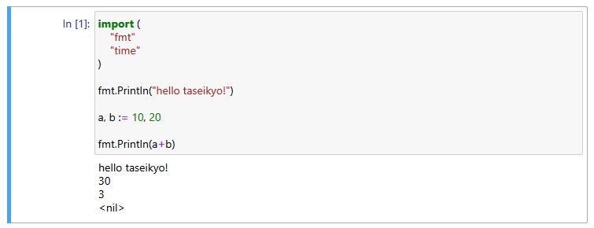

> @Author  : Lewis Tian (taseikyo@gmail.com)
>
> @Link    : github.com/taseikyo
>
> @Range   : 2021-01-17 - 2021-01-23

# Weekly #12

[readme](../README.md) | [previous](202101W2.md) | [next](202101W4.md)

总字数：4493 个（汉字：1488，英文单词：919，数字：351，中文标点：193，英文标点：1542），阅读时长约：8 分 31 秒。


\**Photo by [Alvaro Reyes](https://unsplash.com/@alvarordesign) on [Unsplash](https://unsplash.com/photos/VF1V6K8nlZ4)*

## Table of Contents

- [algorithm](#algorithm-)
	- 1018.可被 5 整除的二进制前缀
- [review](#review-)
	- 用 Jupyter 编写交互式 Go 程序（Medium）
- [tip](#tip-)
	- LaTex 中的数学公式
	- wget 一些技巧（中文）
- [share](#share-)
	- 程序员未来怎么转型？

## algorithm [⬆](#weekly-12)

### 1. [1018.可被 5 整除的二进制前缀](https://leetcode-cn.com/problems/binary-prefix-divisible-by-5)

给定由若干 0 和 1 组成的数组 A。我们定义 N_i：从 A[0] 到 A[i] 的第 i 个子数组被解释为一个二进制数（从最高有效位到最低有效位）。

返回布尔值列表 answer，只有当 N_i 可以被 5 整除时，答案 answer[i] 为 true，否则为 false。

```Markdown
输入：[0,1,1]
输出：[true,false,false]
解释：
输入数字为 0, 01, 011；也就是十进制中的 0, 1, 3 。只有第一个数可以被 5 整除，因此 answer[0] 为真。
```

简单来说就是依次组成二进制数，能够被 5 整除。

初始写法：

```Golang
func prefixesDivBy5(A []int) []bool {
	num := 0
	ans := make([]bool, len(A))

	for i := 0; i < len(A); i++ {
		num = (num * 2 + A[i]) % 5
		ans[i] = num == 0
	}

	return ans
}
```

我以为这样写会更快，实际上并不是，更慢了（8ms -> 12ms）

```Golang
func prefixesDivBy5(A []int) []bool {
	ans := make([]bool, len(A))
	x := 0
	for i, v := range A {
		x = (x << 1 | v) % 5
		ans[i] = x == 0
	}
	return ans
}
```

## review [⬆](#weekly-12)

### 1. [用 Jupyter 编写交互式 Go 程序（Medium）](https://medium.com/@yunabe/interactive-go-programming-with-jupyter-93fbf089aff1)

Jupyter 因为既支持 Markdown 又能写交互式 Python 代码很受欢迎（虽然我用得不多就是），最近想用这个写写 Go，然后搜了一下，果然有人实现了，也就是这篇文章。

作者也是从 Python 转 Go 的，不然也不会去实现这个东西（Go Jupyter environment）。作者为什么要劳神劳力去实现这个呢，因为他没找到一个毕竟完美的，要么不好用，要么功能不全（不支持代码补全、检查或显示非文本内容等等），于是他从 0 开始实现了 Go 的 Jupyter 运行环境。


GitHub 主页：https://github.com/yunabe/lgo

主要特点：

- 像 Python 一样交互式地编写和执行 Go
- 完全支持 Go 语言规范。100% gc (Go compiler)兼容
- 代码补全，检查和代码格式化在 Jupyter 笔记本
- 显示图片，HTML，JavaScript，SVG 等
- 来自控制台的交互式 REPL 模式
- 完全支持 goroutine

安装前设置好 `GOPATH` `GOBIN` 等环境变量， `lgo` 需要额外设置一个环境变量 `LGOPATH` 我直接将它设置为 `GOPATH`，运行完 `lgo install` 之后 `lgo-internal` 就被安装到 `GOBIN` 目录了。

更新：注意 go 版本需要装 1.13，我试过 1.15 安装失败了。而且 go-1.13 的路径为 `/usr/lib/go-1.13/bin/go`，需要手动添加到 PATH，或者做一个软链接。

```bash
# wsl2

# add to .myrc（github.com/taseikyo/oh-my-terminal）
export GOPATH=/mnt/f/Codes/Go
export GOCACHE=/mnt/f/Codes/Go/go-build
export GOBIN=/mnt/f/Codes/Go/bin
export LGOPATH=/mnt/f/Codes/Go

# go-1.13
sai golang-1.13

# intsall ZMQ pkg-config
sai libzmq3-dev pkg-config
# installs lgo -> $GOPATH/bin
go get github.com/yunabe/lgo/cmd/lgo && go get -d github.com/yunabe/lgo/cmd/lgo-internal
# install lgo-external -> $GOPATH/bin
lgo install
# Install the kernel configuration to Jupyter Notebook
python3 $(go env GOPATH)/src/github.com/yunabe/lgo/bin/install_kernel
# run jupyter
jupyter notebook
```

实际使用感觉一般，出结果太慢了



还有 Jypyter 命令行模式，出结果也很慢，基本不能正常使用


最后是 REPL 模式，一个鬼样子，出结果慢，更离谱的是换行的反大括号没法移到命令行开头


## tip [⬆](#weekly-12)

### 1. LaTex 中的数学公式

算是第二次使用 Latex 了，需要写公式，因为在 Markdown 中也有写过公式，知道 `$` 的用法，行内行间公式区别。但是怎么给每行公式打 label、让它自动编号我就不会了，于是搜了一下，还是记一下吧，虽然以后遇到问题可以还是直接去搜去了。

数学公式的前后要加上 `$` 或 `\(` 和 `\)`，比如：`$ f(x) = 3x + 7 $` 和 `\( f(x) = 3x + 7 \)` 效果是一样的：\( f(x) = 3x + 7 \)

如果用 `\[` 和 `\]`，或者使用 `$$` 和 `$$`，则该公式独占一行；

如果用 `\begin{equation}` 和 `\end{equation}`，则公式除了独占一行还会自动被添加序号， 如何公式不想编号则使用 `\begin{equation*}` 和 `\end{equation*}`。

普通字符在数学公式中含义一样，除了 `# $ % & ~ _ ^ \ { }`，若要在数学环境中表示这些符号，需要分别表示为 `\# \$ \% \& \_ \{ \}`。

另外在括号内的空格也需要转义，否则会被吞掉，如 `$ x = (a+b) / (my\ size) $`

### 2. [wget 一些技巧（中文）](https://www.cnblogs.com/litifeng/p/9689346.html)

1、奇怪的 `-qO-` 参数

```Bash
wget -qO- get.docker.com | bash
```

- `-q`：`--quiet`，安静模式，无信息输出
- `-O`：把后面网址下载后，改成一个指定的名称，如果后面没有跟着一个名字，而是 "-"，则表示将下载后的内容输出到标准输出，也就是输出到屏幕上
- `-qO-`：把下载的内容输出到标准输出，但并不在屏幕显示，目的当然是直接传递给 bash 进行解析执行了

2、有时候会在 wget 前面加一个 "\\"，这个意思是取消别名调用，执行原命令

```Bash
\wget -O - https://install.perlbrew.pl | bash
```

3、下载后保存到指定目录

```Bash
wget -P /opt/wordpress https://wordpress.org/latest.zip
```

4、断点续传，如果不使用 "-c" 则表示重新开始整个下载，且在下载的文件后面加 ".1"，因为之前没有下载完的文件还存在。

```Bash
wget -c https://wordpress.org/latest.zip
```

5、对于大文件，你可以用 "-b" 参数在后台下载，输出信息会保存在同目录的 "wget-log" 中，你可以用 "tail -f wget-log" 来查看。

```Bash
wget -b http://example.com/big-file.zip
```

## share [⬆](#weekly-12)

### 1. 程序员未来怎么转型？

今天看到 [我，75后，年薪几十万累到不行，离开上海回乡下种地放羊](https://www.toutiao.com/i6912037372054028804/) 这篇文章，作者在上海工作十八年，每天拼命学技术、开研讨会、最多一年出差飞行近百次。这些努力让他收获了世界五百强公司技术专家的名头、上海内环的房子、几十万的年薪，但也累出了一身病，长期日夜颠倒，神经紧绷。最终他选择离开上海，在绍兴包了 30 亩地，开垦荒地，养起了鸡、鹅和羊。

看完这篇文章，想着他的"前半生"，可能就是我将来的生活状态，不禁陷入深思，我真的想要这种生活吗？这种类似 996 的程序员生活真的是我想要的吗？另外他后面的转型，真的好吗？虽然我也曾想着在农村整一片地，房子周围种一片果树，成熟时间分布在一年四季那种，这样每个季节都有新鲜水果吃，再养些鸡以及一猫一狗，可能这就是比较理想的摸鱼生活了吧？不过说起种地，长期呆在电脑前，没运动，别说，还真干不来那些农事。

后来室友发了条消息：[39 岁网络技术员入住养老院，早 6 晚 9 的作息、和老人一起追剧晒太阳](https://www.zhihu.com/question/439397557)，让我哭笑不得，这或许是程序员的未来出路之一？

以前跟同学聊着说不可能一直写代码，后面得转管理层，或者另寻出路了。但事实是，可能管理层很多都是从其他公司挖过来的，哪里比得过别人，或许有同学直接走选调是一条明路。

有时候，也挺羡慕 b 站上那些后浪的。

[readme](../README.md) | [previous](202101W2.md) | [next](202101W4.md)
