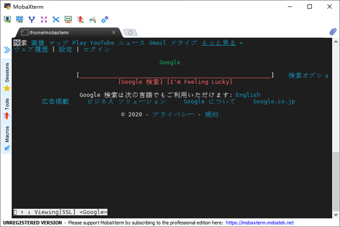

> @Author  : Lewis Tian (taseikyo@gmail.com)
>
> @Link    : github.com/taseikyo
>
> @Range   : 2021-01-24 - 2021-01-30

# Weekly #13

[readme](../README.md) | [previous](202101W3.md) | [next](202102W1.md)

## Table of Contents

- [algorithm](#algorithm-)
	- 找出重复数（腾讯面试题）
- [review](#review-)
- [tip](#tip-)
	- WSL2 通过 Clash 使用 Windows 代理
	- 知道这 20 个正则表达式，能让你少写 1000 行代码
	- Python 正则表达式 特殊符号和字符
- [share](#share-)

## algorithm [⬆](#weekly-13)

### 1. [找出重复数（腾讯面试题）](https://leetcode-cn.com/circle/discuss/6TtGra/)

有 2.5 亿个数，其中只有一个数出现两次，其他的数都出现一次。在内存紧张的情况下，怎么找出这个重复数？

我们以前做过简单的类似题目：仅一个不重复，其他均重复，这时直接异或就可以搞定。现在是仅一个重复，其他不重复，异或似乎搞不定。

看下面的讨论，一个较为便捷的方法就是使用位图，对 250000000 取模，得到的数就在 [0, 250000000]，所以需要内存为 $ 250000000/8=31250000B=29.8M $，不到 30M，而且遍历一遍就够了，应该说比较高效。

当然位图有个问题是可能误判，比如 2 和 250000002 取模都是 2，这个时候可以使用布隆过滤器，它也存在误判，但是概率低多了。

有个大佬提出几种解法

[Meg](https://leetcode-cn.com/u/meg-a/)：

- 如果这道题的数字是连续的，那线性时间复杂度，常数空间复杂度的，方法就比较多了，像异或法，和差法，floyd 链表环都行。
- 如果不是连续的，如果不要求常数空间复杂度的话，考虑到有限空间，可以使用位图法。
- 如果空间限制到位图都装不下...那就使用小根堆加归并排序进行分批排序，最后再进行遍历吧。
- 如果连排序都不允许，那只能使用终极杀器，暴力法了。

## review [⬆](#weekly-13)

## tip [⬆](#weekly-13)

### 1. [WSL2 通过 Clash 使用 Windows 代理](https://www.cnblogs.com/sinicheveen/p/13866914.html)

1、Clash for Windows 打开 “Allow LAN” 选项
2、从配置文件中查看端口
3、打开 shell 终端，输入如下命令

```Bash
export hostip=$(cat /etc/resolv.conf |grep -oP '(?<=nameserver\).*')
export https_proxy="http://${hostip}:7890"
export http_proxy="http://${hostip}:7890"
```

这里只设置了 https_proxy、http_proxy，没有设置 all_proxy 等，并且也只使用了 http 协议代理，没有设置 sock5 协议代理，可以根据需要自己更改，但是需要注意，本例中 http 协议端口是 7890，而如果要设置 sock5 协议，那么端口需要改为 7891。

4、安装 w3m

```Bash
sudo apt install w3m
```

5、用 w3m 进行测试

```Bash
w3m www.google.com
```

如果成功，运行完该命令只有会在 shell 中出现如下画面：



6、一劳永逸，可以在 `~/.myrc` 添加第 3 步的四条命令。

### 2. [知道这 20 个正则表达式，能让你少写 1000 行代码](https://www.jianshu.com/p/e7bb97218946)

很 UC 的标题，阅读量 256,670，被很多网站 "转载"，我是之前就看到的，一直在想要不要加进来，因为我没验证过，今天索性就全部试一下。

1、校验密码强度

密码的强度必须是包含大小写字母和数字的组合，不能使用特殊字符，长度在 8-10 之间。

```
^(?=.*\\d)(?=.*[a-z])(?=.*[A-Z]).{8,10}$
```

```Python
import re

pat = re.compile(r"^(?=.*\d)(?=.*[a-z])(?=.*[A-Z]).{8,10}$")
print(pat.match("123Aa"))
# None

print(pat.match("123Aa431"))
# <re.Match object; span=(0, 8), match='123Aa431'>

print(pat.match("123aa431"))
# None

print(pat.match("123a.431"))
# None
```

`?=` 见下面 tip#3。

2、校验中文

字符串仅能是中文。

```
^[\\u4e00-\\u9fa5]{0,}$
```

```Python
pat = re.compile(r"^[\u4e00-\u9fa5]{1,}$")
print(pat.match("123"))
# None

print(pat.match("中文"))
# <re.Match object; span=(0, 2), match='中文'>

print(pat.match("中文123"))
# None
```

3、由数字、26 个英文字母或下划线组成的字符串

```
^\\w+$
```

```Python
pat = re.compile(r"^\w+$")

print(pat.match("中文"))
# <re.Match object; span=(0, 2), match='中文'>

print(pat.match("123"))
# <re.Match object; span=(0, 3), match='123'>

print(pat.match("1a"))
# <re.Match object; span=(0, 2), match='1a'>

print(pat.match("1a_"))
# <re.Match object; span=(0, 3), match='1a_'>

print(pat.match("1a_."))
# None
```

4、校验E-Mail 地址

同密码一样，下面是 E-mail 地址合规性的正则检查语句。

```
[\\w!#$%&'*+/=?^_`{|}~-]+(?:\\.[\\w!#$%&'*+/=?^_`{|}~-]+)*@(?:[\\w](?:[\\w-]*[\\w])?\\.)+[\\w](?:[\\w-]*[\\w])?
```

```python
pat = re.compile(r"[\w!#$%&'*+/=?^_`{|}~-]+(?:\.[\w!#$%&'*+/=?^_`{|}~-]+)*@(?:[\w](?:[\w-]*[\w])?\.)+[\w](?:[\w-]*[\w])?")

print(pat.match("a@gmail.com"))
# <re.Match object; span=(0, 11), match='a@gmail.com'>

print(pat.match("agmail.com"))
# None
```

5、校验身份证号码

```
15 位
^[1-9]\\d{7}((0\\d)|(1[0-2]))(([0|1|2]\\d)|3[0-1])\\d{3}$
18 位
^[1-9]\\d{5}[1-9]\\d{3}((0\\d)|(1[0-2]))(([0|1|2]\\d)|3[0-1])\\d{3}([0-9]|X)$
```

网上随便搜了一个试了下，一方面说明正则匹配是对的，另一方面说明信息泄露。。。

```python
pat = re.compile(r"^[1-9]\d{7}((0\d)|(1[0-2]))(([0|1|2]\d)|3[0-1])\d{3}$")

print(pat.match("410901199709191000"))
# None

pat = re.compile(r"^[1-9]\d{5}[1-9]\d{3}((0\d)|(1[0-2]))(([0|1|2]\d)|3[0-1])\d{3}([0-9]|X)$")

print(pat.match("410901199709191000"))
# <re.Match object; span=(0, 18), match='410901199709191000'>
```

6、校验日期

"yyyy-mm-dd" 格式的日期校验，已考虑平闰年。

```
^(?:(?!0000)[0-9]{4}-(?:(?:0[1-9]|1[0-2])-(?:0[1-9]|1[0-9]|2[0-8])|(?:0[13-9]|1[0-2])-(?:29|30)|(?:0[13578]|1[02])-31)|(?:[0-9]{2}(?:0[48]|[2468][048]|[13579][26])|(?:0[48]|[2468][048]|[13579][26])00)-02-29)$
```

7、校验金额

金额校验，精确到2位小数。

```
^[0-9]+(.[0-9]{2})?$
```

8、校验手机号

下面是国内 13、15、18 开头的手机号正则表达式。（可根据目前国内收集号扩展前两位开头号码）

```
^(13[0-9]|14[5|7]|15[0|1|2|3|5|6|7|8|9]|18[0|1|2|3|5|6|7|8|9])\\d{8}$
```

9、 判断IE的版本

IE目前还没被完全取代，很多页面还是需要做版本兼容，下面是IE版本检查的表达式。

```
^.*MSIE [5-8](?:\\.[0-9]+)?(?!.*Trident\\/[5-9]\\.0).*$
```

10、 校验IP-v4地址

IP4 正则语句。

```
\\b(?:(?:25[0-5]|2[0-4][0-9]|[01]?[0-9][0-9]?)\\.){3}(?:25[0-5]|2[0-4][0-9]|[01]?[0-9][0-9]?)\\b
```

11、 校验IP-v6地址

IP6 正则语句。

```
(([0-9a-fA-F]{1,4}:){7,7}[0-9a-fA-F]{1,4}|([0-9a-fA-F]{1,4}:){1,7}:|([0-9a-fA-F]{1,4}:){1,6}:[0-9a-fA-F]{1,4}|([0-9a-fA-F]{1,4}:){1,5}(:[0-9a-fA-F]{1,4}){1,2}|([0-9a-fA-F]{1,4}:){1,4}(:[0-9a-fA-F]{1,4}){1,3}|([0-9a-fA-F]{1,4}:){1,3}(:[0-9a-fA-F]{1,4}){1,4}|([0-9a-fA-F]{1,4}:){1,2}(:[0-9a-fA-F]{1,4}){1,5}|[0-9a-fA-F]{1,4}:((:[0-9a-fA-F]{1,4}){1,6})|:((:[0-9a-fA-F]{1,4}){1,7}|:)|fe80:(:[0-9a-fA-F]{0,4}){0,4}%[0-9a-zA-Z]{1,}|::(ffff(:0{1,4}){0,1}:){0,1}((25[0-5]|(2[0-4]|1{0,1}[0-9]){0,1}[0-9])\\.){3,3}(25[0-5]|(2[0-4]|1{0,1}[0-9]){0,1}[0-9])|([0-9a-fA-F]{1,4}:){1,4}:((25[0-5]|(2[0-4]|1{0,1}[0-9]){0,1}[0-9])\\.){3,3}(25[0-5]|(2[0-4]|1{0,1}[0-9]){0,1}[0-9]))
```

12、 检查URL的前缀

应用开发中很多时候需要区分请求是HTTPS还是HTTP，通过下面的表达式可以取出一个url的前缀然后再逻辑判断。

```
if (!s.match(/^[a-zA-Z]+:\\/\\//)) {
    s = 'http://' + s;
}
```

13、 提取URL链接

下面的这个表达式可以筛选出一段文本中的URL。

```
^(f|ht){1}(tp|tps):\\/\\/([\\w-]+\\.)+[\\w-]+(\\/[\\w- ./?%&=]*)?
```

14、 文件路径及扩展名校验

验证windows下文件路径和扩展名（下面的例子中为.txt文件）

```
^([a-zA-Z]\\:|\\\\)\\\\([^\\\\]+\\\\)*[^\\/:*?"<>|]+\\.txt(l)?$
```

15、 提取 Color Hex Codes

有时需要抽取网页中的颜色代码，可以使用下面的表达式。

```
^#([A-Fa-f0-9]{6}|[A-Fa-f0-9]{3})$
```

16、 提取网页图片

假若你想提取网页中所有图片信息，可以利用下面的表达式。

```
\\< *[img][^\\\\>]*[src] *= *[\\"\\']{0,1}([^\\"\\'\\ >]*)
```

17、 提取页面超链接

提取html中的超链接。

```
(<a\\s*(?!.*\\brel=)[^>]*)(href="https?:\\/\\/)((?!(?:(?:www\\.)?'.implode('|(?:www\\.)?', $follow_list).'))[^"]+)"((?!.*\\brel=)[^>]*)(?:[^>]*)>
```

18、 查找CSS属性

通过下面的表达式，可以搜索到相匹配的CSS属性。

```
^\\s*[a-zA-Z\\-]+\\s*[:]{1}\\s[a-zA-Z0-9\\s.#]+[;]{1}
```

19、 抽取注释

如果你需要移除HMTL中的注释，可以使用如下的表达式。

```
<!--(.*?)-->
```

20、 匹配 HTML 标签

通过下面的表达式可以匹配出HTML中的标签属性。

```
<\\/?\\w+((\\s+\\w+(\\s*=\\s*(?:".*?"|'.*?'|[\\^'">\\s]+))?)+\\s*|\\s*)\\/?>
```

就验证了前面几个，发现确实有效果，姑且认证质量通过吧。

### 3. [Python 正则表达式 特殊符号和字符](https://www.kingkk.com/2017/12/%E6%AD%A3%E5%88%99%E8%A1%A8%E8%BE%BE%E5%BC%8F%E7%89%B9%E6%AE%8A%E7%AC%A6%E5%8F%B7%E5%92%8C%E5%AD%97%E7%AC%A6/)

算是一个不错的博客，17 年写的，还是用的 python2.7，于是我将其整理为 python3 且保存为 ipynb 格式。

在线预览：[GitHub](../code/python3-re-expr.ipynb) | [nbviewer](https://nbviewer.jupyter.org/github/taseikyo/arts/tree/master/code/python3-re-expr.ipynb)

## share [⬆](#weekly-13)

[readme](../README.md) | [previous](202101W3.md) | [next](202102W1.md)
