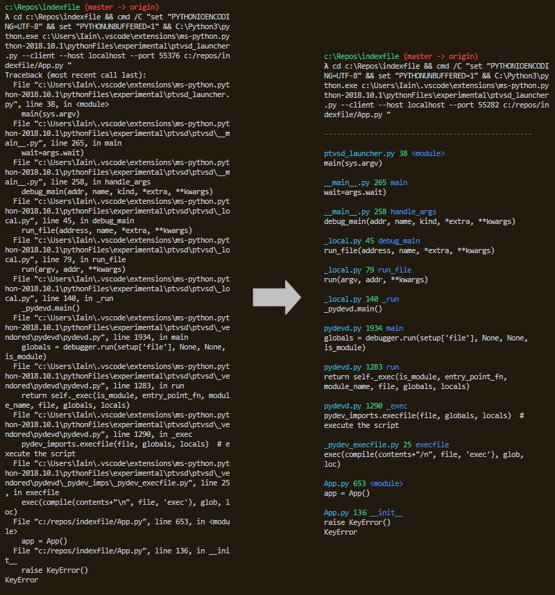

> @Author  : Lewis Tian (taseikyo@gmail.com)
>
> @Link    : github.com/taseikyo
>
> @Range   : 2021-01-31 - 2021-02-06

# Weekly #14

[readme](../README.md) | [previous](202101W4.md) | [next](202102W2.md)

本文总字数 2225 个，阅读时长约：4 分 23 秒，统计数据来自：[算筹字数统计](http://www.xiqei.com/tools?p=tj)。


\**Photo by [Dongsh](https://unsplash.com/@dongsh) on [Unsplash](https://unsplash.com/photos/iH32Gj4mQgQ)*

## Table of Contents

- [algorithm](#algorithm-)
    - 724.寻找数组的中心索引
- [review](#review-)
	- 2020 年排名前 10 的 Python 库（英文）
- [tip](#tip-)
	- Gmail 高级搜索技巧帮你整理收件箱（英文）
- [share](#share-)
    - 树大必有枯枝，人多必有白痴

## algorithm [⬆](#weekly-14)

### 1. [724.寻找数组的中心索引](https://leetcode-cn.com/problems/find-pivot-index/)

给定一个整数类型的数组 nums，找出数组的 "中心索引"。所谓的中心索引，即该位置左侧元素和等于右侧元素和。如果不存在就返回 -1。

最简单就是先遍历拿到总和，然后边遍历边比较。

```Golang
func pivotIndex(nums []int) int {
    total := 0
    for _, v := range nums {
        total += v
    }
    sum := 0
    for i, v := range nums {
        if 2*sum+v == total {
            return i
        }
        sum += v
    }
    return -1
}
```

看评论说有并查集的做法，，对付这道题是高射炮打蚊子了。不过并查集本来就不会，只能拿来主义了：

```C++
class UF {
  public:
    vector<int> parent;
    vector<int> size;
    UF(int _n, vector<int> &nums) : parent(_n), size(nums.begin(),
                nums.end()) {
        iota(parent.begin(), parent.end(), 0);
    }
    void merge(int x, int y) {
        x = find(x);
        y = find(y);
        if (x == y)
            return;
        parent[x] = y;
        size[y] += size[x];
    }

    int find(int x) {
        return x == parent[x] ? x : parent[x] = find(parent[x]);
    }

    int getSize(int index) {
        return size[index];
    }

};
class Solution {
  public:
    int pivotIndex(vector<int>& nums) {
        int n = nums.size();
        UF L2R(n, nums), R2L(n, nums);
        for (int i = 0; i < n - 1; i++)
            L2R.merge(i, i + 1);
        for (int i = n - 1; i > 0; i--)
            R2L.merge(i, i - 1);
        for (int i = 0; i < n; i++)
            if (L2R.getSize(i) == R2L.getSize(i))
                return i;
        return -1;
    }
};
```

## review [⬆](#weekly-14)

### 1. [2020 年排名前 10 的 Python 库（英文）](https://tryolabs.com/blog/2020/12/21/top-10-python-libraries-of-2020)

2020 年的 top 榜单是该网站发布的第六版，评选规则有三条：

1. 2020 发布
2. 发布后一直在维护
3. 食用效果确实不错，值得一试

看完了发现我基本没听过/没用过

1. https://github.com/tiangolo/typer

它是一个利用 Python 3.6+ 的类型提示功能来编写命令行接口的库

```Python
# typer_main.py
import typer

def main(name: str):
    typer.echo(f"Hello {name}")

if __name__ == "__main__":
    typer.run(main)
```

```Bash
tian@polaris:/mnt/d/GitHub/arts (*)
> py code/typer_main.py
Usage: typer_main.py [OPTIONS] NAME
Try 'typer_main.py --help' for help.

Error: Missing argument 'NAME'.

tian@polaris:/mnt/d/GitHub/arts (*)
> py code/typer_main.py --help
Usage: typer_main.py [OPTIONS] NAME

Arguments:
  NAME  [required]

Options:
  --install-completion [bash|zsh|fish|powershell|pwsh]
                                  Install completion for the specified shell.
  --show-completion [bash|zsh|fish|powershell|pwsh]
                                  Show completion for the specified shell, to
                                  copy it or customize the installation.

  --help                          Show this message and exit.

tian@polaris:/mnt/d/GitHub/arts (*)
> py code/typer_main.py taseikyo
Hello taseikyo
```

2. https://github.com/willmcgugan/rich

该库可以为终端输出添加颜色和样式（花里胡哨.jpg）


3. https://github.com/hoffstadt/DearPyGui

看了下例子是一个不错的 gui 库，有多种样式，甚至可以直接画图：https://github.com/hoffstadt/DearPyGui#plottinggraphing

4. https://github.com/onelivesleft/PrettyErrors

整理输出的一坨错误信息，使得更容易人来看。



5. https://github.com/mingrammer/diagrams

使用代码画流程图，或许我会更喜欢 draw.io，但是没试过这个库，暂时不做评判。

6. https://hydra.cc & https://github.com/omry/omegaconf

两者都是配置文件管理（configuration management）库，感觉我使用到的地方不多。

7. https://github.com/PyTorchLightning/PyTorch-lightning

ai 相关的，目前不太感兴趣。

8. https://github.com/microsoft/hummingbird

深度学习相关，同上。

9. https://github.com/facebookresearch/hiplot

看名字就知道是画图库，由 Facebook 发布。

10. https://github.com/emeryberger/scalene

Scalene 是一个针对 Python 脚本的 CPU 和内存分析器，能够正确处理多线程代码，并区分运行 Python 和本机代码所花费的时间。不需要修改你的代码，你只需要用 scalene 在命令行运行你的脚本，它会为你生成一个文本或 HTML 报告，显示你的代码的每一行的 CPU 和内存使用情况。

这些库基本都是几千 star，应该说评选的结果是很公正的，但是我基本没用过。

## tip [⬆](#weekly-14)

### 1. [Gmail 高级搜索技巧帮你整理收件箱（英文）](https://turriate.com/articles/advanced-gmail-search-help-organize-your-inbox)

```Bash
unsubscribe -shipping -payment -card -"YOUR ADDRESS"
    -order -package -track -"tracking number" -"order number"
    -confirmation -from:Robinhood -from:YOURBANK
    -from:"Whole Foods Market" in:inbox is:unread older_than:7d
    -is:important -is:starred -is:snoozed has:nouserlabels -has:attachment
```

将把上面片段粘贴到 Gmail 搜索栏可以找到需要退订和删除的邮件，具体命令解释如下：

- `unsubscribe`
	- 包含 "unsubscribe"
- `-shipping -payment -"tracking number"`
	- 不包含 "shipping" "payment" "tracking number"
- `from:Robinhood -from:YOURBANK -from:"Whole Foods Market"`
	- 不包含来自 "Robinhood" "YOURBANK" "Whole Foods Market"
- `in:inbox`
	- 尽在收件箱中搜索
- `is:unread`
	- 未读邮件
- `older_than:7d`
	- 7 天之前的邮件
- `-is:important`
	- 没有标记为重要的
- `-is:starred`
	- 没有标星的
- `-is:snoozed`
	- 尚未延后的电子邮件
- `has:nouserlabels`
	- 尚未排序或过滤的邮件
- `-has:attachment`
	- 没有附件的邮件

## share [⬆](#weekly-14)

### 1. 树大必有枯枝，人多必有白痴

自从听到这句话之后，就深以为然，无论是身边的人还是网上冲浪看到的人。

前两天看了一个名为四大专家的油画，其中我认识三个，另外一个不认识，油画可以看出来是丑化了他们的形象，我仅看过他们的视频，并没有全面的了解，故不作评价。

看观察者网、观视频的视频还挺多的，因此刷到过金灿荣和张维为的视频，从我个人角度，我觉得他们的观点还是不错的，以实际数据说话，吸取他国经验教训，为我国敲响警钟；另外还有张维为参加一些圆桌会议跟外国人一些辩论的视频，有几个人确实是 "教授"，言语中充满了傲慢与无知，在我看来真的是舞台上的小丑，说着一些毫无根据的废话，当然也不乏实事求是、比较公正的教授。

反过来再看看微博上转发该油画的一些人，刷一些他们的微博就能看出他们屁股是歪的，我是无法理解他们的行为。

说回微博这个平台，现在真的是一个大染缸，有人称之为粪坑我觉得太过了，毕竟微博上有用的东西还是有的，我用来收表情包、吸猫吸狗、保存画师们的大作/壁纸、获取时事新闻啥的，当然用来作为趣闻看看一些人奇怪的行为也是很有意思的。

树大必有枯枝，人多必有白痴。我从来都事不关己高高挂起，做好自己就好了。

[readme](../README.md) | [previous](202101W4.md) | [next](202102W2.md)
