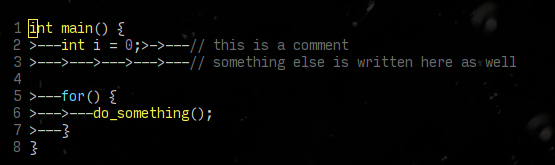

> @Author  : Lewis Tian (taseikyo@gmail.com)
>
> @Link    : github.com/taseikyo
>
> @Range   : 2021-02-07 - 2021-02-13

# Weekly #15

[readme](../README.md) | [previous](202102W1.md) | [next](202102W3.md)

本文总字数 3710  个，阅读时长约：7 分 21 秒，统计数据来自：[算筹字数统计](http://www.xiqei.com/tools?p=tj)。


\**Photo by unknown on Baidu*

## Table of Contents

- [algorithm](#algorithm-)
- [review](#review-)
	- 你用 TABs 的方式是错误的（英文）
	- 熵 —— 使生活复杂化的隐藏力量（英文）
- [tip](#tip-)
	- 使用 MMA 生成加权的词汇云（中文）
	- 为 URL 生成头图
	- Shell 参数传递与默认值
- [share](#share-)
	- 为何年味越来越淡？

## algorithm [⬆](#weekly-15)

## review [⬆](#weekly-15)

### 1. [你用 TAB 的方式是错误的（英文）](https://anadoxin.org/blog/youre-using-tabs-in-a-wrong-way.html)

tab 和 空格之争由来已久，特别是在 Python 之中，缩进是一个 tab 还是 4 个空格？当然现在有类似 black 的格式化工具就不存在这个争论了。

作者说了 tab 和空格的优点（空格就一个还行），tab 在 GitHub 中渲染代码块效果不好（md 文档渲染为 8 个空格），也就是说不同的渲染引擎会使用不同的空格来渲染 tab，可能是 2 个、4 个甚至是 8 个，所以我觉得使用 4 个空格来替代 tab 更好看。

另外作者提到一个问题，那就是用 tab 对齐的注释，由于一般编辑器都是 4 个空格来显示一个 tab，当变成 8 个空格注释就对齐了，如下面两个图所示：

| 4 空格 tab | 8 空格 tab |
|-|-|
|  |  |

如何解决这种问题？很显然直接使用 4 个空格缩进就完事了。

### 2. [熵 —— 使生活复杂化的隐藏力量（英文）](https://fs.blog/2018/11/entropy/)

在高中化学接触到 "熵" 这个概念，所谓的熵增/熵减反应。本质上来说，它是一种无序的度量，它解释了为什么随着时间的推移，生活似乎变得越来越复杂，而不是越来越简单。

一切事物都趋向于混乱：随着时间的推移，任何孤立或封闭系统的净熵（无序程度）总是增加（或至少保持不变） —— 热力学第二定律。

作者指出，熵可以看作是自然赋税（nature's tax）。


1、熵的发现

克劳修斯用简单的术语概括了熵的概念："宇宙的能量是恒定的。宇宙的熵值趋于最大。"

> The increase of disorder or entropy is what distinguishes the past from the future, giving a direction to time.

无序或熵的增加是过去与未来的区别，为时间指明了方向。

—— 霍金《时间简史》

2、熵和时间

熵是为数不多的为时间的存在提供证据的概念之一，"时间之箭" 指的是时间是不对称的，只朝着一个方向流动：向前。它是熵增加的不可逆过程。

亚瑟·爱丁顿在1927年首创了时间之箭的概念：Let us draw an arrow arbitrarily. If as we follow the arrow, we find more and more of the random element in the state of the world, then the arrow is pointing towards the future; if the random element decreases, the arrow points towards the past. That is the only distinction known to physics.

3、商业与经济学中的熵

大多数企业都会倒闭，仅在前18个月就有多达80% 的企业倒闭。理解这一点的一个方法是类比熵。

熵从根本上来说是一种概率观念: 对于每一种可能的 "有序" 分子状态，都存在着许多许多更多的可能的 "无序" 状态。正如能源趋向于一种不那么有用、更无序的状态一样，一般的企业和组织也是如此。将分子（或商业系统和人）重新排列到 "有序" 状态需要注入外部能量。

对于每一个有用的事务安排，朝着一个共同的商业目标，有许多数量级更多的安排，将我们无处可去。为了取得进步，一切都需要以某种方式来安排和管理；我们必须投入大量的精力来保持事物处于有序的状态。

我们必须考虑发生在许多系统中的自我组织现象，包括人类组织。如果有足够强大的目标、足够好的团队和适当的激励，那么这个群体或许不需要太多的 "外部排序" —— 他们可以自己管理自己。

熵存在于企业的各个方面。员工可能会忘记培训，失去热情，走捷径，忽视规则。设备可能出现故障，变得效率低下，或者使用不当。产品可能会过时或需求减少。即使是最好的意图也不能阻止熵滑向混乱。

4、社会学中的熵

如果没有个人和主导机构的持续维护，社会就会走向混乱。分歧行为升级 —— 这个概念被称为 "破窗" 理论。

> The Buddha knew one thing science didn’t prove for millennia after his death: Entropy increases. Things fall apart.

佛陀知道一件科学在他死后数千年都无法证明的事情: 熵增加，万物瓦解。

-- John Green, Looking for Alaska

ー 约翰 · 格林，寻找阿拉斯加

5、我们日常生活中的熵

生活似乎总是变得更加复杂。曾经整洁的房间变得凌乱和灰尘满布。牢固的关系破裂并走向终结。复杂的技能被遗忘了。随着砖墙裂缝、油漆碎片和瓷砖的松动，建筑物逐渐退化。

真正理解熵会导致我们看待世界的方式发生根本性的改变。对它的无知是我们许多最大的错误和失败的原因。我们不能指望任何事情会像我们离开时那样。为了保持我们的健康、人际关系、事业、技能、知识、社会和财富，需要不断的努力和警惕。混乱不是一个错误，它是我们的默认。秩序总是人为的和暂时的。

6、我如何利用熵来获得优势

因为随着时间的推移，事物会自然地变得无序，我们可以定位自己来创造稳定。稳定性有两种类型: 主动型和被动型。考虑一艘船，如果设计得好，应该能够在不受干扰的情况下穿越风暴。这就是被动稳定性。相比之下，战斗机则需要主动的稳定性。如果不调整机翼，飞机只能飞行几秒钟。这种调整发生得如此之快以至于它是由软件控制的。这里没有固有的稳定性: 如果你切断电源，飞机就会坠毁。

这是 18 年的一篇文章，详细地介绍了熵的由来，以及它与各方面的联系，最后谈到如何运用到自身，仔细想想，生活中熵确实无处不在。

## tip [⬆](#weekly-15)

### 1. [使用 MMA 生成加权的词汇云（中文）](https://www.wolfram.com/mathematica/new-in-10/enhanced-image-processing/weighted-word-cloud.html)

不会 MMA（mathematica），偶然搜到这篇文章。

使用 [ImageCollage](http://reference.wolfram.com/language/ref/ImageCollage.html) 创建由在一段文本中出现次数加权的单词列表的词汇云。

导入一段文本并计算单词出现次数：

```Mathematica
In[1]:= (data = Tally[
    ToLowerCase /@
     StringCases[ExampleData[{"Text", "ToBeOrNotToBe"}],
      WordCharacter ..]]) // Short

Out[1]//Short= {{to,15},{be,4},{or,2},<<164>>,{my,1},{sins,1},{remember,1}}
```

以这些单词的出现次数进行加权，创建词汇云：

```Mathematica
In[2]:= images = #2 ->
     Rasterize[Style[#1, RandomColor[LCHColor[_, 1, _]]], "Image",
      RasterSize -> 100] & @@@ data;

In[3]:= ImageCollage[images, "Fit", 400, ImagePadding -> 4, Background -> White]
```

原文如下：


### 2. [为 URL 生成头图](https://thumbnail.ai/)

我不知道使用 "头图" 这个词恰不恰当，就是指一般文章最开头一个宽窄的图片，就像我这个 Weekly 一样，每一篇都会去找一个图片然后裁成 16：9 的宽窄图片，放置在文章开头，我将其称之为 "头图"。

这个网站可以自动生成一个头图，根据你的网站 URL，比如我输入我的 ARTS 的 GitHub 链接，它就自动生成了几张图，根据用途和场景尺寸也不同：

| Facebook + Twitter | Instagram |
|-|-|
|  |  |
|  |  |
|  |  |
|  |  |

当然，由于我在 README 放了图片，所以生成的头图中包含了图片，如果没有的话该网站会提供几张样例图片，也可以自行输入图片链接，所以该网站很方便。

### 3. Shell 参数传递与默认值

1、基本传参

```Bash
#!/bin/bash
echo 参数0: $0;
echo 参数1: $1;
echo 参数2: $2;
echo 参数3: $3;
echo 参数4: $4;
```

```Bash
tian@polaris /m/d/GitHub> vim a.sh
tian@polaris /m/d/GitHub> bash a.sh a b c d
参数0: a.sh
参数1: a
参数2: b
参数3: c
参数4: d
```

2、 $\* 与 $@ 区别

- 相同点：都是引用所有参数
- 不同点：只有在双引号中体现出来。假设在脚本运行时写了三个参数 1、2、3，，则 "\*" 等价于 "1 2 3"（传递了一个参数），而 "@" 等价于 "1" "2" "3"（传递了三个参数）

```Bash
#!/bin/bash

echo "-- \$* 演示 ---"
for i in "$*"; do
    echo $i
done

echo "-- \$@ 演示 ---"
for i in "$@"; do
    echo $i
done
```

```Bash
tian@polaris /m/d/GitHub> bash a.sh 1 2 3
-- $* 演示 ---
1 2 3
-- $@ 演示 ---
1
2
3
```

3、默认参数

1. if 繁琐方式

```Bash
if [ ! $1 ]; then
    $1='default'
fi
```

2. 简单方式

- ${file-xyz}：假如 $file 没有设定，则使用 xyz 作传回值。(空值及非空值时不作处理)
- ${file:-xyz}：假如 $file 没有设定或为空值，则使用 xyz 作传回值。(非空值时不作处理)
- ${file+xyz}：假如 $file 设为空值或非空值，均使用 xyz 作传回值。(没设定时不作处理)
- ${file:+xyz}：若 $file 为非空值，则使用 xyz 作传回值。(没设定及空值时不作处理)
- ${file=xyz}：若 $file 没设定，则使用 xyz 作传回值，同时将 $file 赋值为 xyz 。(空值及非空值时不作处理)
- ${file:=xyz}：若 $file 没设定或为空值，则使用 xyz 作传回值，同时将 $file 赋值为 xyz 。(非空值时不作处理)
- ${file?xyz}：若 $file 没设定，则将 xyz 输出至 STDERR。(空值及非空值时不作处理)
- ${file:?xyz}：若 $file 没设定或为空值，则将 xyz 输出至 STDERR。(非空值时不作处理)

## share [⬆](#weekly-15)

### 1. 为何年味越来越淡？

其实这个问题很早就出现了，以前一家子人一起春晚，嗑瓜子吃水果聊天，而现在各自玩手机，我都好多年没看春晚了，大人们大多打麻将去了，现在过年越来越没意思，究其原因，到底是为啥？

一方面如今生活条件越来越好，听外公说他们那会过年才能吃肉，如今天天都能吃肉，物质条件相比过去有了巨大的提升，很多东西平时都在吃（我回外婆家这些天，几乎天天都在跟外公他们喝酒），甚至已经吃厌了，过年也无非那些鸡鸭鱼肉，没什么新鲜劲。

另一方面，我们这代大多厌恶拜年这一套，不像上一辈，很喜欢互相拜年串门，而且由于计划生育的关系，我们这一代基本都是独生子女，可能以后想拜年都没亲戚走了。

还有就是我们已经长大了，有着各种方面的压力或者事情，没有小时候那种无忧无虑的心情，那个时候过年换新衣服，有压岁钱买烟花爆竹跟邻居家小伙伴一起玩（如今也玩不起来了），如今手机电脑就是最好玩的 23333，谁还会去玩烟花爆竹。

前两天跟舅舅喝完酒还聊起这件事，他说一代亲，二代表，三代就不见了，等我以后成家，过年的时候也就我往这边走走，再等我的孩子长大了，这边的关系大概就断了，不管我对这边感情多深，最后也没办法。想想也是，这大概是中国人的一个家族关系发展过程？

一生二，二生三，三生万物。

> 世情薄，人情恶，雨送黄昏花易落。 —— 唐婉《钗头凤》

[readme](../README.md) | [previous](202102W1.md) | [next](202102W3.md)
