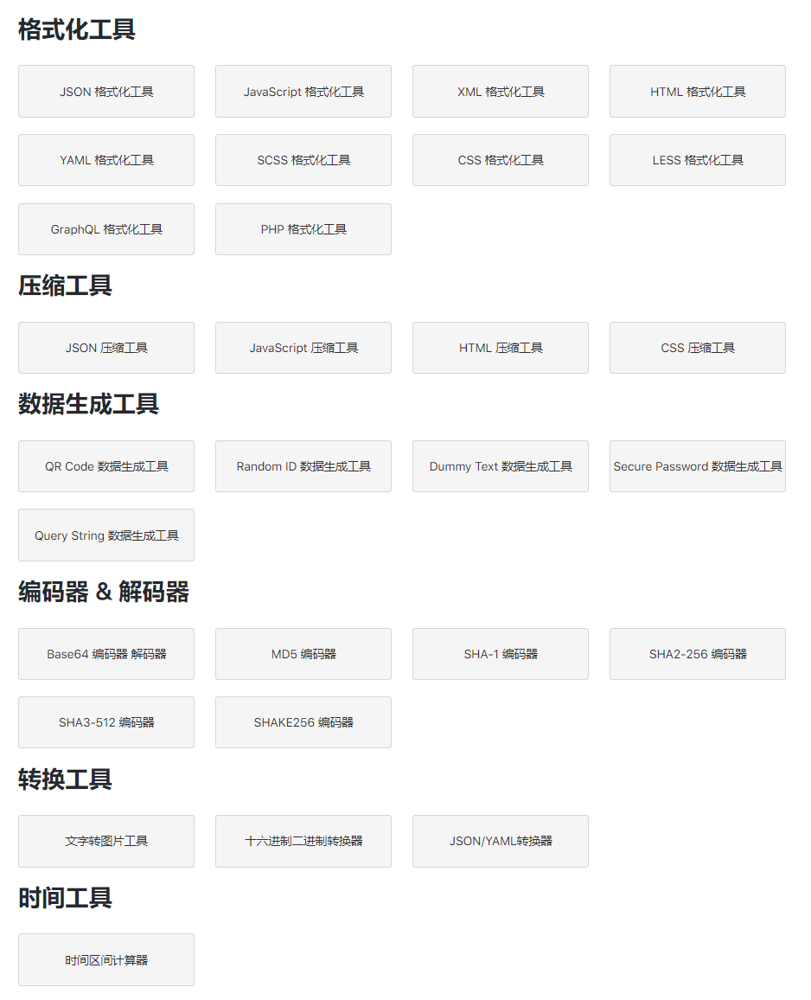

> @Author  : Lewis Tian (taseikyo@gmail.com)
>
> @Link    : github.com/taseikyo
>
> @Range   : 2021-02-14 - 2021-02-20

# Weekly #16

[readme](../README.md) | [previous](202102W2.md) | [next](202102W4.md)

本文总字数 1319 个，阅读时长约：2 分 36 秒，统计数据来自：[算筹字数统计](http://www.xiqei.com/tools?p=tj)。

\**图片来自 [bilibili 专栏](https://www.bilibili.com/read/cv1058737) by [ 
Arse夢貓ジ ](https://space.bilibili.com/65253036)*

## Table of Contents

- [algorithm](#algorithm-)
- [review](#review-)
	- 为你的工具箱添加心理工具
- [tip](#tip-)
	- 开发者生产力工具网站
- [share](#share-)
	- 你花几十万看虚拟主播真的值得吗？

## algorithm [⬆](#weekly-16)

## review [⬆](#weekly-16)

### 1. [为你的工具箱添加心理工具](https://fs.blog/2014/11/charlie-munger-mental-toolbox)

文章开头引用《孙子兵法》的一句话：The general who wins a battle makes many calculations in his temple before the battle is fought.

百度之后得到原文是：夫未战而庙算者胜，得算多也。未战而庙算不胜者，得算少也。

真就将 庙算 直译为 calculations in his temple，太搞笑了。

文章的主要意思就是提前做好准备（未战而庙算），并以此养成习惯，借此来帮助我们更好地学习成长和更好地理解世界变化。

其实这篇文章对于我们来说不算新鲜，因为我们从小学习《论语》，学习一些中国的古典名篇都能接触到这一点，所以可能很多外国人看起来很新鲜的事情，在中国五千年历史中，早就有人发现或者做出类似的事情，并由后人总结经验整理成名篇（文化自信）。

我一直觉得对我影响最深远的两本书是《论语》和《三国演义》，这两本书对我的性格的养成和为人处理的一些原则都有很重要的影响，或好或坏，很感谢当初自己接触并基本看完这两本书，正如那句话所说，你所看过的书籍，虽然会忘记，但最终都化为你的血和肉，化作你成长的养分，变成你自己。

## tip [⬆](#weekly-16)

### 1. [开发者生产力工具网站](https://www.345tool.com/zh-hans)

很喜欢这种工具合集，该网站集成了很多方面的工具：代码格式化和格式化工具（虽然我用到的可能就是 json、yaml），数据生成工具，编码器 & 解码器（base64、md5 等等），转换工具（文字转图片、json-yaml转换）以及时间工具（这个时间工具计算两个时间点的差）。

网页界面：

## share [⬆](#weekly-16)

### 1. [你花几十万看虚拟主播真的值得吗？](https://www.bilibili.com/read/cv9190710)

这是一篇 b 站的专栏文章，作者是 P 家大姐的总督，我也是偶然点进他的空间看到这篇文章，当然以我视频/直播白嫖的特性来回答，我肯定说不值，但对于石油佬来说，肯定是洒洒水啦。

我看虚拟主播也不长，最开始是 19 年底，新科娘三代目，那个时候应该是被推送到我的主页了，于是就点进去看了下，感觉还挺有趣的，但是当时并没有入坑，只是随手点了关注，到后来三代目事件爆发，算是一个破圈事件，那个时候才去真正了解新科娘这个企划，才知道已经是三代目了，并从评论中找到了二代目，去年（2020）3 月份，新科娘复播，才算是入坑吧，前面半年陆陆续续基本每周都会看。这段时期基本只看看新科娘和永远酱，一般没意思我就退了，如果是歌回或者三姐妹整活我才会看很久。

一直到 10 月份的鲸落事件了解到 ccll 和后来的 p 家，才开始看日 V，之前我都觉得听不懂，有啥意思，后来安装一些油猴插件，将同传弹幕转为字幕，看起来也还行，主要是看她们歌回、游戏和整活有意思。

我记得有人搞过一个投票，说你觉得 V 最吸引你的地方是她的哪一点，她的皮、声音、杂谈力、游戏力、整活、特殊才艺（钢琴）。我也忘了当时投的啥，让我现在再选一次，我或许会选择整活吧，毕竟我看 V 主要是图一乐。

回到标题，将范围扩大：看直播花几十万值得吗？

说到底，这跟个人的经济能力有关系，如果有钱，看得开心，打钱也正常，毕竟去看演唱会或者其他娱乐场所都得要门票不是。至于说到熊孩子拿家长的手机打钱，那就另当别论了，我一直觉得这种熊孩子是因为父母没教育好，自己后来吃亏也算是某种因果。

[readme](../README.md) | [previous](202102W2.md) | [next](202102W4.md)
