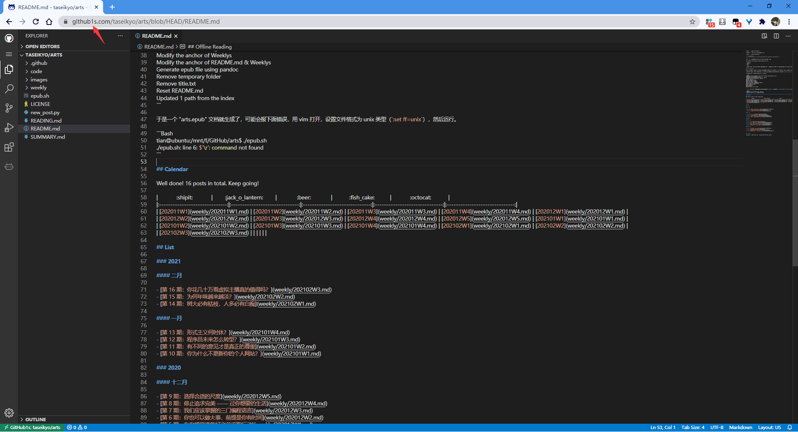

> @Author  : Lewis Tian (taseikyo@gmail.com)
>
> @Link    : github.com/taseikyo
>
> @Range   : 2021-02-21 - 2021-02-27

# Weekly #17

[readme](../README.md) | [previous](202102W3.md) | [next](202102W5.md)

本文总字数 1236 个，阅读时长约：2 分 25 秒，统计数据来自：[算筹字数统计](http://www.xiqei.com/tools?p=tj)。

\**Photo by [Silas Hao](https://unsplash.com/@taeyeonstar) on [Unsplash](https://unsplash.com/photos/0QL1sX96-9s)*

男儿何不带吴钩，收取关山五十州。请君暂上凌烟阁，若个书生万户侯？ —— 李贺

## Table of Contents

- [algorithm](#algorithm-)
- [review](#review-)
	- 我不想再做前端了
- [tip](#tip-)
	- GitHub + 1s = VS Code
- [share](#share-)
	- 高校"唯论文"导向的后果

## algorithm [⬆](#weekly-17)

## review [⬆](#weekly-17)

### 1. [我不想再做前端了](https://soynomm.com/blog/i-dont-want-to-do-frontend-anymore)

前端发展越来越复杂，在我当初自学的时候还仅仅是 HTML+JavaScript+CSS（当然我开始学也只了解了这么多），现在发展为一个巨大的整合体，正如作者在文中说的，你想开始一个前端项目最好先把想法记下来，因为在完成大量设置模板工作过程中就忘了（TypeScript、ESlint、Webpack、Babel），然后你还得知道那些功能直接调库就完事了，那些基础库是必须加上的，太麻烦了。

我之前想做一个用 VuePress 模板写一个 md 文档集合，就类似 GitBook 那样，结果看教程需要配置一堆东西，所以最后选择了 GitBook，毕竟它简单得多，只需要配置好 README 和 SUMMARY 两个就好了。

可能这也是作者为什么不想做前端开发了。

## tip [⬆](#weekly-17)

### 1. [GitHub + 1s = VS Code](https://github.com/conwnet/github1s)

一个很有创意的 GitHub 的库，使用它也很简单，只需要在你浏览的 GitHub 链接中在 github 后面加 1s，此时网页就会变成 VS Code 的模样，很有意思：

## share [⬆](#weekly-17)

### 1. [高校"唯论文"导向的后果](https://github.com/ruanyf/weekly/blob/master/docs/issue-44.md)

今天看阮一峰的周刊，看到 2019 年的本周回顾，然后点进去看了下，我觉得很有道理，我直接贴下来：

> 最近，一位荷兰统计学教授查找一篇论文，就是下面这篇。
>
>> Van der Geer, J., Hanraads, J.A.J., Lupton, R.A., 2010. The art of writing a scientific article. J Sci. Commun.163 (2) 51-59.
>
> 它是某个作者的参考文献。但是奇怪了，怎么都查不到，找不到这本杂志，也找不到原始作者。更奇怪的是，经过检索，这篇文章居然有400个引用！怎么可能，那么多人都引用一篇不存在的论文？
>
> 统计学教授进一步追查，终于发现了答案。这篇参考文献的出处是，某杂志的论文格式模板，供作者投稿时效仿。很多英语不好的外国人下载了论文模板，写好论文以后，参考文献也没改，直接当做会议论文投稿发表了。
>
> 看到这样的新闻，你有何感想？如果参考文献都是假的，论文的质量也就可想而知了，堪称垃圾论文。现在，全世界每年至少产生几千万篇论文，有人公开怀疑，其中大部分都是垃圾论文，不会有人看，数据和成果也是假的，不可重复的。
>
> 我在高校待过，知道一点情况，很多人写垃圾论文是迫不得已。就像有些学校规定，本科生一定要写毕业论文，不写不能毕业，怎么办呢，明明写不出来，只能造假了。老师也是一样，学校都有科研考核，不得不为发表而造假。高校都是以论文的发表数量，作为科研考核的标准，个人的待遇和职称都跟论文挂钩，不写垃圾论文，没法活下去。
>
> 现在已经是互联网时代了，高校还停留在考核纸质杂志的阶段，这不仅助长了垃圾论文，还养活了一大批毫无作用的杂志和会议，以及"中国知网"为代表的论文网站。我心目中理想的做法是，写完论文以后，就张贴到开放的在线论文数据库（比如 arxiv.org），全世界都可以免费下载，以及进行同行评议。这样不仅节省时间，而且不需要版面费，还可以随时发布文章的新版本。如果你真的做出了好的成果，一两天之内就会传遍互联网。

[readme](../README.md) | [previous](202102W3.md) | [next](202102W5.md)
