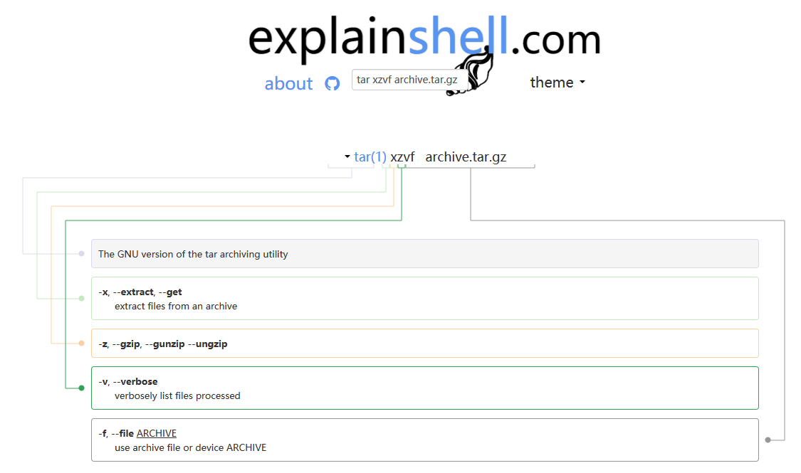
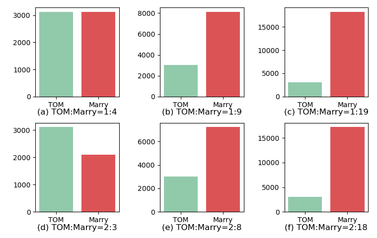
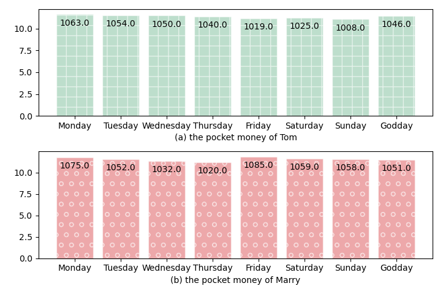

> @Author  : Lewis Tian (taseikyo@gmail.com)
>
> @Link    : github.com/taseikyo
>
> @Range   : 2021-02-28 - 2021-03-06

# Weekly #18

[readme](../README.md) | [previous](202102W4.md) | [next](202103W2.md)

本文总字数 3057 个，阅读时长约：5 分 59 秒，统计数据来自：[算筹字数统计](http://www.xiqei.com/tools?p=tj)。


\**Photo by [Jo Szczepanska](https://unsplash.com/@joszczepanska) on [Unsplash](https://unsplash.com/photos/5aiRb5f464A)*

## Table of Contents

- [algorithm](#algorithm-)
- [review](#review-)
    - 5 分钟了解什么是哈希表
- [tip](#tip-)
	- 解释 Shell 命令的网站
	- Linux 批量删除空文件及空文件夹
	- matplotlib 画多子图
    - GitHub Skyline：将 commit 转化为三维立方图
- [share](#share-)
    - 你讨厌的工作是最好的老师

## algorithm [⬆](#weekly-18)

## review [⬆](#weekly-18)

### 1. [5 分钟了解什么是哈希表](https://www.baseclass.io/hash-tables)

这篇文章简单地给我们介绍了哈希表（Hash Table），包括如何生成要存储对象的 key 以及如何处理碰撞（Collision）。

选取一个好的 hash 函数在一定程度上影响了此哈希表的性能，好的 hash 哈希函数应当将对象均匀分布在各个桶中。

文章确实简单，仅介绍了两种碰撞的处理方法：开放寻址（Open Addressing）与分离链接（Separate Chaining）。前者是将碰撞对象放入下一个空桶中，后者是将所有碰撞对象集中存放。还有一个重要方法拉链没介绍，当然毕竟是一个 5 分钟阅读的文章，要了解更深还需要阅读更多的介绍文章。

## tip [⬆](#weekly-18)

### 1. [解释 Shell 命令的网站](https://explainshell.com/)

这个网站很有意思，在输入栏输入一条 Shell 命令，点击 EXPLAIN 按钮，然后就会转到解释你输入命令的页面，一般可能会分成命令和参数两个部分。



### 2. [Linux 批量删除空文件及空文件夹](https://blog.csdn.net/hanglinux/article/details/49925975)

1、批量删除空文件（大小等于 0 的文件）

```Bash
find . -name "*" -type f -size 0c | xargs -n 1 rm -f
```

2、删除指定大小的文件，只要修改对应的 `-size` 参数就行

```Bash
find . -name "*" -type f -size 1024c | xargs -n 1 rm -f
```

就是删除 1 大小的文件（但注意不要用 `-size 1k`，这个得到的是占用空间 1k，不是文件大小 1k 的）。

3、查询出所有的空文件夹

```Bash
find -type d -empty
```

4、删除文件

列出搜索到的文件

```Bash
find . -name "shuaige.txt" -exec ls {} \;

tian@node ~> find Desktop -name "fread" -exec ls {} \;
Desktop/200914-test/fread
Desktop/read_test/fread
```

批量删除搜索到的文件

```Bash
find . -name "shuaige.txt" -exec rm -f {} \;

tian@node ~> find Desktop -name "fread" -exec rm -rf {} \;
tian@node ~> find Desktop -name "fread" -exec ls {} \;    
tian@node ~> 
```

删除前有提示

```Bash
find . -name "shuaige.txt" -ok rm -rf {} \;

tian@node ~> find Desktop -name "fread" -ok rm -rf {} \;
< rm ... Desktop/200914-test/fread > ? n
< rm ... Desktop/read_test/fread > ? n
tian@node ~> find Desktop -name "fread" -exec ls {} \;
Desktop/200914-test/fread
Desktop/read_test/fread
```

删除当前目录下面所有 test 文件夹下面的文件

```Bash
find . -name "test" -type d -exec rm -rf {} \;
```

注意：

1. {} 前后有空格
1. exec 是一个后续的命令，{} 内的内容代表前面查找出来的文件

### 3. matplotlib 画多子图

用 Python 画图一直用的是这个库，但都是用到啥就直接搜，比如多子图。然后在搜的过程中发现有两种方法画子图，但是要对子图进行数据标注时，可能后一种方法更方便（血泪教训，也是自己菜）。

第一种：

```Python
fig, axs = plt.subplots(2, 3)

xlabel = ("Tom", "Marry")

for x in range(2):
    for y in range(3):
        axs[x][y].bar([0, 1], (tom[3*x+y], marry[3*x+y]),
                      color=('#91C9AB', '#DC5356'))
        axs[x][y].set_title(f"({chr(ord('a')+3*x+y)}) Tom:Marry={subtitle[3*x+y]}", y=-.25)
        axs[x][y].xaxis.set_ticks([0, 1])
        axs[x][y].set_xticklabels(xlabel)

plt.subplots_adjust(hspace=.15)
plt.tight_layout()
plt.show()
```



这个时候不能为子图做标注，也可能是我没搜到，但是在搜的过程中发现了下面的第二种方法：https://www.cnblogs.com/zxingwork/p/12235870.html

第二种：

```Python
def add_labels(rects, label):
	"""
	添加标注，label 就是标注的内容
	"""
    for i, rect in enumerate(rects):
        x = rect.get_x() + rect.get_width() / 2
        y = rect.get_height()
        plt.text(
            x,
            y-0.15,
            f"{round((label[i]-1)*100, 2)}",
            ha="center",
            va="bottom",
        )
        rect.set_edgecolor("white")

plt.subplot(211)
fig = plt.bar(
    range(len(tom_money)),
    tom_money,
    tick_label=tom_label,
    alpha=0.6,
    width=0.8,
    color="#dc3023",
    hatch="+",
)

add_labels(fig, tom_money)
plt.xlabel("(a) pocket money of Tom", y=-.25)

plt.subplot(212)
fig = plt.bar(
    range(len(marry_money)),
    marry_money,
    tick_label=tom_label,
    alpha=0.5,
    width=0.8,
    color="#ff4c00",
    hatch="o",
)

add_labels(fig, marry_money)
plt.xlabel("(b) pocket money of Marry", y=-.25)
plt.tight_layout()
plt.show()
```



这一种就方便许多，可以很简单地为子图添加标记、柱状图的名称（tick_label）、横纵坐标名称、子图标题、图标（legend）等等。

后面我可能更多使用第二种方法吧，虽然看上去代码更多。

### 4. [GitHub Skyline：将 commit 转化为三维立方图](https://skyline.github.com)

这其实跟我之前用过的一个 Chrome 插件一样，都是将 commit 转化为三维立方图，不过这个网站是 GitHub 官方出的，可以下载 [stl 文件](../code/taseikyo-2020.stl)，进行 3D 打印。

## share [⬆](#weekly-18)

### 1. [你讨厌的工作是最好的老师](https://medium.com/the-ascent/the-job-you-hate-is-the-greatest-teacher-of-all-d64683592ed5)

这篇文章写的很好，很多金句。

Your work circumstances don't define you. Your reaction to them does.

> **你的工作环境并不能定义你，你对工作环境的反应才是**

You can get angry at your work colleagues. You can come home from work and be angry at your family. You can scream at the waiter who is a few minutes late with your frappuccino in the morning.

> 你可以下班回家，对你的家人生气。你可以对着服务员大喊大叫，因为他早上的星冰乐晚了几分钟。

For some, working a job is a prison sentence.

> 对于一些人来说，工作就像坐牢

A terrible job teaches you the best lessons you need to break free.

> 一份糟糕的工作能教会你如何挣脱束缚

After work is where the magic happens.

> 工作之余是奇迹发生的地方

A job you hate can teach you to build something before and after work of your own. One exit plan can be your own business. Another exit plan is to supplement your next job with a second income to broaden your options.

> 一份你讨厌的工作可以教会你在工作之前和之后建立自己的东西。一个退出计划可以是你自己的事情。另一个退出计划是用第二份收入来补充你的下一份工作，以扩大你的选择。

A job you hate can lie to you. It can make you think you're going to be broke.

> 一份你讨厌的工作可能会欺骗你，它可能会让你觉得自己要破产了

But a job I hated taught me to be frugal...I took the money I saved and built a backup fund. The backup fund became the soft mattress I could land on if my boss kicked me out of the 10-story office building I work in, or if I decided to jump to escape.

> 但是一份我讨厌的工作教会我要节俭。...我用我存的钱建立了一个备用基金。如果我的老板把我从我工作的10层办公楼里踢出去，或者我决定跳楼逃跑，备用基金就成了我赖以生存的软床垫。

The amount of money you need to leave a job you hate is a lot less than you think. Add up the amount of money you need in an excel spreadsheet. Then see where you can ruthlessly cut. What you'll be left with is a number that is smaller than your fear-ridden mind could have imagined.

> 离开一份你讨厌的工作所需要的钱比你想象的要少得多。在 excel 电子表格中把你需要的钱加起来。然后看看哪里可以无情地削减。你会得到的数字比你充满恐惧的大脑所能想象的要小。

Gravitate towards people you want to be like, not terrible people who make you hate your job.

> **吸引那些你想成为的人，而不是那些让你讨厌自己工作的坏人**

Waiting is the axe that hacks away at your joy in life.

> 等待是砍掉你生活乐趣的斧子

I'm thankful to have worked a bad job. It sped up the process of me finding better work. It forced me to think faster. The frustration took me to uncomfortable places I wouldn't have gone to of my own accord. Without a bad job I would never have worked hard at public speaking or discovered the life-changing magic of selfless leadership.

> 我很庆幸自己的工作做得不好。它加快了我找到更好工作的过程。它迫使我思考得更快。这种挫折感把我带到了一个不舒服的地方，这是我自己不愿意去的。如果没有一份糟糕的工作，我永远不会在公共演讲上努力工作，也不会发现无私领导的改变人生的魔力。

You know what you want to be doing. A bad job will lead you there faster.

> 你知道自己想做什么，一份糟糕的工作会让你更快地到达目的地

That's what happens when you hang around insecure, unkind, selfish people for too long. You accidentally start mimicking their example.

> 当你和那些缺乏安全感、刻薄、自私的人在一起太长时间时，就会发生这种情况。你不小心开始模仿他们的例子。

A job you hate is similar to running a marathon. It shows you your weaknesses, strengths, potential, blindspots, and your ability to endure relentless pain.

> 你讨厌的工作就像跑马拉松一样。它向你展示了你的弱点、力量、潜力、盲点以及忍受无情痛苦的能力。

You're actually stronger than you think.

> 你实际上比你想象的要坚强。

You can choose to see a bad job as the miracle you've been waiting for.

> 你可以选择把一份糟糕的工作看作是你一直在等待的奇迹。

When you do, the road back to the top of the mountain holds 10x more value.

> 当你这样做的时候，回到山顶的道路拥有 10 倍的价值。

[readme](../README.md) | [previous](202102W4.md) | [next](202103W2.md)
