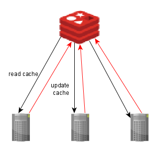
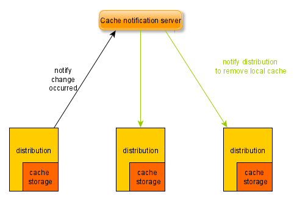

> @Author  : Lewis Tian (taseikyo@gmail.com)
>
> @Link    : github.com/taseikyo
>
> @Range   : 2021-03-07 - 2021-03-13

# Weekly #19

[readme](../README.md) | [previous](202103W1.md) | [next](202103W3.md)

本文总字数 3452 个，阅读时长约：6 分 46 秒，统计数据来自：[算筹字数统计](http://www.xiqei.com/tools?p=tj)。


\**Photo by [Ishant Mishra](https://unsplash.com/@ishant_mishra54) on [Unsplash](https://unsplash.com/photos/Ha4GZKWINdw)*

甘地说："贫穷才是最糟糕的暴力。毁灭人类的七种事是：没有原则的政治，没有牺牲的崇拜，没有人性的科学，没有道德的商业，没有是非的知识，没有良知的快乐，没有劳动的富裕。"

注：从这周开始，头图改为 21:9 的尺寸（1080, 463）

## Table of Contents

- [algorithm](#algorithm-)
	- 自定义 C/C++ 日志输出函数
- [review](#review-)
	- 分布式系统中的缓存
- [tip](#tip-)
	- VS Code 摸🐟打字练习插件
	- matplotlib 设置画布大小和子图个数
	- VS Code 编辑区文本溢出自动换行
	- 一键解锁 Medium 会员文章
- [share](#share-)
	- 生活是为你工作，而不是与你为敌

## algorithm [⬆](#weekly-19)

### 1. [自定义 C/C++ 日志输出函数](https://www.kymjs.com/code/2020/08/07/01)

在 C++ 中输出使用 `cout`，要调试信息的需要写一堆类似 `key:value` 对的形式，如下所示：

```C++
int main(int argc, char **argv) {
	char *Name = "Bill";
	int Age = 10;
	float Score = 86.5;
	float Height = 121.3;
	float Body_Weight = 36;

	std::cout << "Name:" << Name << ", "
	          << "Age:" << Age << ", "
	          << "Score:" << Score << ", "
	          << "Height:" << Height << ", "
	          << "Body_Weight:" << Body_Weight << std::endl;
}
```

能不能换一种简单的方法？就像下面一样？

```C++
int main(int argc, char **argv) {
	char *Name = "Bill";
	int Age = 10;
	float Score = 86.5;
	float Height = 121.3;
	float Body_Weight = 36;

	logDebug(Name, Age, Score, Height, Body_Weight);
}

// DEBUG [..\cppdemo\main.cpp@main#11]Name:Bill, Age:10, Score:86.5, Height:121.3, Body_Weight:36
```

于是这就是本篇文章（自定义日志函数实现）的由来。

实现主要用到了宏的技巧，在宏定义中，如果使用井号（#），可以将参数变为字符串，也即：

```C++
#define  toStr(x)  #x

char *str = toStr(hello);  
//  等价于 
char *str = "hello";
```

对于文件位置信息，C++ 中也有对应的宏，分别是 `__FILE__`、`__FUNCTION__`、`__LINE__`

```C++
#define FILE_INFO   "[" << __FILE__ << '@' << __FUNCTION__ << '#' << __LINE__  << "]"
#define logs(x)     std::cout << FILE_INFO << #x":" << x << std::endl

int delay = 5;
int other = 3;

logs(delay);
logs(other);
// [..\cppdemo\main.cpp@main#21]delay:5
// [..\cppdemo\main.cpp@main#22]other:3
```

要想用颜色区分 error 和 warning 也不难，之前在 Shell 脚本中使用过：

```C++
#define OUT_RED     "\033[0;31;1m"
#define OUT_GREEN   "\033[0;32;1m"
#define OUT_END     "\033[0m"

#define logRed(x)       std::cout << OUT_RED << FILE_INFO << #x":" << x << OUT_END << std::endl
#define logGreen(x)     std::cout << OUT_GREEN << FILE_INFO << #x":" << x << OUT_END << std::endl

logRed(delay);
logGreen(other);
```

最重要的问题是如何实现自动识别多变量，最傻瓜的是实现每一种输出函数，但是没必要且很蠢。

```C++
#define logs1(a)       std::cout << OUT_GREEN << FILE_INFO << #a":" << a << OUT_END << std::endl
#define logs2(a,b)     std::cout << OUT_GREEN << FILE_INFO << #a":" << a << ", "#b":" << b << OUT_END << std::endl
#define logs3(a,b,c)   std::cout << OUT_GREEN << FILE_INFO << #a":" << a << ", "#b":" << b << ", "#c":" << c << OUT_END << std::endl
#define logs4...
#define logs5...
```

其实 C/C++ 中也有多参数的函数，如 printf 函数，其函数原型就是：`int __cdecl printf(const char * _Format,...);`，所以只要我们能够动态计算出参数个数，就可以通过映射的方式，绑定到对应参数数目的输出函数上面。

```C++
#define ARG_COUNT_PRIVATE(_0,  _1,  _2,  _3,  _4,  _5,  _6,  _7,  _8, N, ...) N
#define ARG_COUNT(...)      ARG_COUNT_PRIVATE(0, __VA_ARGS__, 8,  7,  6,  5,  4,  3,  2,  1,  0)

#define FILE_INFO   "[" << __FILE__ << '@' << __FUNCTION__ << '#' << __LINE__  << "]"
#define logs(a)       std::cout << OUT_GREEN << FILE_INFO << #a":" << a << OUT_END << std::endl

int one = 5;
int two = 3;
int three = 2;

logs(ARG_COUNT(one));
logs(ARG_COUNT(one, two));
logs(ARG_COUNT(one, two, three));
// [..\cppdemo\main.cpp@main#30]ARG_COUNT(one):1
// [..\cppdemo\main.cpp@main#31]ARG_COUNT(one, two):2
// [..\cppdemo\main.cpp@main#32]ARG_COUNT(one, two, three):3
```

然后只要我们在用 C++ 宏里面的 ## 进行连接，就可以将 logs ## Num 变成对应的函数。

完整代码见：[logger.h](../code/logger.h)

## review [⬆](#weekly-19)

### 1. [分布式系统中的缓存](https://medium.com/programming-sharing/caching-in-the-distributed-system-c5dce8a41321)

分布式系统是一种软件体系结构，应用程序分布在多个服务器上。优点是使我们能够构建高可扩展性和高可靠性（high scalability & high reliability）。缺点是管理数据的一致性变得更加复杂。使缓存无效也是一个复杂的任务。

分布式系统的缓存方法有两种：集中式缓存（Centralized Cache） & 本地化缓存（Localized Cache）

1、集中式缓存（Centralized Cache）



集中式缓存主要是使用缓存服务器（Memcached 或 Redis）。缓存数据存储在缓存服务器上，每个服务器都将从缓存服务器读数据，或者把数据更新到缓存服务器。

优点是缓存存储的高可扩展性，当我们想要扩展缓存时，我们只需要扩展缓存服务器，对应用服务器没有影响。而且确保了数据的一致性，因为只有一个地方需要更新。

缺点是缓存数据经常在网络中传输，从而影响带宽。如果缓存服务器不可用，所有分发将受到影响。这种方法降低了分布式系统的高可靠性。

2、本地化缓存（Localized Cache）



这种方法将缓存数据存储在每个发行版服务器中，这使得访问和存储数据的速度非常快。这种方法提供了很高的可靠性，当一个分发版本消亡时，其他分发版本不会受到影响。

问题是发生修改时需要分别更新每个实例，并需要在每个服务器上加载数据。另一个缺点是它增加了分布之间数据不一致的风险。

最后一个缺点是，每个服务器的必备资源可能比集中式方法大。

（就这还得开会员看？）

## tip [⬆](#weekly-19)

### 1. [VS Code 摸🐟打字练习插件](https://github.com/Kaiyiwing/qwerty-learner-vscode)

原项目是：[Kaiyiwing/qwerty-learner](https://github.com/Kaiyiwing/qwerty-learner)，在线版本是：https://qwerty-learner.vercel.app

这个 VS Code 版是另一个大佬开发的，方便摸鱼，启动该插件的快捷键是 <kbd>Shitf + Alt + Q</kbd>，不过我刚试了下没有声音，网页版会读出单词。

### 2. matplotlib 设置画布大小和子图个数

1、只有一个子图时

```Python
# 默认画布大小
plt.figure()
# 自定义画布大小
plt.figure(figsize=(width, height))
# 使用 plt 绘图
plt.plot(...)
```

2、有多个子图时

1. add_subplot

```Python
# 用 2x2 个子图为例
# 定义整个画布
fig = plt.figure([figsize=(width, height)])
# 第一个子图
ax1 = fig.add_subplot(221)
ax1.plot(...)
# 在子图上作图
ax2 = fig.add_subplot(222)
ax2.plot(...)
ax3 = fig.add_subplot(223)
ax3.plot(...)
ax4 = fig.add_subplot(224)
ax4.plot(...)
```

2. subplots

```Python
# 仍用 2x2 个子图为例
fig, axes = plt.subplots(2, 2, [figsize=(width,height)])
ax = axes.flatten()
# 若不 flatten axes，则这里用 axes[0,0]
ax[0].plot(...)
ax[1].plot(...)
```

关于多子图绘图见 [#18#tip3](202103W1.md#3-matplotlib-画多子图)

### 3. VS Code 编辑区文本溢出自动换行


算是一个提醒，明明实验室电脑上的 VS Code 文本溢出会自动换行，而寝室电脑却不行，一直以来我都很奇怪，但是没有搜（...）。

直到今天（2021/03/12），我忍不了了！搜了一下，果然是设置没开。。。

<kbd>Ctrl + ,</kbd> 打开设置，搜索 `wrap`，将 `Editor: Word Wrap` 设为 `on` 即可，然后文本就会自动换行了。

### 4. 一键解锁 Medium 会员文章

以前是用 [manojVivek/medium-unlimited](https://github.com/manojVivek/medium-unlimited) 这个浏览器插件解锁的，最近好像由于网站升级导致这个插件不可用了，启用插件会导致那个需要解锁的网页一直死循环刷新，但是解锁不了。

后面又发现了一个方法，很有意思，网站是：https://sugoidesune.github.io/readium

它页面上有一个 `Readium` 的按钮，将其拖到书签栏（隐藏了的话，按快捷键 <kbd>Ctrl + Shift + B</kbd>），然后找一个会员文章，点击那个书签，然后奇迹发生了，文章解锁了！

## share [⬆](#weekly-19)

### 1. [生活是为你工作，而不是与你为敌](https://medium.com/the-ascent/life-is-working-for-you-not-against-you-e04639360669)

Wisdom often takes years to connect the dots

> 智慧常常需要几年的时间才能将点点滴滴串连起来

Life is working for you all the time. It’s how you perceive what is happening to you that determines whether life is working for you.

> 生活一直在为你工作。你如何看待发生在你身上的事情决定了生活是否适合你

Life was trying to work for me by showing me my defects. The problem is when you ignore the signs that help you learn an important lesson.

> 生活试图通过向我展示我的缺点来为我工作。问题是你忽视了那些帮助你学到重要一课的迹象

Life works in your favor when you’ve had time to reflect on what didn’t work out. Wisdom takes years to join the dots.

> 当你有时间反思什么没有成功的时候，生活就会对你有利。智慧需要几年的时间才能加入这些点

Death is trying to tell you to stop worrying about what everybody thinks. Death is telling you to hurry up. Death is telling you to focus less on money and more on the people you love. Death is telling you your time will come randomly too. Death is trying to tell you to start a family or get married, if that’s something you’ve wanted to do. Death is trying to get you to do that one thing you’ve been putting off your entire life.

> 死亡试图告诉你不要再担心别人的想法。死神在告诉你要快点。死亡告诉你少花点钱，多花点心思在你爱的人身上。死亡告诉你，你的时间也会随机到来。死亡是在告诉你，如果你一直想要组建一个家庭或者结婚，那么这就是你想要做的。死亡是试图让你去做那件你一辈子都在拖延的事情

心情不好，所以这两周都是些鸡汤文。

[readme](../README.md) | [previous](202103W1.md) | [next](202103W3.md)
