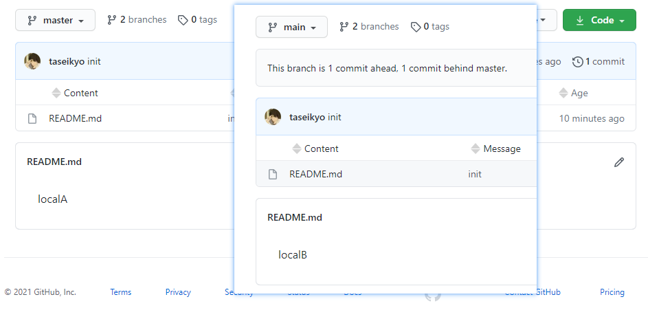

> @Author  : Lewis Tian (taseikyo@gmail.com)
>
> @Link    : github.com/taseikyo
>
> @Range   : 2021-03-21 - 2021-03-27

# Weekly #21

[readme](../README.md) | [previous](202103W3.md) | [next](202103W5.md)

## Table of Contents

- [algorithm](#algorithm-)
- [review](#review-)
	- 使用 pandoc 将 latex 转化为 docx
- [tip](#tip-)
	- 将右键开始菜单的 CMD 换成 PowerShell
	- Windows Terminal 以管理员身份打开 PowerShell
	- Markdown 文档中插入图片的三种方法
	- 多个本地仓库对应一个远程仓库的不同分支
- [share](#share-)

## algorithm [⬆](#weekly-21)

## review [⬆](#weekly-21)

### 1. [使用 pandoc 将 latex 转化为 docx](https://medium.com/@zhelinchen91/how-to-convert-from-latex-to-ms-word-with-pandoc-f2045a762293)

1、基本转换

```Bash
pandoc mydoc.tex -o mydoc.docx
```

2、包含引用（bib）

```Bash
pandoc mydoc.tex --bibliography=myref.bib -o mydoc.docx
```

3、Word 样式

```Bash
pandoc mydoc.tex --bibliography=myref.bib --reference-docx=IEEE_template.doc -o mydoc.docx
```

4、交叉引用

`pandoc-crossref` 来自：[lierdakil/pandoc-crossref](https://github.com/lierdakil/pandoc-crossref)

```Bash
pandoc mydoc.tex --filter pandoc-crossref --bibliography=myref.bib --reference-docx=IEEE_template.doc -o mydoc.docx
```

转化之后还是格式怪怪的，并不会跟指定的模板 docx 样式完全一样，所以还是放弃了这种方式。

## tip [⬆](#weekly-21)

### 1. 将右键开始菜单的 CMD 换成 PowerShell

CMD 是真的辣鸡，既不能记录历史命令，又没什么快捷键，虽然 PowerShell 也很辣鸡，但总比 CMD 强。

一般来说右键开始菜单弹出来的是 "命令提示符(C)" & "命令提示符(管理员)(A)"，但是可以改成 PowerShell，步骤是："设置" - "个性化" - "任务栏" - "当我右键点击开始或按 下 Win 键 + X 键时，在 Windows 中将命令提示符换为 PowerShell" 勾选，然后就成 PowerShell 了。

### 2. Windows Terminal 以管理员身份打开 PowerShell

1、安装 [gsudo](https://github.com/gerardog/gsudo)

根据官方给出的安装指令，贴到 PowerShell 里面即可

```PowerShell
PowerShell -Command "Set-ExecutionPolicy RemoteSigned -scope Process; iwr -useb https://raw.githubusercontent.com/gerardog/gsudo/master/installgsudo.ps1 | iex"
```

2、进入 terminal 配置文件，新增下列配置项

```Json
{
	"guid": "{41dd7a51-f0e1-4420-a2ec-1a7130b7e950}",
	"name": "Windows PowerShell Elevated",
	"commandline": "gsudo.exe powershell.exe",
	"hidden": false,
	"colorScheme": "Dracula",
	"fontFace": "Fira Code",
	"icon" : "https://i.imgur.com/Giuj3FT.png"
},
```

3、出现 bug：error 0x80070002 when launching `gsudo.exe powershell.exe`

根据下面第三条参考链接，将 "%systemroot%\System32\WindowsPowerShell\v1.0" 贴到 PATH 环境变量即可

然后只需要新建对应 tab 页即可，就可以新建一个管理员模式的 PowerShell 了。

我将配置同步更新到 [taseikyo/oh-my-terminal](https://github.com/taseikyo/oh-my-terminal) 了，可以直接去复制配置。

参考：

- [Windows Terminal 以管理员身份打开](https://blog.csdn.net/weixin_40263993/article/details/112917070)
- [A Sudo for Windows - run elevated without spawning a new Console Host Window](https://github.com/gerardog/gsudo)
- [error 0x80070002 when launching `powershell.exe`](https://github.com/microsoft/terminal/issues/6039)

### 3. Markdown 文档中插入图片的三种方法

其实是老生常谈了，三种都用过，只不过 base64 老用老忘，索性做个记录。

1、网络图片

一般使用图床，主要怕图床的网站跑路，然后图就都裂开了。在我早期的博客的 README 都是使用了这个方法，导致后来看的时候图片都裂了。

``

2、本地图片

这也是常用的一个方法，图片保存在本地，不怕图片裂开，应该算是一个最好的方法了。

``

3、存于本文件的 base64 图片

这种方式分为两部分，一般将图片的 base64 编码的字符串统一放于文件尾，然后在正文中引用即可，缺点是编码后会比原图片大 30% 左右，优点是所有东西都在一个文件中，不用再另保存图片。

```Markdown
![avatar][img1]

[img1]:data:image/png;base64,xxxx...
[img2]:data:image/jpeg;base64,xxxx...
[img2]:data:image/gif;base64,xxxx...
```

三种方式都有优劣，本地图片存放的话一旦变多就很杂，之前就遇到过，我的解决方法是根据年月分类放置。其实如果 base64 编码不增加，或者增加的程度没那么离谱，我觉得这种方式其实是最好的，一个文件全部搞定。

### 4. 多个本地仓库对应一个远程仓库的不同分支

突然有这个想法（需求），是因为想将两个类似的东西放到一个远程库，免得又建一个麻烦。然而没搜到，结果都是一个本地库对应多个远程库。

果然还是得自己尝试，当前文件夹如下图所示：

```Bash
test
 |
 |
 |--localA
 |   |
 |   |---README.md
 |
 |--localB
     |
     |---README.md
```

1. 将 localA 的内容 push 到远程的 master 分支
2. 将 localB 的内容 push 到远程的 main 分支

```Bash
cd localA
echo "localA" > README.md
gs
git init
git add .
git commit -m "init"
git branch -M master
git remote add origin git@github.com:taseikyo/local-remote.git
git push -u origin master
../localB
echo "localB" > README.md
git init
git add .
git commit -m "init"
git branch -M master
git remote add origin git@github.com:taseikyo/local-remote.git
git push -u origin master:main
```



## share [⬆](#weekly-21)

[readme](../README.md) | [previous](202103W3.md) | [next](202103W5.md)
