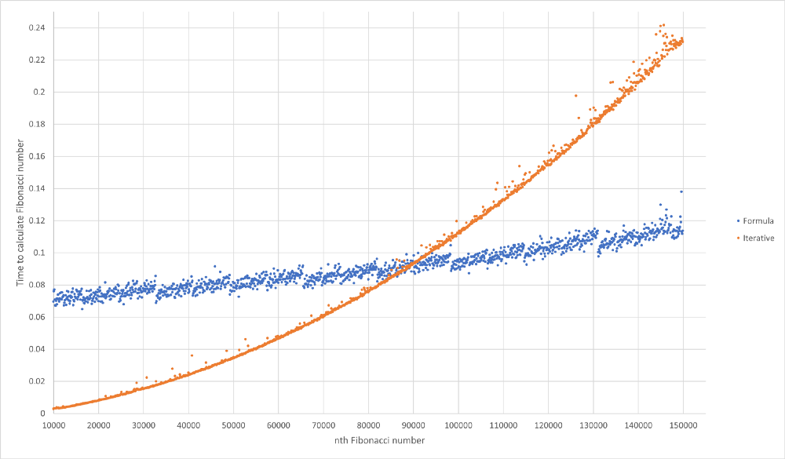

> @Author  : Lewis Tian (taseikyo@gmail.com)
>
> @Link    : github.com/taseikyo
>
> @Range   : 2021-04-04 - 2021-04-10

# Weekly #23

[readme](../README.md) | [previous](202103W5.md) | [next](202104W2.md)

本文总字数 3338 个，阅读时长约：6 分 26 秒，统计数据来自：[算筹字数统计](http://www.xiqei.com/tools?p=tj)。


\**Photo by [Roma Kaiuk](https://unsplash.com/@roma_kaiuk) on [Unsplash](https://unsplash.com/photos/3yv362vuITw)*

年年欲惜春，春去不容惜。 —— 苏轼

## Table of Contents

- [algorithm](#algorithm-)
- [review](#review-)
    - 我是如何用 Python 计算第 100 万个斐波那契数列的
    - 如何使用 Python 进行财务计算
- [tip](#tip-)
	- 人生苦短，我用 scoop（Windows）
	- 常见的环境变量（Windows）
	- sublime 中的快捷键文件限定
- [share](#share-)
	- 一辈子单身的话怎么样？

## algorithm [🔝](#weekly-23)

## review [🔝](#weekly-23)

### [1. 我是如何用 Python 计算第 100 万个斐波那契数列的](https://kushm.medium.com/how-i-calculated-the-1-000-000th-fibonacci-number-with-python-e921d3642dbf)

斐波那契数列是一个被做烂的题目，递归或者迭代，我点进这篇文章主要是看到 100w 这个数，想着是否有什么简单方法计算得到。

作者提出五种方法：

1. 简单递归
2. 带缓存的递归
3. 迭代
4. 使用 Binet 公式
5. 计算第 100w 个数

1、简单递归肯定是不可行的，不用想都知道：

```Python
def recursiveFib(n):
    if n == 1 or n == 2:
        return 1

    return recursiveFib(n - 1) + recursiveFib(n - 2)
```

2、带缓存的递归，作者使用量 lru_cache：

```Python
from functools import lru_cache

@lru_cache()
def recursiveFibCached(n):
    if n == 1 or n == 2:
        return 1

    return recursiveFibCached(n - 1) + recursiveFibCached (n - 2)
```

在计算第 500 个时，会报错："RecursionError: maximum recursion depth exceeded in comparison"

需要设置递归限制：`sys.setrecursionlimit(5000)`

然而在计算第1553个数字，即使递归限制增加了，也不会发生任何事情，不会有任何东西打印出来到终端，程序只是简单地退出。

显然，此方法也行不通。

3、迭代法：

```Python
def iterativeFib(n):
    a, b = 0, 1

    for i in range(n):
        a, b = b, a + b

    return a
```

迭代很快，只需要 0.0028195 秒就可以计算出第 10,000 个数字

4、Binet 公式：

$ F_n = \frac{\varphi^n - (-\varphi)^{-n}}{\sqrt{5}} $，其中 $ \varphi=\frac{1+\sqrt{5}}{2} $


```Python
def formulaFib(n):
    root_5 = 5 ** 0.5
    phi = ((1 + root_5) / 2)

    a = ((phi ** n) - ((-phi) ** -n)) / root_5

    return round(a)
```

这种方法有一个小问题，如果我们试图计算任何超过1475的数字，我们将会遇到一个错误："OverflowError: (34, result too large)"

这是由于在 python 中实现浮点数的方式，并且浮点数只能有一个特定的最大值，而使用这种方法时，浮点数的最大值超过了这个值

修复这个问题是非常容易实现的，我们可以使用一个内置的叫做 Decimal 的模块来创建一个十进制对象，这个对象的精度和大小要高得多：

```Python
import decimal

def formulaFibWithDecimal(n):
    decimal.getcontext().prec = 10000

    root_5 = decimal.Decimal(5).sqrt()
    phi = ((1 + root_5) / 2)

    a = ((phi ** n) - ((-phi) ** -n)) / root_5

    return round(a)
```

在这个新函数中，我们将精度值设置为 10,000 位长，然后将 $ \sqrt{5} $ 转换为十进制对象值，并在方程中使用这个值。这使我们只需 0.0692986 秒计算出序列中的第 10w 个数

5、计算第 100w 个数字

当 n = 10,000 时，使用公式的速度比迭代解要慢，因为在公式中我们需要创建一个 Decimal 对象并在方程中使用它，这比循环一条简单的指令 10,000 次要花费更多的时间

如果我们增加需要循环的次数，这会大大增加整个流程完成所需的时间。在某一点上，当 n 近似为 89200 时，迭代解计算答案所需的时间等于公式，当 n 增加到这个值以上时，迭代解所需的时间比使用公式所需的时间增加得更快：



为了正确计算结果，还需要做一个额外的更改，提高 Decimal 对象的精度：`decimal.getcontext().prec = 300000`

计算花费时间：

- 迭代：8.832661
- 公式：1.151380

至于那个数字：If you wanted to see the actual number, it is 208,988 digits long and takes 209KB to store in a text file. -> [fix.txt](https://gist.github.com/1Blademaster/3560093050fff94597dc93645b6bfa4c/raw/e18dc4f0660a1694348446b2aceb9f6976a63103/fib.txt)

挺有趣的一篇文章，我比较好奇他那张图怎么得来的，最后作者说，通过图可以估算出使用公式计算第 10 亿需要 310.8467 秒。

### 2. [如何使用 Python 进行财务计算](https://python.plainenglish.io/how-to-use-python-for-financial-calculations-8fd5a692a506)

说是财务计算，其实是能借多少、每月需要还多少（How much you can borrow? What will your loan payment be?），主要使用了 numpy_financial 这个库。

能借多少还多少跟你借的本金、利率、决定偿还的年限还有自己的收入有关，将相关参数设置好，其他都是 numpy_financial 的工作，由于很多东西都是动态变化的，结果只能说做个参考，感觉没啥意义。

## tip [🔝](#weekly-23)

### 1. 人生苦短，我用 scoop（Windows）

以前我单知道 [scoop](github.com/lukesampson/scoop) 好用，没想到它这么好用！

之前我只是用它来安装 7zip、aria2、gcc、python 和 latex，直到最近我才发现我低估他了。

因为之前看到它介绍说是只能安装命令行工具（非 GUI），后来发现我天真了，其实是 main 这个 bucket 仅囊括命令行工具，它有自己的 [收录标准](github.com/lukesampson/scoop/wiki/Criteria-for-including-apps-in-the-main-bucket)，在 extras 这个 bucket 中收集了很多 GUI 软件，最近在把自己电脑上的软件都重新用 scoop 安装了（能用 `scoop search x` 找到的），对于强迫症和极简主义的人来说，真是太爽了！

安装（`scoop install x`）、升级（`scoop update x`）、卸载（`scoop uninstall x`）和清理旧版本（`scoop install *`）都很方便。

很多我常用的软件都迁移过去了，像 cmder、SumatraPDF、Typora、ScreenToGif 等等。


一个注意点是，在安装 scoop 之前记得修改安装路径，不然会都给你安装到 C 盘，那我不能忍。

```Bash
$env:SCOOP='D:\Programs\scoop'
[Environment]::SetEnvironmentVariable('SCOOP', $env:SCOOP, 'User')
$env:SCOOP_GLOBAL='D:\Programs\scoop'
[Environment]::SetEnvironmentVariable('SCOOP_GLOBAL', $env:SCOOP_GLOBAL, 'Machine')
```

### 2. 常见的环境变量（Windows）

- https://blog.csdn.net/catshitone/article/details/70238163

|            VAR            |                 PATH                |
|---------------------------|-------------------------------------|
| %USERPROFILE%             | C:\Users\用户名                     |
| %HOMEPATH%                | C:\Users\用户名                     |
| %APPDATA%                 | C:\Users\用户名\AppData\Roaming     |
| %LOCALAPPDATA%            | C:\Users\用户名\AppData\Local       |
| %TEMP%                    | C:\Users\用户名\AppData\Local\Temp  |
| %TMP%                     | C:\Users\用户名\AppData\Local\Temp  |
| %SystemRoot%              | C:\Windows                          |
| %WINDIR%                  | C:\Windows                          |
| %ALLUSERSPROFILE%         | C:\ProgramData                      |
| %COMMONPROGRAMFILES%      | C:\Program Files\Common Files       |
| %COMMONPROGRAMFILES(x86)% | C:\Program Files (x86)\Common Files |
| %COMSPEC%                 | C:\Windows\System32\cmd.exe         |
| %HOMEDRIVE%               | C:\                                 |
| %SystemDrive%             | C:\                                 |
| %PROGRAMDATA%             | C:\ProgramData                      |
| %PROGRAMFILES%            | C:\Program Files                    |
| %PROGRAMFILES(X86)%       | C:\Program Files (x86)              |
| %PUBLIC%                  | C:\Users\Public                     |

上面列了一堆，感觉常用的可能就 `%USERPROFILE%` 和 `%APPDATA%` 这俩了。

### 3. sublime 中的快捷键文件限定

今天（21/04/08）在用 [sublime-markdown-helper](https://github.com/taseikyo/sublime-markdown-helper) 插件时发现昨天的修改导致今天的问题。

之前仅仅是 <kbd>Ctrl + 1</kbd> ~ <kbd>Ctrl + 7</kbd>，也就是三级标题、列表、块级代码和块级 LaTex 公式，昨天加了很多，行级代码和公式、人物列表、加粗、斜体、删除线和图片。由于将加粗的快捷键设置为 <kbd>Ctrl + B</kbd> 导致 Python 文件的运行快捷键被占用，使得我无法使用，于是想着将此插件的作用限定在 Markdown 文件中，然后找方法。

参考 SublimeAStyleFormatter 的方法，在快捷键设置中添加 context，并在其中添加一个 key：helper_is_enabled。然后在它代码里面发现一个 `on_query_context` 函数，去 API 文档中搜了一下发现在触发快捷键时会调用这个函数，那么问题似乎可以解决了，于是修改了一下这个函数，根据以前得知获取视图中文件的语言类型（`syntax = view.settings().get("syntax").split("/")[-1].split(".")[0]`），进行判断，如果是 Markdown 则返回 True，否则 False。

然而在离成功只有 1% 的时候发生翻车，我一直在用 `lower(syntax)`，死活不起作用，后来调出控制台发现报错信息，`lower` 函数不存在 🤦‍，马上意识到问题所在。。。

最终添加代码如下：

```Python
PLUGIN_NAME = "MarkdownHelper"

def load_settings():
    return sublime.load_settings(PLUGIN_NAME + '.sublime-settings')


class PluginEventListener(sublime_plugin.EventListener):
    def on_query_context(self, view, key, operator, operand, match_all):
        if key == 'helper_is_enabled':
            settings = load_settings()
            allows = settings.get("allow_fileformats")
            syntax = view.settings().get("syntax").split("/")[-1].split(".")[0]
            if syntax.lower() in allows:
                return True
        return False
```

想要添加文件类型的话，直接在 MarkdownHelper.sublime-settings 文件中添加即可！

有个地方很蠢的是 sublime 用的 Python 3.3，所以用不了 f-string。

## share [🔝](#weekly-23)

### 1. [一辈子单身的话怎么样？](https://humanparts.medium.com/pondering-a-future-alone-f0ad66f5a0ee)

偶然发现的一篇文章，很有趣。

最近在 B 站上经常看到热评：*我对国家未来充满希望，对自己未来充满迷茫。*

貌似年轻一代中越来越多的人有着本期 Share 主题的想法，一个人自在的活着，不需要考虑另一半的想法，也没有来自家庭的压力。

事实真是如此吗？

标题链接的文章很有趣，通篇以 "what if" 开头进行发问，前半部分提了很多关于物质上的问题，关于如果下半辈子一个人遇到种种突发状态该如何应对的自我发问，这类问题其实说难也难，说不难也不难，经济条件好的话可能不会出现那些问题；

后面逐渐转向心理/精神层面，也渐渐得出结论，虽然是问句：

*What if relationships become too much of an effort? What if love begins to seem like a chore? What if hope becomes too heavy to carry after having gone so long unrealized?*

> 如果人际关系变得太费力怎么办？如果爱开始变成一件苦差事怎么办？如果在这么长时间没有实现之后，希望变得过于沉重而无法承受，那该怎么办？

*And what if none of it matters at all? What if being alone for the rest of my life is the best thing that could happen to me?*

> 如果这些都不重要呢？如果孤独地度过余生对我来说是最好的事情呢？

我暂时还无法得出结论，可能我还没遇到真正让我动心的人，现在的感受是：**偶尔羡慕情侣，时常庆幸自由。**

[readme](../README.md) | [previous](202103W5.md) | [next](202104W2.md)
