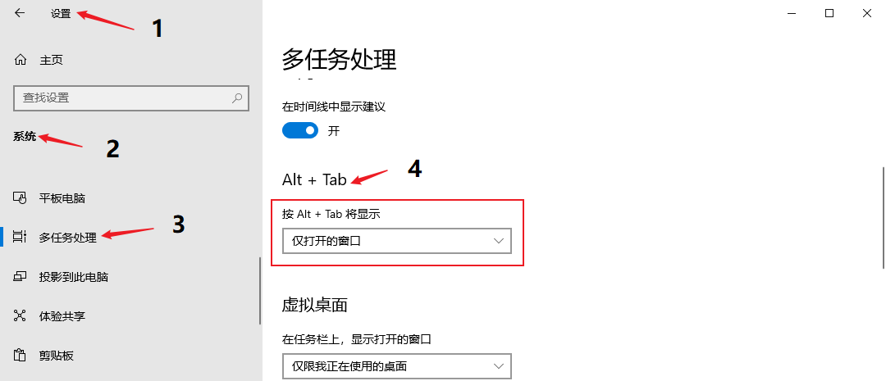

> @Author  : Lewis Tian (taseikyo@gmail.com)
>
> @Link    : github.com/taseikyo
>
> @Range   : 2021-04-11 - 2021-04-17

# Weekly #24

[readme](../README.md) | [previous](202104W1.md) | [next](202104W3.md)

本文总字数 1773 个，阅读时长约：3 分 23 秒，统计数据来自：[算筹字数统计](http://www.xiqei.com/tools?p=tj)。


\**Photo by [inthesky](https://pixabay.com/users/inthesky-802841) on [Pixabay](https://pixabay.com/photos/wuhan-wuhan-yangtze-river-bridge-658845/)*

> 万里长江横渡，极目楚天舒。不管风吹浪打，胜似闲庭信步，今日得宽馀。

## Table of Contents

- [algorithm](#algorithm-)
- [review](#review-)
	- Github/Gitlab PR 工作流与 Git 内置的邮件工作流的比较
- [tip](#tip-)
	- 超棒的 LaTex PPT 模板
	- Edge 如何关闭 tab 页在 Alt+Tab 快捷键中的显示
	- 微软应用商店打不开/无法下载
	- pandoc 行间公式转换报错
	- xelatex 报错：`TeX capacity exceeded, sorry [main memory size=3000000]`
	- QQ/TIM 无法登陆：登陆超时，请检查你的网络或者本机防火墙设置。错误码：0x00000001
- [share](#share-)
	- 真正浪费时间和金钱的方式

## algorithm [🔝](#weekly-24)

## review [🔝](#weekly-24)

### 1. [Github/Gitlab PR 工作流与 Git 内置的邮件工作流的比较](https://blog.brixit.nl/git-email-flow-versus-github-flow)

GitHub 的 PR 工作流很简单，我也有幸发起过几个 PR 并得到 merge，主要是 fork 别人的项目，进行修改，push 到自己的远程仓库并发起 PR，然后就是等待原项目的维护者进行操作（merge/refuse）

后者我只是听过，并没有真正的使用。

由于 git 最初就是为了维护 Linux 而被开发出来的，所以最初的 PR 工作流是邮件方式。

邮件工作流基本有 6 步：

1. Clone the repository locally
2. Make your changes on your local checkout
3. Run `git send-email` with a ref pointing to one or a range of commits
4. Get comments as response to the patch as emails, mirrored on the webpage of the mailing list
5. Fix up your previous mistakes, run `git send-email` again with the `-v2` argument to send an updated version
6. The maintainer applies the patch from the email

作为一个维护者得到这样的补丁是很好的，因为除非有冲突，你不需要合并分支或 rebase，它只有来自作者的更改，而不是完整的 git 历史。

作者表示更喜欢邮件工作流的方式，而我可能更喜欢 GitHub 这类的直接页面操作的方式，简单方便且直观。

## tip [🔝](#weekly-24)

### 1. [超棒的 LaTex PPT 模板](https://github.com/Urinx/LaTeX-PPT-Template)

一共七种配色：

<details>
<summary><b>Jet Black (曜石黑)</b></summary>


</details>

<details>
<summary><b>Blood Red (姨妈红)</b></summary>


</details>

<details>
<summary><b>Sky Gray (深空灰)</b></summary>


</details>

<details>
<summary><b>Emperor Gold (秦屎黄)</b></summary>


</details>

<details>
<summary><b>Northeast Silver (东北银)</b></summary>


</details>

<details>
<summary><b>Mutou Ran Blue (武藤蓝)</b></summary>


</details>

<details>
<summary><b>Amethyst Purple (水晶紫)</b></summary>


</details>

在 "code/latex-ppt-template/" 目录下，一共 14 个文件（模板+demo），使用 xelatex 编译即可。

上述图片是用 compile_pdf_convert_image.sh 脚本编译生成 pdf 在转化为图片的。

### 2. [Edge 如何关闭 tab 页在 Alt+Tab 快捷键中的显示](https://tieba.baidu.com/p/7087117046#136396830820l)

今天将 Chrome 换成了 Edge 使用，然后在使用 <kbd>Alt+Tab</kbd> 时，上一个页面会出现在切换窗口中，搞得我很烦，我时要切其他应用，我又不想切你 Tab 页，什么 zz 设定。

于是在这个贴吧找到方法：系统设置 - 系统 - 多任务 - alt+tab -> 仅打开的窗口



瞬间身心舒畅。

### 3. 微软应用商店打不开/无法下载

关掉代理 -> Power Shell（管理员） -> `netsh winsock reset` -> 重启 -> 打开应用商店 -> 下载

### 4. pandoc 行间公式转换报错

- https://github.com/jgm/pandoc/issues/2976

解决方案是在公式前后不加空格，公式开始/结束紧贴美元符号。

奇怪的要求。

### 5. xelatex 报错：`TeX capacity exceeded, sorry [main memory size=3000000]`

- https://florian-rappl.de/Articles/Page/239/latex-memory
- https://tex.stackexchange.com/a/548335

Windows：

```Bash
initexmf --edit-config-file=xelatex
```

在打开的记事本中（可能是空白）写入：

```Bash
main_memory=12000000
```

保存退出，并执行：

```Bash
initexmf --dump=xelatex
```

### 6. QQ/TIM 无法登陆：登陆超时，请检查你的网络或者本机防火墙设置。错误码：0x00000001

之前是使用在贴吧找到的方法，用管理员权限运行 `netsh winsock reset` 命令然后重启，结果今天（2021/4/12）重启了无数次还是无法登录。

最终在知乎找到答案：

- https://www.zhihu.com/question/29699075/answer/1575531919

点击登录界面右上角的齿轮打开设置，选择登录服务器为 TCP 类型，在后面的地址里下拉小三角选择除当前已选择的另外一个，端口不用修改，再试一次。

确定回到登录界面再次登录就 OK 了！

## share [🔝](#weekly-24)

### 1. [真正浪费时间和金钱的方式](http://paulgraham.com/selfindulgence.html)

*But in fact the way most fortunes are lost is not through excessive expenditure, but through bad investments.*

*The most dangerous way to lose time is not to spend it having fun, but to spend it doing fake work.*

上面两段话是作者认为真正浪费时间和钱的方式：不当的投资和摸鱼（做假工/fake work）。

可能一般人认为财富流失的方式是过度消费，但其实更浪费的方式是不当的投资。作者举例是当花钱买奢侈品的时候，人的脑海中会响起警报，从而会约束自己后面的消费；而投资则不会，这种方式会潜意识认为是在进行资产转移。

再说时间，当把大把时间话在玩乐的时候，后面就会自省。但是在工作时摸鱼则可能不会，因为这个时候会自我劝解：我只是稍微休息了一会/我也在做工作啊。

*But the world has gotten more complicated: the most dangerous traps now are new behaviors that bypass our alarms about self-indulgence by mimicking more virtuous types. And the worst thing is, they're not even fun.*

新技术的涌现会不自觉让人麻痹自我，可能开发者针对人的爽点做了优化？反正会让人逐渐沉迷而不自知。

想起来昨天晚上（2021/4/11）回寝室，路上同学跟我说：以后晚点回寝室吧，回去早了就想着打游戏，一把就半个小时起步，输了还很难受，半天睡不着。

这不是正好应对了作者最后那句话：**And the worst thing is, they're not even fun.**

[readme](../README.md) | [previous](202104W1.md) | [next](202104W3.md)
