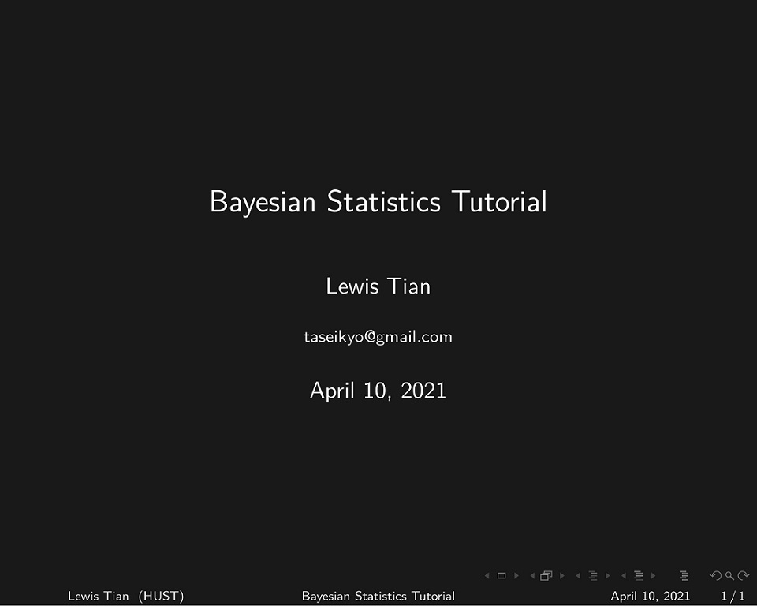
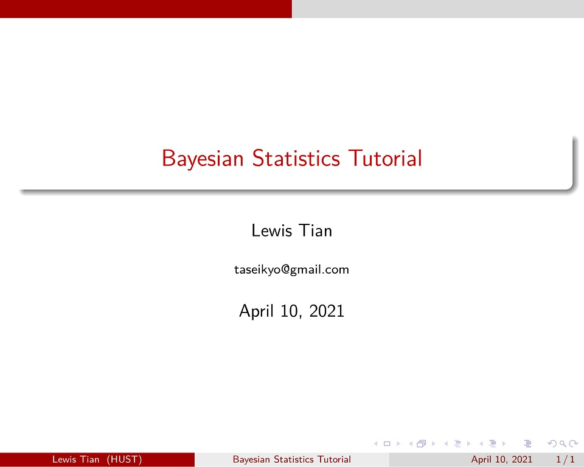
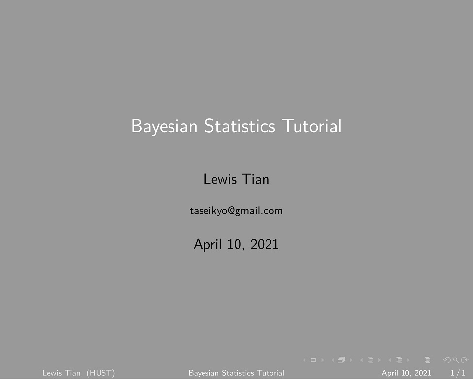
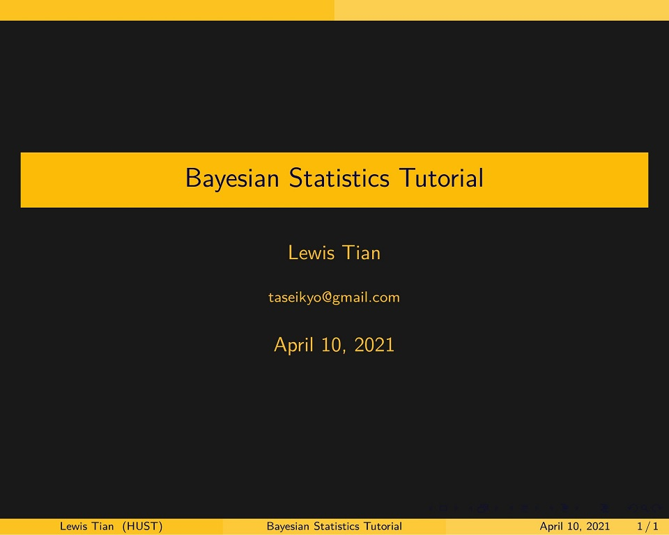
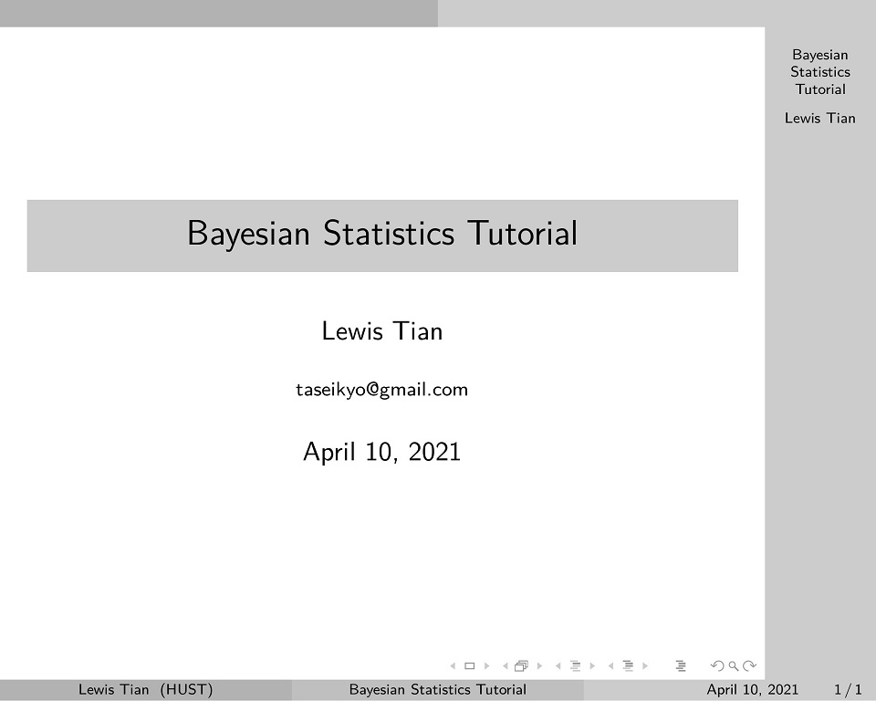
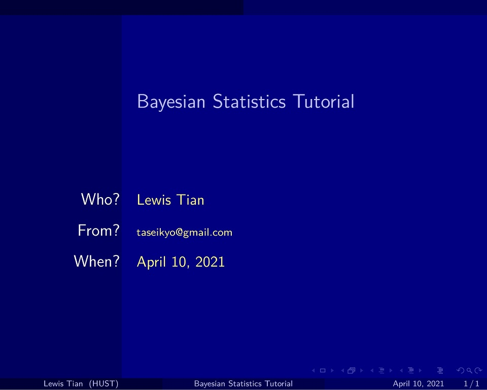
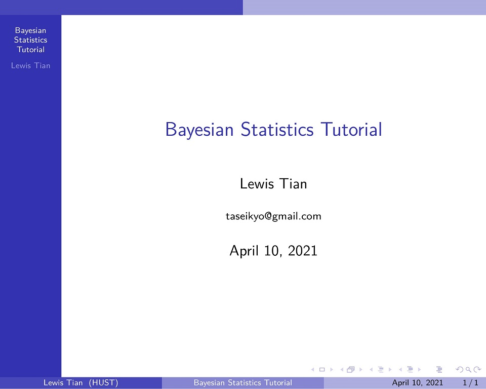

> @Author  : Lewis Tian (taseikyo@gmail.com)
>
> @Link    : github.com/taseikyo
>
> @Range   : 2021-04-09 - 2021-04-09

# Weekly #24

[readme](../README.md) | [previous](202104W1.md) | [next](202104W3.md)

## Table of Contents

- [algorithm](#algorithm-)
- [review](#review-)
	- Github/Gitlab PR 工作流与 Git 内置的邮件工作流的比较
- [tip](#tip-)
	- 超棒的 LaTex PPT 模板
	- Edge 如何关闭 tab 页在 Alt+Tab 快捷键中的显示
- [share](#share-)

## algorithm [🔝](#weekly-24)

## review [🔝](#weekly-24)

### 1. [Github/Gitlab PR 工作流与 Git 内置的邮件工作流的比较](https://blog.brixit.nl/git-email-flow-versus-github-flow)

GitHub 的 PR 工作流很简单，我也有幸发起过几个 PR 并得到 merge，主要是 fork 别人的项目，进行修改，push 到自己的远程仓库并发起 PR，然后就是等待原项目的维护者进行操作（merge/refuse）

后者我只是听过，并没有真正的使用。

由于 git 最初就是为了维护 Linux 而被开发出来的，所以最初的 PR 工作流是邮件方式。

邮件工作流基本有 6 步：

1. Clone the repository locally
2. Make your changes on your local checkout
3. Run `git send-email` with a ref pointing to one or a range of commits
4. Get comments as response to the patch as emails, mirrored on the webpage of the mailing list
5. Fix up your previous mistakes, run `git send-email` again with the `-v2` argument to send an updated version
6. The maintainer applies the patch from the email

作为一个维护者得到这样的补丁是很好的，因为除非有冲突，你不需要合并分支或 rebase，它只有来自作者的更改，而不是完整的 git 历史。

作者表示更喜欢邮件工作流的方式，而我可能更喜欢 GitHub 这类的直接页面操作的方式，简单方便且直观。

## tip [🔝](#weekly-24)

### 1. [超棒的 LaTex PPT 模板](https://github.com/Urinx/LaTeX-PPT-Template)

一共七种配色：

<b>Jet Black (曜石黑)</b>

<b>Blood Red (姨妈红)</b>

<b>Sky Gray (深空灰)</b>

<b>Emperor Gold (秦屎黄)</b>

<b>Northeast Silver (东北银)</b>

<b>Mutou Ran Blue (武藤蓝)</b>

<b>Amethyst Purple (水晶紫)</b>

在 "code/latex-ppt-template/" 目录下，一共 14 个文件（模板+demo），使用 xelatex 编译即可。

上述图片是用 compile_pdf_convert_image.sh 脚本编译生成 pdf 在转化为图片的。

### 2. [Edge 如何关闭 tab 页在 Alt+Tab 快捷键中的显示](https://tieba.baidu.com/p/7087117046#136396830820l)

今天将 Chrome 换成了 Edge 使用，然后在使用 <kbd>Alt+Tab</kbd> 时，上一个页面会出现在切换窗口中，搞得我很烦，我时要切其他应用，我又不想切你 Tab 页，什么 zz 设定。

于是在这个贴吧找到方法：系统设置 - 系统 - 多任务 - alt+tab -> 仅打开的窗口

瞬间身心舒畅。

## share [🔝](#weekly-24)

[readme](../README.md) | [previous](202104W1.md) | [next](202104W3.md)
