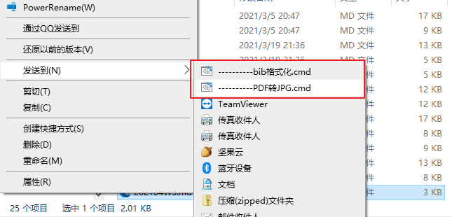

> @Author  : Lewis Tian (taseikyo@gmail.com)
>
> @Link    : github.com/taseikyo
>
> @Range   : 2021-04-18 - 2021-04-24

# Weekly #25

[readme](../README.md) | [previous](202104W2.md) | [next](202104W4.md)

## Table of Contents

- [algorithm](#algorithm-)
- [review](#review-)
- [tip](#tip-)
	- Word 中使用 bib 管理参考文献
	- 右键文件选择发送到 CMD 执行命令
- [share](#share-)

## algorithm [🔝](#weekly-25)

## review [🔝](#weekly-25)

## tip [🔝](#weekly-25)

### 1. [Word 中使用 bib 管理参考文献](https://www.scholat.com/vpost.html?pid=72303)

使用一个名为 [Bibtex4Word](http://www.scholat.com/downloadPostAtt.html?fileid=6610&user=huangkekun) 的宏来进行转换，下载好之后将解压好的 bibtex4word.dot 移到 "%APPDATA%/Microsoft/Word/STARTUP"

然后启动 word 可以看到多了一个 "加载项" tab 页，里面一共大概 6 个按钮。

首先点击打开按钮（Define Bibtex File），加载 bib 文件。然后在想引用文献的位置点击插入按钮（Insert Citation），在弹出的窗口中输入 bib 的关键词。

搞完之后，移动到最后参考文献的章节，点击插入旁边那个有数字的按钮（Insert/Update Bibliography），然后就会自动生成参考文献列表，还是挺方便的。

还可以自定义样式，点击笔刷按钮（Define Bibtex Style），可以输入样式名，注意需要是安装的 LaTeX  支持的样式，比如我安装的 MiKTeX 在 "%SCOOP_GLOBAL%/apps/latex/current/texmfs/install/bibtex/bst/" 目录下有所有样式，也可以自行下载样式放到这个目录，完了之后需要刷新数据库：

```Bash
sudo texhash
```

### 2. 右键文件选择发送到 CMD 执行命令

我也不知道这个 trick 该怎么取名，应该是去年是在知乎看到的，当时没记下来，如今再去搜怎么也搜不到（毕竟也不知道搜什么关键词，另外也不知道当时是在什么问题下看到的），通过摸索还是自行搞定了，目前就两个功能，如下图所示：



第一个会格式化 bib 文件，第二个会将 pdf 转化为 jpg。

具体实现很简单，靠 cmd 和 Python 脚本配合。

首先在资源管理器地址栏输入 "shell:sendto"，打开 SendTo 文件夹，然后新建 cmd 脚本，以 "-----" 取名会使得此脚本在右键菜单中排列靠前，然后循环对每一个参数调用 Python 脚本，这里需要使用 `shift` `goto` 等关键词。

> ----------PDF转JPG.cmd

```Bash
echo off
:parse
IF "%~1"=="" GOTO endparse
python F:/Codes/Python/sendto/pdf2img.py %1
SHIFT
GOTO parse
:endparse
pause
```

而 Python 脚本则来真正实现功能

> pdf2img.py

```Python
import os
import sys
from pdf2image import convert_from_path

if __name__ == '__main__':
    for x in sys.argv[1:]:
        if not x.endswith("pdf"):
            continue
        print(x)
        name, ext = os.path.splitext(x)
        pages = convert_from_path(x, 500)
        for page in pages:
            page.save(f"{name}.jpg", "JPEG")
```

至于为啥不直接把 Python 放到 SenTo 文件夹使得直接运行，试过就知道了，它根本不会出现在右键菜单。

## share [🔝](#weekly-25)

[readme](../README.md) | [previous](202104W2.md) | [next](202104W4.md)
