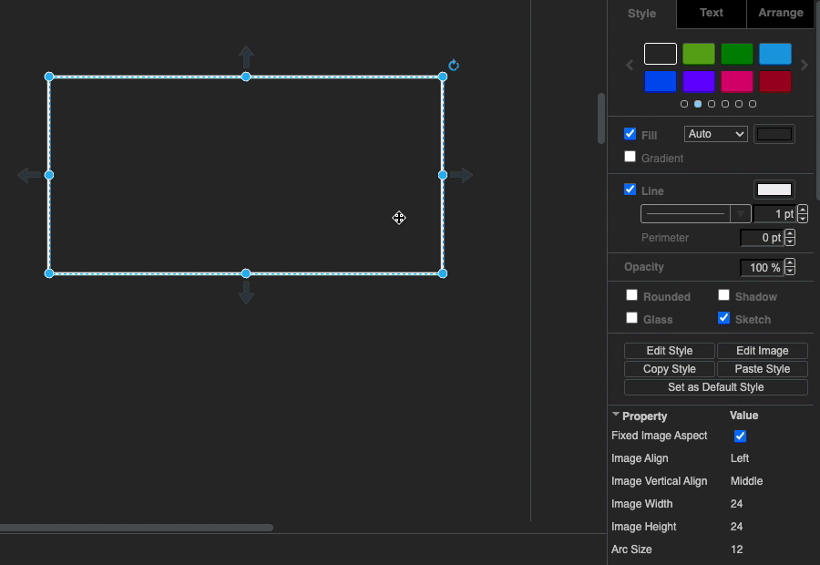

> @Author  : Lewis Tian (taseikyo@gmail.com)
>
> @Link    : github.com/taseikyo
>
> @Range   : 2021-04-18 - 2021-04-24

# Weekly #25

[readme](../README.md) | [previous](202104W2.md) | [next](202104W4.md)

## Table of Contents

- [algorithm](#algorithm-)
- [review](#review-)
    - Python 中的 `...`（three dots）
- [tip](#tip-)
	- Word 中使用 bib 管理参考文献
	- 右键文件选择发送到 CMD 执行命令
	- draw.io 使用形状填充矩形
- [share](#share-)

## algorithm [🔝](#weekly-25)

## review [🔝](#weekly-25)

### 1. [Python 中的 `...`（three dots）](https://pakstech.com/blog/python-ellipsis/)

这篇文章介绍了 `...` 在 Python 中的用法。

文章第一部分我觉得有问题，作者说：Here I am using normal python lists so each dimension needs to be indexed separately

```Python
>>> b = [[1, 2, 3], [4, 5, 6]]
>>> b[:][:]
[[1, 2, 3], [4, 5, 6]]
>>> b[1][:]
[4, 5, 6]
```

我对某个维度不加索引一样可以，比如 `b` `b[1]`

1、在 numpy 中使用

```Python
>>> import numpy as np
>>> c = np.array(b)
>>> c
array([[1, 2, 3],
       [4, 5, 6]])
```

```Python
>>> c[:,:]
array([[1, 2, 3],
       [4, 5, 6]])
>>> c[...]
array([[1, 2, 3],
       [4, 5, 6]])
```

创立一个三维的列表来说明其作用：

```Python
>>> d = np.array([[[i + 2*j + 8*k for i in range(3)] for j in range(3)] for k in range(3)])
>>> d
array([[[ 0,  1,  2],
        [ 2,  3,  4],
        [ 4,  5,  6]],

       [[ 8,  9, 10],
        [10, 11, 12],
        [12, 13, 14]],

       [[16, 17, 18],
        [18, 19, 20],
        [20, 21, 22]]])
```

```Python
>>> d[1,...]
array([[ 8,  9, 10],
       [10, 11, 12],
       [12, 13, 14]])
```

```Python
>>> d[...,1]
array([[ 1,  3,  5],
       [ 9, 11, 13],
       [17, 19, 21]])
```

```Python
>>> d[1,...,1]
array([ 9, 11, 13])
```

不能使用多个省略号：

```Python
>>> d[...,1,...]
Traceback (most recent call last):
  File "<stdin>", line 1, in <module>
IndexError: an index can only have a single ellipsis ('...')
```

在这种情况下，必须在其他维度中使用 `:`

2、类似 pass 的作用（nop）

```Python
def do_something():
    ...

def do_something():
    pass
```

3、在类型注解（type annotation）中使用

这个用法有意思

```Python
async def something(q: str = Query(..., min_length=10))
```

上面是个 FastAPI 中一个类似的函数，参数要求是必选的、如果是 str 类型则打印错误，如果是 int 类型则转化为 int（大概意思是传入 "123"，转化为 123？），然后该参数有个最小长度，至少为 10。

作者解释说将缺省值设置为 `...` 会生成 API 中所需的参数，大概是 `...` 会自动将参数解包？

试了下，确实：

```Python
class Query:
    def __init__(self, qstr: str, min_leng: int = 10):
        self.qstr = qstr
        self.min_leng = min_leng

    def __repr__(self):
        return f"{self.qstr}: {self.min_leng}"


def foo(x=Query(..., 10)):
    print(x)


if __name__ == '__main__':
    foo(Query("15")) # 15: 10
    foo(Query("a", 15)) # a: 15
```

## tip [🔝](#weekly-25)

### 1. [Word 中使用 bib 管理参考文献](https://www.scholat.com/vpost.html?pid=72303)

使用一个名为 [Bibtex4Word](http://www.scholat.com/downloadPostAtt.html?fileid=6610&user=huangkekun) 的宏来进行转换，下载好之后将解压好的 bibtex4word.dot 移到 "%APPDATA%/Microsoft/Word/STARTUP"

然后启动 word 可以看到多了一个 "加载项" tab 页，里面一共大概 6 个按钮。

首先点击打开按钮（Define Bibtex File），加载 bib 文件。然后在想引用文献的位置点击插入按钮（Insert Citation），在弹出的窗口中输入 bib 的关键词。

搞完之后，移动到最后参考文献的章节，点击插入旁边那个有数字的按钮（Insert/Update Bibliography），然后就会自动生成参考文献列表，还是挺方便的。

还可以自定义样式，点击笔刷按钮（Define Bibtex Style），可以输入样式名（比如换成 [hustthesis](https://github.com/hust-latex/hustthesis)），注意需要是安装的 LaTeX  支持的样式，比如我安装的 MiKTeX 在 "%SCOOP_GLOBAL%/apps/latex/current/texmfs/install/bibtex/bst/" 目录下有所有样式，也可以自行下载样式放到这个目录，完了之后需要刷新数据库：

```Bash
sudo texhash
```

更新：可以修改样式为 `hustthesis/^/nsch`

- n，表示强制文献以引用顺序排列，不管选用的样式文件是著者年还是顺序方式的
- s，表示 "sort"，将顺序引用的标记 [2, 4, 1, 3] 整理为 [1, 2, 3, 4]
- c，表示 "compress"，将顺序引用的标记 [1, 2, 3, 4] 压缩为 [1-4]
- h，表示 "hyperlink"（如：plain/h；acm/h），将引用标记与文后文献的对应条目之间建立超链接关系，按住 "ctrl" 键用鼠标左击标记即可跳转至对应的文献条目，返回则是按住 "alt" 键后按一下方向键中的 "left" 键即可
- ^，表示上标引用方式，即 $^{[4]}$ 样式
- [，表示引用标记采用方括号样式，例如 [4-9]
- (，表示引用标记采用圆括号样式，例如（Smith, 2000）

参考：https://www.cnblogs.com/PiaYie/p/14457485.html

### 2. 右键文件选择发送到 CMD 执行命令

我也不知道这个 trick 该怎么取名，应该是去年是在知乎看到的，当时没记下来，如今再去搜怎么也搜不到（毕竟也不知道搜什么关键词，另外也不知道当时是在什么问题下看到的），通过摸索还是自行搞定了，目前就两个功能，如下图所示：


第一个会格式化 bib 文件，第二个会将 pdf 转化为 jpg。

具体实现很简单，靠 cmd 和 Python 脚本配合。

首先在资源管理器地址栏输入 "shell:sendto"，打开 SendTo 文件夹，然后新建 cmd 脚本，以 "-----" 取名会使得此脚本在右键菜单中排列靠前，然后循环对每一个参数调用 Python 脚本，这里需要使用 `shift` `goto` 等关键词。

> ----------PDF转JPG.cmd

```Bash
echo off
:parse
IF "%~1"=="" GOTO endparse
python F:/Codes/Python/sendto/pdf2img.py %1
SHIFT
GOTO parse
:endparse
pause
```

而 Python 脚本则来真正实现功能

> pdf2img.py

```Python
import os
import sys
from pdf2image import convert_from_path

if __name__ == '__main__':
    for x in sys.argv[1:]:
        if not x.endswith("pdf"):
            continue
        print(x)
        name, ext = os.path.splitext(x)
        pages = convert_from_path(x, 500)
        for page in pages:
            page.save(f"{name}.jpg", "JPEG")
```

至于为啥不直接把 Python 放到 SenTo 文件夹使得直接运行，试过就知道了，它根本不会出现在右键菜单。

### 3. draw.io 使用形状填充矩形

- https://github.com/jgraph/drawio/issues/753#issuecomment-733498605

选中矩形 - 勾选 Sketch - 设置 Jiggle 为 0 - 填充（Fill）选择形状



## share [🔝](#weekly-25)

[readme](../README.md) | [previous](202104W2.md) | [next](202104W4.md)
