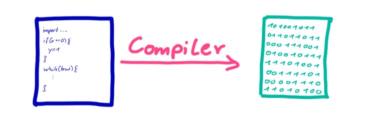
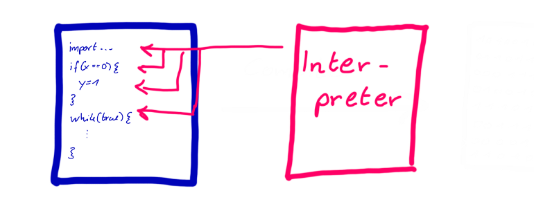
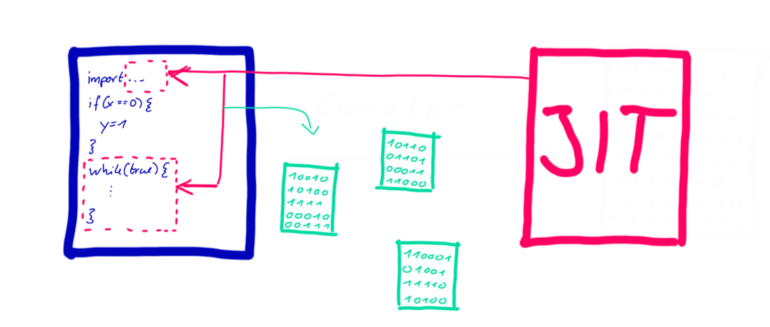

> @Author  : Lewis Tian (taseikyo@gmail.com)
>
> @Link    : github.com/taseikyo
>
> @Range   : 2021-04-25 - 2021-05-01

# Weekly #26

[readme](../README.md) | [previous](202104W3.md) | [next](202104W5.md)

## Table of Contents

- [algorithm](#algorithm-)
- [review](#review-)
    - 像 C 一样快地运行 Python 代码
    - 每个 Python 编程者都应该掌握的 8 个内置函数
- [tip](#tip-)
    - 用谷歌地图（Google Earth）查看 36 年的变迁
    - 支持微信格式的 Markdown 编辑器
    - 解锁 Medium 会员文章
- [share](#share-)

## algorithm [🔝](#weekly-26)

## review [🔝](#weekly-26)

### 1. [像 C 一样快地运行 Python 代码](https://towardsdatascience.com/run-your-python-code-as-fast-as-c-4ae49935a826)

本文介绍了另一个 Python 解释器：pypy。

```Python
import time
from termcolor import colored

start = time.time()
number = 0
for i in range(100000000):
    number += i

print(colored("FINISHED", "green"))
print(f"Ellapsed time: {time.time() - start} s")
```

上面代码，使用默认 Python 解释器需要 9.28 秒，而 pypy 只需要 0.22 秒，这是一个巨大的性能提升。


pypy 提升性能的秘诀是即时编译（just-in-time），简称 JIT 编译

像 C，C++ 这种编译型语言，在运行前需要编译成机器能读懂的二进制代码，这种属于 AOT 编译（ahead-of-time）



\**Ahead-of-Time Compilation converts source files to machine code.*

而解释型语言则是由解释器一行一行解释运行，所以慢



\**An interpreter runs a program line by line.*

Python 的默认解释器叫做 CPython，PyPy 是利用即时编译实现的另一种 Python 解释器。

PyPy 并不是逐行解释代码，而是在执行之前将部分代码编译为机器代码。



\**JIT compilation combines ahead-of-time compilation and interpretation.*

看起来，JIT 编译是逐行解释和提前编译的结合

最重要的是使用 PyPy 不需要修改代码即可运行

### 2. [每个 Python 编程者都应该掌握的 8 个内置函数](https://levelup.gitconnected.com/8-built-in-functions-every-python-programmer-should-know-3552eb768894)

1、`hash(input_object)`

返回对象的哈希值，注意参数必须是不可变对象（immutable object），如 list 就不行

2、`map(function, iterable)`

对可迭代对象中每一个对象调用函数

```Python
def square(n):
    return n * n

num_list = [1,2,3,4]
result = map(square, num_list)
print('Mapped result is: ', list(result))
# Output:
# Mapped result is:  [1, 4, 9, 16]
```

3、`zip(*iterators)`

从函数名来看就是压缩，注意它以最短的迭代对象为准，有 "截断" 作用

```Python
numbers = [1, 2, 3, 4]
letters = ['One', 'Two', 'Three']

result = zip(numbers, letters)

# converting values to print as set
result = set(result)
print('The zipped result is: ', result)
print(list(zip(letters)))
# Output:
# The zipped result is:  {(3, 'Three'), (1, 'One'), (2, 'Two')}
# [('One',), ('Two',), ('Three',)]
```

4、`eval(string)`

能解析字符串的函数：

```Python
result1 = eval('10 + 15')
result2 = eval('3 * 8')

print(result1)
print(result2)
# 25
# 24
```

5、`string.split(separator, maxsplit)`

我很常用的一个函数了，如：`txt.split("#")`

6、`ord(character)`

返回一个字符的 Unicode code：

```python
x = ord('a')
y = ord('$')
z = ord(' ')   #space character

print(x)
print(y)
print(z)
# 97
# 36
# 32
```

7、`dir(object)`

返回对象的所有属性，没用过这个函数，之前好像见过：

```Python
class Student:
  name = "Joy",
  age = 16,
  rollNo = 25

print(dir(Student))
# ['__class__', '__delattr__', '__dict__', '__dir__', '__doc__',
# '__eq__', '__format__', '__ge__', '__getattribute__', '__gt__',
# '__hash__', '__init__', '__init_subclass__', '__le__', '__lt__',
# '__module__', '__ne__', '__new__', '__reduce__', '__reduce_ex__',
# '__repr__', '__setattr__', '__sizeof__', '__str__', '__subclasshook__',
# '__weakref__', 'age', 'name', 'rollNo']
```

8、`pow(num, exp)`

老实说，这个函数没用，`x**y` 它不香吗

```Python
x = pow(2, 3)
y = pow(3, 3)
print(x)
print(y)

# 8
# 27
```

文章一般，竟然还要会员

## tip [🔝](#weekly-26)

### 1. [用谷歌地图（Google Earth）查看 36 年的变迁](https://earthengine.google.com/timelapse)

这好像是谷歌地图出的一个页面，可以查看一个从 1984 年到 2020 年的地貌变化过程，我录了个光谷的 36 年变迁，还是挺震撼的，看着一条条公路和城市的建设，真是从一片荒凉变成现代化商业圈：


然后搜了一下光谷的发展历程：

武汉东湖新技术开发区，简称"东湖高新区"，"东湖开发区"，别称"中国光谷"。

- 1984 年，东湖高新区开始筹建。
- 1988 年，东湖高新区创建成立。
- 1991 年，被国务院批准为首批国家级高新技术产业开发区（面积 24 平方公里）。
- 2000 年，被科技部、外交部批准为 APEC 科技工业园区。
- 2001 年，被原国家计委、科技部批准为国家光电子产业基地，即 "武汉・中国光谷"。
- 2006 年，被科技部列为全国建设世界一流科技园区试点之一；被商务部、信息产业部、科技部确定为国家服务外包基地城市示范区。
- 2007 年，被国家发改委批准为国家生物产业基地。
- 2009 年，被国务院批准为国家自主创新示范区，是全国 17 个国家自主示范区的第二个国家自主创新示范区（北京中关村、武汉东湖、上海张江、深圳、苏南等）。
- 2011 年 4 月，中组部和国务院国资委确定武汉未来成为四家全国 "中央企业集中建设人才基地" 之一（北京、天津、杭州、武汉）。
- 2012 年 5 月，获批东湖国家级文化和科技融合示范基地。
- ...

巧合在于正好是 1984 年开始筹建，有趣。

### 2. [支持微信格式的 Markdown 编辑器](https://devtool.tech/markdown)

一个不错的支持微信公众号的 Markdown 编辑器

- 导出 PDF
- 支持微信外链转脚注
- 微信外链转二维码
- 从 URL 采集 Markdown

编辑好内容可以直接复制然后到微信公众号粘贴，试了下效果还不错。

### 3. 解锁 Medium 会员文章

之前 [weekly#19@tip4](202103W2.md#4-一键解锁-medium-会员文章) 中介绍了一种解锁的方法，但是今天使用的时候出现了一点问题，很多文章解锁不了，试了 5 篇文章，成功了一篇，然后发现了另一种方法。

分享到 twitter，然后从 twitter 的分享链接点进文章就解锁了！

## share [🔝](#weekly-26)

[readme](../README.md) | [previous](202104W3.md) | [next](202104W5.md)
