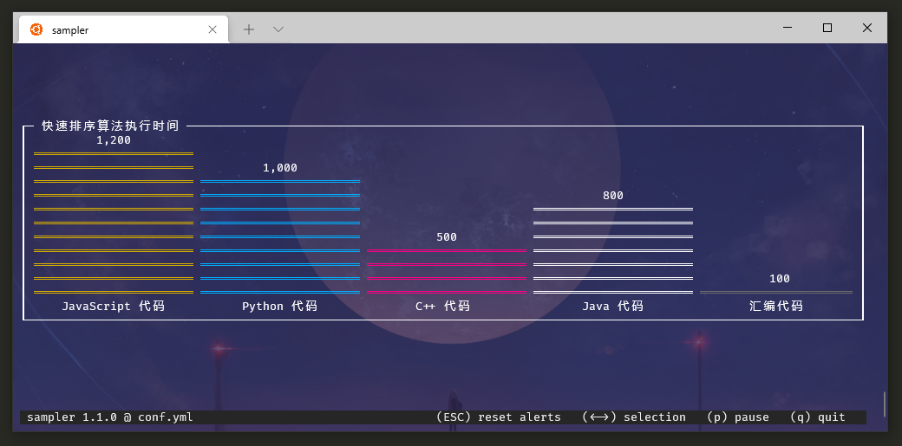

> @Author  : Lewis Tian (taseikyo@gmail.com)
>
> @Link    : github.com/taseikyo
>
> @Range   : 2021-05-16 - 2021-05-22

# Weekly #29

[readme](../README.md) | [previous](202105W2.md) | [next](202105W4.md)

本文总字数 2506 个，阅读时长约：4 分 54 秒，统计数据来自：[算筹字数统计](http://www.xiqei.com/tools?p=tj)。


\**Photo by [Jason Rosewell](https://unsplash.com/@jasonrosewell) on [Unsplash](https://unsplash.com/photos/ASKeuOZqhYU)*

## Table of Contents

- [algorithm](#algorithm-)
- [review](#review-)
    - 下一代图片格式：AVIF
    - Python 3.9 中的 4 个非常有用的新功能（:-1:）
    - 将 Python 脚本抓化为可执行的 EXE 文件（:-1:）
    - 如何将循环转化为列表推导式
    - 如何在 Jupyter Notebook 中写 Golang
- [tip](#tip-)
    - AirPodsPro 声音小的解决办法
    - Git 仓库清理瘦身
    - Shell 命令可视化工具：Sampler
- [share](#share-)
    - 此后如竟没有炬火，我便是唯一的光。

## algorithm [🔝](#weekly-29)

## review [🔝](#weekly-29)

### 1. [下一代图片格式：AVIF](https://darekkay.com/blog/avif-images)

这篇文章介绍了 AVIF（AV1 Image File Format）格式图片，据说是下一代图片格式，压缩率极高，比 webp 还高。

| 格式 | 大小 | 图片 |
|:-:|:-:|:-:|
| JPEG | 30 kB |  |
| WebP | 15 kB |  |
| AVIF | 11 kB | <picture><source type="image/avif" srcset="../images/2021/05/cow.avif" /></picture> |

如果上面第三个图片显示的不是牛，就表示你正在用的浏览器不支持。

比如在我看的时候 Edge 还不支持，换成 Chrome 就好了。

webp 和 avif 格式相对于 jpeg 分别减少了 50% 和 63%。

有几种将其他格式图片换成 AVIF 格式图片的方法：

- [Squoosh](https://squoosh.app/)

很好用的一个图片格式转化网站，我之前用过很多次了，还可以压缩图片，不愧是谷歌出品。

- [Squoosh CLI](https://www.npmjs.com/package/@squoosh/cli)

```Bash
squoosh-cli --avif '{speed: 2}' cow.jpg
```

*speed* 参数越小会使转换速度越慢，但文件大小会更小。

- [ImageMagick](https://imagemagick.org/index.php)

```Bash
convert -quality 75 cow.jpg cow.avif
```

一个渐进式增强（Progressive enhancement）的例子：

截至 2021 年 4 月，WebP 的全球使用率为 93%，AVIF 为 63%。幸运的是，有一个向后兼容的功能，为不支持的浏览器提供一个回退。

```HTML
<picture>
  <source type="image/avif" srcset="cow.avif" />
  <source type="image/webp" srcset="cow.webp" />
  
</picture>
```

浏览器将从上到下匹配格式，并使用它支持的第一个格式。AVIF 被列为第一种格式，因为它提供最好的压缩。

如果浏览器完全不支持 `<picture>`（IE11：你看我干嘛？），所有的 `<source>` 条目将被忽略，JPEG `` 将被作为后备。这就是渐进式增强的一个完美例子。

### 2. [Python 3.9 中的 4 个非常有用的新功能](https://towardsdatascience.com/4-amazingly-useful-additions-in-python-3-9-732115c59c9d)

1、合并字典

这个我之前也提过几次了，就是使用 `|` 运算符，注意顺序：

```Python
dict1 = {'a': 1, 'b': 2}
dict2 = {'b': 3, 'c': 4, 'd': 5}
dict1 | dict2
# {'a': 1, 'b': 3, 'c': 4, 'd': 5}
```

2、更新字典

这就是上一个功能，利用 `|=` 运算符

```Python
dict1 |= dict2
```

3、从字符串中删除前缀

新加的 `removeprefix()` 方法：

```Python
my_str = 'Title: Hello World'
my_str.removeprefix('Title: ')
# World
```

4、从字符串中移除后缀

`removesuffix()` 方法：

```Python
my_str = 'Title: Hello World'
my_str.removesuffix(' Hello World')
# Title:
```

说起来实际就两个功能：更新字典和移除字符串，就这还要会员，垃圾文章。

你内容垃圾就不要设置会员，那样我还好想点，我会把前一期也更新下，再前面就不管了，垃圾的会员文章就加上 GitHub 的大拇指吧：:-1:

### 3. [将 Python 脚本抓化为可执行的 EXE 文件](https://python.plainenglish.io/convert-a-python-project-to-an-executable-exe-file-175080da4485)

主要利用到了这么一个库：[brentvollebregt/auto-py-to-exe](https://github.com/brentvollebregt/auto-py-to-exe)

这玩意是个有界面的程序，可以自行选择脚本位置，是生成一个文件还是文件夹等等，跟 [pyinstaller/pyinstaller](https://github.com/pyinstaller/pyinstaller) 有点类似，不过后者是命令行式的。

### 4. [如何将循环转化为列表推导式](https://towardsdatascience.com/how-to-convert-loops-to-list-comprehension-in-python-15efcc696759)

对于一重循环的转化很简单，但是对于多重就有点麻烦，我之前每次转化两层的时候老搞反了，但其实它就是相当于把几行的公式 "压扁了"。

拿下面的代码为例，直接把两层循环压扁，外层循环在最前面，内存循环其次，条件判断在最后。

```Python
mylist = []
for lst in lst_a:
   for item in lst:
      if item > 3:
         mylist.append(item)
print(mylist)
# [4, 5, 5, 8, 6, 4]

mylist = [item for lst in lst_a for item in lst if item > 3]
```

### 5. [如何在 Jupyter Notebook 中写 Golang](https://levelup.gitconnected.com/running-golang-on-jupyter-notebook-f7f9fba37812)

我之前在 [Weekly12](202101W3.md#1-用-jupyter-编写交互式-go-程序medium) 中记过一次，但那次使用 [yunabe/lgo](https://github.com/yunabe/lgo) 效果很差，交互速度太慢了，于是只能放弃。

这篇文章介绍了另一个内核，[gopherdata/gophernotes](https://github.com/gopherdata/gophernotes)：The Go kernel for Jupyter notebooks and nteract.

按照教程，在 WSL 中手动安装：

```bash
env GO111MODULE=off go get -d -u github.com/gopherdata/gophernotes
cd "$(go env GOPATH)"/src/github.com/gopherdata/gophernotes
env GO111MODULE=on go install
mkdir -p ~/.local/share/jupyter/kernels/gophernotes
cp kernel/* ~/.local/share/jupyter/kernels/gophernotes
cd ~/.local/share/jupyter/kernels/gophernotes
chmod +w ./kernel.json # in case copied kernel.json has no write permission
sed "s|gophernotes|$(go env GOPATH)/bin/gophernotes|" < kernel.json.in > kernel.json
```

测试是否安装成功：

```Bash
"$(go env GOPATH)"/bin/gophernotes

#2021/05/10 16:17:33 Need a command line argument specifying the connection file.
```

然后启动 Jupyter Notebook，新建就会出现 "Go" 选项

这个的速度很快，几乎是秒出，不像之前那个等好几秒才出。

## tip [🔝](#weekly-29)

### 1. AirPodsPro 声音小的解决办法

第二次遇到了，索性做个记录吧，解决方法来自酷安：


### 2. [Git 仓库清理瘦身](https://www.cnblogs.com/bushuosx/archive/2004/01/13/10965485.html)

1、找出大文件或误添加的文件

```Bash
git rev-list --objects --all | grep "$(git verify-pack -v .git/objects/pack/*.idx | sort -k 3 -n | tail -5 | awk '{print $1}')"
```

2、从仓库中删除文件或文件夹

删文件，将 bigfile 换成上面找出的文件名

```Bash
git filter-branch --force --index-filter \
  'git rm --cached --ignore-unmatch "bigfile"' \
  --prune-empty -- --all
```

删文件夹，将 wrongdir 换成上面找出的文件夹

```Bash
git filter-branch --force --index-filter \
  'git rm -r --cached --ignore-unmatch "wrongdir"' \
  --prune-empty -- --all
```

3、删除缓存的对象

这一步可以暂时跳过，等到确认完全不会出现问题之后再执行。（这些缓存对象给你提供了撤销操作的一次机会）。

```Bash
git for-each-ref --format='delete %(refname)' refs/original | git update-ref --stdin
git reflog expire --expire=now --all
git gc --prune=now
```

4、强制更新远程仓库

(这一步执行了，就真没救了。请确认已备份。)

```Bash
git push --force --verbose --dry-run
git push --force
```

### 3. [Shell 命令可视化工具：Sampler](https://github.com/sqshq/sampler)

通过运行实现定义一个 yaml 配置文件来进行可视化

命令：`sampler -c config.yml`

它支持多种图像，在主页有详细介绍。

看了几个例子，发现它的配置文件中 `sample` 后接的是一个命令，那么如果想显示静态柱状图该怎么操作？

我想着既然是要接命令。那直接给个输出常量的命令不就完了？

于是试了下修改它给出的 [Barchart](https://github.com/sqshq/sampler#barchart) 实例：

```YAML
barcharts:
  - title: 快速排序算法执行时间
    items:
      - label: JavaScript 代码
        sample: echo 1200
      - label: Python 代码
        sample: echo 1000
      - label: C++ 代码
        sample: echo 500
      - label: Java 代码
        sample: echo 800
      - label: 汇编代码
        sample: echo 100
```

果然是这样，效果还不错：



## share [🔝](#weekly-29)

### 1. 此后如竟没有炬火，我便是唯一的光。

> 有一分热，发一分光，就令萤火一般，也可以在黑暗里发一点光，不必等候炬火。此后如竟没有炬火，我便是唯一的光。
>
> 倘若有了炬火，出了太阳，我们自然心悦诚服的消失。不但毫无不平，而且还要随喜赞美这炬火或太阳；因为他照了人类，连我都在内。我又愿中国青年都只是向上走，不必理会这冷笑和暗箭。

> 我向来是不惮以最坏的恶意，来推测中国人的，然而我还不料，也不信竟会凶残到这地步。

> "同学们，学校的监控是无时无刻开着的，你们违反校规的事情被看到了就会进行严肃处理！"
>
> "先生对不起，我们这边的监控坏了，没有当天的录像"

[readme](../README.md) | [previous](202105W2.md) | [next](202105W4.md)
