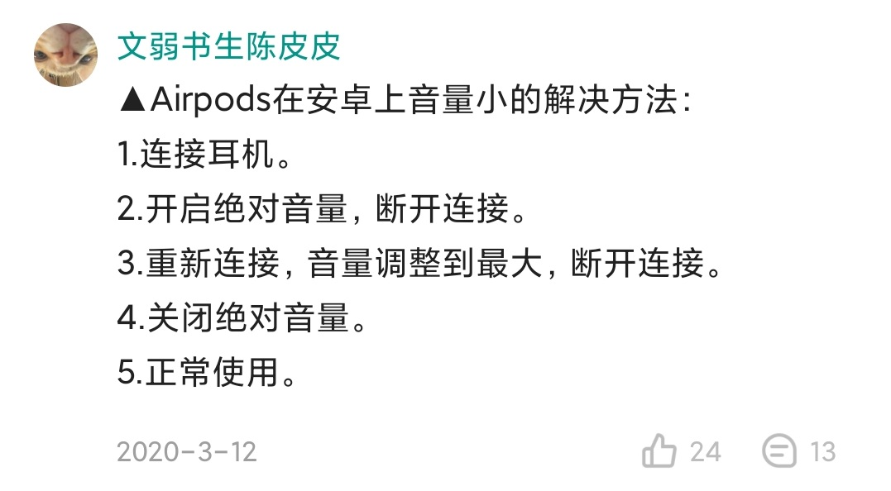

> @Author  : Lewis Tian (taseikyo@gmail.com)
>
> @Link    : github.com/taseikyo
>
> @Range   : 2021-05-16 - 2021-05-22

# Weekly #29

[readme](../README.md) | [previous](202105W2.md) | [next](202105W4.md)

## Table of Contents

- [algorithm](#algorithm-)
- [review](#review-)
- [tip](#tip-)
    - AirPodsPro 声音小的解决办法
- [share](#share-)

## algorithm [🔝](#weekly-29)

## review [🔝](#weekly-29)

## tip [🔝](#weekly-29)

### 1. AirPodsPro 声音小的解决办法

第二次遇到了，索性做个记录吧，解决方法来自酷安：

## share [🔝](#weekly-29)

[readme](../README.md) | [previous](202105W2.md) | [next](202105W4.md)
