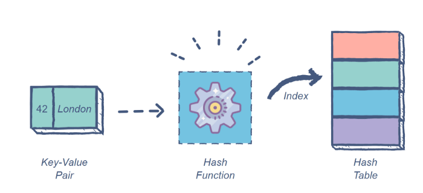

> @Author  : Lewis Tian (taseikyo@gmail.com)
>
> @Link    : github.com/taseikyo
>
> @Range   : 2021-05-30 - 2021-06-05

# Weekly #31

[readme](../README.md) | [previous](202105W4.md) | [next](202106W2.md)


\**Photo by [Aron Yigin](https://unsplash.com/@aronyigin) on [Unsplash](https://unsplash.com/photos/Hnvvtshep3k)*

敢问路在何方？

## Table of Contents

- [algorithm](#algorithm-)
- [review](#review-)
    - Github Action stuck at queue
    - 每个 Python 程序员都应该知道的 8 种数据结构
    - 用 Docker 把你的 Python 脚本变成一个真正的程序
- [tip](#tip-)
    - ffmpeg 常用操作手册
    - Scoop 安装 MySQL
    - 使用 Python 将原图的地理位置抠出来
- [share](#share-)

## algorithm [🔝](#weekly-31)

## review [🔝](#weekly-31)

### 1. [Github Action stuck at queue](https://github.community/t/github-action-stuck-at-queue/16869/141)

在 2021/05/16 晚上我将最新一期的 Weekly push 之后发现并没有正常触发 GitHub Action，状态变成了 *Queen*

随后我发现 `taseikyo/taseikyo` 库的 EveOneCat 表情包也没有更新，点进去看对应的 Action 的状态也是 *Queen*，然后搜到这个

下面很多留言都说是遇到卡住的问题，下面我看到一个留言给出了问题原因，说是 GitHub 出问题了：[Incident with GitHub Actions, API Requests, and GitHub Pages](https://www.githubstatus.com/incidents/zbpwygxwb3gw)

然后我推迟了推送新 tag，毕竟也触发不了对应的 Action (;;)

我在取消的卡住的几个 Action 时把几个之前运行过的 Action 给莫名其妙删了，真烦。

### 2. [每个 Python 程序员都应该知道的 8 种数据结构](https://python.plainenglish.io/8-data-structures-every-python-programmer-should-know-acafd46f479b)

Python 有 4 个内置的数据结构：列表、字典、元组和集合

1、数组（列表）

常见的面试问题：

- 从列表中删除偶数
- 合并两个排序的列表
- 查找列表中的最小值
- 最大和子列表
- 所有元素的乘机（products）

2、队列

Deque 允许创建双端队列，它可以通过 `popleft()` 和 `popright()` 方法访问队列的两端

```Python
from collections import deque
# Initializing a queue
q = deque()
# Adding elements to a queue
q.append('a')
q.append('b')
q.append('c')
print("Initial queue")
print(q)
# Removing elements from a queue
print("\nElements dequeued from the queue")
print(q.popleft())
print(q.popleft())
print(q.popleft())
print("\nQueue after removing elements")
print(q)
# Uncommenting q.popleft()
# will raise an IndexError
# as queue is now empty
```

常见的面试问题：

- 反转队列的前 k 个元素
- 使用链表实现队列
- 使用队列实现栈

3、栈

用 list 实现，push 操作使用 `append()` 方法，pop 操作使用 `pop()`

```Python
stack = []
# append() function to push
# element in the stack
stack.append('a')
stack.append('b')
stack.append('c')
print('Initial stack')
print(stack)
# pop() function to pop
# element from stack in
# LIFO order
print('\nElements popped from stack:')
print(stack.pop())
print(stack.pop())
print(stack.pop())
print('\nStack after elements are popped:')
print(stack)
# uncommenting print(stack.pop())
# will cause an IndexError
# as the stack is now empty
```

常见的面试问题：

- 使用栈实现一个队列
- 使用栈计算后缀表达式
- 使用栈的获取第二大元素
- 使用栈创建 main 函数

4、链表

链表主要用于创建高级数据结构，如图和树，或者用于需要经常在整个结构中添加/删除元素的任务。

```Python
class Node:
    def __init__(self, dataval=None):
        self.dataval = dataval
        self.nextval = None

class SLinkedList:
    def __init__(self):
        self.headval = None

list1 = SLinkedList()
list1.headval = Node("Mon")
e2 = Node("Tue")
e3 = Node("Wed")
# Link first Node to second node
list1.headval.nextval = e2
# Link second Node to third node
e2.nextval = e3
```

常见的面试问题：

- 打印给定链表的中间元素
- 从排序的链表中删除重复的元素
- 检查单链表是否为回文
- 合并 k 排序链表
- 查找两个链表的交点

5、循环链表

标准链表的主要缺点是必须始终从 Head 节点开始。循环链表通过将 Tail 节点的空指针替换为指向 Head 节点的指针来修复这个问题。

这种设置的优点是可以从任何节点开始遍历整个列表。

常见的面试问题：

- 检测链表中的循环
- 反转循环链表
- 以给定大小的组来反转循环链表（Reverse circular linked list in groups of a given size）

6、树

与链表一样，它们由 Node 对象填充，这些对象包含一个数据值和一个或多个指针，用于定义其与直接节点的关系。

二叉树最常见的应用是二叉查找树（BST）

```Python
class Node:
    def __init__(self, data):
        self.left = None
        self.right = None
        self.data = data
    def insert(self, data):
# Compare the new value with the parent node
        if self.data:
            if data < self.data:
                if self.left is None:
                    self.left = Node(data)
                else:
                    self.left.insert(data)
            elif data > self.data:
                if self.right is None:
                    self.right = Node(data)
                else:
                    self.right.insert(data)
        else:
            self.data = data
# Print the tree
    def PrintTree(self):
        if self.left:
            self.left.PrintTree()
        print( self.data),
        if self.right:
            self.right.PrintTree()
# Use the insert method to add nodes
root = Node(12)
root.insert(6)
root.insert(14)
root.insert(3)
root.PrintTree()
```

常见的面试问题：

- 检查两个二叉树是否相同
- 实现二叉树的层次序遍历
- 打印二叉查找树的周长
- 沿着一条路径求所有节点的和
- 连接一个二叉树的所有兄弟节点

7、图

有向图 & 无向图

当用纯文本编写时，图有一个顶点和边的列表：

```Python
V = {a, b, c, d, e}
E = {ab, ac, bd, cd, de}
```

在 Python 中，图最好使用字典来实现，每个顶点的名称作为键，边列表作为值。

```Python
# Create the dictionary with graph elements
graph = {"a": ["b", "c"],
         "b": ["a", "d"],
         "c": ["a", "d"],
         "d": ["e"],
         "e": ["d"]
         }
# Print the graph
print(graph)
```

常见的面试问题：

- 检测有向图中的循环
- 在有向图中查找父节点
- 计算无向图中的边数
- 检查两个顶点之间是否存在路径
- 求两个顶点之间的最短路径

8、哈希表



（这个图画的很棒，于是偷过来了）

```Python
import pprint

class Hashtable:
    def __init__(self, elements):
        self.bucket_size = len(elements)
        self.buckets = [[] for i in range(self.bucket_size)]
        self._assign_buckets(elements)

    def _assign_buckets(self, elements):
        for key, value in elements:  # calculates the hash of each key
            hashed_value = hash(key)
            # positions the element in the bucket using hash
            index = hashed_value % self.bucket_size
            # adds a tuple in the bucket
            self.buckets[index].append((key, value))

    def get_value(self, input_key):
        hashed_value = hash(input_key)
        index = hashed_value % self.bucket_size
        bucket = self.buckets[index]
        for key, value in bucket:
            if key == input_key:
                return(value)
        return None

    def __str__(self):
        # pformat returns a printable representation of the object
        return pprint.pformat(self.buckets)


if __name__ == "__main__":
    capitals = [
        ('France', 'Paris'),
        ('United States', 'Washington D.C.'),
        ('Italy', 'Rome'),
        ('Canada', 'Ottawa')
    ]
    hashtable = Hashtable(capitals)
    print(hashtable)
    print(f"The capital of Italy is {hashtable.get_value('Italy')}")
```

常见的面试问题：

- 不使用内置函数从头构建一个哈希表
- Word formation using a hash table
- 找出两个加起来等于 K 的数字
- 实现冲突处理的开放寻址
- 使用哈希表检测列表是否具有周期性

不错的一篇文章，说是 Python 中的八种数据结构，实际上就是将八种数据结构讲了一遍，然后用 Python 实现，然后每个数据结构讲解完还附带有优缺点（我没贴过来）和面试问题，很不错，比之前那些没营养的会员文章强多了 :)

### 3. [用 Docker 把你的 Python 脚本变成一个真正的程序](https://python.plainenglish.io/turn-your-python-script-into-a-real-program-with-docker-c200e15d5265)

这篇文章教你怎么将一个 Python 脚本 Docker 化，并将 Dockerfile 上传至 DockerHub 以实现分享

看上去是挺简单的，主要就是编写好 Dockerfile，然后运行即可

> src/main.py

```Python
#!/usr/bin/env python3
import logging
import os
import time
import sys
from watchdog.observers import Observer
from watchdog.events import LoggingEventHandler

# load variables from environment variables
verbose = int(os.environ.get('VERBOSE', 1))
directory = os.environ.get('DIRECTORY',  os.path.join('tmp'))

if __name__ == "__main__":
    if verbose:
        logging.basicConfig(stream=sys.stdout, level=logging.INFO)

    event_handler = LoggingEventHandler()

    observer = Observer()
    observer.schedule(event_handler, directory, recursive=True)
    observer.start()

    try:
        while True:
            time.sleep(1)
    finally:
        observer.stop()
        observer.join()
```

> requirements.txt

```
watchdog==2.0.2
```

> Dockerfile

```Dockerfile
# first stage
FROM python:3.8 AS builder
COPY requirements.txt .

# install dependencies to the local user directory (eg. /root/.local)
RUN pip install --user -r requirements.txt

# second stage
FROM python:3.8-slim
WORKDIR /code

# copy only the dependencies that are needed for our application and the source files
COPY --from=builder /root/.local /root/.local
COPY ./src .

# update PATH
ENV PATH=/root/.local:$PATH

# make sure you include the -u flag to have our stdout logged
CMD [ "python", "-u", "./main.py" ]
```

## tip [🔝](#weekly-31)

### 1. [ffmpeg 常用操作手册](https://gist.github.com/steven2358/ba153c642fe2bb1e47485962df07c730)

这个网页收集了 ffmpeg 一些常见操作的命令行，可能初衷跟我之前做的 [FFmpeg Helper](https://github.com/taseikyo/PyQt5-Apps#ffmpeg-helper) 工具相同，只不过我把我常用的命令包装成 GUI 了

### 2. Scoop 安装 MySQL

安装完成之后，root 密码为空，如果不为空可以去安装目录下的 `data/<computer name>.err` 查看（`$SCOOP/apps/mysql/current/data/taseikyo.err`）

至于修改密码则使用命令：

```Bash
mysqladmin -uroot -p<old passwd> password <new passwd>
# 如没有密码，且要设置为 root
mysqladmin -uroot -p password root
```

### 3. 使用 Python 将原图的地理位置抠出来

刷到这篇 UC 文章（[女友加班发自拍，男友用几行代码发现惊天秘密...](https://mp.weixin.qq.com/s/d9lMLp7iJp3cLsrFo1xU4A)）很有意思，于是拿一张图片试了下。

首先需要安装 exifread 库，代码挺垃圾的，需要修改才能使用

```Bash
pip3 install exifread
```

然后使用 exifread 从原图中提取出经纬度，之后利用百度地图的 API 获取详细位置

> [extract_gps_info.py](../code/extract_gps_info.py)

```Python
def process_num(x):
    """
    将 [26, 5, 10243/2000] 转化为 26°5'5.125"
    """
    x_last = eval(str(x[-1]))
    new_x = x[0].num + x[1].num / 60 + x_last / 3600

    return "{:.13f}".format(new_x)


def extract_image(pic_path):
    GPS = {}
    date = ""
    with open(pic_path, "rb") as f:
        tags = exifread.process_file(f)
        date = tags.get("Image DateTime", "0").values
        # 纬度标志
        GPS["GPSLatitudeRef"] = tags.get("GPS GPSLatitudeRef", "0").values
        # 纬度
        GPS["GPSLatitude"] = process_num(tags.get("GPS GPSLatitude", "0").values)
        # 经度标志
        GPS["GPSLongitudeRef"] = tags.get("GPS GPSLongitudeRef", "0").values
        # 经度
        GPS["GPSLongitude"] = process_num(tags.get("GPS GPSLongitude", "0").values)

    return {"GPS_information": GPS, "date_information": date}


def find_address_from_bd(GPS):
    secret_key = "wLyevcXk5QY36hTKmvV5350F"
    if not GPS:
        return "该照片无GPS信息"
    lat, lng = (
        GPS["GPSLatitude"],
        GPS["GPSLongitude"],
    )
    baidu_map_api = (
        f"http://api.map.baidu.com/geocoder/v2/?ak={secret_key}&"
        f"callback=&location={lat},{lng}s&output=json&pois=0"
    )
    r = requests.get(baidu_map_api)
    info = r.json()["result"]

    formatted_address = info["formatted_address"]
    province = info["addressComponent"]["province"]
    city = info["addressComponent"]["city"]
    district = info["addressComponent"]["district"]
    location = info["sematic_description"]
    return formatted_address, province, city, district, location


if __name__ == "__main__":
    data = extract_image("a.jpg")
    info = find_address_from_bd(data)
    print(f"拍摄时间：{data['date_information']}\n照片拍摄地址：{info}")
```

找了张原图，确实拿到了信息：

```
拍摄时间：2021:05:23 18:24:43
照片拍摄地址：('湖北省武汉市洪山区珞喻路933', '湖北省', '武汉市', '洪山区', '华中科技大学内')
```


## share [🔝](#weekly-31)

[readme](../README.md) | [previous](202105W4.md) | [next](202106W2.md)
