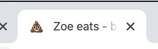
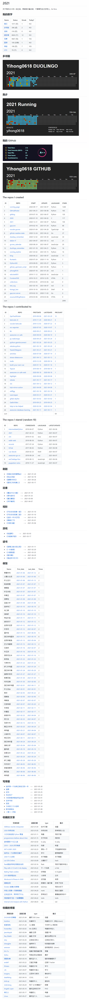

> @Author  : Lewis Tian (taseikyo@gmail.com)
>
> @Link    : github.com/taseikyo
>
> @Range   : 2021-06-13 - 2021-06-19

# Weekly #33

[readme](../README.md) | [previous](202106W2.md) | [next](202106W4.md)

## Table of Contents

- [algorithm](#algorithm-)
- [review](#review-)
    - 了解如何在 jupyter 中编写 Markdown 和 LaTex（Medium）（:-1:）
    - 用 emoji 作为网站的图标/icon（英文）
- [tip](#tip-)
    - Sublime Text 4 设置光标闪烁
    - 如何用一个 GitHub 仓库记录自己的一年（中文）
- [share](#share-)

## algorithm [🔝](#weekly-33)

## review [🔝](#weekly-33)

### 1. [了解如何在 jupyter 中编写 Markdown 和 LaTex（Medium）](https://towardsdatascience.com/write-markdown-latex-in-the-jupyter-notebook-10985edb91fd)

这篇文章主要分成两部分：Markdown 语法 & LaTex 语法，就这还要会员？

我真是信了你的邪...

### 2. [用 emoji 作为网站的图标/icon（英文）](https://css-tricks.com/emojis-as-favicons)

这个 [推文](https://twitter.com/LeaVerou/status/1241619866475474946) 首先（大概）使用了 shit 作为网站的图标，然后引出了本文：



主要代码如下：

```HTML
<svg xmlns="http://w3.org/2000/svg" viewBox="0 0 100 100">
<text y=".9em" font-size="90">💩</text>
</svg>
```

这种方式能成主要是由于浏览器支持 emoji 作为网页的图标，将 emoji 嵌入到 `svg` 的 `<text>` 标签中即可：

```HTML
<link rel="icon" href="data:image/svg+xml,<svg xmlns=%22http://www.w3.org/2000/svg%22 viewBox=%220 0 100 100%22><text y=%22.9em%22 font-size=%2290%22>🎯</text></svg>">
```


## tip [🔝](#weekly-33)

### 1. Sublime Text 4 设置光标闪烁

Scoop 终于可以将 Sublime Text 升级到 4 的版本了，然后发现光标就僵住不动了，搜了一下很简单，在设置里面加入：`"caret_style": "smooth",` 即可。

查看默认设置会发现注释有写到，之前默认值就是 `smooth`，升级之后就变成 `solid` 也即不动了，不知道开发者咋想的。

### 2. [如何用一个 GitHub 仓库记录自己的一年（中文）](https://github.com/yihong0618/gitblog/issues/209)

有人用 GitHub 来存放代码，有人存放瑟图，有人存放些脑残言论，有人则将其功能玩到极致。

这篇文章（issue）便是介绍如何将 GitHub 玩到极致：

- 利用 issue 进行写作
- 利用 label 进行分类（阅读、跑步、观影等等记录）
- 利用 GitHub Action 来进行自动更新 README
- 利用特殊的触发方式分门别类地展示各种 issue 中的信息

下面是作者的 [2021](https://github.com/yihong0618/2021#readme) 总结图，点开查看长图：

<details>
<summary></summary>


</details>

<p></p>

有人说即使谷歌、阿里死了，GitHub 也不会死（[People Die, but Long Live GitHub](https://laike9m.com/blog/people-die-but-long-live-github,122)），于是他将博客托管到 GitHub，以让后人能寻访到他的一丝丝足迹，不至于让他死亡两次（*人有两次死亡，第一次是肉体，第二次是被人忘记。*）

说实话，这篇文章是个不错的想法，我一直认为加上时间 tag 的东西，后来再回头看的时候就会很有意义，我或许会试试。

## share [🔝](#weekly-33)

[readme](../README.md) | [previous](202106W2.md) | [next](202106W4.md)
