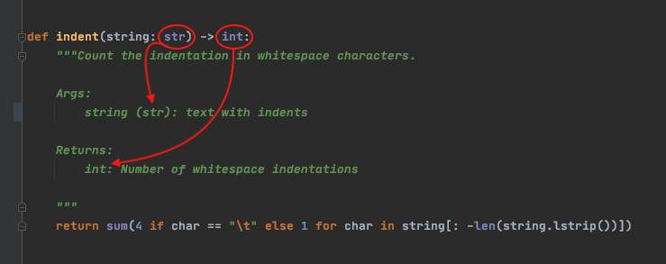

> @Author  : Lewis Tian (taseikyo@gmail.com)
>
> @Link    : github.com/taseikyo
>
> @Range   : 2021-06-20 - 2021-06-26

# Weekly #34

[readme](../README.md) | [previous](202106W3.md) | [next](202107W1.md)

## Table of Contents

- [algorithm](#algorithm-)
- [review](#review-)
    - Python 类型提示与文档注释
- [tip](#tip-)
    - 微软 0x8019001 错误，应用商店无法打开
- [share](#share-)

## algorithm [🔝](#weekly-34)

## review [🔝](#weekly-34)

### 1. [Python 类型提示与文档注释](https://towardsdatascience.com/python-type-hints-docstrings-7ec7f6d3416b)

本文介绍了 Python 3.5 之后加入的类型提示和文档注释。

为什么 3.5 之后加入类型提醒（type-hints）？

类型提示可以从 `typing` 模块导入，格式为：`<variable name> : <variable type>`

类型提示增加了源代码文档和可读性，可以说它本身就是 Python 的增强协议（Enhancement Protocols，PEP）的一部分

下面就是一个例子，虽然不错，但我觉得换行之后再注释更好（强迫症）

类型提示是可选的，因此 Python 解释器会忽略它们，即使是格式错误的类型提示的 Python 代码仍然能运行

但是诸如 PyCharm 之类的 IDE 已经集成了类型检查和静态类型检查工具（如，`mypy`），它们将类型错误作为 bug 进行检查。

由于强迫症的习惯，我也多多少少在代码中加入了类型提示，并在提交代码前会使用如下工具对代码进行格式化检查：

- `black`
- `mypy`
- `isort`
- `flake8`

文章中说道可以使用 Git 提供的 pre-commit hooks 来自动进行代码的格式化，主要是使用 "pre-commit-config.yaml" 配置文件来进行配置，具体做法在另一篇文章中，下次在看吧。

其实手动也挺快的，直接将代码写入 Shell 脚本，然后在 WSL2 中运行即可，也很方便。

## tip [🔝](#weekly-34)

### 1. 微软 0x8019001 错误，应用商店无法打开

这个问题遇到过几次了，要么是打开应用商店（Microsoft Store），要么是登陆账号，那时候会一直转圈，然后报错 0x8019001，搜索一通之后发现方法都不能解决。

最后发现实际上是开着代理的问题，关掉 Clash 的代理设置，然后重新打开应用商店就好了。

## share [🔝](#weekly-34)

[readme](../README.md) | [previous](202106W3.md) | [next](202107W1.md)
