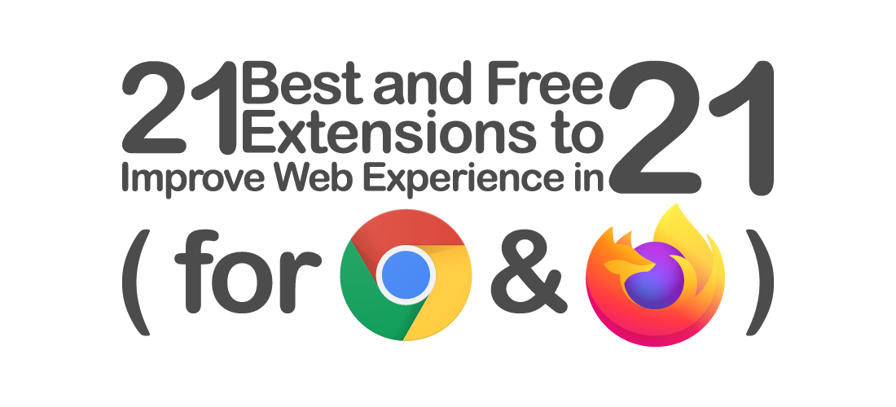

> @Author  : Lewis Tian (taseikyo@gmail.com)
>
> @Link    : github.com/taseikyo
>
> @Range   : 2021-06-20 - 2021-06-26

# Weekly #34

[readme](../README.md) | [previous](202106W3.md) | [next](202107W1.md)

## Table of Contents

- [algorithm](#algorithm-)
- [review](#review-)
    - Python 类型提示与文档注释
    - 21 款很棒的浏览器（Chrome & Firefox）扩展（Medium）
- [tip](#tip-)
    - 微软 0x8019001 错误，应用商店无法打开
    - 将 Chrome 中的缓存数据移出 C 盘（博客园）
- [share](#share-)

## algorithm [🔝](#weekly-34)

## review [🔝](#weekly-34)

### 1. [Python 类型提示与文档注释](https://towardsdatascience.com/python-type-hints-docstrings-7ec7f6d3416b)

本文介绍了 Python 3.5 之后加入的类型提示和文档注释。

为什么 3.5 之后加入类型提醒（type-hints）？

类型提示可以从 `typing` 模块导入，格式为：`<variable name> : <variable type>`

类型提示增加了源代码文档和可读性，可以说它本身就是 Python 的增强协议（Enhancement Protocols，PEP）的一部分

下面就是一个例子，虽然不错，但我觉得换行之后再注释更好（强迫症）

类型提示是可选的，因此 Python 解释器会忽略它们，即使是格式错误的类型提示的 Python 代码仍然能运行

但是诸如 PyCharm 之类的 IDE 已经集成了类型检查和静态类型检查工具（如，`mypy`），它们将类型错误作为 bug 进行检查。

由于强迫症的习惯，我也多多少少在代码中加入了类型提示，并在提交代码前会使用如下工具对代码进行格式化检查：

- `black`
- `mypy`
- `isort`
- `flake8`

文章中说道可以使用 Git 提供的 pre-commit hooks 来自动进行代码的格式化，主要是使用 "pre-commit-config.yaml" 配置文件来进行配置，具体做法在另一篇文章中，下次在看吧。

其实手动也挺快的，直接将代码写入 Shell 脚本，然后在 WSL2 中运行即可，也很方便。

### 2. [ 21 款很棒的浏览器（Chrome & Firefox）扩展（Medium）](https://guillaumehr.medium.com/21-best-free-browser-extensions-for-chrome-and-firefox-to-improve-privacy-productivity-and-web-a8c158d9216b)

1、隐私类

- [uBlock Origin](https://chrome.google.com/webstore/detail/ublock-origin/cjpalhdlnbpafiamejdnhcphjbkeiagm)

大概跟 Adblock Plus 差不多

- [Ninja Cookie](https://chrome.google.com/webstore/detail/ninja-cookie/jifeafcpcjjgnlcnkffmeegehmnmkefl)

看描述是拒绝网站使用 cookie，从而避免弹窗，但是开了 Adblock Plus 我已经很久没看到广告和弹窗了

- [Lastpass](https://chrome.google.com/webstore/detail/lastpass-free-password-ma/hdokiejnpimakedhajhdlcegeplioahd)

我是觉得浏览器自带的密码管理器已经够用了

- [HTTPS Everywhere](https://chrome.google.com/webstore/detail/https-everywhere/gcbommkclmclpchllfjekcdonpmejbdp)

看名字就知道了，自动将 http切换到 https

- [Decentraleyes](https://chrome.google.com/webstore/detail/decentraleyes/ldpochfccmkkmhdbclfhpagapcfdljkj)

没太看懂描述：Decentraleyes "prevents a lot of requests from reaching networks like Google Hosted Libraries, and serves local files to keep sites from breaking".

2、生产力及实用工具

- [Nimbus Screenshot & Screen Video Recorder](https://chrome.google.com/webstore/detail/nimbus-screenshot-screen/bpconcjcammlapcogcnnelfmaeghhagj)

截图以及录制工具，显然有其他替代工具了

- [One Tab](https://chrome.google.com/webstore/detail/onetab/chphlpgkkbolifaimnlloiipkdnihall)

这个好东西必须推荐！

- [FoxClocks](https://chrome.google.com/webstore/detail/foxclocks/obcbigljfpgappaaofailjjoabiikckk)

显示世界各地的时间

- [Evernote](https://chrome.google.com/webstore/detail/evernote-web-clipper/pioclpoplcdbaefihamjohnefbikjilc)

印象笔记的插件，用来一键保存

- [BlockSite](https://chrome.google.com/webstore/detail/blocksite-stay-focused-co/eiimnmioipafcokbfikbljfdeojpcgbh)

屏蔽掉让你分心的网站，提高生产力，真的很 productivity 了

- [Forest](https://chrome.google.com/webstore/detail/forest-stay-focused-be-pr/kjacjjdnoddnpbbcjilcajfhhbdhkpgk)

名为森林，很有趣的一个种树插件，树会逐渐长大，但是你浏览黑名单的网站，树就会死掉

- [Todoist](https://chrome.google.com/webstore/detail/todoist-for-chrome/jldhpllghnbhlbpcmnajkpdmadaolakh)

人物列表，让你有计划的安排

- [Mercury Reader or Tranquility Reader](https://chrome.google.com/webstore/detail/mercury-reader/oknpjjbmpnndlpmnhmekjpocelpnlfdi)

一个阅读器，该插件清理网页，只留下文本和图像，跟简阅很像，但是简阅的功能可能更强大

3、自定义

- [Dark Reader](https://chrome.google.com/webstore/detail/dark-reader/eimadpbcbfnmbkopoojfekhnkhdbieeh)

让网页变成黑色主题

- [Momentum](https://chrome.google.com/webstore/detail/momentum/laookkfknpbbblfpciffpaejjkokdgca)

定制新标签页，我之前用过，感觉一般，默认的其实就行了

4、翻译和字典

关于这类我用的是沙拉翻译，挺好用的，集成了多种接口

- [Mate Translate](https://chrome.google.com/webstore/detail/mate-translate-%E2%80%93-translat/ihmgiclibbndffejedjimfjmfoabpcke)
- [Grammarly](https://chrome.google.com/webstore/detail/grammarly-for-chrome/kbfnbcaeplbcioakkpcpgfkobkghlhen)

5、社交媒体

- [Bitly](https://chrome.google.com/webstore/detail/bitly-powerful-short-link/iabeihobmhlgpkcgjiloemdbofjbdcic)

该插件可以将网址缩短，生成一个短的 URL

- [RiteTag](https://chrome.google.com/webstore/detail/ritetag/hclhpnhohpmlbadmeieecaandnglfodm)

该插件根据颜色来打标签，确实需要一个轻重缓急的顺序，我老把想读但是当前可能没时间的网站都扔到一个 ReadLater 的收藏夹，一段时间之后会积累好多，收藏之后就忘记了是一个很严重的问题

6、搜索引擎优化

- [SEOQuake](https://chrome.google.com/webstore/detail/seoquake/akdgnmcogleenhbclghghlkkdndkjdjc)

SEOQuake 提供具体的指标，如反向链接，流量，关键字难度，页面搜索引擎优化审计

7、游戏

- [Boxel Rebound](https://chrome.google.com/webstore/detail/boxel-rebound/iginnfkhmmfhlkagcmpgofnjhanpmklb)

这是个浏览器内的游戏，作者挺逗的，前面提到专注于生产的扩展，这波放出令人分心的扩展，还说了句：`Are you ready to waste time? :)`

## tip [🔝](#weekly-34)

### 1. 微软 0x8019001 错误，应用商店无法打开

这个问题遇到过几次了，要么是打开应用商店（Microsoft Store），要么是登陆账号，那时候会一直转圈，然后报错 0x8019001，搜索一通之后发现方法都不能解决。

最后发现实际上是开着代理的问题，关掉 Clash 的代理设置，然后重新打开应用商店就好了。

### 2. [将 Chrome 中的缓存数据移出 C 盘（博客园）](https://www.cnblogs.com/vichin/p/10192943.html)

Chrome 浏览器会默认的将用户的缓存是数据存放于  `%LOCALAPPDATA%\Google\Chrome\User Data` 文件夹内。

用久了之后，就会积攒大量缓存数据与 C 盘内。尤其在 Win10 系统 C 盘日益吃紧的前提下，将缓存是数据移至其他盘符很有必要。

1. 进入 `%LOCALAPPDATA%\Google\Chrome`（=`C:\Users\Administrator\AppData\Local\Google\Chrome`，用户是 Administrator）
1. 将 `User Data` 文件剪切到其他盘符，我这是在 D 盘内创建了一个叫做 Chrome 的文件夹。
1. 打开控制台窗口运行 `mklink /j "C:\Users\Administrator\AppData\Local\Google\Chrome\User Data" "D:\chrome\User Data"`

## share [🔝](#weekly-34)

[readme](../README.md) | [previous](202106W3.md) | [next](202107W1.md)
