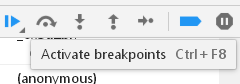
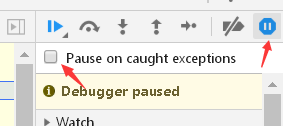
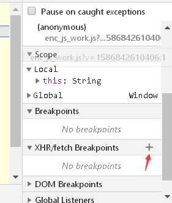
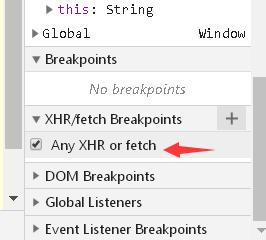

> @Author  : Lewis Tian (taseikyo@gmail.com)
>
> @Link    : github.com/taseikyo
>
> @Range   : 2021-06-27 - 2021-07-03

# Weekly #35

[readme](../README.md) | [previous](202106W4.md) | [next](202107W2.md)

## Table of Contents

- [algorithm](#algorithm-)
- [review](#review-)
- [tip](#tip-)
    - Paused in debugger 解决方法总结
- [share](#share-)

## algorithm [🔝](#weekly-35)

## review [🔝](#weekly-35)

## tip [🔝](#weekly-35)

### 1. [Paused in debugger 解决方法总结](https://www.cnblogs.com/5h4d0w/p/12697701.html)

Paused in debugger 是指按 f12 打开开发者工具后，功能受限的一种情况

1、方法一

多按几次 f8 或者点击图中的蓝色按钮

该按钮的功能是继续执行脚本（resume script execution），因为现在相当于设置了断点。

2、方法一

按 <kbd>ctrl+f8</kbd> 或者点击如下图中的红色箭头所指的按钮，使其变会蓝色。

该按钮功能是使所有断点临时失效（Deactivate breakpoints）

3、方法三

点击下图中的按钮，并保证箭头处没有勾选中。

该按钮的功能是让脚本不要在异常处暂停（Don't Pause on exceptions）

4、方法四

下拉滚动条，找到如图所示的位置，展开，并点击图中的加号。

并按下回车，或者点在输入框外的任意一处空地，出现下图的情况说明步骤正确。

然后，取消勾选状态即可。

`XHR/FETCH BreakPoints` 功能的作用是针对某一个请求或者请求的关键字设置断点，如果设置了 `any XHR or fetch`，并取消勾选，则意味着不监听任何请求或关键字设置的断点。

## share [🔝](#weekly-35)

[readme](../README.md) | [previous](202106W4.md) | [next](202107W2.md)
