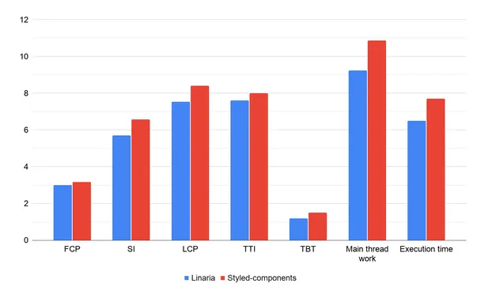
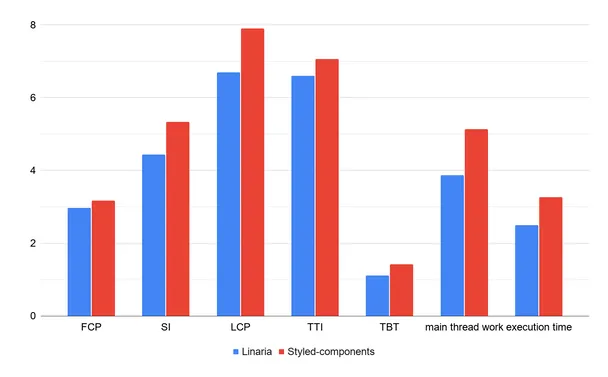
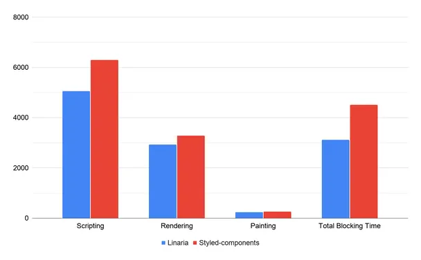
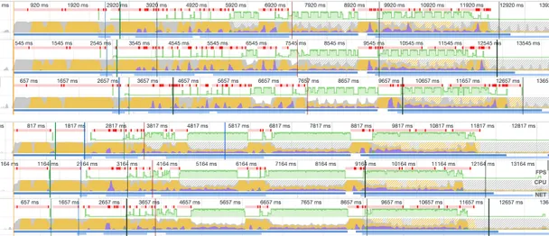
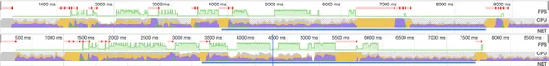

> @Author  : Lewis Tian (taseikyo@gmail.com)
>
> @Link    : github.com/taseikyo
>
> @Range   : 2021-07-04 - 2021-07-10

# Weekly #36

[readme](../README.md) | [previous](202107W1.md) | [next](202107W3.md)

本文总字数 1675 个，阅读时长约：5 分 7 秒，统计数据来自：[算筹字数统计](http://www.xiqei.com/tools?p=tj)。


\**Photo by Unknown on [Sohu](https://www.sohu.com/a/307347824_120113245)*

> 天下熙熙皆为利来，天下攘攘皆为利往 —— 《史记》

## Table of Contents

- [algorithm](#algorithm-)
- [review](#review-)
    - CSS 与 CSS-in-JS 的性能比较（英文）
- [tip](#tip-)
    - 【git】全局配置和单个仓库的用户名邮箱配置
    - 在 MAC 终端下打开 Finder
- [share](#share-)
    - You pay, while I enjoy!

## algorithm [🔝](#weekly-36)

## review [🔝](#weekly-36)

### 1. [CSS 与 CSS-in-JS 的性能比较（英文）](https://pustelto.com/blog/css-vs-css-in-js-perf)

单独写 css，和在 js 中写 css 这其实看个人习惯，有人习惯单独写（比如我），有人喜欢在 js 里面控制，我原来以为这其实都差不太多，实际上它俩性差差异还蛮大的。

TLDR: Don’t use runtime CSS-in-JS if you care about the load performance of your site. ***Simply less JS = Faster Site.***

测试：

- Network (size of the JS and CSS assets, coverage, number of requests)
- Lighthouse audits (performance audit with mobile preset)
- Performance profiling (tests for page load, one for drag and drop interaction)

1、网络比较

Home page network stats comparison

|                          | Styled Component |       Linaria |
|-------------------------:|-----------------:|--------------:|
| Total number of requests |               11 |            13 |
| Total size               |      361kB/1.8MB |   356kB/1.8MB |
| CSS size                 |      2.3kB/7.2kB | 14.7kB/71.5kB |
| No. of CSS requests      |                1 |             3 |
| JS size                  |      322kB/1.8MB |   305kB/1.7MB |
| No. of JS requests       |                6 |             6 |

Search page network stats comparison

|                          | Styled Component |       Linaria |
|-------------------------:|-----------------:|--------------:|
| Total number of requests |               10 |            12 |
| Total size               |      395kB/1.9MB |   391kB/1.9MB |
| CSS size                 |      2.3kB/7.2kB | 16.0kB/70.0kB |
| No. of CSS requests      |                1 |             3 |
| JS size                  |      363kB/1.9MB |   345kB/1.8MB |
| No. of JS requests       |                6 |             6 |

the sum of CSS and JS for [Linaria](https://linaria.dev) is still smaller than the size of the JS itself in Styled Component

2、覆盖范围

Coverage comparison – Home page

|                    | Styled Component | Linaria |
|-------------------:|-----------------:|--------:|
| Size of unused CSS |            6.5kB |  55.6kB |
| Size of unused JS  |            932kB |   915kB |
| Total size         |           938.5k | 970.6kB |

Coverage comparison – Search page

|                    | Styled Component | Linaria |
|-------------------:|-----------------:|--------:|
| Size of unused CSS |            6.3kB |  52.9kB |
| Size of unused JS  |            937kB |   912kB |
| Total size         |           938.5k | 970.6kB |

3、Lighthouse





Linaria 在大多数网络要素中表现得更好（在 CLS 中丢失一次）。有时甚至是很大的差距。例如，LCP 在主页上快 870 毫秒，在搜索页面上快 1.2 秒。使用普通 CSS 渲染页面不仅要快得多，而且还需要更少的资源。阻塞时间和执行所有 JS 所需的时间分别减少了 300 毫秒和大约 1.3 秒。

4、性能分析




使用样式化组件构建的屏幕有更多长时间运行的任务。与 Linaria 变体相比，这些任务也需要更长的时间才能完成。

下面是用样式化组件（上部）和 Linaria（下部）加载主页的性能图表的可视化比较。



5、用户交互的比较

|                     | Styled Component | Linaria |   Diff |
|--------------------:|-----------------:|--------:|-------:|
| Scripting           |             2955 |    2392 | -563ms |
| Rendering           |             3002 |    2525 | -477ms |
| Painting            |              329 |     313 |  -16ms |
| Total Blocking Time |          1862.66 |  994.07 | -868ms |



6、总结

运行时 CSS-in-JS 对网页有明显的影响。主要用于互联网连接较慢或数据较昂贵的低端设备和地区。

作者：下次我开始一个新项目时，我将不再使用运行时 css in-js。我要么使用老式的 CSS，要么使用一些构建时的 CSS in-JS 替代方案，从 JS 包中获取我的样式。

## tip [🔝](#weekly-36)

### 1. [【git】全局配置和单个仓库的用户名邮箱配置](https://blog.csdn.net/QPC908694753/article/details/79237748)

一般使用都会配置一个全局的用户名和邮箱

```Bash
git config --global user.name "taseikyo"
git config --global user.email "taseikyo@gmail.com"
git config --list
```

如果你公司的项目是放在自建的 gitlab 上面，如果你不进行配置用户名和邮箱的话，则会使用全局的，这个时候是错误的，正确的做法是针对公司的项目，在项目根目录下进行单独配置：

```Bash
git config user.name "Lewis Tian"
git config user.email "lewistian@gmail.com"
git config --list
```
`git config --list` 查看当前配置，在当前项目下面查看的配置是全局配置 + 当前项目的配置，使用的时候会优先使用当前项目的配置

### 2. [在 MAC 终端下打开 Finder](https://blog.csdn.net/tiantiandjava/article/details/109804508)

初次使用 Mac，各种不习惯，首先就是没有一个资源管理器（文件管理），也没有一个在当前文件夹打开终端（估计要配置）

还有就是无法在当前路径打开 finder，在 Windows 下直接 `explorer .` 就能打开资源管理器

我甚至直接 `alias e='explorer .'`，所以只需要简单的敲 e 即可

然后也想实现这个方式，搜了一下，Mac 下也能实现：`open .`

## share [🔝](#weekly-36)

### 1. You pay, while I enjoy!

余杭区，五常街道。

由于其中有着阿里巴巴、字节跳动和同花顺等等科技公司，使得其周边的住房在这段时间十分紧俏，即使一些破旧小区扔价高难求。

之前下午看完一个 loft，有点犹豫，晚上想通了再联系的时候就已经没了，僧多粥少就是这样。

更有甚者，不少房东把一间房子拆分、装修成 4 居室、5 居室，只为多租给几个人获得更高的回报。

而开发商也是满足户主，做些所谓的 4 钥匙房，也是为了获取高回报。

而外地来此谋生的各位初期只能忍受这种奇怪的现象，也许后面房源多了、工资涨了会考虑换一个环境/条件好一点的地方，但是受限于一年的租房合同还得花时间找下家，为房东续命，房东则是躺着收钱。

*You work, you pay, and I'm laying and enjoying it!*

[readme](../README.md) | [previous](202107W1.md) | [next](202107W3.md)
