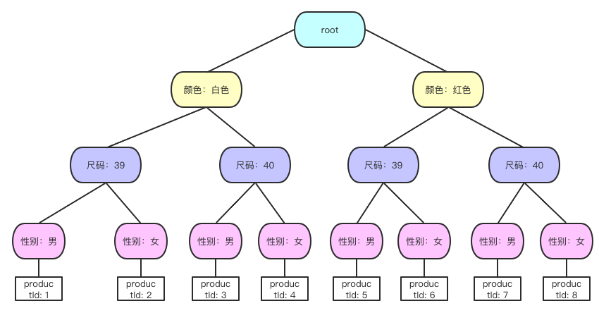

> @Author  : Lewis Tian (taseikyo@gmail.com)
>
> @Link    : github.com/taseikyo
>
> @Range   : 2021-07-25 - 2021-07-31

# Weekly #39

[readme](../README.md) | [previous](202107W4.md) | [next](202108W1.md)

本文总字数 4215 个，阅读时长约：9 分 35 秒，统计数据来自：[算筹字数统计](https://www.zxgj.cn/g/zhishutongji)。


\**Photo by [Violette Filippini](https://unsplash.com/@violettefil) on [Unsplash](https://unsplash.com/photos/VO8FNHLy8SI)*

## Table of Contents

- [algorithm](#algorithm-)
- [review](#review-)
    - 速度提高几百倍，记一次数据结构在实际工作中的运用
    - RPC 和 Restful API 的对比
- [tip](#tip-)
    - 常用正则表达式
- [share](#share-)
    - 知识是个圆，知道的越多，不知道的越多。

## algorithm [🔝](#weekly-39)

## review [🔝](#weekly-39)

### 1. [速度提高几百倍，记一次数据结构在实际工作中的运用](https://www.cnblogs.com/dennisj/p/14030280.html)

作者介绍了他在实际工作中接需求遇到问题并解决问题的过程，我觉得还是挺值得学习的，毕竟之后自己也会接需求，也会遇到种种麻烦，那个时候就得自己发散思维解决问题了

一般国内的购物 APP 都是两层产品选项，如下图所示，一个是颜色，一个是尺码，作者接的需求是要加一层


1、这可能是个伪需求

上面鞋子有 11 种颜色，11 种尺码，意味着这些选项后面对应的是 11 * 11，总共 121 个商品。如果一层选项，假设也有 11 个选项，那对应的商品总共就是 1331 个，好多店铺总共可能都没有这么多。

所以，第三层选项可能是个伪需求，用户并没有那么多选项放在第三层，还是以上面的鞋子为例，除了颜色，尺码外，非要再添一个层级，那只能是性别了，也就是男鞋和女鞋。对于男鞋和女鞋来说，版型，尺码这些很不一样，一般都不会放到一个商品下面，更常用的做法是分成两个商品，各自有自己的颜色和尺码。

2、性能问题

以上面双鞋子为例，从后端 API 拿到的数据：

```js
const merchandise = {
  // variations存放的是所有选项
  variations: [
    {
      name: '颜色',
      values: [
        { name: '限量版574海军蓝' },
        { name: '限量版574白粉' },
        // 下面还有9个
      ]
    },
    {
      name: '尺码',
      values: [
        { name: '38' },
        { name: '39' },
        // 下面还有9个
      ]
    },
  ],
  // products数组存放的是所有商品
  products: [
    {
      id: 1,
      price: 208,
      // 与上面variations的对应关系在每个商品的variationMappings里面
      variationMappings: [
        { name: '颜色', value: '限量版574白粉' },
        { name: '尺码', value: '38'},
      ]
    },
    // 下面还有一百多个产品
  ]
}
```

`merchandise.variations` 是一个数组，有几层选项，这个数组就有几个对象，每个对象的 name 就是当前层级的名字，values 就是当前层级包含的选项，所以 `merchandise.variations` 可以直接拿来显示在 UI 上，将他们按照层级渲染成按钮就行

上面图片中，用户选择了第一层的 **限量版 574 白粉**，第二层的 40，41 等不存在的商品就自动灰掉了

用上面的数据结构可以做到这个功能，当用户选择 **限量版 574 白粉** 的时候，遍历 `merchandise.products` 数组，这个数组的一个项就是一个商品，这个商品上的 `variationMappings` 会有当前商品的颜色和尺码信息

如果这个商品可以卖，它就会在 `merchandise.products` 这个数组里面，否则，她就不在数组中

比如上图的 **限量版 574 白粉**，40 码的组合就不会出现在 `merchandise.products`，查找的时候找不到这个组合，那就会将它变为灰色

对于 **限量版 574 白粉**，40 这个鞋子来说，为了知道它需不需要灰掉，需要整个遍历 `merchandise.products` 这个数组。按照前面说的 11 个颜色，11 个尺码来说，最多查找 121 次

对于两层选项来说，11 * 11 已经算比较多的了，每个尺码百来次运算可能还不会有严重的性能问题。但是如果再加一层选项，新加这层假如也有 11 个可选项（1331），这复杂度瞬间就增加了一个指数，从 $O(n^2)$ 变成 $O(n^3)$！

假如第三层是性别，为了知道 **限量版 574 白粉 - 40 - 男性** 这个商品可不可以卖，需要遍历 1331 个商品，如果遍历 121 个商品需要 20ms，还比较流畅，那遍历 1331 个商品就需要 220ms，这明显可以感觉到卡顿了

3、解决方案

这种指数级的复杂度增长是来自于整个数组的遍历，如果能够找到一个方法不去遍历这个数组，立即就能找到 **限量版 574 白粉 - 40 - 男性** 对应的商品存不存在就好了

这个具体的问题转换一下，其实就是：**在一个数组中，通过特定的过滤条件，查找符合条件的一个项**。现在之所以需要去遍历这个数组，是因为这些查找条件跟商品间没有一个直接的对应关系，如果我能建立一个直接的对应关系，不就可以一下就找到了吗？我想到了：**查找树**

假如重组这些层级关系，将它们组织为一颗树，每个商品都对应树上的一个叶子节点，那么可以将三层选项的查找复杂度从 $O(n^3)$ 降到 $O(1)$

3.1、两层查找树

为了说明白这个算法，先简化这个问题，假设现在有两层选项，颜色和尺码，每层选项有两个可选项：

- 颜色：白色，红色
- 尺码：39，40

对应有 4 个商品：

- 一号商品：productId 为 1，白色，39 码
- 二号商品：productId 为 2，白色，40 码
- 三号商品：productId 为 3，红色，39 码
- 四号商品：productId 为 4，红色，40 码

如果按照最简单的做法，为了查找红色的 39 码鞋子存不存在，需要遍历所有的这四个商品，时间复杂度为 $O(n^2)$

但是如果构建像下面这样一颗树，可以将时间复杂度降到 $O(1)$：


```js
const tree = {
  "颜色：白色": {
    "尺码：39": { productId: 1 },
    "尺码：40": { productId: 2 }
  },
  "颜色：红色": {
    "尺码：39": { productId: 3 },
    "尺码：40": { productId: 4 }
  }
}
```

有了这个数据结构，要查找红色的 39 码直接取值 `tree["颜色：红色"]["尺码：39"]` 就行了，复杂度瞬间就变为 $O(1)$ 了

3.2、三层查找树

理解了上面的两层查找树，要将它扩展到三层就简单了，直接再加一层就行了



```js
const tree = {
  "颜色：白色": {
    "尺码：39": {
        "性别：男": { productId: 1 },
      "性别：女": { productId: 2 },
    },
    "尺码：40": {
        "性别：男": { productId: 3 },
      "性别：女": { productId: 4 },
    }
  },
  "颜色：红色": {
    "尺码：39": {
        "性别：男": { productId: 5 },
      "性别：女": { productId: 6 },
    },
    "尺码：40": {
        "性别：男": { productId: 7 },
      "性别：女": { productId: 8 },
    }
  }
}
```

假如我们要查找一个白色的，39码，男的鞋子，直接 `tree["颜色：白色"]["尺码：39"]["性别：男"]` 就行了，时间复杂度也是 $O(1)$

4、实现 `tree` 结构的构建

API 返回的源数据：

```js
const merchandise = {
  variations: [
    {
      name: '颜色',
      values: [
        { name: '白色' },
        { name: '红色' },
      ]
    },
    {
      name: '尺码',
      values: [
        { name: '39' },
        { name: '40' },
      ]
    },
    {
      name: '性别',
      values: [
        { name: '男' },
        { name: '女' },
      ]
    },
  ],
  products: [
    {
      id: 1,
      variationMappings: [
        { name: '颜色', value: '白色' },
        { name: '尺码', value: '39' },
        { name: '性别', value: '男' }
      ]
    }
    // 下面还有7个商品，我就不重复了
  ]
}
```

```js
function buildTree(apiData) {
  const tree = {};
  const { variations, products } = apiData;

  // 先用variations将树形结构构建出来，叶子节点默认值为null
  addNode(tree, 0);
  function addNode(root, deep) {
    const variationName = variations[deep].name;
    const variationValues = variations[deep].values;

    for (let i = 0; i < variationValues.length; i++) {
      const nodeName = `${variationName}：${variationValues[i].name}`;
      if (deep === 2) {
        root[nodeName] = null
      } else {
        root[nodeName] = {};
        addNode(root[nodeName], deep + 1);
      }
    }
  }

  // 然后遍历一次products给树的叶子节点填上值
  for (let i = 0; i < products.length; i++) {
    const product = products[i];
    const { variationMappings } = product;
    const level1Name = `${variationMappings[0].name}：${variationMappings[0].value}`;
    const level2Name = `${variationMappings[1].name}：${variationMappings[1].value}`;
    const level3Name = `${variationMappings[2].name}：${variationMappings[2].value}`;
    tree[level1Name][level2Name][level3Name] = product;
  }

  // 最后返回构建好的树
  return tree;
}
```

用上面的 API 测试数据运行下看下效果，发现构建出来的树完全符合预期：


5、问题

仔细看下我们构建出来的数据结构，层级关系是固定的，第一层是颜色，第二层是尺码，第三层是性别，而对应的商品是放在第三层性别上的

也就是说使用这个结构，用户必须严格按照，先选颜色，再选尺码，然后我们看看性别这里哪个该灰掉。如果他不按照这个顺序，比如他先选了性别男，然后选尺码 40，这时候我们应该计算最后一个层级颜色哪些该灰掉

但是使用上面这个结构我们是算不出来的，因为我们并没有 `tree["性别：男"]["尺码：40"]` 这个对象

这怎么办呢？我们没有性别-尺码-颜色这种顺序的树，那我们就建一颗呗！这当然是个方法，但是用户还可能有其他的操作顺序呀，如果我们要覆盖用户所有可能的操作顺序，总共需要多少树呢？这其实是性别，尺码，颜色这三个变量的一个全排列，也就是 A33，总共 6 颗树

怎么办呢，有没有偷懒的办法呢？如果我能在需求上动点手脚，是不是可以规避这个问题？带着这个思路，我想到了两点：

1. 给一个默认值

用户打开商品详情页的时候，默认选中第一个可售商品。这样就相当于我们一开始就帮用户按照颜色-尺码-性别这个顺序选中了一个值，给了他一个默认的操作顺序

2. 不提供取消功能，只能切换选项

不提供取消功能，只能通过选择其他选项来切换，只能从红色换成白色，而不能取消红色，其他的一样。这样我们就能永远保证颜色-尺码-性别这个顺序，用户操作只是只是每个层级选中的值不一样，层级顺序并不会变化，我们的查找树就一直有效了


6、封装代码

其实我们这个方案实现本身是比较独立的，其他人要是用的话，他也不关心你里面是棵树还是颗草，只要传入选择条件，能够返回正确的商品就行，所以我们可以将它封装成一个类：

```js
class VariationSearchMap {
    constructor(apiData) {
        this.tree = this.buildTree(apiData);
    }

    // 这就是前面那个构造树的方法
    buildTree(apiData) {
        const tree = {};
        const { variations, products } = apiData;

        // 先用variations将树形结构构建出来，叶子节点默认值为null
        addNode(tree, 0);
        function addNode(root, deep) {
            const variationName = variations[deep].name;
            const variationValues = variations[deep].values;

            for (let i = 0; i < variationValues.length; i++) {
                const nodeName = `${variationName}：${variationValues[i].name}`;
                if (deep === variations.length - 1) {
                    root[nodeName] = null;
                } else {
                    root[nodeName] = {};
                    addNode(root[nodeName], deep + 1);
                }
            }
        }

        // 然后遍历一次products给树的叶子节点填上值
        for (let i = 0; i < products.length; i++) {
            const product = products[i];
            const { variationMappings } = product;
            const level1Name = `${variationMappings[0].name}：${variationMappings[0].value}`;
            const level2Name = `${variationMappings[1].name}：${variationMappings[1].value}`;
            const level3Name = `${variationMappings[2].name}：${variationMappings[2].value}`;
            tree[level1Name][level2Name][level3Name] = product;
        }

        // 最后返回构建好的树
        return tree;
    }

    // 添加一个方法来搜索商品，参数结构和API数据的variationMappings一样
    findProductByVariationMappings(variationMappings) {
        const level1Name = `${variationMappings[0].name}：${variationMappings[0].value}`;
        const level2Name = `${variationMappings[1].name}：${variationMappings[1].value}`;
        const level3Name = `${variationMappings[2].name}：${variationMappings[2].value}`;

        const product = this.tree[level1Name][level2Name][level3Name];

        return product;
    }
}
```

然后使用的时候直接 new 一下就行：

```js
const variationSearchMap = new VariationSearchMap(apiData);    // new一个实例出来

// 然后就可以用这个实例进行搜索了
const searchCriteria = [
    { name: '颜色', value: '红色' },
    { name: '尺码', value: '40' },
    { name: '性别', value: '女' }
];
const matchedProduct = variationSearchMap.findProductByVariationMappings(searchCriteria);
console.log('matchedProduct', matchedProduct);    // { productId: 8 }
```

### 2. [RPC 和 Restful API 的对比](https://www.cnblogs.com/chenqia/p/13432137.html)

1、RESTful API 架构

几个特点为：资源、统一接口、URI 和无状态

1. 资源

所谓"资源"，就是网络上的一个实体，或者说是网络上的一个具体信息。它可以是一段文本、一张图片、一首歌曲、一种服务，就是一个具体的实在

2. 统一接口

REST ful 架构风格规定，数据的元操作，即 CRUD 操作，分别对应于 HTTP 方法：GET 用来获取资源，POST 用来新建资源（也可以用于更新资源），PUT 用来更新资源，DELETE 用来删除资源，这样就统一了数据操作的接口，仅通过 HTTP 方法，就可以完成对数据的所有增删查改工作

3. URL

可以用一个 URI（统一资源定位符）指向资源，即每个 URI 都对应一个特定的资源。要获取这个资源，访问它的 URI 就可以，因此 URI 就成了每一个资源的地址或识别符

4. 无状态

所谓无状态的，即所有的资源，都可以通过 URI 定位，而且这个定位与其他资源无关，也不会因为其他资源的变化而改变。有状态和无状态的区别，举个简单的例子说明一下。

如查询员工的工资，如果查询工资是需要登录系统，进入查询工资的页面，执行相关操作后，获取工资的多少，则这种情况是有状态的。

因为查询工资的每一步操作都依赖于前一步操作，只要前置操作不成功，后续操作就无法执行。

如果输入一个 URI 即可得到指定员工的工资，则这种情况是无状态的，因为获取工资不依赖于其他资源或状态。

且这种情况下，员工工资是一个资源，由一个 URI 与之对应，可以通过 HTTP 中的 GET 方法得到资源，这是典型的 RESTful 风格

2、RPC 和 Restful API 对比

面对对象不同：

- RPC 更侧重于动作
- REST 的主体是资源

RESTful 是面向资源的设计架构，但在系统中有很多对象不能抽象成资源，比如登录，修改密码等

而 RPC 可以通过动作去操作资源，所以在操作的全面性上 RPC 大于 RESTful

传输效率：

RPC 效率更高。RPC，使用自定义的 TCP 协议，可以让请求报文体积更小，或者使用 HTTP2 协议，也可以很好的减少报文的体积，提高传输效率。

复杂度：

- RPC 实现复杂，流程繁琐
- REST 调用及测试都很方便

RPC 实现需要实现编码，序列化，网络传输等，而 RESTful 不要关注这些，RESTful 实现更简单

灵活性：

- HTTP 相对更规范，更标准，更通用，无论哪种语言都支持 HTTP 协议
- RPC 可以实现跨语言调用，但整体灵活性不如 RESTful

3、总结

- RPC 主要用于公司内部的服务调用，性能消耗低，传输效率高，实现复杂
- HTTP 主要用于对外的异构环境，浏览器接口调用，App 接口调用，第三方接口调用等

RPC 使用场景（大型的网站，内部子系统较多、接口非常多的情况下适合使用 RPC）：

- 长链接。不必每次通信都要像 HTTP 一样去 3 次握手，减少了网络开销
- 注册发布机制。RPC 框架一般都有注册中心，有丰富的监控管理；发布、下线接口、动态扩展等，对调用方来说是无感知、统一化的操作。
- 安全性，没有暴露资源操作
- 微服务支持。就是最近流行的服务化架构、服务化治理，RPC 框架是一个强力的支撑

## tip [🔝](#weekly-39)

### 1. [常用正则表达式](https://www.cnblogs.com/yafei236/p/4168290.html)

莫名其妙看到这篇文章，标题是《PHP 正则表达式笔记和实例》，而时间是 2014-12-16 22:44，可能还是 PHP 流行的时候，如今很少有人提及 PHP 了

滑倒文章下面有一节是常用正则表达式，于是索性记下来，语言可能会过失，但是这个玩意不会啊，不管哪种语言都能用，现在直接拿过来：

- 非负整数：`^\d+$`
- 正整数：`^[0-9]*[1-9][0-9]*$`
- 非正整数：`^((-\d+)|(0+))$`
- 负整数：`^-[0-9]*[1-9][0-9]*$`
- 整数：`^-?\d+$`
- 非负浮点数：`^\d+(\.\d+)?$`
- 正浮点数：`^((0-9)+\.[0-9]*[1-9][0-9]*)|([0-9]*[1-9][0-9]*\.[0-9]+)|([0-9]*[1-9][0-9]*))$`
- 非正浮点数：`^((-\d+\.\d+)?)|(0+(\.0+)?))$`
- 负浮点数：`^(-((正浮点数正则式)))$`
- 英文字符串：`^[A-Za-z]+$`
- 英文大写串：`^[A-Z]+$`
- 英文小写串：`^[a-z]+$`
- 英文字符数字串：`^[A-Za-z0-9]+$`
- 英数字加下划线串：`^\w+$`
- E-mail地址：`^[\w-]+(\.[\w-]+)*@[\w-]+(\.[\w-]+)+$`
- URL：`^[a-zA-Z]+://(\w+(-\w+)*)(\.(\w+(-\w+)*))*(\?\s*)?$`
- 邮政编码：`^[1-9]\d{5}$`
- 中文：`^[\u0391-\uFFE5]+$`
- 电话号码：`^((\(\d{2,3}\))|(\d{3}\-))?(\(0\d{2,3}\)|0\d{2,3}-)?[1-9]\d{6,7}(\-\d{1,4})?$`
- 手机号码：`^((\(\d{2,3}\))|(\d{3}\-))?13\d{9}$`
- 双字节字符(包括汉字在内)：`^\x00-\xff`
- 匹配首尾空格：`(^\s*)|(\s*$)`（像vbscript那样的trim函数）
- 匹配HTML标记：`<(.*)>.*<\/\1>|<(.*) \/>`
- 匹配空行：`\n[\s| ]*\r`
- 提取信息中的网络链接：`(h|H)(r|R)(e|E)(f|F) *= *('|")?(\w|\\|\/|\.)+('|"| *|>)?`
- 提取信息中的邮件地址：`\w+([-+.]\w+)*@\w+([-.]\w+)*\.\w+([-.]\w+)*`
- 提取信息中的图片链接：`(s|S)(r|R)(c|C) *= *('|")?(\w|\\|\/|\.)+('|"| *|>)?`
- 提取信息中的IP地址：`(\d+)\.(\d+)\.(\d+)\.(\d+)`
- 提取信息中的中国手机号码：`(86)*0*13\d{9}`
- 提取信息中的中国固定电话号码：`(\(\d{3,4}\)|\d{3,4}-|\s)?\d{8}`
- 提取信息中的中国电话号码（包括移动和固定电话）：`(\(\d{3,4}\)|\d{3,4}-|\s)?\d{7,14}`
- 提取信息中的中国邮政编码：`[1-9]{1}(\d+){5}`
- 提取信息中的浮点数（即小数）：`(-?\d*)\.?\d+`
- 提取信息中的任何数字 ：`(-?\d*)(\.\d+)?`
- IP：`(\d+)\.(\d+)\.(\d+)\.(\d+)`
- 电话区号：`/^0\d{2,3}$/`
- 腾讯 QQ 号：`^[1-9]*[1-9][0-9]*$`
- 帐号(字母开头，允许 5-16 字节，允许字母数字下划线)：`^[a-zA-Z][a-zA-Z0-9_]{4,15}$`
- 中文、英文、数字及下划线：`^[\u4e00-\u9fa5_a-zA-Z0-9]+$`

## share [🔝](#weekly-39)

### 1. 知识是个圆，知道的越多，不知道的越多。

最近在看一本书：《三国史话》，是吕思勉先生写的，写得很不错，我很推荐

之外本科的时候选过一门三国的选修课，在课上知道了很多关于三国的历史（暴露了自己的知识面的贫瘠），另外还知道了一些《三国演义》上的*移花接木*的事，曾经深信不疑的事，竟然是另一个人的所作所为，真是让人哭笑不得。

然后在看过这本书之后又知道了很多，看着吕先生随手拈来各种史书的片段，如《三国志》、《晋书》等等，一方面真的很羡慕，另一方面竟然有想去看看这些书的冲动。

所以说啊，你知道的越多，你会发现你不知道的越多，正如庄子所说，吾生也有涯，而知也无涯 。

另一个点是，可能读越多史书，会越质疑史书，甚至质疑史书的作者（如书中，吕先生就质疑过很多史书的记事，也质疑班固，甚至看不起他，书中原文："其实班固这个人是无甚见识的，根本不配写历史"），可能真的只有你的知识储备到了一定程度才会/敢去这么做，像一般人，谁敢质疑班固这《汉书》的作者。

看了下吕先生的著作：史学代表作品有《白话本国史》《吕著中国通史》《秦汉史》《先秦史》《两晋南北朝史》《隋唐五代史》《吕思勉读史札记》《宋代文学》《先秦学术概论》《中国民族史》《中国制度史》《文字学四种》等。

感觉就是中华上下五千年的历史他都知道，可想而知吕先生读了是多少书...

我以前给自己定的目标是每个月读两本非技术向的书（人文、历史、传记等等），增长见识，拓展知识面，提升人文素养，然而由于种种原因这个计划停滞不前。

现在的话想重拾这个计划，当然可能只能读一本了，但还是希望自己能坚持读书这个爱好，多多吸取古人的经验教训，化作自己的知识，让我的这个圆尽量大一些。

[readme](../README.md) | [previous](202107W4.md) | [next](202108W1.md)
