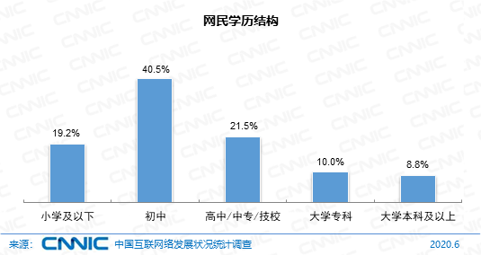

> @Author  : Lewis Tian (taseikyo@gmail.com)
>
> @Link    : github.com/taseikyo
>
> @Range   : 2021-08-01 - 2021-08-07

# Weekly #40

[readme](../README.md) | [previous](202107W5.md) | [next](202108W2.md)

本文总字数 2919 个，阅读时长约：5 分 38 秒，统计数据来自：[算筹字数统计](http://www.xiqei.com/tools?p=tj)。


*Photo by [远扩 王](https://unsplash.com/@potato_wang) on [Unsplash](https://unsplash.com/photos/rl_LJtvv0rI)*

> 山外青山楼外楼，西湖歌舞几时休？暖风熏得游人醉，直把杭州作汴州。 —— 林升《题临安邸》

## Table of Contents

- [algorithm](#algorithm-)
- [review](#review-)
    - Python 3.10 尝鲜
    - Mac 开发环境设置（2021 版）
- [tip](#tip-)
    - 一个 CSS 命令，反转网页颜色
    - pyenv - Python 版本管理器
- [share](#share-)
    - 己所不欲，勿施于人。

## algorithm [🔝](#weekly-40)

## review [🔝](#weekly-40)

### 1. [Python 3.10 尝鲜](https://www.cnblogs.com/dongfangtianyu/p/14713895.html)

1、联合运算符

在 Python 3.10 中， `|` 可以表示 X 类型 或 Y 类型，以取代之前的 `typing.Union` 完成类型注解

旧写法：

```Python
from typing import Union

def f(value: Union[int, str]) -> Union[int, str]:
    return value*2
```

新写法：

```Python
def f(value: int | str) -> int | str:
    return value*2
```

2、多行上下文管理器

```Python
with (
    open("test.txt", "r", encoding="utf-8") as f,  # 打开第一个文件
    open("test_copy.txt", "w", encoding=f.encoding) as f_copy,  # 打开第二个文件
):
    content = f.read()  # 从第一个文件获取内容
    f_copy.write(content)  # 向第二个文件写入内容
```

3、结构模式匹配（Structural Pattern Matching）

实际上就是 `switch...case...`

```Python
today = 1
match  today:
    case 0:
        day = "星期天"
    case 1:
        day = "星期一"
    case 2:
        day = "星期二"
    case 3:
        day = "星期三"
    case 4:
        day = "星期四"
    case 5:
        day = "星期五"
    case 6:
        day = "星期六"
    case _:
        day = "别闹...一个星期只有七天"

print(day)
```

- 从上往下匹配
- 匹配第一个 `case` 后停止
- 如果没有符合条件的匹配，则会执行 `case _`

4、zip 支持长度检查

之前是根据最短的进行截断处理，3.10 中可以传递 `strict=True` 对长度进行严格检查

```Python
for i in zip(name_list, number_list, strict=True):
    print(i)

# ('报警', 110)
# ('急救', 120)
# ('消防', 119)
# Traceback (most recent call last):
#     for i in zip(name_list, number_list, strict=True):
# ValueError: zip() argument 2 is shorter than argument 1
```

### 2. [Mac 开发环境设置（2021 版）](https://www.swyx.io/new-mac-setup-2021)

这篇文章介绍了作者如何设置他的开发环境，如系统设置，软件设置等等，里面当然也有一些我用不上

话说回来，我之前也总结了一篇自己的开发环境总结，不过一部分跟公司有关，不具备完全的通用性

在公司用 Mac，回家用 Windows，没习惯 Mac 反而跟 Windows 搞混了

比如复制 <kbd>cmd + c</kbd>，由于键位的原因，回家之后一不小心就会按成 <kbd>opt + c</kbd>，笑死

## tip [🔝](#weekly-40)

### 1. [一个 CSS 命令，反转网页颜色](https://davidwalsh.name/dark-mode-invert-filter)

如何使用一行 CSS 命令反转网页颜色？

这个似乎跟我之前看到的用 CSS 命令实现竖排文字一样，是个很小众（？）的命令，当然我不是前端，也没资格说这个

反转网页颜色命令如下：

```CSS
html {
  filter: invert(1);
}
```

该博客下面有评论加了点料：

```CSS
html { filter: invert(1) contrast(0.95) saturate(0.5) hue-rotate(180deg);
```

### 2. [pyenv - Python 版本管理器](https://einverne.github.io/post/2017/04/pyenv.html)

1、介绍

[pyenv](https://github.com/yyuu/pyenv) 可以改变全局的 Python 版本，在系统中安装多个版本的 Python， 设置目录级别的 Python 版本，还能创建和管理 virtual python environments。所有的设置都是用户级别的操作，不需要 sudo 命令。

pyenv 通过修改系统环境变量来实现不同 Python 版本的切换。而 virtualenv 通过将 Python 包安装到一个目录来作为 Python 包虚拟环境，通过切换目录来实现不同包环境间的切换。

pyenv 实现的精髓之处在于，它并没有使用将不同的 `$PATH` 植入不同的 shell 这种高耦合的工作方式，而是简单地在 `$PATH` 的最前面插入了一个垫片路径（shims）：`~/.pyenv/shims:/usr/local/bin:/usr/bin:/bin`。所有对 Python 可执行文件的查找都会首先被这个 shims 路径截获，从而使后方的系统路径失效。

使用 `pyenv commands` 显示所有可用命令

pyenv 从源码安装 Python, 每一个安装的版本都会在 pyenv 根目录的 versions 目录下

2、安装与卸载

```Python
pyenv install 2.7.3   # 安装 python
ls ~/.pyenv/versions/
pyenv uninstall 2.7.3 # 卸载 python
rm -rf ~/.pyenv/versions/2.7.3 # 另一种卸载方式
```

3、查看本机安装 Python 版本

```Python
pyenv versions
```

4、查看可安装 Python 版本

```Python
pyenv install -l
```

5、Python 切换

寻找 python 的时候优先级：`shell > local > global`

pyenv 会从当前目录开始向上逐级查找 `.python-version` 文件，直到根目录为止。若找不到，就用 global 版本。

```Python
pyenv global 2.7.3  # 设置全局的 Python 版本，通过将版本号写入 ~/.pyenv/version 文件的方式。
pyenv local 2.7.3 # 设置 Python 本地版本，通过将版本号写入当前目录下的 .python-version 文件的方式。通过这种方式设置的 Python 版本优先级较 global 高。
```

6、pyenv-virtualenv

使用自动安装 pyenv 后，它会自动安装部分插件，通过 `pyenv-virtualenv` 插件可以很好的和 virtualenv 结合：

```Bash
ll ~/.pyenv/plugins
total 24K
drwxr-xr-x 4 einverne einverne 4.0K Apr 22 10:55 pyenv-doctor
drwxr-xr-x 5 einverne einverne 4.0K Apr 22 10:55 pyenv-installer
drwxr-xr-x 4 einverne einverne 4.0K Apr 22 10:55 pyenv-update
drwxr-xr-x 7 einverne einverne 4.0K Apr 22 10:55 pyenv-virtualenv
drwxr-xr-x 4 einverne einverne 4.0K Apr 22 10:55 pyenv-which-ext
drwxr-xr-x 5 einverne einverne 4.0K Apr 22 10:54 python-build
```

7、创建虚拟环境

```Python
pyenv virtualenv 2.7.15 env-name
```

若不指定 python 版本，会默认使用当前环境 python 版本。如果指定 Python 版本，则一定要是已经安装过的版本，否则会出错。环境的真实目录位于 `~/.pyenv/versions` 下

8、列出当前虚拟环境

```Python
pyenv virtualenvs
pyenv activate env-name  # 激活虚拟环境
pyenv deactivate #退出虚拟环境，回到系统环境
```

9、删除虚拟环境

```Python
pyenv uninstall env-name
rm -rf ~/.pyenv/versions/env-name  # 或者删除其真实目录
```

使用 pyenv 来管理 python，使用 pyenv-virtualenv 插件来管理多版本 python 包。此时，还需注意，当我们将项目运行的 env 环境部署到生产环境时，由于我们的 python 包是依赖 python 的，需要注意生产环境的 python 版本问题。

## share [🔝](#weekly-40)

### 1. 己所不欲，勿施于人。

努力成为一个更好的人，做到简单且温柔；

要推己及人，不要**严于律人，宽以待己**，键盘侠真的烦，严重影响冲浪体验；



\**CNNIC 第 46 次调查报告：网民属性结构（本科及以上仅占 8.8%）*

[readme](../README.md) | [previous](202107W5.md) | [next](202108W2.md)
