> @Author  : Lewis Tian (taseikyo@gmail.com)
>
> @Link    : github.com/taseikyo
>
> @Range   : 2021-08-29 - 2021-09-04

# Weekly #44

[readme](../README.md) | [previous](202108W4.md) | [next](202109W2.md)

## Table of Contents

- [algorithm](#algorithm-)
- [review](#review-)
    - Golang 高级技巧
- [tip](#tip-)
    - VS Code 产生的 ipch 文件夹占用 C 盘空间过大处理
    - win10 的 `pagefile.sys` 是什么文件？`pagefile.sys` 文件太大如何移动到 D 盘中？
- [share](#share-)

## algorithm [🔝](#weekly-44)

## review [🔝](#weekly-44)

### 1. [Golang 高级技巧](https://github.com/rfyiamcool/share_ppt#golang%E9%AB%98%E7%BA%A7%E6%8A%80%E5%B7%A7)

还是很有收获的，从开始的代码规范到各种技巧以及各种坑，最后推荐了一些库

我是觉得开始的编码规范是很不错的，值得学习（[golang_tips_rfyiamcool.go](../code/golang_tips_rfyiamcool.go)）：

```golang
// 字段对齐，注释对齐
type User struct {
    Username   string // ⽤户名
    Email      string // 邮箱
    URI        string // 后缀
    API        string // 地址
    IsOpen     bool   // 开放
    CreateTime bool   // 创建时间
}

// Bool使用”判断”语义的前缀
var (
    isExist      bool
    hasConflict  bool
    canManage    bool
    allowGitHook bool
)

type Scheme string

const (
    HTTP  Scheme = "http"
    HTTPS Scheme = "https"
)

// 自定义类型常量, iota从1开始
const (
    ModeAdd = iota + 1
    ModeDel
    ModeUpdate
    ModeUpsert
)
```

## tip [🔝](#weekly-44)

### 1. [VS Code 产生的 ipch 文件夹占用 C 盘空间过大处理](https://blog.csdn.net/qq_41688558/article/details/99085069)

ipch 文件夹是 Intelli Sense（好像是预编译头文件之类的）这个东西产生的缓存文件，占用空间很大！！！

每编译一次文件就会产生 ipch 里对应的一个文件夹。

我看了我的 ipch 文件夹产生了 121 个对应的文件夹，总共产生了 6G 多。。。惊人啊！

在 VSCode 找到设置→扩展→C/C++→Intelli Sense Cache Path。

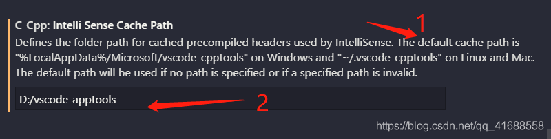

1 处写明了 vscode 默认 Intelli Sense 缓存文件路径是在 C 盘的，2 处可以更改为你要保存缓存文件的位置。据我所知，这些缓存文件删了也不影响的之前的文件的，所以可以随时删，只是每次编译又会重新产生，所以还是把缓存路径改为别的盘吧。

### 2. [win10 的 `pagefile.sys` 是什么文件？`pagefile.sys` 文件太大如何移动到 D 盘中？](https://blog.csdn.net/xrinosvip/article/details/81352823)

在 C 盘系统下，有一个命名为 `pagefile.sys` 的文件占用 C 盘太大的空间，不少用户怕删除 `pagefile.sys` 文件之后会对系统造成影响，而不少用户想要将 `pagefile.sys` 文件移动到 D 盘中。那么 `pagefile.sys` 是什么文件？Win10 系统下 `pagefile.sys` 文件太大如何移动到 D 盘中？

0、`pagefile.sys` 是什么文件？

`pagefile.sys` 文件是操作系统的虚拟内存文件，如果用户经常运行大型程序，建议保留。

1、显示虚拟内存文件 pagefile.sys

1. 大家打开 C 盘，是看不到这个文件的。因为是系统保护和隐藏文件。双重保护起来了。

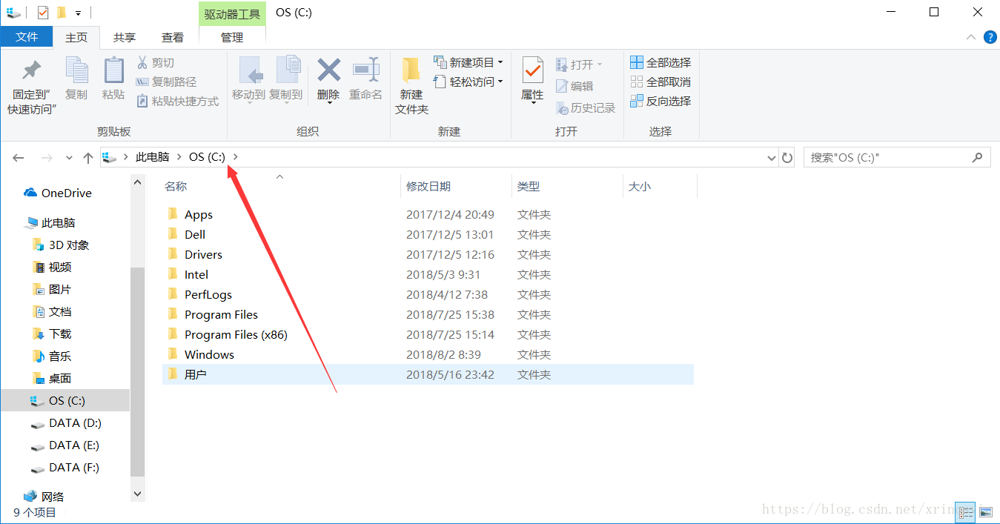

2. 下一步，按图操作：


3. 这时候，就能看到 `pagefile.sys` 文件了

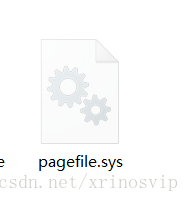

2、D 盘创建虚拟内存文件

1. 点击 此电脑，然后右键打开属性，然后高级系统设置。

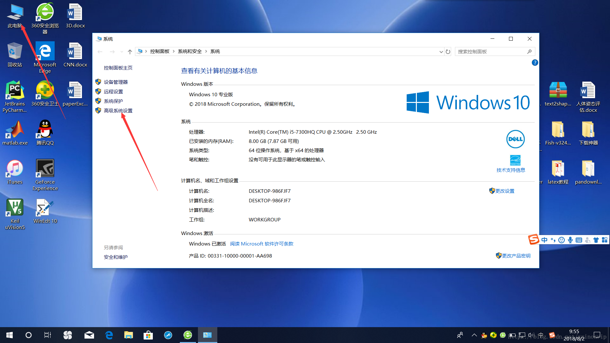

2. 点击 “高级”，然后点击 设置。

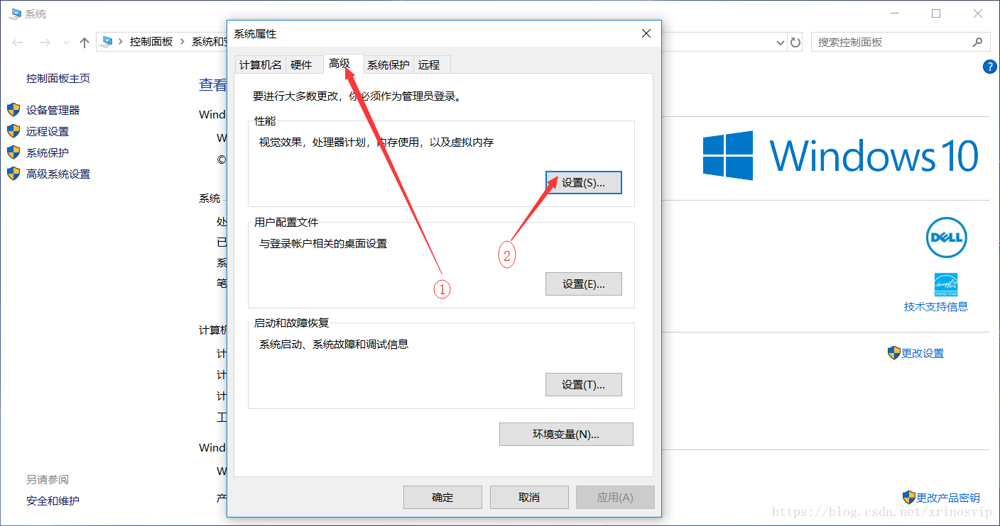

3. 再次点击 “高级”，然后点击 更改。

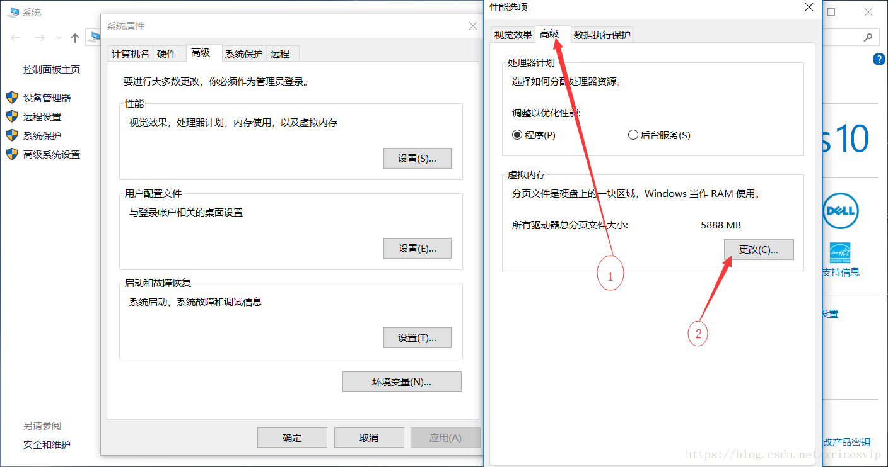

4. 将默认勾选的 “自动管理所有驱动器的分页文件大小” 选项取消；

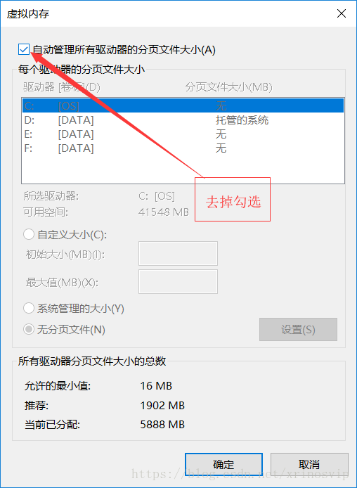

5. 安装图片的顺序一步步弄好，此处创建的 pagefie.sys 文件与 C 盘的类似，自动分配大小，比较省事，

手动分配大小的方法也会给出，二者根据个人喜好选择其中一种就可以

注意：下图中 C 盘 显示为 “无”，是因为我已经配置好后才写的这篇博客，之前忘记截图了，没配置前 C 盘应该显示为 “托管的系统”，D 之所以显示为 “托管的系统”，是因为我已在 D 盘配置好了 pagefile.sys 文件

NOTE: 此处自动虚拟大小的方法：

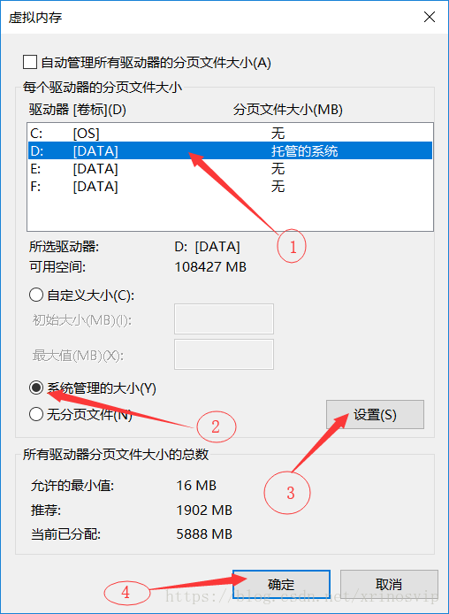

NOTE: 手动分配 pagefile.sys 的方法:

在驱动器中选择 D 盘，选择 “自定义大小”，初始值设为 “16”，最大值设为 “3072”， 大小根据自己的实际情况分配，当然你也可以配的更大些

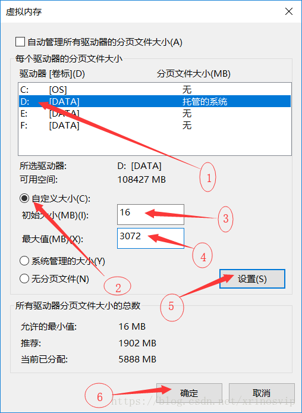

6. 弹出系统报告，点击 “确定” 重启计算机即可，到这步先别 重启，选择 稍后重启，还要对 C 盘的 pagefile.sys 进行配置，这一步也要重启计算机，可以配置完后 再重启

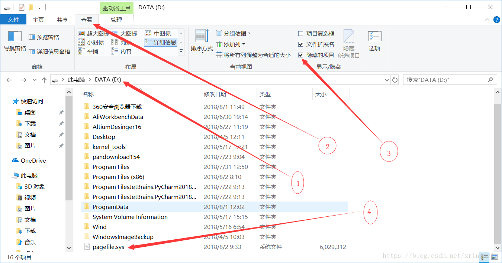

3、修改（删除）C 盘虚拟内存

1. 按照图片中的序号 1 2 3 4，一步一步来。

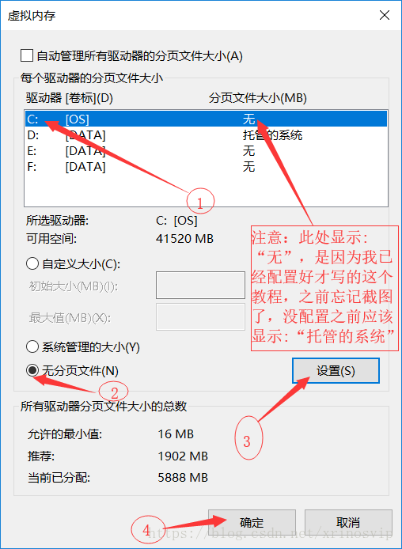

2. 重启电脑，然后开机后，发现 C 盘的虚拟内存文件 pagefile.sys 文件咩有了，C 盘变大了。也就是说成功了。虚拟内存现在变成在了 D 盘了。

4、Reference:

- http://www.lotpc.com/dnzs/7059_2.html
- [win7 系统 pagefile.sys 是什么？如何更改它的大小](http://xinzhi.wenda.so.com/a/1517732530202865)

## share [🔝](#weekly-44)

[readme](../README.md) | [previous](202108W4.md) | [next](202109W2.md)
