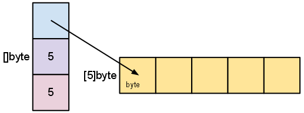

> @Author  : Lewis Tian (taseikyo@gmail.com)
>
> @Link    : github.com/taseikyo
>
> @Range   : 2021-09-19 - 2021-09-25

# Weekly #47

[readme](../README.md) | [previous](202109W3.md) | [next](202109W5.md)

## Table of Contents

- [algorithm](#algorithm-)
- [review](#review-)
    - Go Slices: usage and internals
    - Error handling and Go
    - 用 C 语言编写 Shell
- [tip](#tip-)
- [share](#share-)

## algorithm [🔝](#weekly-47)

## review [🔝](#weekly-47)

### 1. [Go Slices: usage and internals](https://go.dev/blog/slices-intro)

1、数组

go 里面的切片是一种特殊的数组，数组是固定长度的。

声明数组的两种方法：

```golang
b := [2]string{"Penn", "Teller"}
b := [...]string{"Penn", "Teller"}
```

在这两种情况下，b 的类型都是 `[2]string`。

2、切片

切片没有指定的长度，它可以自动扩容。

声明切片：

```golang
letters := []string{"a", "b", "c", "d"}
// 内置的 make 方法
func make([]T, len, cap) []T
```

3、切片的内部构造

切片由指向数组的指针、段的长度及其容量 (段的最大长度) 组成：


当使用 `make([]byte, 5)` 创建时：



当使用切片时 `s = s[2:4]`：


切片不复制切片的数据。它创建一个指向原始数组的新值。这使得切片操作与操作数组索引一样高效。

因此，修改切片的元素会修改原始切片的元素。

这是一篇老早就放到【ReadLater】收藏夹的博客，现在看来很简单，就是介绍了下 slice 的用法和内部结构，不知道当初为啥要收藏？

### 2. [Error handling and Go](https://go.dev/blog/error-handling-and-go)

go 比较有特色的就是错误处理了，像 C 只能返回一个错误码，而 go 可以将返回值和错误一同返回，当然这也是 C 就一个返回值的限制了。

由于引入了这么一个方式，所以 go 代码里面有很多判断返回值中的 err 是否为空，来检查函数是否执行出错，由此也引发出两种写法。

一种是需要使用返回值，这种就需要将函数调用和 err 判空分开写；另一种不需要使用返回值则可以直接放在一行写，就很简洁。

虽然 go 没有像其他语言的 try 代码块，但是这种每次调用函数就检查 err 的写法上逻辑更清晰，一旦错误就进行处理。

像之前写 Python，就是将一大串代码放在 try 里面，我也不知道哪个会执行出错，反正有 except 兜着，写法就很野鸡，当然也没相关开发经验，不知道实际开发时，Python 时如何进行错误处理的。

### 3. [用 C 语言编写 Shell](https://brennan.io/2015/01/16/write-a-Shell-in-c)

- code: https://github.com/brenns10/lsh

1、Shell 的生命周期

Shell 在其生命周期中主要做三件事：初始化、翻译和终止。

初始化会读取并执行配置文件，接下来 Shell 从 `stdin` 读取命令并执行它们，在命令执行之后，Shell 执行任何关闭命令，释放任何内存，并终止。

这些步骤非常通用，可以应用于许多程序，但是我们将把它们作为 Shell 的基础。我们的 Shell 将非常简单，不会有任何配置文件，也不会有任何 shutdown 命令。因此，我们只需调用循环函数，然后终止。但是在体系结构方面，重要的是要记住，程序的生命周期不仅仅是循环。

```C
int main(int argc, char **argv)
{
  // Load config files, if any.

  // Run command loop.
  lsh_loop();

  // Perform any shutdown/cleanup.

  return EXIT_SUCCESS;
}
```

2、Shell 的基本循环

一个简单的处理命令的方法有三个步骤:

- 从标准输入读取命令
- 将命令字符串分离为可执行程序和参数
- 执行命令

```C
void lsh_loop(void)
{
  char *line;
  char **args;
  int status;

  do {
    printf("> ");
    line = lsh_read_line();
    args = lsh_split_line(line);
    status = lsh_execute(args);

    free(line);
    free(args);
  } while (status);
}
```

2.1、读取一行输入

从 stdin 中读取一行听起来很简单，但是在 c 语言中可能会很麻烦。你事先并不知道用户会在 shell 中输入多少文本。因此你需要从一个块开始，如果他们超过了这个块，就重新分配更多的空间，这是 c 语言中常用的策略。

```C
#define LSH_RL_BUFSIZE 1024
char *lsh_read_line(void)
{
  int bufsize = LSH_RL_BUFSIZE;
  int position = 0;
  char *buffer = malloc(sizeof(char) * bufsize);
  int c;

  if (!buffer) {
    fprintf(stderr, "lsh: allocation error\n");
    exit(EXIT_FAILURE);
  }

  while (1) {
    // Read a character
    c = getchar();

    // If we hit EOF, replace it with a null character and return.
    if (c == EOF || c == '\n') {
      buffer[position] = '\0';
      return buffer;
    } else {
      buffer[position] = c;
    }
    position++;

    // If we have exceeded the buffer, reallocate.
    if (position >= bufsize) {
      bufsize += LSH_RL_BUFSIZE;
      buffer = realloc(buffer, bufsize);
      if (!buffer) {
        fprintf(stderr, "lsh: allocation error\n");
        exit(EXIT_FAILURE);
      }
    }
  }
}
```

在循环中，读取一个字符，并将其存储为 int，而不是 char，EOF 是整数，不是字符，如果要检查它，需要使用 int。这是初学者常犯的错误。

如果它是换行符，或者 EOF，我们使用 null 结束当前的字符串并返回它。否则，我们将字符添加到现有的字符串中。

实际上 stdio.h 中有一个 `getline()` 函数，它完成了上面大部分工作。这个函数是 c 库的 GNU 扩展，直到 2008 年才被添加到规范中，所以大多数现代 unix 系统现在都应该有这个函数。

使用 getline，函数变得更简单：

```C
char *lsh_read_line(void)
{
  char *line = NULL;
  ssize_t bufsize = 0; // have getline allocate a buffer for us

  if (getline(&line, &bufsize, stdin) == -1){
    if (feof(stdin)) {
      exit(EXIT_SUCCESS);  // We recieved an EOF
    } else  {
      perror("readline");
      exit(EXIT_FAILURE);
    }
  }

  return line;
}
```

2.2、解析

```C
#define LSH_TOK_BUFSIZE 64
#define LSH_TOK_DELIM " \t\r\n\a"
char **lsh_split_line(char *line)
{
  int bufsize = LSH_TOK_BUFSIZE, position = 0;
  char **tokens = malloc(bufsize * sizeof(char*));
  char *token;

  if (!tokens) {
    fprintf(stderr, "lsh: allocation error\n");
    exit(EXIT_FAILURE);
  }

  token = strtok(line, LSH_TOK_DELIM);
  while (token != NULL) {
    tokens[position] = token;
    position++;

    if (position >= bufsize) {
      bufsize += LSH_TOK_BUFSIZE;
      tokens = realloc(tokens, bufsize * sizeof(char*));
      if (!tokens) {
        fprintf(stderr, "lsh: allocation error\n");
        exit(EXIT_FAILURE);
      }
    }

    token = strtok(NULL, LSH_TOK_DELIM);
  }
  tokens[position] = NULL;
  return tokens;
}
```

2.3、Shell 是如何启动进程的

在 Unix 上启动进程只有两种方式。第一个是 Init。当一台 Unix 计算机引导时，它的内核就被加载了。加载和初始化后，内核只启动一个进程，称为 Init。这个进程在计算机打开的整个时间段内运行，并且它管理加载计算机有用所需的其余进程。

由于大多数程序都不是 Init，因此只有一种实用的方法可以启动进程: fork 系统调用。

通常，当你想要运行一个新进程时，你不只是想要同一个程序的另一个副本 —— 你想要运行一个不同的程序。这就是 exec 系统调用的全部内容。它用一个全新的程序替换当前的运行程序。这意味着，当你调用 exec 时，操作系统将停止你的进程，加载新程序，并在其位置启动该程序。进程从不从 exec 调用返回 (除非有错误)。

有了这两个系统调用，我们就有了在 Unix 上如何运行大多数程序的构建模块。首先，一个现有的进程将自己分割成两个独立的进程。然后，子程序使用 exec 将自己替换为一个新程序。父进程可以继续做其他事情，甚至可以使用系统调用 wait 来监视其子进程。

```C
int lsh_launch(char **args)
{
  pid_t pid, wpid;
  int status;

  pid = fork();
  if (pid == 0) {
    // Child process
    if (execvp(args[0], args) == -1) {
      perror("lsh");
    }
    exit(EXIT_FAILURE);
  } else if (pid < 0) {
    // Error forking
    perror("lsh");
  } else {
    // Parent process
    do {
      wpid = waitpid(pid, &status, WUNTRACED);
    } while (!WIFEXITED(status) && !WIFSIGNALED(status));
  }

  return 1;
}
```

2.4、Shell 内置命令

您可能已经注意到 lsh_loop 函数调用 lsh_execute，但是在上面，我们将函数命名为 lsh_launch。这是故意的，shell 执行的大多数命令都是程序，它们中的一些是内置命令。

如果要更改目录，则需要使用函数 chdir，如果你写了一个叫做 cd 的程序改变了目录，它只会改变自己的工作目录，并不会修改当前的目录。

```C
/*
  Function Declarations for builtin shell commands:
 */
int lsh_cd(char **args);
int lsh_help(char **args);
int lsh_exit(char **args);

/*
  List of builtin commands, followed by their corresponding functions.
 */
char *builtin_str[] = {
  "cd",
  "help",
  "exit"
};

int (*builtin_func[]) (char **) = {
  &lsh_cd,
  &lsh_help,
  &lsh_exit
};

int lsh_num_builtins() {
  return sizeof(builtin_str) / sizeof(char *);
}

/*
  Builtin function implementations.
*/
int lsh_cd(char **args)
{
  if (args[1] == NULL) {
    fprintf(stderr, "lsh: expected argument to \"cd\"\n");
  } else {
    if (chdir(args[1]) != 0) {
      perror("lsh");
    }
  }
  return 1;
}

int lsh_help(char **args)
{
  int i;
  printf("Stephen Brennan's LSH\n");
  printf("Type program names and arguments, and hit enter.\n");
  printf("The following are built in:\n");

  for (i = 0; i < lsh_num_builtins(); i++) {
    printf("  %s\n", builtin_str[i]);
  }

  printf("Use the man command for information on other programs.\n");
  return 1;
}

int lsh_exit(char **args)
{
  return 0;
}
```

2.5、组装内置命令和程序

最后一个缺失部分是实现 lsh_execute，这个函数将启动一个内建函数或一个进程

```C
int lsh_execute(char **args)
{
  int i;

  if (args[0] == NULL) {
    // An empty command was entered.
    return 1;
  }

  for (i = 0; i < lsh_num_builtins(); i++) {
    if (strcmp(args[0], builtin_str[i]) == 0) {
      return (*builtin_func[i])(args);
    }
  }

  return lsh_launch(args);
}
```

3、Putting it all together

代码在开头已经贴出来了

## tip [🔝](#weekly-47)

## share [🔝](#weekly-47)

[readme](../README.md) | [previous](202109W3.md) | [next](202109W5.md)
