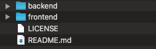
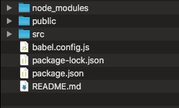
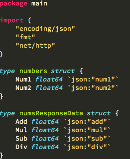
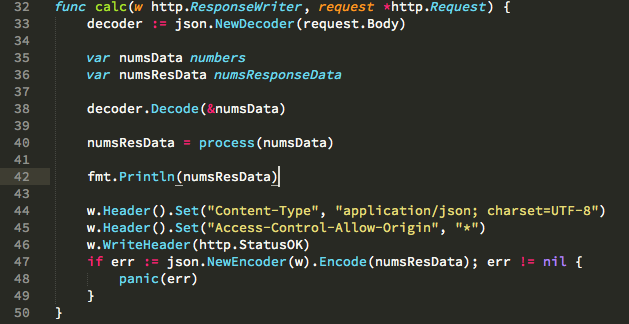
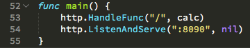
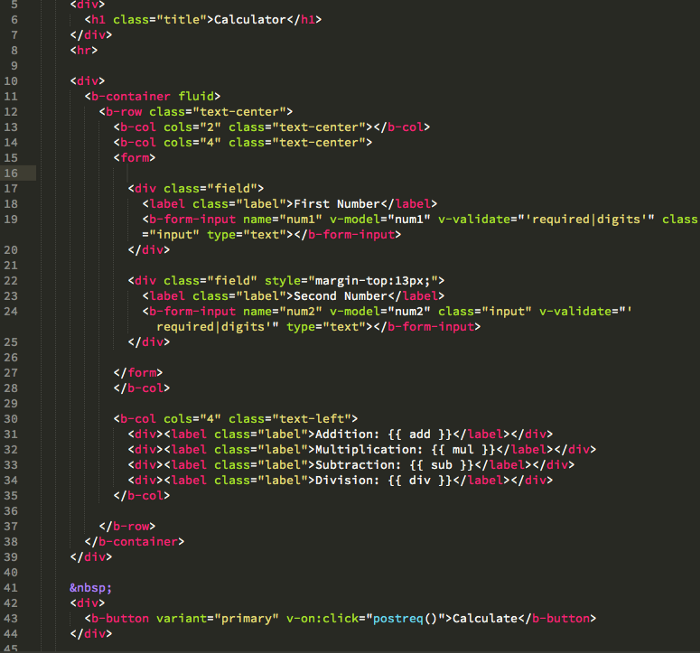
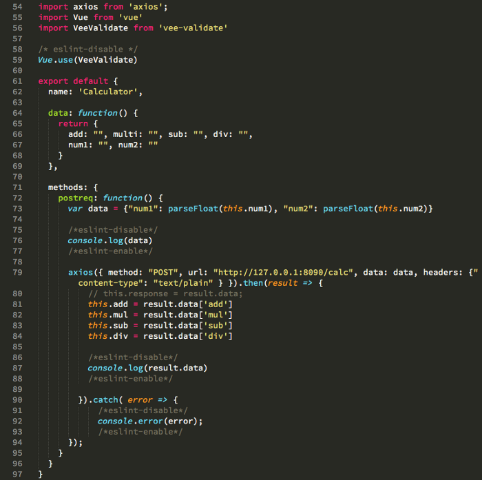

> @Author  : Lewis Tian (taseikyo@gmail.com)
>
> @Link    : github.com/taseikyo
>
> @Range   : 2021-09-26 - 2021-10-02

# Weekly #48

[readme](../README.md) | [previous](202109W4.md) | [next](202110W2.md)

本文总字数 1260 个，阅读时长约：2 分 27 秒，统计数据来自：[算筹字数统计](http://www.xiqei.com/tools?p=tj)。


\**Photo by [Jonatan Pie](https://unsplash.com/@r3dmax) on [Unsplash](https://unsplash.com/photos/toqpSEsw_Aw)*

## Table of Contents

- [algorithm](#algorithm-)
- [review](#review-)
    - Python 和 Golang 选哪个
    - Golang 实战：Vue.js + Golang
- [tip](#tip-)
- [share](#share-)
    - 节假日到底何去何从

## algorithm [🔝](#weekly-48)

## review [🔝](#weekly-48)

### 1. [Python 和 Golang 选哪个](https://dzone.com/articles/golang-vs-python-which-one-to-choose)

1、性能

很显然，Golang 比 Python 好，一个编译型语言，一个解释型语言，根本没法打吧

2、可扩展性

Python 并不支持并发，它只是通过多线程来实现并行

Golang 具有内置支持并发的进程通道

3、应用

这个方面各有优势，Python 被广泛地用于数据分析、人工智能、深度学习以及 Web 开发，而 Golang 更多的用于系统编程以及云计算和集群计算领域

4、库

这个方面显然 Python 更占优势，各种库层出不穷

5、可读性

这个看开发者的编程和命名等习惯，如果命名很规范，其实注释都不需要，最好的注释事自注释的，看了变量名和函数名就大致知道其作用，所以我觉得这一点与语言无关

### 2. [Golang 实战：Vue.js + Golang](https://adeshg7.medium.com/vuejs-golang-a-rare-combination-53538b6fb918)

1、初始化项目目录



在 backend 文件夹创建一个 `server.go` 文件

前端部分，在命令行输入以下命令来创建一个新的 app 应用：

```Bash
$ vue create calculator
```

完成之后的目录结构如下：



2、构建后端

定义 JSON 类型的数据结构如下：



我们需要写一个方法，当使用 POST 方法发送 JSON 格式的请求时，这个方法能够被执行。



第 33 行，我们定义了一个 JSON 的译码器来转译从请求的实体中的传过来的 JSON 数据。

`numsData` 和 `numsResData` 是定义好的数据结构。

接收的数据存储在 `numsData` 中 并且在 38 行被转译。

然后我们设置 ResponseWriter 的 header 头部，并且在 47 行返回 JSON 格式的响应数据以及检查错误。

最后，在这个主函数上，我们可以定义 HTTP 路由，例如 53 行为每个 URL 请求分别定义响应函数。后端服务将运行在 8090 端口上。



完整代码：[server.go](../code/vue_golang_server.go)

3、构建前端

进入前端目录安装依赖：

```Bash
$ npm install --save bootstrap-vue Bootstrap axios vee-validate
```

使用 `axios` 来处理 POST 请求，使用 `vee-validate` 校验表单的输入数据，使用 bootstrap-vue 构建界面

在 `src/Calculator.vue` 文件里编写前端部分代码



从 17 行到 25 行，我们定义 input 输入框和 label 标签来获取数据。在 Vue 中使用 `v-model` 指令获取数据

30-35 行完成 UI 层的展示，并且 43 行定义了一个按钮，将会被触发 `postreq` 方法，这个方法会在接下来完成



54-59 行引入了 `axios` 和 `vee-validate`。然后在 64-69 行我们定义一些变量，这些 data 变量用来存储计算器组件的变量的值。

所有的函数都会定义在 methods 对象里。我们创建 `postreq()` 方法用来向 `http://localhost:8090/calc` 发送 JSON 格式的 POST 请求。还记得之前在 `server.go` 文件创建的 calc 方法吗？我们发送 JSON 数据后，后端返回结果后数据会被储存在 add，mul，sub 和 div 等变量中，这些绑定在 HTML 的变量例如 `{{add}}` 的占位符将会显示结果。

注意：

- 使用 Golang 写服务端逻辑并且运行在单独的端口上
- 构建代码结构来处理 JSON 数据，你不能将它们存储在变量中
- 前端的 Vuejs 会使用 GET 或 POST 请求来调用服务端的 API 接口

4、运行

启动后端服务可以使用以下命令，它将运行在 8090 端口上：

```Bash
$ go run server.go
```

运行前端可以使用：

```Bash
$ npm run serve
```

完整代码：https://github.com/adesgautam/Calculator


## tip [🔝](#weekly-48)

## share [🔝](#weekly-48)

### 1. 节假日到底何去何从

好不容易到了放假，大家都想出去玩，结果好玩的景点都是人，最后变成了去看人而不是玩

但是呆在家又很无聊，有种浪费假期的感觉。但是也没好去处，最后也只能灰溜溜回家

还挺希望到处走走看看，可惜平时没时间，放假又赶不上趟

所以，节假日该何去何从

[readme](../README.md) | [previous](202109W4.md) | [next](202110W2.md)
