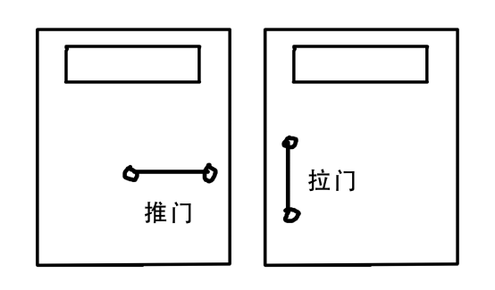
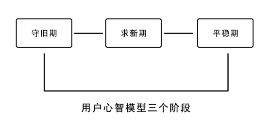

> @Author  : Lewis Tian (taseikyo@gmail.com)
>
> @Link    : github.com/taseikyo
>
> @Range   : 2021-10-17 - 2021-10-23

# Weekly #51

[readme](../README.md) | [previous](202110W3.md) | [next](202110W5.md)

## Table of Contents

- [algorithm](#algorithm-)
- [review](#review-)
    - 用户心智模型：你该懂得的三个策略阶段
- [tip](#tip-)
- [share](#share-)
    - 买断 V.S. 租赁

## algorithm [🔝](#weekly-51)

## review [🔝](#weekly-51)

### 1. [用户心智模型：你该懂得的三个策略阶段](http://www.woshipm.com/pmd/826143.html)

用户心智模型往往不仅只是关系到产品好用与否，大的说更关系到产品生与死。在分析用户心智之前，先通过一张图来直观感受下用户心智。

从上面这幅图中你看到了什么？

图中两扇门，在开门的方式上存在着不同。由于门把手的放置不同，用户在操作上存在不同方式，左边的门，用户会下意识的去推门，而右边的门用户则会下意识的去拉门，而这一切的引导皆来自用户的心智。

> 心智模型 (Mental Model) 概念已经被广泛应用到很多领域。这个概念最早是 Kenneth Craik 在他 1943 出版的《TheNature of Explanation》中提到。但这个概念的再次采用和真正形成是在上个世纪 80 年代，Johnson Laird 在 1983 年提出心智模型是描述人类如何解决问题，如何进行演绎推理的思维模式。Gentner 和 StevenS 则认为心智模型用来解释了人类处理问题时的所呈现的物理规律，是用来分析人类行为的物理原理。

**心理学上，心智即是指人们对已知事物的沉淀和储存，通过生物反应而实现动因的一种能力总和。“心智模型” 就是隐藏在你一切行为方式、思考方式背后的那些形式和规律。心智模型是认识事物的方法和习惯，在有限的领域知识和有限的信息处理能力上，产生合理的解释。**

综合来说：心智模型是一种代表外在现实事物的一种内化的心理模型表征，是一种隐含在我们内心深处的思维方式和思想观念，能够直接或者间接影响着我们的行为。心智模型之所以对我们的所作所为具有巨大影响力是因为它影响我们如何认知周遭世界，并影响我们如何采取行动。

心智影响着用户对他所使用的产品的相关行为，正如图例中门把手的不同的放置方式，在用户对门把手的使用习惯下，用户会下意识的辨别门把手的使用方式。而这种符合用户心智模型的设计，用户使用起来就会觉得自然与顺畅。

个人认为在用户心智模型中会有三个不同的阶段，不同的阶段会影响到产品的相应设计策略。如下图所示，三个阶段依次是守旧期，求新期和平稳期。

守旧期：由于人天生具有对固有事物的保守态度，人本能地认为熟悉的事物是安全的，心理学认为人的安全感来自对外界的掌握，所以在心智模型中反映出来的则是人的守旧期阶段。这在历史变革进程中，能得到很好的证明，保守派总会认为祖宗流传下来的就是安全的好的，而认为革新是危险的。

当用户习惯于原本的产品时，迁移到新产品上时会有诸多抵触，例如在电商刚刚发展之初，人们习惯于线下购物场景，产品可立马触碰到，真实地感受到，可以深度体验产品好坏以及一手交钱一手拿货的安全感。因此，人们最初由于线上购物场景与他们过往的心智模型不匹配，会显现出不安全感与抵触。

求新期：好奇心害死猫。人类的好奇与求知欲也是与生俱来的。因此，在对旧事物的保守中，总会有人试图去突破，这些人的心智模型是对旧事物与习惯感到厌倦，需要新鲜的事物来刺激神经。新的好玩的，有趣的事物会带给用户不同的体验。

歌手选秀节目发展至今也有不少年头了，但是今年夏天《中国有嘻哈》异军突起，正是人们对于千篇一律的歌手选秀节目的厌倦与疲劳，新的非主流类的嘻哈音乐让观众为之一新，加之一些营销活动，造就了《中国有嘻哈》燃爆的节目效果。

平稳期：当一个产品或事物度过用户求新阶段，被人们所普遍接受后，便进入了平稳期。在平稳期，用户心智达到对新事物的习惯，慢慢会把它习以为常。

例如，微信作为一款熟人社交软件，它建立起人与人沟通的新桥梁，人们已在日常生活中习惯了它的存在，在与想要联系的人沟通时会习惯性的使用起微信。平稳期用户心智阶段，正是人们通过不断适应达到成熟与习以为常的时期。

了解用户心智模型的三个阶段，有助于我们在产品设计中，针对不同时期的用户心智设计出符合用户心智模型的产品与体验。这对我们在产品的不同阶段调整产品设计策略具有很大帮助。当电子书刚面向用户时，由于人们长期使用纸质书的习惯，在读书的过程中有个习以为常的翻书习惯，因此翻书的动作在用户心智中是稳定的。而电子书由于是新产品，它的使用习惯是不同于纸质书的，为了在用户求新的过程中减少用户使用成本，把翻书的交互动作迁移到电子书上，是符合用户心智模型的，更能被用户所接受与习惯。但是，当用户习惯了移动电子设备上平滑图文的翻阅方式以后，翻书的交互动作又会显得比较繁琐，因此现在许多读书软件翻页的交互并不再模拟翻书而是更简洁的平滑动作。

从上面这个案例可知，从守旧期到求新期，一个好的用户心智模型的迁移往往更能适应大多数用户的使用习惯，降低用户使用的成本。

## tip [🔝](#weekly-51)

## share [🔝](#weekly-51)

### 1. 买断 V.S. 租赁

买断和租赁是两种不同的售卖策略，前一种是直接卖给你，你直接拥有使用权；后者则有时间限制，在范围内你拥有使用权，过期之后则没了，如果想继续使用，则继续租，有时候选择更多决定于经济实力吧。

我一直都更偏向于前者，更喜欢买下来直接拥有。最近是因为打喋血复仇，由于 steam 上原价太高，于是转向 xbox 的一种租赁会员制（XGP），买了一个月来玩。总的来说体验还行，由于是首次开通，所以也不贵，另外 XGP 包含一套游戏，除了上面说的喋血复仇还有很多，只不过平时没时间玩。

[readme](../README.md) | [previous](202110W3.md) | [next](202110W5.md)
