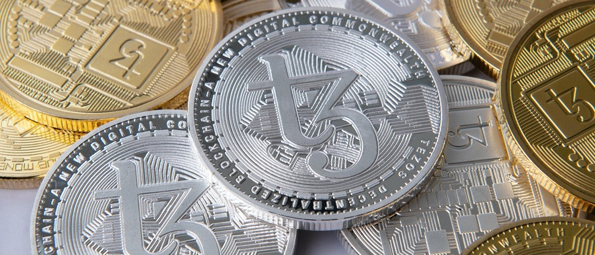
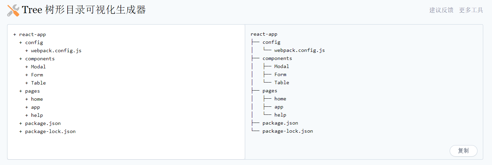

> @Author  : Lewis Tian (taseikyo@gmail.com)
>
> @Link    : github.com/taseikyo
>
> @Range   : 2021-11-07 - 2021-11-13

# Weekly #54

[readme](../README.md) | [previous](202111W1.md) | [next](202111W3.md)

本文总字数 1688 个，阅读时长约：1 分 44 秒，统计数据来自：[算筹字数统计](http://www.xiqei.com/tools?p=tj)。



*Photo by [Tezos](https://unsplash.com/@tezos) on [Unsplash](https://unsplash.com/photos/a6FNOYGWj6k)*

## Table of Contents

- [algorithm](#algorithm-)
- [review](#review-)
- [tip](#tip-)
    - 用 curl 计时（英文）
    - Tree 树形目录可视化生成器
- [share](#share-)
    - 天上不会掉馅饼

## algorithm [🔝](#weekly-54)

## review [🔝](#weekly-54)

## tip [🔝](#weekly-54)

### 1. [用 curl 计时（英文）](https://susam.in/maze/timing-with-curl.html)

```bash
curl -L -w "time_namelookup: %{time_namelookup}
time_connect: %{time_connect}
time_appconnect: %{time_appconnect}
time_pretransfer: %{time_pretransfer}
time_redirect: %{time_redirect}
time_starttransfer: %{time_starttransfer}
time_total: %{time_total}
" https://example.com/
```

```bash
curl -L -w "time_namelookup: %{time_namelookup}\ntime_connect: %{time_connect}\ntime_appconnect: %{time_appconnect}\ntime_pretransfer: %{time_pretransfer}\ntime_redirect: %{time_redirect}\ntime_starttransfer: %{time_starttransfer}\ntime_total: %{time_total}\n" https://example.com/
```

```bash
$ curl -L -w "namelookup: %{time_namelookup}\nconnect: %{time_connect}\nappconnect: %{time_appconnect}\npretransfer: %{time_pretransfer}\nstarttransfer: %{time_starttransfer}\ntotal: %{time_total}\n" https://example.com/
<!DOCTYPE HTML PUBLIC "-//W3C//DTD HTML 4.01 Transitional//EN">
<html>
...
</html>
time_namelookup: 0.001403
time_connect: 0.245464
time_appconnect: 0.757656
time_pretransfer: 0.757823
time_redirect: 0.000000
time_starttransfer: 0.982111
time_total: 0.982326
```

### 2. [Tree 树形目录可视化生成器](https://devtool.tech/tree)

很方便的一个网站，用于 Markdown 展示目录，示意图：



上图中，左边是你自己输入的，然后右边就是生成的，复制就完事了。

## share [🔝](#weekly-54)

### 1. 天上不会掉馅饼

晚上吃饭的时候接到一个电话，是个小姐姐，说是宣传防诈骗的，因为最近很多人被骗，然后上门宣传的时候我不在家（绝大部分时间我都不在家，能碰到算是运气好），于是打电话来做宣传。

问了很多几个问题，说不要再网上轻信他人，提高安全意识。

说起来，我是一直不太懂被骗的人是怎么想的，怎么会相信有天上掉馅饼的好事，再想想，好事别人怎么会想到你？你是他的谁？他又是你的谁？

所以啊，我一直觉得能被骗是挺怪的事，说活该有点不近人情，只能说自己太蠢吧

正如习大大所说，天上不会掉馅饼，努力奋斗才能梦想成真。

### 那年今日

- [Weekly #2](202011W2.md)

[readme](../README.md) | [previous](202111W1.md) | [next](202111W3.md)
