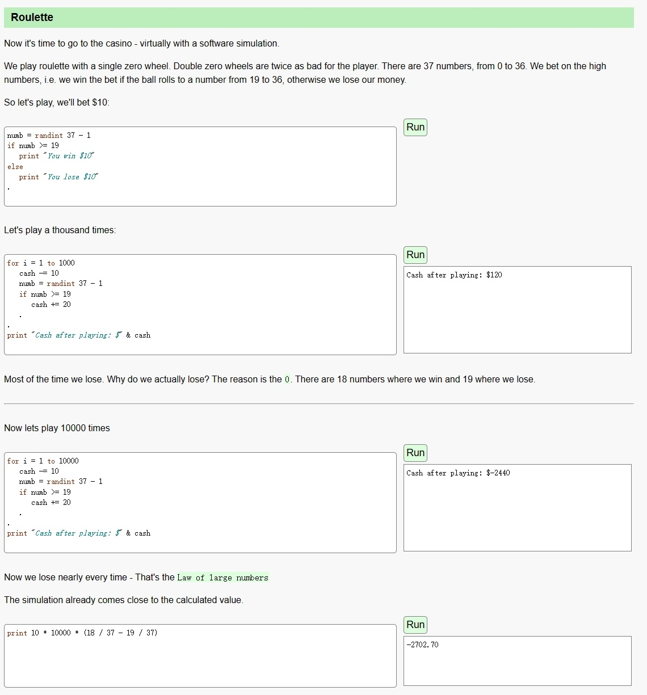
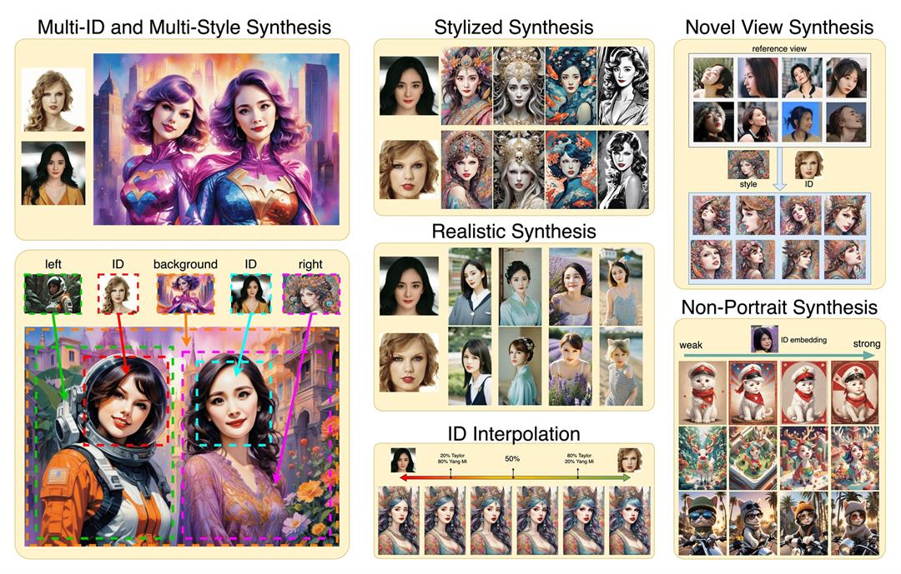

> @Author  : Lewis Tian (taseikyo@gmail.com)
>
> @Link    : github.com/taseikyo
>
> @Range   : 2024-03-31 - 2024-04-06

# Weekly #57

[readme](../README.md) | [previous](202111W4.md) | [next](202404W2.md)

\**Photo by [Elena Mozhvilo](https://unsplash.com/@miracleday) on [Unsplash](https://unsplash.com/photos/a-table-topped-with-candles-and-cards-next-to-a-potted-plant-UKNVIsA2i_E)*

> 时来天地皆同力，运去英雄不自由。 —— 罗隐《筹笔驿》

## Table of Contents

- [algorithm](#algorithm-)
- [review](#review-)
    - 为什么去赌场是个坏主意（英文）
    - 高德地图官方首度揭秘：红绿灯倒计时功能是如何实现的？
- [tip](#tip-)
    - InstantID：Zero-shot 的换脸工具
- [share](#share-)
    - 2024 ARTS 重新开始

## algorithm [🔝](#weekly-57)

## review [🔝](#weekly-57)

### 1. [为什么去赌场是个坏主意（英文）](https://easylang.dev/apps/tutorial_mcarlo.html)

这篇文章实际上是通过编程的方式去模拟计算若干次之后，作为一个赌徒你最终的结局。

当然大家都知道十赌九输，但是为什么还是有人会去赌呢，除去有钱不在乎的人，也有一小撮人就是碰运气，梦想能睹中那个“一”；

这篇文章也提供了源码，甚至可以直接运行，当多次点击的时候，确实会有几次能赚钱，毕竟概率的事情说不准，但从长远来看，输的概率显然是远大于赢的概率。

### 2. [高德地图官方首度揭秘：红绿灯倒计时功能是如何实现的？](https://mp.weixin.qq.com/s/3_LNM62zoHaJsmvAryujEw)

原来早在 2022 年，高德地图就上线了 “红绿灯倒计时” 功能，将道路上的红绿灯工作情况以智能化、动态化的方式同步到高德地图 App。

而这个技术的背后是基于过往司机的实时开停数据，通过这些数据得到的一个计算倒计时，所以并不一定准确，之前是在哪里看到过别人吐槽说倒计时差很多。

## tip [🔝](#weekly-57)

### 1. [InstantID：Zero-shot 的换脸工具](https://github.com/InstantID/InstantID)

demo: https://huggingface.co/spaces/InstantX/InstantID

试了下，有点好玩，简单解释下：第一张图提取脸部信息，第二张图提取姿势

## share [🔝](#weekly-57)

### 1. 2024 ARTS 重新开始

毛主席说过，一个人做点好事并不难，难的是一辈子做好事。从这个库来看，别说做好事，仅仅是一周做一件自律利己的事情都很难，更别说利他的好事了。

时隔几年，终于决心重拾 arts，或者说重拾初心，每周去解决一道算法题，点评一篇英文文章，学习一项技术技巧，分享一个观点或思考。

### 那年今日

- [Weekly #23](202104W1.md)

[readme](../README.md) | [previous](202111W4.md) | [next](202404W2.md)
