> @Author  : Lewis Tian (taseikyo@gmail.com)
>
> @Link    : github.com/taseikyo
>
> @Range   : 2024-04-21 - 2024-04-27

# Weekly #60

[readme](../README.md) | [previous](202404W3.md) | [next](202405W1.md)


\**Photo by [Blake Harbison](https://unsplash.com/@blake_harbison) on [Unsplash](https://unsplash.com/photos/an-airplane-flying-over-a-field-of-flowers-CDsrj_c0UP8)*

## Table of Contents

- [algorithm](#algorithm-)
- [review](#review-)
- [tip](#tip-)
    - 新的实时动漫放大算法（Anime4k+potplayer）
    - ubuntu 内核编译教程－编译 linux4.10 内核
    - Windows 下 pandoc 转换 LaTex 成 Word 最全指令
    - C++ 左值/右值/左值引用/右值引用/移动语义/完美转发
    - 知道这 20 个正则表达式，能让你少写 1000 行代码
- [share](#share-)
    - 爱人先爱己

## algorithm [🔝](#weekly-60)

## review [🔝](#weekly-60)

## tip [🔝](#weekly-60)

### 1. [新的实时动漫放大算法（Anime4k+potplayer）](https://blog.csdn.net/hwoehn/article/details/102070395)

项目地址: https://github.com/bloc97/Anime4K

- 下载 Anime4K_HLSL.zip：
    - [nga](http://img.nga.178.com/attachments/mon_201908/22/-9lddQ5-6hamK7.zip?filename=Anime4K_HLSL.zip)
    - [本地](code/Anime4K_HLSL.zip)
- 把所有文件解压到 `C:\Program Files\DAUM\PotPlayer\PxShader` 目录下（安装目录可能不一样，自行更改）
- 打开 Potlplayer，右键视频区域 视频 -> 像素着色 -> 重载着色文件

> 见下图，前三步做的没有问题的话应该可以看见这些 `Anime4K_` 开头的项目

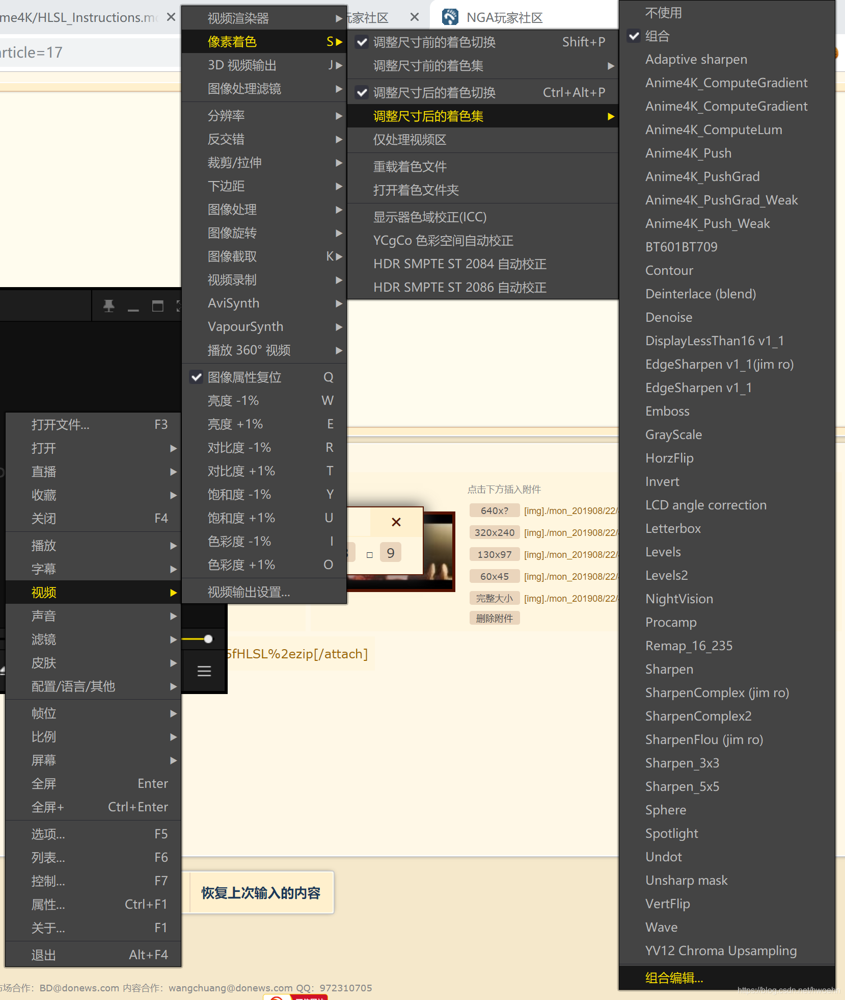

- 上一步菜单的最下方，点击 "组合编辑"，依次添加图中这几项之后确定，注意第三级菜单中要选择调整尺寸后的着色集

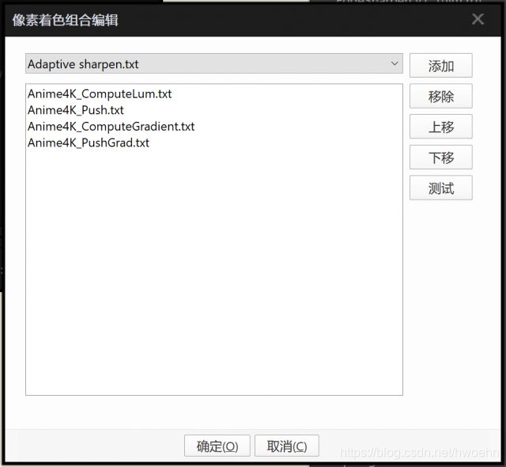

- 同样位置勾选 "组合"，这样应该就设置完成了

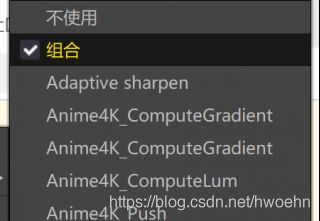

- 可以用 `Ctrl+Alt+P` 切换开关，如果设置成功的话画面应该有肉眼可见差别（或者你的网易云音乐突然开始放歌 jojo 立）

### 2. [ubuntu 内核编译教程－编译 linux4.10 内核](https://www.jianshu.com/p/5e37d91bfbbe)

1、环境准备

1. 准备 linux 源码和补丁

可在 [官网](http://www.kernel.org) 下载

```Bash
wget http://mirrors.aliyun.com/linux-kernel/v4.x/linux-4.5.tar.xz
wget http://mirrors.aliyun.com/linux-kernel/v4.x/patch-4.5.xz
```

2. 准备安装环境

首先执行 `apt update` 来更新软件源，然后安装需要的环境

```Bash
apt install kernel-package build-essential libncurses5-dev fakeroot
```

3. 解压缩内核

第一层解压

```Bash
xz -d linux-4.10.tar.xz
```

第二层解压

```Bash
tar –xvf linux-4.10.tar
```

解压后得到 linux.4.10，然后将内核目录 linux-4.10 复制到 `/usr/src`，然后进入 `/usr/src`

```Bash
sudo cp -r linux-4.10 /usr/src
cd /usr/src
```

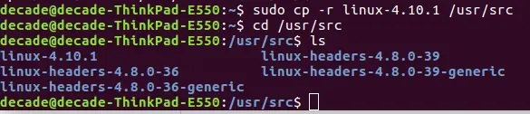

2、准备编译

1. 编译配置

看以前的内核版本号，将里面的 `.config` 文件复制到 linux-4.10 文件夹中：

通过 ls 可以发现。我的内核文件夹是 `linux-headers-4.8-39-generic`，我们应当将这个文件夹中的 `.config` 文件复制到 4.10 文件夹中

```Bash
cp linux-headers-4.8.0-39-generic/.config linux-4.10/
cd linux-4.10
```

然后执行 `make menuconfig` 打开可视化菜单
选择 `load->OK->Save->OK->EXIT->EXIT`

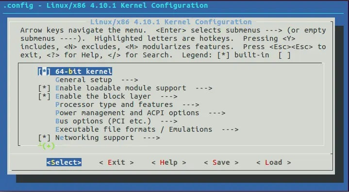

3、编译内核

1. 编译启动映像

```Bash
make bzImage -j8
```

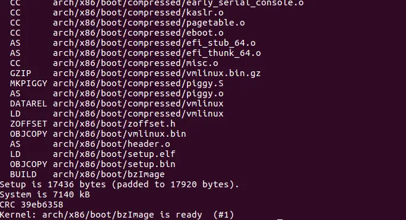

这里可能会出现两个错误：

```Bash
fatal error: openssl/opensslv.h: No such file or directory
```

这是因为没有安装 openssl 的，需要先安装 openssl: `apt-get install libssl-dev`

```Bash
bc: not found
```

需要安装 bc: `apt-get install bc`

安装对应依赖后再运行。

4、安装内核

先安装模块

```Bash
make modules_install
```

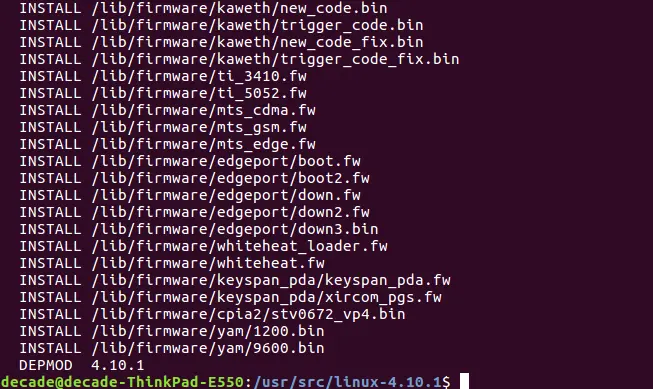

再安装内核

```Bash
make install
```

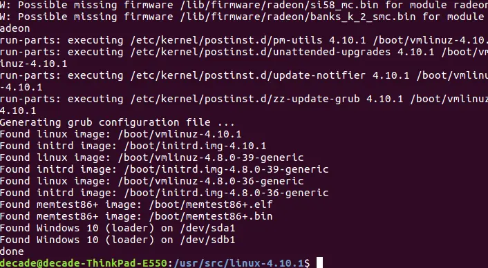

5、更改启动 grub

grub 就是系统启动的一个程序，若要运行编译好的内核，则需要修改相对应的 grub：

```Bash
mkiniramfs 4.10.0 -o /boot/inird.img-4.10
update-grub2
```

该命令会帮助我们自动修改 grub

修改之后，可以查看内核版本

```Bash
uname -a
```

> 以前在实验室这些步骤是非常熟悉了，但是几年后没接触，再看命令只是有点眼熟罢了

### 3. [Windows 下 pandoc 转换 LaTex 成 Word 最全指令](https://blog.csdn.net/qq_27464321/article/details/88853270)

1、pandoc 下载

- http://pandoc.org/installing.html
- [使用手册](https://www.pandoc.org/MANUAL.html)


2、转换方法

- 打开 windows 命令行窗口 `win+r -> cmd`
- 切换到工作目录： 使用 cd 命令切换到 Latex 文件所在的目录
- 基础转换命令: `pandoc input.tex -o output.docx`
    - input 是输入的文件名
    - output 是输出的文件名， 必须是 docx 后缀
- 图片的提取: 需要同时指定文件搜索目录和图片的目录。
    - `--extract-media=filename` 其中 filename 是 tex 源文件转换的目的文件的文件名。建议将要提取的图片都存于同一个文件夹下，图片只支持 jpg，png 等格式，对 pdf 不支持，需要先手动转换成 jpg

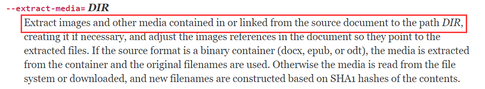

    - `--resource-path=.;path` 其中 `.` 表示当前工作目录，`;` 是 windows 系统的分隔符号（Linux/Unix/macOs 用 `:`），`path` 是图片目录的名字，这句表示将在当前工作目录的 path 文件下来搜素图片和其他资源。

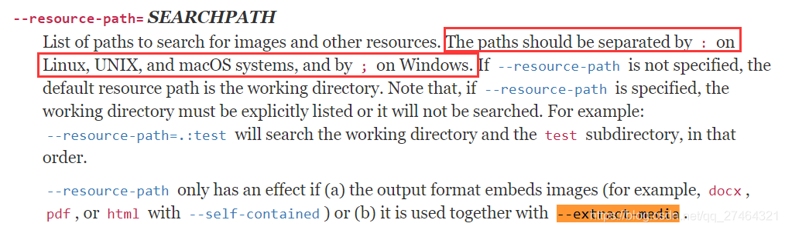

- 参考文献的提取: `--bibliography=ref.bib`
    - ref.bib 是参考文献文件，放在跟 tex 文件一个目录下
- 交叉引用的提取: `--filter pandoc-crossref` 为了处理数字、方程式、表格和交叉引用的编号，有一个名为 pandoc-crossref 的文件管理器。
    - 对于 Windows 系统，需要下载 GitHub Repo 发布页面上提供的预构建好的 exe 文件。然后将可执行文件放在 Pandoc 的安装目录中
    - 【注意 pandoc-crossref 的版本必须与 pandoc 的版本匹配】

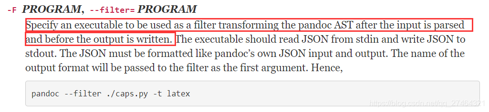

- 完整的转换命令: `pandoc input.tex --filter pandoc-crossref --extract-media=output --resource-path=.;path --bibliography=ref.bib -o output.docx`

3、注意

tex 源程序中部分函数可能不支持转换，比如 `\thanks {}` 相关的内容就无法转化，需要先对这部分进行屏蔽，才能转换成功。每次修改源程序 tex 文件后，需要重新编译后才能生效。

### 4. [C++ 左值/右值/左值引用/右值引用/移动语义/完美转发](https://juejin.cn/post/7137669991825932295)

0、前言

- C++11 在性能上做了很大的改进，最大程度减少了内存移动和复制，通过右值引用、 forward、emplace 和一些无序容器我们可以大幅度改进程序性能
- 右值引用仅仅是通过改变资源的所有者（剪切方式，而不是拷贝方式）来避免内存的拷贝，能大幅度提高性能
- forward 能根据参数的实际类型转发给正确的函数
- emplace 系列函数通过直接构造对象的方式避免了内存的拷贝和移动

1、 什么是 左值 / 右值

左值是表达式结束后仍然存在的持久对象，右值是指表达式结束时就不存在的临时对象

我们可以从两个维度去判断：

- 左值可以取地址，位于等号左边
- 右值不能取地址，位于等号右边

换句话说，有变量名称的就是左值，没有名称的就是右值。


```C++
int a = 6;
```

a 可以通过 & 取地址，位于等号左边，所以 a 是左值；6 位于等号右边，6 没法通过 & 取地址，所以 6 是个右值。

```C++
struct A {
    A(int a = 0) {
        a_ = a;
    }
    int a_;
};
A a = A();
```

a 可以通过 & 取地址，位于等号左边，所以 a 是左值；`A()` 是个临时值，没法通过 & 取地址，位于等号右边，所以 `A()` 是个右值。

可见左右值的概念很清晰，有地址的变量就是左值，没有地址的字面值、临时值就是右值。

2、什么是 左值引用/右值引用

引用的本质就是别名，可以通过引用修改变量的值，传参时传引用可以避免拷贝。

- 左值引用 (符号 &)：可以指向左值，不能指向右值
- 右值引用 (符号 &&)：可以指向右值，不能指向左值

2.1、左值引用

引用是变量的别名，由于右值没有地址，没法被修改，所以左值引用无法指向右值。

```C++
int a = 5;
int &ref_a = a; // 左值引用指向左值，编译通过
int &ref_a = 5; // 左值引用指向了右值，会编译失败
```

这里需要特别注意一点，**const 左值引用是可以指向右值的，const 左值引用不会修改指向值，因此可以指向右值。**

```C++
const int &ref_a = 5; // 编译通过
```

这也是为什么要使用 `const &` 作为函数参数的原因之一，如 `std::vector` 的 `push_back`

```C++
void push_back (const value_type& val);
```

如果没有 const，`vec.push_back(5)` 这样的代码就无法编译通过，因为 `value_type &` 左值引用不能指向右值。

2.2、右值引用

即然左值引用不能指向右值，那么我们就能看出，**右值引用专门为右值而生，为了使用右值引用去修改右值。**

```C++
int &&ref_a_right = 5; // ok

int a = 5;
int &&ref_a_left = a; // 编译不过，右值引用不可以指向左值

ref_a_right = 6; // 右值引用的用途：可以修改右值
```

右值引用就是对一个右值进行引用的类型。因为右值没有名字，所以我们只能通过引用的方式找到它。无论声明左值引用还是右值引用都必须立即进行初始化，因为引用类型本身并不拥有所绑定对象的内存，只是该对象的一个别名。

通过右值引用的声明，该右值又重获新生，其生命周期其生命周期与右值引用类型变量的生命周期一样，只要该右值引用类型变量还活着，那么这个右值临时量将会一直存活下去。

2.3、右值引用有办法指向左值吗？

有办法，使用 `std::move`，后续会详细介绍 `std::move`，这里先做简单理解。

```C++
int a = 5; // a是个左值
int &ref_a_left = a; // 左值引用指向左值
int &&ref_a_right = std::move(a); // 通过std::move将左值转化为右值，可以被右值引用指向

cout << a; // 打印结果：5
```

在上边的代码里，看上去是左值 a 通过 `std::move` 移动到了右值 `ref_a_right` 中，那是不是 a 里边就没有值了？并不是，打印出 a 的值仍然是 5。

`std::move` 是一个非常有迷惑性的函数：

- 不理解左右值概念的人们往往以为它能把一个变量里的内容移动到另一个变量，这样理解是错误的！
- 事实上 `std::move` 移动不了什么，唯一的功能是把左值强制转化为右值，让右值引用可以指向左值。其实现等同于一个类型转换: `static_cast<T&&>(lvalue)` 。所以，单纯的 `std::move (xxx)` 不会有性能提升，只是类型转换工具 (后续介绍如何使用 move 提升性能)。

```C++
int &&ref_a = 5;
ref_a = 6;
// 等同于以下代码：
int temp = 5;
int &&ref_a = std::move(temp);
ref_a = 6;
```

2.4、左值引用、右值引用这个变量本身是左值还是右值？

被声明出来的左、右值引用都是左值。因为被声明出的左右值引用是有地址的，也位于等号左边 (认真品读这句话)。仔细看下边代码：

```C++
#include <iostream>
using namespace std;
void change(int&& right_value) {
    right_value = 8;
}
int main() {
    int a = 5; // a是个左值
    int &ref_a_left = a; // ref_a_left是个左值引用
    int &&ref_a_right = std::move(a); // ref_a_right是个右值引用

    change(a); // 编译不过，a是左值，change参数要求右值
    change(ref_a_left); // 编译不过，左值引用ref_a_left本身也是个左值
    change(ref_a_right); // 编译不过，右值引用ref_a_right本身也是个左值

    change(std::move(a)); // 编译通过
    change(std::move(ref_a_right)); // 编译通过
    change(std::move(ref_a_left)); // 编译通过
    change(5); // 当然可以直接接右值，编译通过

    // 打印这三个左值的地址，都是一样的
    cout << &a << ' ';
    cout << &ref_a_left << ' ';
    cout << &ref_a_right;
}
```

看完这个代码我们知道了左值引用、右值引用这个变量本身是左值，但是我们还是会有一个疑问: `std::move` 会返回一个右值引用 `int &&`，它是左值还是右值呢？

从表达式 `int &&ref = std::move(a)` 来看，右值引用 ref 指向的必须是右值，所以 move 返回的 `int &&` 是个右值。

这与我们刚才得到的结论冲突，不是刚说好 左值引用 / 右值引用变量本身 是左值吗？怎么又变成右值了？实则不冲突，上面我们所说的是被声明，有地址，有变量名。

所以右值引用既可能是左值，又可能是右值吗？ 确实如此：右值引用既可以是左值也可以是右值，如果有名称则为左值；如果没有名称那就是右值。

换句话说，作为函数返回值的 && 是右值，直接声明出来的 && 是左值，其实引用和普通变量判断左右值的方法是一样的，等号左边就是左值，右边就是右值。

```C++
lvalue    = rvalue
int     a = 5;
int &&ref = std::move(a);
```

2.5、右值引用 && 总结

- 从性能上讲，左右值引用没有区别，传参使用左右值引用都可以避免拷贝
- 右值引用可以直接指向右值，也可以通过 `std::move` 指向左值；而左值引用只能指向左值 (const 左值引用也能指向右值)。
- 作为函数形参时，右值引用更灵活。虽然 const 左值引用也可以做到左右值都接受，但它无法修改，有一定局限性。

```C++
#include <iostream>
using namespace std;

void f1(const int& n) {
    n += 1; // 编译失败，const左值引用不能修改指向变量
}
void f2(int && n) {
    n += 1; // ok
}
int main() {
    f1(5);
    f2(5);
}
```

- 左值和右值是独立于它们的类型的，右值引用类型自身可能是左值也可能是右值(看有没有名字)(重点记忆)。
- `auto&&` 或 `函数参数类型自动推导的T&&` 是一个未定的引用类型，被称为 `universal references`，它可能是左值引用也可能是右值引用类型，取决于初始化的值类型。(重点记忆)
- 所有的右值引用叠加到右值引用上仍然是一个右值引用，其他引用折叠都为左值引用。当 `T&&` 为模板参数时，输入左值，它会变成左值引用，而输入右值时则变为具名的右值引用。(重点记忆)
- 编译器会将已命名的右值引用视为左值，而将未命名的右值引用视为右值。

3、右值引用 && 的使用场景

3.1、浅拷贝重复释放

对于含有堆内存的类，我们需要提供 **深拷贝的拷贝构造函数**，如果使用默认构造函数，会导致堆内存的重复删除，比如下面的代码：

```C++
#include <iostream>
using namespace std;
class A {
    public:
        A() :m_ptr(new int(0)) {
            cout << "constructor A" << endl;
        }
        ~A() {
            cout << "destructor A, m_ptr:" << m_ptr << endl;
            delete m_ptr;
            m_ptr = nullptr;
        }
    private:
        int* m_ptr;
};
// 为了避免返回值优化，此函数故意这样写
A Get(bool flag) {
    A a;
    A b;
    cout << "ready return" << endl;
    if (flag) {
        return a;
    } else {
        return b;
    }
}
int main() {
    {
        A a = Get(false); // 运行报错
    }
    cout << "main finish" << endl;
    return 0;
}
```

```Bash
constructor A
constructor A
ready return
destructor A, m_ptr:0xa35e40
destructor A, m_ptr:0xa35e20
destructor A, m_ptr:0xa35e40

--------------------------------
Process exited after 1.164 seconds with return value 3221226356
```

3.2、深拷贝构造函数

在上面的代码中，默认的拷贝构造函数是浅拷贝，main 函数的 a 和 Get 函数的 b 会指向同一个指针 m_ptr，在析构的时候会导致重复删除该指针。正确的做法是提供深拷贝的拷贝构造函数，比如下面的代码：

```C++
#include <iostream>
using namespace std;
class A {
    public:
        A() :m_ptr(new int(0)) {
            cout << "constructor A" << endl;
        }
        A(const A& a) :m_ptr(new int(*a.m_ptr)) {
            cout << "copy constructor A" << endl;
        }
        ~A() {
            cout << "destructor A, m_ptr:" << m_ptr << endl;
            delete m_ptr;
            m_ptr = nullptr;
        }
    private:
        int* m_ptr;
};
// 为了避免返回值优化，此函数故意这样写
A Get(bool flag) {
    A a;
    A b;
    cout << "ready return" << endl;
    if (flag) {
        return a;
    } else {
        return b;
    }
}
int main() {
    {
        A a = Get(false); // 运行报错
    }
    cout << "main finish" << endl;
    return 0;
}
```

```Bash
constructor A
constructor A
ready return
copy constructor A
destructor A, m_ptr:0x1a5e40
destructor A, m_ptr:0x1a5e20
destructor A, m_ptr:0x1a5e60
main finish
```

3.3、移动构造函数

这样就可以保证拷贝构造时的安全性，但有时这种拷贝构造却是不必要的，比如上面代码中的拷贝构造就是不必要的。上面代码中的 Get 函数会返回临时变量，然后通过这个临时变量拷贝构造了一个新的对象 b，临时变量在拷贝构造完成之后就销毁了，如果堆内存很大，那么，这个拷贝构造的代价会很大，带来了额外的性能损耗。有没有办法避免临时对象的拷贝构造呢？答案是肯定的。看下面的代码：

```C++
#include <iostream>
using namespace std;
class A {
    public:
        A() :m_ptr(new int(0)) {
            cout << "constructor A" << endl;
        }
        A(const A& a) :m_ptr(new int(*a.m_ptr)) {
            cout << "copy constructor A" << endl;
        }
        // 移动构造函数，可以浅拷贝
        A(A&& a) :m_ptr(a.m_ptr) {
            a.m_ptr = nullptr; // 为防止a析构时delete data，提前置空其m_ptr
            cout << "move constructor A" << endl;
        }
        ~A() {
            cout << "destructor A, m_ptr:" << m_ptr << endl;
            delete m_ptr;
            m_ptr = nullptr;
        }
    private:
        int* m_ptr;
};
// 为了避免返回值优化，此函数故意这样写
A Get(bool flag) {
    A a;
    A b;
    cout << "ready return" << endl;
    if (flag) {
        return a;
    } else {
        return b;
    }
}
int main() {
    {
        A a = Get(false); // 运行报错
    }
    cout << "main finish" << endl;
    return 0;
}
```

```Bash
constructor A
constructor A
ready return
move constructor A
destructor A, m_ptr:0
destructor A, m_ptr:0x95e20
destructor A, m_ptr:0x95e40
main finish
```

上面的代码中没有了拷贝构造，取而代之的是移动构造（ Move Construct）。从移动构造函数的实现中可以看到，它的参数是一个右值引用类型的参数 `A&&`，这里没有深拷贝，只有浅拷贝，这样就避免了对临时对象的深拷贝，提高了性能。这里的 `A&&` 用来根据参数是左值还是右值来建立分支，如果是临时值，则会选择移动构造函数。移动构造函数只是将临时对象的资源做了浅拷贝，不需要对其进行深拷贝，从而避免了额外的拷贝，提高性能。这也就是所谓的移动语义（move 语义），右值引用的一个重要目的是用来支持移动语义的。

4、移动语义 move

4.1、move 介绍

移动语义可以将资源（堆、系统对象等）通过浅拷贝方式从一个对象转移到另一个对象，这样能够减少不必要的临时对象的创建、拷贝以及销毁，可以大幅度提高 C++ 应用程序的性能，消除临时对象的维护（创建和销毁）对性能的影响。

我们知道移动语义是通过右值引用来匹配临时值的，那么，普通的左值是否也能借组移动语义来优化性能呢？C++11 为了解决这个问题，提供了 `std::move()` 方法来将左值转换为右值，从而方便应用移动语义。

move 是将对象的状态或者所有权从一个对象转移到另一个对象，只是转义，没有内存拷贝。要 move 语义起作用，核心在于需要对应类型的移动构造构造函数支持。（因为 `std::move` 只是类型转换工具，将左值转换成无名右值，而无名右值会走移动构造函数）。单单 move 是无法提升性能的，要与移动构造函数结合起来才能提升性能。

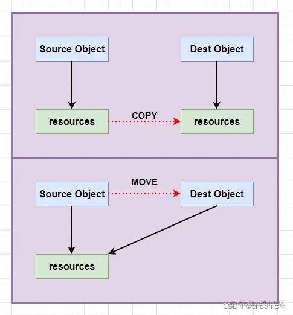

5、完美转发 forward

5.1、forward 介绍

```C++
Template<class T>
void func(T &&val);
```

`auto&&` 或 `函数参数类型自动推导的T&&`  是一个未定的引用类型，被称为 `universal references`，它可能是左值引用也可能是右值引用类型，取决于初始化的值类型。 但要注意，引用以后，这个 T 类型它本质上是一个左值！

forward 完美转发实现了参数在传递过程中保持其 参数模板 属性的功能，什么意思呢？在用右值引用做参数形参的时候，这个右值引用这个变量是左值，那么在函数内部转发此函数给其他函数就会变成左值。使用 `std::forward()` 可以实现完美转发，完美转发被赋值之前的类型，也就是说，之前是左值，转发之后就是左值，之前是右值，转发之后就是右值。不会因为形参是有名称，形参是左值而影响到原来的类型

forward 比 move 更强大，通过它的参数模板，它可以转发为左值，也可以转发为右值

```C++
int &&a = 10;
int &&b = a; //错误
```

注意这里，a 是一个右值引用，但其本身 a 也有内存名字，所以 a 本身是一个左值，再用右值引用引用 a 这是不对的。

```C++
int &&a = 10;
int &&b = std::forward<int>(a);//以右值的方式转发，因为int是右值
```

```C++
#include <iostream>
using namespace std;
template <class T>
void Print(T &t) {
    cout << "L" << t << endl;
}
template <class T>
void Print(T &&t) {
    cout << "R" << t << endl;
}
template <class T>
void func(T &&t) {
    Print(t);//L，参数始终是左值
    Print(std::move(t));//R，move之后始终是右值
    Print(std::forward<T>(t));//完美转发
}
int main() {
    cout << "-- func(1)\n" << endl;
    func(1);//1 本身是 R

    cout << "-- func(x)\n" << endl;
    int x = 10;
    func(x); //x本身是 L

    int y = 20;
    cout << "-- func(std::forward<int>(y))\n" << endl;
    func(std::forward<int>(y));  //T模板参数为int右值 ，以右值方式转发y，实参为右值

    cout << "-- func(std::forward<int&>(y))\n" << endl;
    func(std::forward<int&>(y)); //T模板参数为左值引用，以左值方式转发y，实参为左值

    cout << "-- func(std::forward<int&&>(y))\n" << endl;
    func(std::forward<int&&>(y));//T模板参数为右值引用，以右值方式转发y，实参为右值

    return 0;
}
```

```Bash
-- func(1)
L1
R1
R1
-- func(x)
L10
R10
L10
-- func(std::forward<int>(y))
L20
R20
R20
-- func(std::forward<int&>(y))
L20
R20
L20
-- func(std::forward<int&&>(y))
L20
R20
R20
```

解释：

- `func(1)`

```Bash
Print(t);//L，具名参数始终是左值
- Print(std::move(t));//R，move之后始终是右值
- Print(std::forward<T>(t));//完美转发，forward模板参数为右值，以右值转发，所以转发后实参为右值
```

- `func(x)`

```Bash
Print(t);//L，具名参数始终是左值
- Print(std::move(t));//R，move之后始终是右值
- Print(std::forward<T>(t));//完美转发，forward模板参数为左值，以左值转发，所以转发后实参为左值
```

- `func(std::forward(y))`

```Bash
Print(t);//L，具名参数始终是左值
- Print(std::move(t));//R，move之后始终是右值
- Print(std::forward<T>(t));//完美转发，forward模板参数为右值，以右值转发，所以转发后实参为右值
```

- `func(std::forward<int&>(y))`

```Bash
Print(t);//L，具名参数始终是左值
- Print(std::move(t));//R，move之后始终是右值
- Print(std::forward<T>(t));//完美转发，forward模板参数为左值引用，以左值转发，所以转发后实参为左值
```

- `func(std::forward<int&&>(y))`

```Bash
Print(t);//L，具名参数始终是左值
- Print(std::move(t));//R，move之后始终是右值
- Print(std::forward<T>(t));//完美转发，forward模板参数为右值引用，以右值转发，所以转发后实参为右值
```

### 5. [知道这 20 个正则表达式，能让你少写 1000 行代码](https://www.jianshu.com/p/e7bb97218946)

正则表达式，一个十分古老而又强大的文本处理工具，仅仅用一段非常简短的表达式语句，便能够快速实现一个非常复杂的业务逻辑。熟练地掌握正则表达式的话，能够使你的开发效率得到极大的提升。

正则表达式经常被用于字段或任意字符串的校验，如下面这段校验基本日期格式的 JavaScript 代码：

```JavaScript
var reg = /^(\\d{1,4})(-|\\/)(\\d{1,2})\\2(\\d{1,2})$/;
var r = fieldValue.match(reg);
if(r==null)alert('Date format error!');
```

1、校验密码强度

密码的强度必须是包含大小写字母和数字的组合，不能使用特殊字符，长度在 8-10 之间。

```JavaScript
^(?=.*\\d)(?=.*[a-z])(?=.*[A-Z]).{8,10}$
```

2、校验中文

字符串仅能是中文。

```JavaScript
^[\\u4e00-\\u9fa5]{0,}$
```

3、由数字、26 个英文字母或下划线组成的字符串

```JavaScript
^\\w+$
```

4、校验 E-Mail 地址

同密码一样，下面是 E-mail 地址合规性的正则检查语句。

```JavaScript
[\\w!#$%&'*+/=?^_`{|}~-]+(?:\\.[\\w!#$%&'*+/=?^_`{|}~-]+)*@(?:[\\w](?:[\\w-]*[\\w])?\\.)+[\\w](?:[\\w-]*[\\w])?
```

5、校验身份证号码

下面是身份证号码的正则校验。15 或 18 位。

15 位：

```JavaScript
^[1-9]\\d{7}((0\\d)|(1[0-2]))(([0|1|2]\\d)|3[0-1])\\d{3}$
```

18 位：

```JavaScript
^[1-9]\\d{5}[1-9]\\d{3}((0\\d)|(1[0-2]))(([0|1|2]\\d)|3[0-1])\\d{3}([0-9]|X)$
```

6、校验日期

"yyyy-mm-dd" 格式的日期校验，已考虑平闰年。

```JavaScript
^(?:(?!0000)[0-9]{4}-(?:(?:0[1-9]|1[0-2])-(?:0[1-9]|1[0-9]|2[0-8])|(?:0[13-9]|1[0-2])-(?:29|30)|(?:0[13578]|1[02])-31)|(?:[0-9]{2}(?:0[48]|[2468][048]|[13579][26])|(?:0[48]|[2468][048]|[13579][26])00)-02-29)$
```

7、校验金额

金额校验，精确到 2 位小数。

```JavaScript
^[0-9]+(.[0-9]{2})?$
```

8、校验手机号

下面是国内 13、15、18 开头的手机号正则表达式。（可根据目前国内收集号扩展前两位开头号码）

```JavaScript
^(13[0-9]|14[5|7]|15[0|1|2|3|5|6|7|8|9]|18[0|1|2|3|5|6|7|8|9])\\d{8}$
```

9、判断 IE 的版本

IE 目前还没被完全取代，很多页面还是需要做版本兼容，下面是 IE 版本检查的表达式。

```JavaScript
^.*MSIE [5-8](?:\\.[0-9]+)?(?!.*Trident\\/[5-9]\\.0).*$
```

10、校验 IP-v4 地址

IP4 正则语句。

```JavaScript
\\b(?:(?:25[0-5]|2[0-4][0-9]|[01]?[0-9][0-9]?)\\.){3}(?:25[0-5]|2[0-4][0-9]|[01]?[0-9][0-9]?)\\b
```

11、校验 IP-v6 地址

IP6 正则语句。

```JavaScript
(([0-9a-fA-F]{1,4}:){7,7}[0-9a-fA-F]{1,4}|([0-9a-fA-F]{1,4}:){1,7}:|([0-9a-fA-F]{1,4}:){1,6}:[0-9a-fA-F]{1,4}|([0-9a-fA-F]{1,4}:){1,5}(:[0-9a-fA-F]{1,4}){1,2}|([0-9a-fA-F]{1,4}:){1,4}(:[0-9a-fA-F]{1,4}){1,3}|([0-9a-fA-F]{1,4}:){1,3}(:[0-9a-fA-F]{1,4}){1,4}|([0-9a-fA-F]{1,4}:){1,2}(:[0-9a-fA-F]{1,4}){1,5}|[0-9a-fA-F]{1,4}:((:[0-9a-fA-F]{1,4}){1,6})|:((:[0-9a-fA-F]{1,4}){1,7}|:)|fe80:(:[0-9a-fA-F]{0,4}){0,4}%[0-9a-zA-Z]{1,}|::(ffff(:0{1,4}){0,1}:){0,1}((25[0-5]|(2[0-4]|1{0,1}[0-9]){0,1}[0-9])\\.){3,3}(25[0-5]|(2[0-4]|1{0,1}[0-9]){0,1}[0-9])|([0-9a-fA-F]{1,4}:){1,4}:((25[0-5]|(2[0-4]|1{0,1}[0-9]){0,1}[0-9])\\.){3,3}(25[0-5]|(2[0-4]|1{0,1}[0-9]){0,1}[0-9]))
```

12、检查 URL 的前缀

应用开发中很多时候需要区分请求是 HTTPS 还是 HTTP，通过下面的表达式可以取出一个 url 的前缀然后再逻辑判断。

```JavaScript
if (!s.match(/^[a-zA-Z]+:\\/\\//))
{
    s = 'http://' + s;
}
```


13、提取 URL 链接

下面的这个表达式可以筛选出一段文本中的 URL。

```JavaScript
^(f|ht){1}(tp|tps):\\/\\/([\\w-]+\\.)+[\\w-]+(\\/[\\w- ./?%&=]*)?
```


14、文件路径及扩展名校验

验证 windows 下文件路径和扩展名（下面的例子中为 txt 文件）

```JavaScript
^([a-zA-Z]\\:|\\\\)\\\\([^\\\\]+\\\\)*[^\\/:*?"<>|]+\\.txt(l)?$
```

15、提取 Color Hex Codes

有时需要抽取网页中的颜色代码，可以使用下面的表达式。

```JavaScript
^#([A-Fa-f0-9]{6}|[A-Fa-f0-9]{3})$
```

16、提取网页图片

假若你想提取网页中所有图片信息，可以利用下面的表达式。

```JavaScript
\\< *[img][^\\\\>]*[src] *= *[\\"\\']{0,1}([^\\"\\'\\ >]*)
```

17、提取页面超链接

提取 html 中的超链接。

```JavaScript
(<a\\s*(?!.*\\brel=)[^>]*)(href="https?:\\/\\/)((?!(?:(?:www\\.)?'.implode('|(?:www\\.)?', $follow_list).'))[^"]+)"((?!.*\\brel=)[^>]*)(?:[^>]*)>
```

18、查找 CSS 属性

通过下面的表达式，可以搜索到相匹配的 CSS 属性。

```JavaScript
^\\s*[a-zA-Z\\-]+\\s*[:]{1}\\s[a-zA-Z0-9\\s.#]+[;]{1}
```

19、抽取注释

如果你需要移除 HMTL 中的注释，可以使用如下的表达式。

```JavaScript
<!--(.*?)-->
```

20、匹配 HTML 标签

通过下面的表达式可以匹配出 HTML 中的标签属性。

```JavaScript
<\\/?\\w+((\\s+\\w+(\\s*=\\s*(?:".*?"|'.*?'|[\\^'">\\s]+))?)+\\s*|\\s*)\\/?>
```

## share [🔝](#weekly-60)

### 爱人先爱己

如果不懂得爱自己，不珍惜自己，那么又怎么能够真正地去爱别人呢？学会爱自己，就是要先学会关注自己的身体和心理健康，照顾好自己的情绪和需要，让自己保持积极向上的心态和精神状态。只有在这样的基础上，我们才能更好地去关心和爱护别人。


[readme](../README.md) | [previous](202404W3.md) | [next](202405W1.md)
