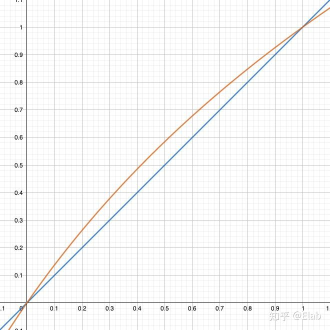
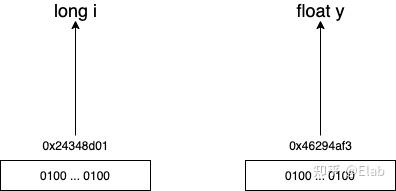
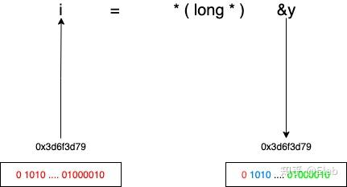
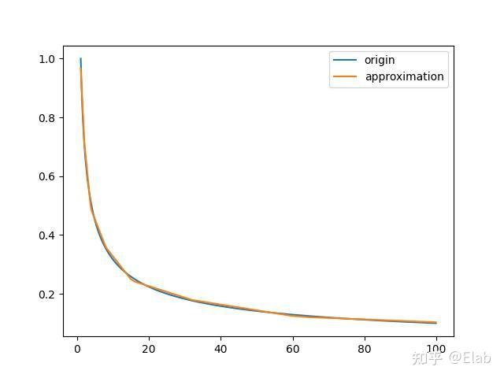
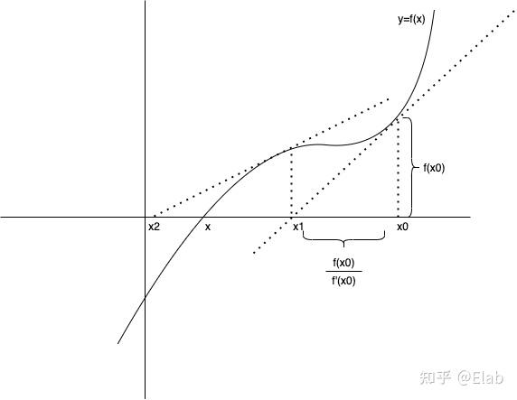
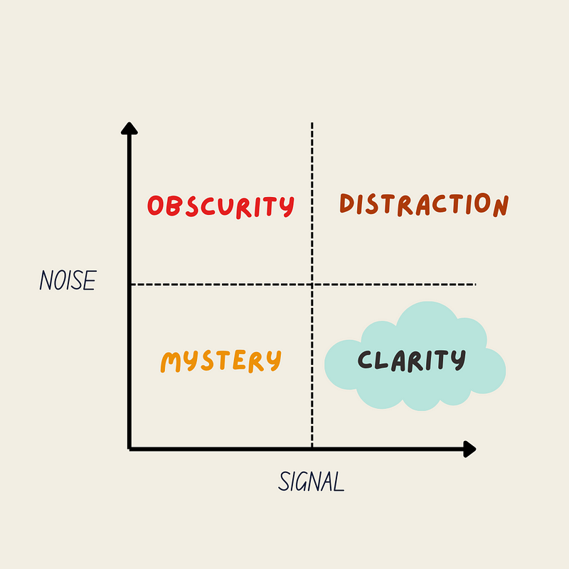

> @Author  : Lewis Tian (taseikyo@gmail.com)
>
> @Link    : github.com/taseikyo
>
> @Range   : 2024-05-19 - 2024-05-25

# Weekly #63

[readme](../README.md) | [previous](202405W2.md) | [next](202405W4.md)


\**Photo by [Matt Boitor](https://unsplash.com/@mattboitor) on [Unsplash](https://unsplash.com/photos/a-group-of-people-standing-on-top-of-a-sandy-beach-Of0B3Cc3C2A)*

## Table of Contents

- [algorithm](#algorithm-)
- [review](#review-)
    - Magic Number - 《雷神之锤 3》平方根倒数速算法
    - Markdown 中 LaTeX 数学公式命令
- [tip](#tip-)
    - 使用油猴脚本为网页添加自己的快捷键
- [share](#share-)
    - 学会有选择性地忽略（Ignore Selectively）

## algorithm [🔝](#weekly-63)

## review [🔝](#weekly-63)

### 1. [Magic Number - 《雷神之锤 3》平方根倒数速算法](https://zhuanlan.zhihu.com/p/445813662)

```C
float Q_rsqrt( float number ) {
    long i;
    float x2, y;
    const float threehalfs = 1.5F;
    x2 = number * 0.5F;
    y = number;
    i = * ( long * ) &y;             // evil floating point bit level hacking
    i = 0x5f3759df - (i >> 1);       // what the fuck?
    y = * ( float * ) &i;
    y = y * (threehalfs - ( x2 * y * y ) );     // 1st iteration
    y = y * (threehalfs - ( x2 * y * y ) );     // 2nd iteration, this can be removed
    return y;
}
```

如果你看到这个 `0x5f3759df` 数字，想必有点小懵逼，人生三问开始了：

- 它是谁？
- 它怎么来的？
- 它有什么用？

下面就会介绍这个 magic number 从何来，去何处。

1、为何需要这个算法？

当你需要在游戏中实现一些物理效果，比如光影效果、反射效果时，所关注的点其实是某个向量的方向，而不是这个向量的长度，如果能将所有向量给单位化，很多计算就会变得比较简单。

所以在计算中很重要的一点就是计算出单位向量，而在真正在运行代码中需要根据某个向量计算相应的单位向量，根据某个向量 `(x, y, z)` 计算法向量公式如下

$$
x_0 = x * \frac{1}{\sqrt{x^2 + y^2 + z^ 2}} \\

y_0 = y * \frac{1}{\sqrt{x^2 + y^2 + z^ 2}} \\

z_0 = z * \frac{1}{\sqrt{x^2 + y^2 + z^ 2}} \\
$$


2、二进制数的表示方法

为了能够方便对这些机器数进行算术运算、提高运算速度，计算机设计了许多种表示方式，其中比较常见的是：原码、反码、补码以及移码。下面主要以 8bit 长度的数 `0000 0100`，即十进制数 4，去介绍这几种表示方式

- 原码

原码表示方式是最容易理解的，首先第一位为符号位，后面七位表示的就是真值，如果表示负数，只需要将符号位置为 1 即可，后面七位依然为真值，所以 4 与 -4 的原码为：`0000 0100`，`1000 0100`

所以很容易就得出原码的表示范围为 [-127, 127]，会存在两个特殊的数为 +0 与 -0。

- 反码

正数的反码即是其原码，而负数的反码就是在保留符号位的基础上，其他位全部取反，所以 4 与 -4 的反码为：`0000 0100`，`1111 1011`

所以反码表示范围为 [-127, 127]，依然存在两个特殊的数为 +0 与 -0

- 补码

正数的补码即是其原码，而负数的补码就是在保留符号位的基础上，其他位全部取反，最后加 1，即在反码的基础上 +1，所以 4 与 -4 有补码是：`0000 0100`，`1111 1100`

所以补码表示范围为 [-128,127]，之前的 -0 在补码中被表示成了 -128，可以多表示一个数。

- 移码

在数轴上，移码表示的范围，恰好对应着真值在数轴上的范围向正方向移动 $2^n$
 个单元，对应着 8 个 bit 的范围从 [0, 255] 变为 [-128, 127]，可以看出偏移量为 128，所以 4 与 -4 的移码为：`0111 1100`，`1000 0100`

移码的一大好处就是方便比较，可以直接进行按位比较。

3、浮点数

先考虑一个问题，如果你用 32 位二进制如何表示 4.25？可能会是这样：

0000 0000 0000 0100 . 0100 0000 0000 0000

这放在普通十进制，这种想法其实非常常见，但是这种方式放在二进制世界中，总共 1 位符号位，15 号整数位，16 位小数位，总共表示数的范围只有 $[-2^{15}, 2^{15}]$，而对于长整型的范围却有 $[-2^{31}, 2^{31}]$，差的倍数有 6w5，可见这种方式为了小数表示抛弃了一半的位数，得不偿失，所以有人提出了 `IEEE754` 标准。

在描述这个标准前，先在这里说下科学计数法，在十进制中科学计数法表示如下

$$
12300 = 1.23 * 10^{4} \\
0.00123 = 1.23 * 10^{-3} \\
$$

同样的，可以将科学计数法运用到二进制中

$$
11.000= 1.1 * 2^{4} \\
0.0101= 1.01 * 2^{-2} \\
$$

所以 `IEEE754` 也是采用的是科学计数法的形式，会将 32 位数分为以下三部分

0 00000000 00000000000000000000000

- Sign Bit

首先第一位是符号位，0 表示正数，1 表示负数，而在平方根的计算中，明显不会涉及到负数，所以第一位肯定是为 0 的。

- Exponent

第二部分用 8 位 bit 表示指数部分，可以表示数的范围是 `[0, 255]`，但是这个只能表示正数，所以需要把负数也加进来，而 `IEEE754` 标准中阶码表示方式为移码，之所以要表示为移码的方式是在浮点数比较中，比较阶码的大小会变得非常简单，按位比较即可。不过和正常的移码有一点小区别是，`0000 0000` 与 `1111 1111` 用来表示非规格化数与一些特殊数，所以偏移量从 128 变为 127，表示范围也就变成了 `[-127, 126]`。

举个例子，众所周知啊，4 这个数的 8bit 真值为 `0000 0100`，加上 127 的偏移量变成 131，即 4 的移码为 `1000 0011`。

- Mantissa

小数部分就是剩余的 23 位，可以表示的范围就是 $[0, 1 - 2^{-23}]$，而科学计数法的第一位默认是为 1 的，所以这个范围就会变成 $[1, 2 - 2^{-23}]$，而 1 是默认存在的，这样就不会用这 23 位 bit 中一位专门来表示这个 1，从而多出一位来表示更广范围的小数，真正计算的时候再加上 1 即可。

下面我们以 9.625 这个数改成 IEEE 754 标准的机器数：

首先变为相应的二进制数为 1001.101，用规范的浮点数表达应为 $1.001101 * 2^{3}$，所以符号段为 0，指数部分的移码为 1000 0010，有效数字去掉 1 后为 001101，所以最终结果为

0 10000010 00110100000000000000000

4、二进制数转换

我们以 9.625 这个数为例，首先我们令阶码的真值为 E，则有

$$
E = 1000,0010_{(2)} = 130_{(10)}
$$

令余数为 M，则有

$$
M = 00110100000000000000000_{(2)} = {0.001101 * 2^{23}}_{(2)}
$$

现在我们先不认为这个是浮点数，这个数就是 32 位长整型，令这个数为 L，它所表示的十进制数便是这样

$$
L = 2^{23} * E + M
$$

这个数 L 便是这 32 位所表示的无符号整型，这个数后面有大用，我们先暂且把它放在这儿，后续再来看。

然后我们通过一个公式来表示这个浮点数 F 的十进制数

$$
F = (1 + \frac{M}{2^{23}}) * 2^{E - 127}
$$

尾数加 1 是因为在 IEEE754 标准中把首位的一去掉了，所以计算的时候需要把这个一给加上，然后阶码减去 127 是因为偏移为 127，要在 8 位真值的基础上减去 127 才是其表示真正的值。

然后有趣的事情就发生了，我们现在将这个数 F 取下对数

$$
\log_2 F = \log_2 (1 + \frac{M}{2^{23}}) + E - 127
$$

在这个公式，`E-127` 自然非常好计算，但是前面的对数计算起来是比较麻烦的，所以我们可以找个近似的函数去代替对数。

现在看下 $y=log_2(1 + x)$ 与 $y=x$ 的图像



根据图像，我们很容易得出下面这个结论

$$
\lim_{x \to 0^+} \log_2 (1 + x) = x \\

\lim_{x \to 1^-} \log_2 (1 + x) = x \\
$$

然后很容易发现，在 `[0, 1]` 这个范围内，$\log_2(x+1)$ 与 $x$ 其实是非常相近的，那样我们可以取一个在 `[0,1]` 的校正系数 $\mu$，使得下面公式成立

$$
\log_2 (x + 1) \approx x + \mu
$$

到此，我们知道了怎样去简化对数，所以我们可以将这个简化代入上面浮点数表示中，就可以得到

$$
\log_2 F = \log_2 (1 + \frac{M}{2^{23}}) + E - 127 \\
\approx (\frac{M}{2^{23}} + \mu) + E - 127 \\
= (\frac{M}{2^{23}} + \frac{E * 2^{23}}{2^{23}}) + \mu - 127 \\
= \frac{1}{2^{23}} (M + E * 2^{23}) + \mu - 127 \\
$$

看见这个 $M + E * 2 ^{23}$ 应该比较熟悉吧，这个数就是浮点数 F 的二进制数 L，然后代入约等式中得到 $\log_2 F \approx \frac{L}{2^{23}} + \mu - 127 $

在某种程度上，不考虑放缩与变换，我们可以认为浮点数的二进制表示 L 其实就是其本身 F 的对数形式，即 $\log_2 F \approx L$

5、三部曲

经过上面一系列复杂的数字处理操作，我们终于可以开始我们的算法三部曲了

5.1、evil bit hack

众所周知啊，每个变量都有自己的地址，程序运行的时候就会通过这个地址拿到这个变量的值，然后进行一系列的计算，比如 i 和 y 在内存中会这样表示




我们对长整型这些数据很好进行位移运算，比如我想将这个数乘以或者除以 $ 2^n $
，只需要左移或者右移 N 个位就可以，但是浮点数明显无法进行位运算，它本身二进制表示就不是为了位运算设计的。

然后，现在就会提出一个想法，我把 float 转成 int，然后进行位运算不就行了，代码如下：`long i = (long) y`

假设 y 为 3.33，进行长整型强转后，C 语言会直接丢弃尾数，i 也就变成了 3，丢失这么多精度，谁干啊，如果我们想一位都不动地进行位运算，就是下面这份代码：`i = * ( long * ) &y`

这个强转过程其实没改变内存中任何东西，首先它并没有改变地址，也没改变地址中所存储的数据，可以认为改变的是 C 语言的 “认知”，原本是要以 IEEE754 标准去读取这个地址中数据，但是 C 语言现在认为这个是长整型的地址，按长整型方式读取就行。所以 (long*)&y 代表 0x3d6f3d791 这个地址中存储的是长整型数据，然后我通过 * 运算符从这个地址中拿出数据，赋值给 i 这个长整型变量。



5.2、what the fuck

众所周知啊，位运算中的左移和右移一位分别会使原数乘以或者除以 2，比如

$$
x = 110 = 6 \\
x << 1 = 1100 = 12 \\
x >> 1 = 11 = 3
$$

我们想办法把平方根倒数做一个简单的转化 $\frac{1}{\sqrt x} = x^{-\frac{1}{2}} $

这个等式其实就是我们的最终目标，接下的计算就会逐渐往这个等式靠近，得到一个近似的结果。

在前面一步的叙述中，我们得出这样一个结论，浮点数的二进制表示其实就是其本身的对数形式，想要求的浮点数存储在 y 中，则有 y = 9.625

$ log_2 (y) \approx i = 01000001 \ 00011010 \ 00000000 \ 00000000 $

也就是说 i 中其实存储着 y 的对数，当然还需要进行一系列的转换与缩放。

前面提到过，直接运算一个数的平方根倒数，所以不如直接计算平方根倒数的对数，然后就会有如下等式

$\log_2 (\frac{1}{\sqrt y}) = \log_2 (y^{- \frac{1}{2}}) = - \frac{1}{2} \log_2(y) $

$\log_2 (y) \approx i $

$\log_2 (\frac{1}{\sqrt y}) \approx -(i >> 1)$

除法同样计算速度是比较慢的，所以我们用右移代替除法，这也就解释了 `-(i >> 1)` 其实是为了计算 $\log_2 (\frac{1}{\sqrt y})$ 的结果。

所以 `0x5f3759df` 这个数到底咋来的，为啥要这么计算，并且 `-(i >> 1)` 并不完全是 $\log_2 (\frac{1}{\sqrt y})$ 的近似值啊，根据公式还得除以 $2^{23}$，还得加上一定的误差。

先别急，我们先算下这个 `magic number` 是咋来的，令 $\Gamma$ 为 y 的平方根倒数，则有

$$
\Gamma = \frac{1}{\sqrt y} \\
\log_2 \Gamma = \log_2 (\frac{1}{\sqrt y}) = -\frac{1}{2} \log_2 (y)
$$

然后我们代入上面那个浮点数对数的公式中，则有

$$
\log_2 \Gamma = \frac{1}{2^{23}} (M_{\Gamma} + E_{\Gamma} * 2^{23}) + \mu - 127 \\
\log_2 y = \frac{1}{2^{23}} (M_y + E_y * 2^{23}) + \mu - 127 \\
\frac{1}{2^{23}} (M_{\Gamma} + E_{\Gamma} * 2^{23}) + \mu - 127 = -\frac{1}{2}(\frac{1}{2^{23}} (M_y + E_y * 2^{23}) + \mu - 127)
$$

现在经过一定的变换能够得到下面这个式子

$$
(M_{\Gamma} + E_{\Gamma} * 2^{23}) = \frac{3}{2}2^{23}(127 - \mu) -\frac{1}{2} (M_y + E_y * 2^{23}) \\
= 0x5f3759df - (i >> 1)
$$

这里 $\mu$ 是就是之前简化对数计算引进的误差，通过一定计算，得到最合适的 $\mu$，来得到 $\Gamma$  的近似值。这个计算过程偏向纯数学化的，具体过程请查阅 [《FAST INVERSE SQUARE ROOT》](http://www.matrix67.com/data/InvSqrt.pdf) 这篇论文。

原算法中取的$\mu$ \mu 值为 0.0450465，然后计算一下 $\frac{3}{2}2^{23}(127 - \mu) = \frac{3}{2}2^{23}(127 - 0.0450465) = 1597463007 $

这个数的十六进制就是 `0x5f3759df`，也就是上面提到的那个 `magin number`，然后我们根据这个数去计算得到的近似值，并与真正的 $\frac{1}{\sqrt y}$ 进行比较，具体函数图像如下



从上面的图像可以看到，在 `[1,100]` 这个区间内，所得到的近似值曲线已经和原始值制拟合的比较好了，这样我们已经完成了前面几个比较重要的步骤。

```
y = * ( float * ) &i;
```

这样我们通过和 `evial bit hack` 的逆向步骤，即将一个长整型的内存地址，转变成一个浮点型的内存地址，然后根据 IEEE754 标准取出这个浮点数，即我们要求的 $\Gamma$ 的近似值，其实到这里应该是算法差不多结束了，但是这个近似值还存在一定的误差，还需要经过一定的处理降低误差，更接近真实值。

5.4、Newton Iteration

本身我们已经得到了一个比较好的近似值，但是仍然存在一定的误差，而牛顿迭代法可以这个近似值更加接近真实的值，近一步减少误差。

牛顿迭代法本身是为了找到一个方程根的方法，比如现在有一个方程 $f(x)=0$ ，需要找到这个方程的根，但是解方程嘛，是不会解方程的，所以可以找到一个近似值来代替这个真正的解。



如上图，假设 $f(x)=0$ 的解为 $x=x_c$ ，我们需要首先给一个 x 的近似值 $x_0$，通过这个 $x_0$，不断求得一个与 $ x_c $  更接近的值。

在 $(x_0, f(x_0))$ 处做切线，切线的斜率就是 $ f(x) $ 在 $ x=x_0 $ 的导数 $ f'(x_0) $，然后来求这条切线与 x 轴的交点 $ x_1 $，则有
$ x_1 = x_0 - \frac{f(x_0)}{f'(x_0)} $

这样我们就完成了一次迭代，从图像上可以看见 $x_1$ 比 $x_0$ 更接近于真正的解，下一次迭代基于 $x_1$ 进行同样的步骤，就能得到比 $x_1$ 更好的近似值 $x_2$ ，所以牛顿迭代公式非常简单：$x_{n + 1} = x_n - \frac{f(x_n)}{f'(x_0)}$

当这个迭代次数接近无限时，$x_n$ 也就越接近真正的解。

而最后一行就是经过一次迭代后的简化公式，这个公式怎么来的呢。对于一个浮点数 a，要求它的平分根倒数，则有：$ y = \frac{1}{\sqrt a} $

通过这个公式能构成一个函数：$ f(y) = \frac{1}{y^2} - a $

求这个 y 值，其实就是求 $ f(y)=0 $ 的根，所以迭代公式就是：

$$
y_{n+1} = y_n - \frac{f(y_n)}{f'(y_n)} \\
= y_n - \frac{y_n^{-2} - a}{-2 * y_n^{-3}} \\
= y_n * (\frac{3}{2} - \frac{1}{2}* a * y_n^2)
$$

这个公式对应的算法中的代码

```
y = y * (threehalfs - ( x2 * y * y ) )
```

至此，你的代码就更接近真实的 $y=\frac{1}{\sqrt x}$ ，在更接近真实答案的同时，运行速率也大大提升。仅仅牺牲了一点点的准确性，却能提高整个的速度，这其实就是算法在优化中的一个比较重要的点。

### 2. [Markdown 中 LaTeX 数学公式命令](https://kivenckl.github.io/post/9a79e44d.html)

1、Markdown 中使用 LaTeX 基础语法

LaTeX 公式有两种，一种是用在正文中的，一种是单独显示的。

- 行内公式：用 `$formula$` 表示，例如: `$\sum_{i=0}^{n}i^2$` 表示 $\sum_{i=0}^{n}i^2$

- 独立公式：用 `$$formula$$` 表示，例如: `$$\sum_{i=0}^{n}i^2$$` 表示 $$\sum_{i=0}^{n}i^2$$

2、常用数学表达命令

2.1、上下标表示

- 上标：用 `^` 后的内容表示上标，例如: `$x^{(i)}$`，`$y^{(i)}$` 表示 $x^{(i)}$，$y^{(i)}$
- 下标：用 `_` 后的内容表示上标，例如: `$x_{(i)}$`，`$y_{(i)}$` 表示 $x_{(i)}$，$y_{(i)}$
- 上下标混用，例如: `$x_1^2$`，`$x^{y^{z} }$`，`$x^{y_z}$` 表示 $x_1^2$, xyz$x^{y^{z} }$, xyz$x^{y_z}$

当角标位置看起来不明显时，可以强制改变角标层次或者在角标前面加上改变其大小的命令 (如 `\tiny`，`\small`，`\normalsize`，`\large`，`\Large`，`\LARGE` )，例如: `$y_N$`，`$y_{_N}$`，`$y_{\tiny{N}}$` 表示 $y_N$，$y_{_N}$，$y_{\tiny{N} }$

并且支持中文作为角标，例如: `${\partial f}_{\tiny极大值}$`，`${\partial f}_{\large 极大值}$` 表示 ${\partial f}_{\tiny 极大值}$，${\partial f}_{\large 极大值}$

2.2、分数形式

分式命令:

- `$\dfrac{}{}$` ，表示该分式是以 displaystyle 设置的，例如: `$\dfrac{y}{x}$` 表示 $\dfrac{y}{x}$
- `$\tfrac{}{}$` ，表示该分式是以 textstyle 设置的，例如: `$\tfrac{y}{x}$` 表示 $\tfrac{y}{x}$
- `$\frac{}{}$` ，表示该分式根据环境设置样式，例如: `$\frac{y}{x}$` 表示 $\frac{y}{x}$
- `${}\over{}$` ，分式的另一种表达方式，一般不建议使用 (但是真的很方便啊)，例如: `$y \over x$` 表示 $y \over x$


其具体区别请参考：

- [What is the difference between `\dfrac` and `\frac`?](https://tex.stackexchange.com/questions/135389/what-is-the-difference-between-dfrac-and-frac)
- [What is the difference between `\over` and `\frac`?](https://tex.stackexchange.com/questions/73822/what-is-the-difference-between-over-and-frac)

连分式 `$x_0+\frac{1}{x_1+\frac{1}{x_2+\frac{1}{x_3+\frac{1}{x_4} } } }$` 表示 $x_0+\frac{1}{x_1+\frac{1}{x_2+\frac{1}{x_3+\frac{1}{x_4} } } }$

可以通过强制改变字体大小使得分子分母字体大小一致，例如: `$\newcommand{\FS}[2]{\dfrac{ #1}{ #2} }x_0+\FS{1}{x_1+\FS{1}{x_2+\FS{1}{x_3+\FS{1}{x_4} } } }$` 表示 $\newcommand{\FS}[2]{\dfrac{ #1}{ #2} }x_0+\FS{1}{x_1+\FS{1}{x_2+\FS{1}{x_3+\FS{1}{x_4} } } }$

其中第一行命令定义了一个新的分式命令，规定每个调用该命令的分式都按 `\displaystyle` 的格式显示分式，等价于 `$x_0+\dfrac{1}{x_1+\dfrac{1}{x_2+\dfrac{1}{x_3+\dfrac{1}{x_4} } } }$`

分数线长度值是预设为分子分母的最大长度，如果想要使分数线再长一点，可以在分子或分母两端添加一些间隔，例如: `$\frac{1}{2}$` ，`$\frac{\;1\;}{\;2\;}$` 表示 $\frac{1}{2}$，$\frac{\;1\;}{\;2\;}$

2.3、根式

- 二次根式命令: `\sqrt{表达式}` ，例如: `$\sqrt{x}$` 表示 $\sqrt{x}$
- n$n$ 次根式命令: `\sqrt[n]{表达式}` ，例如: `$\sqrt[3]{x}$` 表示 $\sqrt[3]{x}$

被开方表达式字符高度不一致时，根号上面的横线可能不在同一条直线上，可以在被开方表达式插入一个只有高度没有宽度的数学支柱 `\mathstrut` ，例如: `$\sqrt{a}+\sqrt{b}+\sqrt{c}$` ，`$\sqrt{\mathstrut a}+\sqrt{\mathstrut b}+\sqrt{\mathstrut c}$` 表示 $\sqrt{a}+\sqrt{b}+\sqrt{c}$，√(a+√(b+√(c$\sqrt{\mathstrut a}+\sqrt{\mathstrut b}+\sqrt{\mathstrut c}$

当开方次数的位置显得略低时，可以将开方改为上标，并拉近与根式的水平距离，即将命令中的 `[n]` 改为 `[^n\!]` (其中 ^ 表示是上标，! 表示缩小间隔)，例如: `$sqrt{1+\sqrt[p]{1+\sqrt[p]{1+a} } }$` ，`$\sqrt{1+\sqrt[^p \!]{1+\sqrt[^p \!]{1+a} } }$` 表示 $\sqrt{1+\sqrt[p]{1+\sqrt[p]{1+a} } }$，$\sqrt{1+\sqrt[^p \!]{1+\sqrt[^p \!]{1+a} } }$

2.4、向量

使用 `\vec{矢量}` 来产生一个矢量，也可以使用 `\overrightarrow` 等命令自定义字母上方的符号，例如: `$$\vec{x} \quad \overleftarrow{xy} \quad \overleftrightarrow{xy} \quad \overrightarrow{xy}$$` 表示

$$\vec{x} \quad \overleftarrow{xy} \quad \overleftrightarrow{xy} \quad \overrightarrow{xy}$$

2.5、定界符 - 自适应放大命令

自适应放大命令: `\left` 和 `\right` ，本命令放在左右定界符前，随着公式内容大小自动调整符号大小，例如: `$\left(\frac{1}{xyz}\right)$` 表示 $\left(\frac{1}{xyz}\right)$

还有另外一种使用方式 `$() \big(\big) \Big(\Big) \Bigg(\Bigg)$` 表示 ()()()()$() \big(\big) \Big(\Big) \Bigg(\Bigg)$

> **Tips:** `\left` 和 `\right` 需成对使用，只需要一边时，可用 `\left.` 或 `\right.` 进行配对，例如: `$\left.\frac{1}{2}x^2\right|_0^1$` 表示 12x2|10$\left.\frac{1}{2}x^2\right|_0^1$ .

2.6、空白间距 - 占位宽度

`\quad` 代表当前字体下接近字符 `M` 的宽度。

|         符号            |       命令          | 效果    |
|:--------------------: |:----------------: |:----: |
|       没有空格        |       $ab$        |  ab   |
| 紧贴，缩进 1/6m 宽度     |      $a\!b$       |  ab   |
|        小空格            |      $a\,b$       |  ab   |
|      1/3 个空格          |      $a\ b$       |  a b  |
|       中等空格        | $a\:b$ 或 $a\;b$   |  ab   |
|       一个空格        |    $a \quad b$    |  ab   |
|       两个空格        |   $a \qquad b$    |  ab   |

2.7、省略号

省略号用 `\dots \cdots \vdot \ddots` 表示，`\dots` 和 `\cdots` 的纵向位置不同，前者一般用于有下标的序列，例如: `$$x_1，x_2，\dots，x_n \quad 1,2,\cdots,n \quad \vdots \quad \ddots$$` 表示：$x_1，x_2，\dots，x_n \quad 1,2,\cdots,n \quad \vdots \quad \ddots$

2.8、长公式

无须对齐可使用 `multline` ，需要对齐使用 `split` ，用 `\\` 和 `&` 来分行和设置对齐的位置，例如:

```
$$\begin{multline}
x=a+b+c+{} \\
d+e+f+g
\end{multline}$$
```

$$\begin{multline} x=a+b+c+{} \\ d+e+f+g \end{multline}$$

```
$$\begin{split}
x={}$a+b+c+{} \\
$d+e+f+g
\end{split}$$
```

$$\begin{split} x={}&a+b+c+{} \\ &d+e+f+g \end{split}$$

2.8、公式组

不需要对齐的公式组用 `gather` ，需要对齐使用 `align` ，例如:

```
$$\begin{gather}
a=b+c+d \\
x=y+z
\end{gather}$$
```

$$\begin{gather} a=b+c+d \\ x=y+z \end{gather}$$

```
$$\begin{align}
a &=b+c+d \\
x &=y+z
\end{align}$$
```

$$\begin{align} a &=b+c+d \\ x &=y+z \end{align}$$


2.9、分支公式

分段函数通常用 `cases` ，例如:

```
$$y=\begin{cases}
-x,\quad &x \leq 0 \\
x，&x>0
\end{cases}$$
```

$$y=\begin{cases} -x,\quad &x \leq 0 \\ x，&x>0 \end{cases}$$

2.10、公式编号

自动编号的公式可以用如下方法表示：

```
$$\begin{equation}
E=mc^2
\end{equation}$$
```

$$\begin{equation} E=mc^2 \end{equation}$$

也可以通过命令 `\tag{n}` 手动为公式编号，并使用 `\label{}` 指令埋下锚点，例如:

```
$$
S(r_k)  = \sum_{r_k \ne r_i} \text{exp}(\frac{-D_s(r_k，r_i)}{\sigma_s^2})
\tag{2.1}\label{eq:2.1}$$
```

$$S(r_k) = \sum_{r_k \ne r_i} \text{exp}(\frac{-D_s(r_k，r_i)}{\sigma_s^2}) \tag{2.1}\label{eq:2.1}$$

使用 `\eqref` 指令引用前面埋下的锚点， `$\eqref{eq:2.1}$` 将显示为 $\eqref{eq:2.1}$

2.11、取消公式编号

可在公式后加上 `\nonumber` 命令取消公式编号，例如:

```
$$\begin{align}
a &=b+c+d \nonumber \\
x &=y+z \nonumber
\end{align}$$
```

$$\begin{align} a &=b+c+d \nonumber \\ x &=y+z \nonumber \end{align}$$

对于公式组，可采用 `aligned` 不对公式编号，例如:

```
$$\begin{aligned}
a &=b+c+d \\
x &=y+z
\end{aligned}$$
```

$$\begin{aligned} a &=b+c+d \\ x &=y+z \end{aligned}$$

2.12、上下水平线

- `\overline{表达式}` : 在表达式上方画出水平线，例如: `$\overline{x+y}$` 表示 $\overline{x+y}$
- `\underline{表达式}` : 在表达式下方画出水平线，例如: `$\underline{x+y}$` 表示 $\underline{x+y}$

2.13、上下大括号

- `\overbrace{表达式}` : 在表达式上方画出一个水平的大括号，例如: `$\overbrace{1+2+3+\cdots+100}^{100}$` 表示 $\overbrace{1+2+3+\cdots+100}^{100}$
- `\underbrace{表达式}` : 在表达式下方画出一个水平的大括号，例如: `$\underbrace{1+2+3+\cdots+100}_{100}$` 表示 $\underbrace{1+2+3+\cdots+100}_{100}$

2.14、矩阵

生成矩阵的命令中每一行以 `\\` 结束，矩阵的元素之间用 `&` 来分隔开，例如:

```
$$\begin{matrix}
x_{_{11} } & x_{_{12} } & \dots & x_{_{1n} } \\
x_{_{21} } & x_{_{22} } & \dots & x_{_{2n} } \\
\vdots & \vdots & \ddots  & \vdots  \\
x_{_{m1} } & x_{_{m2} } & \dots & x_{_{mn} } \\
\end{matrix}$$
```

$$\begin{matrix} x_{_{11} } & x_{_{12} } & \dots & x_{_{1n} } \\ x_{_{21} } & x_{_{22} } & \dots & x_{_{2n} } \\ \vdots & \vdots & \ddots & \vdots \\ x_{_{m1} } & x_{_{m2} } & \dots & x_{_{mn} } \\ \end{matrix}$$

带各类不同边界的矩阵:

```
$$
\begin{pmatrix} a & b \\ c & d \\ \end{pmatrix} \quad
\begin{bmatrix} a & b \\ c & d \\ \end{bmatrix} \quad
\left[ \begin{matrix} a & b \\ c & d \\ \end{matrix} \right] \quad
\begin{Bmatrix} a & b \\ c & d \\ \end{Bmatrix} \quad
\left\{ \begin{matrix} a & b \\ c & d \\ \end{matrix} \right\} \quad
\begin{vmatrix} a & b \\ c & d \\ \end{vmatrix} \quad
\begin{Vmatrix} a & b \\ c & d \\ \end{Vmatrix} \quad
\left[ \begin{array} {c|c} a & b \\ c & d \\ \end{array} \right]
$$
```

$$\begin{pmatrix} a & b \\ c & d \\ \end{pmatrix} \quad \begin{bmatrix} a & b \\ c & d \\ \end{bmatrix} \quad \left[ \begin{matrix} a & b \\ c & d \\ \end{matrix} \right] \quad \begin{Bmatrix} a & b \\ c & d \\ \end{Bmatrix} \quad \left\{ \begin{matrix} a & b \\ c & d \\ \end{matrix} \right\} \quad \begin{vmatrix} a & b \\ c & d \\ \end{vmatrix} \quad \begin{Vmatrix} a & b \\ c & d \\ \end{Vmatrix} \quad \left[ \begin{array} {c|c} a & b \\ c & d \\ \end{array} \right]$$

2.15、Norm - 范数符号

范数命令: `\parallel` 例如: `$\parallel x \parallel _2$` 表示 $\parallel x \parallel _2$

2.16、堆积符号

- `\stackrel{上位符号}{基位符号}` : 基位符号大，上位符号小，例如: `$\vec{x}\stackrel{\mathrm{def} }{=}{x_1,\dots,x_n}$` 表示 $\vec{x}\stackrel{\mathrm{def} }{=}{x_1,\dots,x_n}$
- `{上位公式 \choose 下位公式}` : 上下符号一样大，上下符号被包括在圆弧内，例如: `${n+1 \choose k}={n \choose k}+{n \choose k-1}$` 表示 ${n+1 \choose k}={n \choose k}+{n \choose k-1}$
- `{上位公式 \atop 下位公式}` : 上下符号一样大，例如: `$\sum_{k_0,k_1,\ldots>0 \atop k_0+k_1+\cdots=n}A_k$` 表示 $\sum_{k_0,k_1,\ldots>0 \atop k_0+k_1+\cdots=n}A_k$

2.17、给公式加一个方框

`\boxed` 命令给公式加一个方框，例如: `$$\boxed{E=mc^2}$$` 表示 $$\boxed{E=mc^2}$$

2.18、给公式加点颜色

`\color{color}{text}` 命令给 `text` 部分渲染 `color` ，例如:

|           命令              |           效果              |
|:-----------------------:  |:-----------------------:  |
|  `$\color{black}{text}$`  |  $\color{black}{text}$    |
|   `$\color{gray}{text}$`  |   $\color{gray}{text}$    |
|  `$\color{silver}{text}$` |  $\color{silver}{text}$   |
|  `$\color{white}{text}$`  |  $\color{white}{text}$    |
|  `$\color{maroon}{text}$` |  $\color{maroon}{text}$   |
|  `$\color{red}{text}$`    |   $\color{red}{text}$     |
|  `$\color{yellow}{text}$` |  $\color{yellow}{text}$   |
|   `$\color{lime}{text}$`  |   $\color{lime}{text}$    |
|  `$\color{olive}{text}$`  |  $\color{olive}{text}$    |
|  `$\color{green}{text}$`  |  $\color{green}{text}$    |
|   `$\color{teal}{text}$`  |   $\color{teal}{text}$    |
|   `$\color{aqua}{text}$`  |   $\color{aqua}{text}$    |
|   `$\color{blue}{text}$`  |   $\color{blue}{text}$    |
|   `$\color{navy}{text}$`  |   $\color{navy}{text}$    |
|  `$\color{purple}{text}$` |  $\color{purple}{text}$   |
| `$\color{fuchsia}{text}$` | $\color{fuchsia}{text}$   |

2.19、添加刪除线

在公式内使用 `\require{cancel}` 来允许 `片段删除线` 的显示。 声明片段删除线后，使用 `\cancel{字符}` ，`\bcancel{字符}` ，`\xcancel{字符}` 和 `\cancelto{字符}` 来实现各种片段删除线效果，例如:

```
$$
\require{cancel}\begin{array}{rl}
\verb|y+\cancel{x}| & y+\cancel{x}\\
\verb|\cancel{y+x}| & \cancel{y+x}\\
\verb|y+\bcancel{x}| & y+\bcancel{x}\\
\verb|y+\xcancel{x}| & y+\xcancel{x}\\
\verb|y+\cancelto{0}{x}| & y+\cancelto{0}{x}\\
\verb+\frac{1\cancel9}{\cancel95} = \frac15+& \frac{1\cancel9}{\cancel95} = \frac15 \\
\end{array}
$$
```

$$\require{cancel}\begin{array}{rl} \verb|y+\cancel{x}| & y+\cancel{x}\\ \verb|\cancel{y+x}| & \cancel{y+x}\\ \verb|y+\bcancel{x}| & y+\bcancel{x}\\ \verb|y+\xcancel{x}| & y+\xcancel{x}\\ \verb|y+\cancelto{0}{x}| & y+\cancelto{0}{x}\\ \verb+\frac{1\cancel9}{\cancel95} = \frac15+& \frac{1\cancel9}{\cancel95} = \frac15 \\ \end{array}$$


使用 `\require{enclose}` 来允许 `整段删除线` 的显示。 声明整段删除线后，使用 `\enclose{删除线效果}{字符}`
来实现各种整段删除线效果。 其中，删除线效果有 `horizontalstrike`，`verticalstrike`，`updiagonalstrike` 和
`downdiagonalstrike` ，可叠加使用，例如:

```
$$
\require{enclose}\begin{array}{rl}
\verb|\enclose{horizontalstrike}{x+y}| & \enclose{horizontalstrike}{x+y}\\
\verb|\enclose{verticalstrike}{\frac xy}| & \enclose{verticalstrike}{\frac xy}\\
\verb|\enclose{updiagonalstrike}{x+y}| & \enclose{updiagonalstrike}{x+y}\\
\verb|\enclose{downdiagonalstrike}{x+y}| & \enclose{downdiagonalstrike}{x+y}\\
\verb|\enclose{horizontalstrike,updiagonalstrike}{x+y}| & \enclose{horizontalstrike,updiagonalstrike}{x+y}\\
\end{array}
$$
```

$$\require{enclose}\begin{array}{rl} \verb|\enclose{horizontalstrike}{x+y}| & \enclose{horizontalstrike}{x+y}\\ \verb|\enclose{verticalstrike}{\frac xy}| & \enclose{verticalstrike}{\frac xy}\\ \verb|\enclose{updiagonalstrike}{x+y}| & \enclose{updiagonalstrike}{x+y}\\ \verb|\enclose{downdiagonalstrike}{x+y}| & \enclose{downdiagonalstrike}{x+y}\\ \verb|\enclose{horizontalstrike,updiagonalstrike}{x+y}| & \enclose{horizontalstrike,updiagonalstrike}{x+y}\\ \end{array}$$

2.20、交换图表使用

使用一行 `$\require{AMScd}$` 语句来允许交换图表的显示。 声明交换图表后，语法与矩阵相似，在开头使用 `begin{CD}` ，在结尾使用 `end{CD}` ，在中间插入图表元素，每个元素之间插入 `&` ，并在每行结尾处使用 `\\` ，例如:

```
$\require{AMScd}$
\begin{CD}
    A @>a>> B\\
    @V b V V\# @VV c V\\
    C @>>d> D
\end{CD}
```

$\require{AMScd}$

$$\begin{CD} A @>a>> B\\ @V b V V\# @VV c V\\ C @>>d> D \end{CD}$$

其中，`@>>>` 代表右箭头，`@<<<` 代表左箭头，`@VVV` 代表下箭头，`@AAA` 代表上箭头，`@=` 代表水平双实线，`@|` 代表竖直双实线，`@.` 代表没有箭头。 在 `@>>>` 的 `>>>` 之间任意插入文字即代表该箭头的注释文字。

```
\begin{CD}
    A @>>> B @>{\text{very long label}}>> C \\
    @. @AAA @| \\
    D @= E @<<< F
\end{CD}
```

$$\begin{CD} A @>>> B @>{\text{very long label}}>> C \\ @. @AAA @| \\ D @= E @<<< F \end{CD}$$

## tip [🔝](#weekly-63)

### 1. [使用油猴脚本为网页添加自己的快捷键](https://wcedmisten.fyi/post/keyboard-shortcuts-userscripts/)

根据作者的网页，我自己简单写了下，还挺好玩，代码：

```JavaScript
// ==UserScript==
// @name         测试一下
// @namespace    http://tampermonkey.net/
// @version      2024-05-26
// @description  try to take over the world!
// @author       You
// @match        *://github.com*
// @match        *://github.com/*
// @match        *://www.accessdata.fda.gov/*
// @icon         https://www.google.com/s2/favicons?sz=64&domain=wcedmisten.fyi
// @grant        none
// @require      https://cdn.jsdelivr.net/npm/@violentmonkey/shortcut@1
// ==/UserScript==

(function() {
    'use strict';
    VM.shortcut.register('ctrl-alt-n', () => {
        location.href = 'https://www.accessdata.fda.gov/scripts/cdrh/cfdocs/cfPMN/pmn.cfm';
    });
    VM.shortcut.register('ctrl-alt-s', () => {
        const input = document.getElementById("DeviceName");
        input.focus();
    });
    VM.shortcut.register('ctrl-shift-c', () => {
        if (location.href.includes("?ID=")) {
            // copy the ID from the details page
            var xpath = '/html/body/div[3]/maxamineignore/div[2]/div[2]/span[2]/table[2]/tbody/tr/td/table/tbody/tr[2]/td/table/tbody/tr/td/table/tbody/tr[2]/td';
            var deviceId = document.evaluate(
                    xpath,
                    document,
                    null,
                    XPathResult.FIRST_ORDERED_NODE_TYPE,
                    null
                )
                .singleNodeValue.innerText;

            window.navigator.clipboard.writeText(deviceId);
        } else {
            // copy the last result from the table
            xpath = '/html/body/div[3]/maxamineignore/div[2]/div[2]/span[2]/table[2]/tbody/tr/td/table/tbody';
            var table = document.evaluate(
                    xpath,
                    document,
                    null,
                    XPathResult.FIRST_ORDERED_NODE_TYPE,
                    null
                )
                .singleNodeValue;

            var tableLength = table.children.length;
            var lastRow = table.children[tableLength - 1]

            // get the ID from the last element
            deviceId = lastRow.children[2].firstChild.text;

            window.navigator.clipboard.writeText(deviceId);
        }
    });
})();
```

下面是使用的效果：

1. `ctrl-alt-n` 打开网页
2. `ctrl-alt-s` 聚焦设备输入
3. 输入关键词，回车拿到搜索结果
4. `ctrl-shift-c` 复制最后一个设备号
5. `ctrl-v` 验证一下是否复制成功


## share [🔝](#weekly-63)

### 1. [学会有选择性地忽略（Ignore Selectively）](https://medium.com/illumination/the-7-surprising-yet-inspiring-habits-of-highly-effective-leaders-0155dcfba6ea)

这篇文章作者讨论了高效领导者的 7 个的习惯，我从其中挑选了一个作为本期的主题，因为这个跟我一直在说的一句话很类似：选择比努力更重要。

- Embrace Failure. Highly effective leaders celebrate failure as a valuable learning experience. They see failure as a necessary stepping stone to success.
- Be Authentic. Highly effective leaders are unapologetically themselves. They lead with authenticity, openly sharing their values, beliefs, and vulnerabilities.
- Ignore Selectively. Highly effective leaders are masters at selective ignorance, which helps them to drive productivity and efficiency in their organizations.
- Embrace Imperfection. Highly effective leaders embrace imperfection, and they are obsessed with innovation through rapid experimentation and adaptation.
- Be Transparent. Highly effective leaders believe in transparency as a cornerstone of trust and accountability.
- Cultivate Empathy. Highly effective leaders foster a culture of empathy and gratitude with their organizations, while not neglecting their own well-being.
- Embrace Change. Highly effective leaders embrace change, and continue to evolve their organizations to stay relevant and competitive.



> We live in an information-saturated world today.
>
> There is an overwhelming amount of data, countless distractions, and competing priorities vying for our attention.
>
> It is not humanly possible for us to catch every ball thrown at us.
>
> Leaders who fail to discern what truly matters from the massive onslaught of information can get overwhelmed, and end up burning out themselves and their teams, while still not delivering the results.
>
> Effective leaders understand how to distinguish the signal from the noise, and the importance of selective ignorance.
>
> They weight the urgent vs the important, and commit their time to tasks that will yield the highest and most meaningful results. They keep their teams focused, and actively remove distractions and cut out things that are not strategically important.
>
> “Deciding what not to do is as important as deciding what to do.” — Steve Jobs
>
> Indra Nooyi, during her tenure as CEO of PepsiCo, implemented a strategy called Performance with Purpose, which involved prioritizing healthier products, sustainability initiatives, and investing in emerging markets. This intentional strategic focus helped PepsiCo emerge strong during her tenure as CEO.
>
> Highly effective leaders are masters at selective ignorance, which helps them to drive productivity and efficiency in their organizations.

[readme](../README.md) | [previous](202405W2.md) | [next](202405W4.md)
