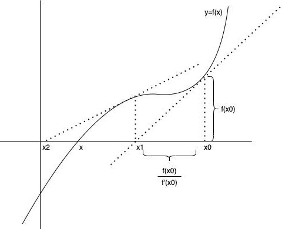

> @Author  : Lewis Tian (taseikyo@gmail.com)
>
> @Link    : github.com/taseikyo
>
> @Range   : 2024-05-19 - 2024-05-25

# Weekly #63

[readme](../README.md) | [previous](202405W2.md) | [next](202405W4.md)


\**Photo by [Matt Boitor](https://unsplash.com/@mattboitor) on [Unsplash](https://unsplash.com/photos/a-group-of-people-standing-on-top-of-a-sandy-beach-Of0B3Cc3C2A)*

## Table of Contents

- [algorithm](#algorithm-)
- [review](#review-)
    - Magic Number - 《雷神之锤 3》平方根倒数速算法
- [tip](#tip-)
- [share](#share-)

## algorithm [🔝](#weekly-63)

## review [🔝](#weekly-63)

### 1. [Magic Number - 《雷神之锤 3》平方根倒数速算法](https://zhuanlan.zhihu.com/p/445813662)

```C
float Q_rsqrt( float number ) {
    long i;
    float x2, y;
    const float threehalfs = 1.5F;
    x2 = number * 0.5F;
    y = number;
    i = * ( long * ) &y;             // evil floating point bit level hacking
    i = 0x5f3759df - (i >> 1);       // what the fuck?
    y = * ( float * ) &i;
    y = y * (threehalfs - ( x2 * y * y ) );     // 1st iteration
    y = y * (threehalfs - ( x2 * y * y ) );     // 2nd iteration, this can be removed
    return y;
}
```

如果你看到这个 `0x5f3759df` 数字，想必有点小懵逼，人生三问开始了：

- 它是谁？
- 它怎么来的？
- 它有什么用？

下面就会介绍这个 magic number 从何来，去何处。

1、为何需要这个算法？

当你需要在游戏中实现一些物理效果，比如光影效果、反射效果时，所关注的点其实是某个向量的方向，而不是这个向量的长度，如果能将所有向量给单位化，很多计算就会变得比较简单。

所以在计算中很重要的一点就是计算出单位向量，而在真正在运行代码中需要根据某个向量计算相应的单位向量，根据某个向量 `(x, y, z)` 计算法向量公式如下

$$
x_0 = x * \frac{1}{\sqrt{x^2 + y^2 + z^ 2}} \\

y_0 = y * \frac{1}{\sqrt{x^2 + y^2 + z^ 2}} \\

z_0 = z * \frac{1}{\sqrt{x^2 + y^2 + z^ 2}} \\
$$


2、二进制数的表示方法

为了能够方便对这些机器数进行算术运算、提高运算速度，计算机设计了许多种表示方式，其中比较常见的是：原码、反码、补码以及移码。下面主要以 8bit 长度的数 `0000 0100`，即十进制数 4，去介绍这几种表示方式

- 原码

原码表示方式是最容易理解的，首先第一位为符号位，后面七位表示的就是真值，如果表示负数，只需要将符号位置为 1 即可，后面七位依然为真值，所以 4 与 -4 的原码为：`0000 0100`，`1000 0100`

所以很容易就得出原码的表示范围为 [-127, 127]，会存在两个特殊的数为 +0 与 -0。

- 反码

正数的反码即是其原码，而负数的反码就是在保留符号位的基础上，其他位全部取反，所以 4 与 -4 的反码为：`0000 0100`，`1111 1011`

所以反码表示范围为 [-127, 127]，依然存在两个特殊的数为 +0 与 -0

- 补码

正数的补码即是其原码，而负数的补码就是在保留符号位的基础上，其他位全部取反，最后加 1，即在反码的基础上 +1，所以 4 与 -4 有补码是：`0000 0100`，`1111 1100`

所以补码表示范围为 [-128,127]，之前的 -0 在补码中被表示成了 -128，可以多表示一个数。

- 移码

在数轴上，移码表示的范围，恰好对应着真值在数轴上的范围向正方向移动 $2^n$
 个单元，对应着 8 个 bit 的范围从 [0, 255] 变为 [-128, 127]，可以看出偏移量为 128，所以 4 与 -4 的移码为：`0111 1100`，`1000 0100`

移码的一大好处就是方便比较，可以直接进行按位比较。

3、浮点数

先考虑一个问题，如果你用 32 位二进制如何表示 4.25？可能会是这样：

0000 0000 0000 0100 . 0100 0000 0000 0000

这放在普通十进制，这种想法其实非常常见，但是这种方式放在二进制世界中，总共 1 位符号位，15 号整数位，16 位小数位，总共表示数的范围只有 $[-2^{15}, 2^{15}]$，而对于长整型的范围却有 $[-2^{31}, 2^{31}]$，差的倍数有 6w5，可见这种方式为了小数表示抛弃了一半的位数，得不偿失，所以有人提出了 `IEEE754` 标准。

在描述这个标准前，先在这里说下科学计数法，在十进制中科学计数法表示如下

$$
12300 = 1.23 * 10^{4} \\
0.00123 = 1.23 * 10^{-3} \\
$$

同样的，可以将科学计数法运用到二进制中

$$
11.000= 1.1 * 2^{4} \\
0.0101= 1.01 * 2^{-2} \\
$$

所以 `IEEE754` 也是采用的是科学计数法的形式，会将 32 位数分为以下三部分

0 00000000 00000000000000000000000

- Sign Bit

首先第一位是符号位，0 表示正数，1 表示负数，而在平方根的计算中，明显不会涉及到负数，所以第一位肯定是为 0 的。

- Exponent

第二部分用 8 位 bit 表示指数部分，可以表示数的范围是 `[0, 255]`，但是这个只能表示正数，所以需要把负数也加进来，而 `IEEE754` 标准中阶码表示方式为移码，之所以要表示为移码的方式是在浮点数比较中，比较阶码的大小会变得非常简单，按位比较即可。不过和正常的移码有一点小区别是，`0000 0000` 与 `1111 1111` 用来表示非规格化数与一些特殊数，所以偏移量从 128 变为 127，表示范围也就变成了 `[-127, 126]`。

举个例子，众所周知啊，4 这个数的 8bit 真值为 `0000 0100`，加上 127 的偏移量变成 131，即 4 的移码为 `1000 0011`。

- Mantissa

小数部分就是剩余的 23 位，可以表示的范围就是 $[0, 1 - 2^{-23}]$，而科学计数法的第一位默认是为 1 的，所以这个范围就会变成 $[1, 2 - 2^{-23}]$，而 1 是默认存在的，这样就不会用这 23 位 bit 中一位专门来表示这个 1，从而多出一位来表示更广范围的小数，真正计算的时候再加上 1 即可。

下面我们以 9.625 这个数改成 IEEE 754 标准的机器数：

首先变为相应的二进制数为 1001.101，用规范的浮点数表达应为 $1.001101 * 2^{3}$，所以符号段为 0，指数部分的移码为 1000 0010，有效数字去掉 1 后为 001101，所以最终结果为

0 10000010 00110100000000000000000

4、二进制数转换

我们以 9.625 这个数为例，首先我们令阶码的真值为 E，则有

$$
E = 1000,0010_{(2)} = 130_{(10)}
$$

令余数为 M，则有

$$
M = 00110100000000000000000_{(2)} = {0.001101 * 2^{23}}_{(2)}
$$

现在我们先不认为这个是浮点数，这个数就是 32 位长整型，令这个数为 L，它所表示的十进制数便是这样

$$
L = 2^{23} * E + M
$$

这个数 L 便是这 32 位所表示的无符号整型，这个数后面有大用，我们先暂且把它放在这儿，后续再来看。

然后我们通过一个公式来表示这个浮点数 F 的十进制数

$$
F = (1 + \frac{M}{2^{23}}) * 2^{E - 127}
$$

尾数加 1 是因为在 IEEE754 标准中把首位的一去掉了，所以计算的时候需要把这个一给加上，然后阶码减去 127 是因为偏移为 127，要在 8 位真值的基础上减去 127 才是其表示真正的值。

然后有趣的事情就发生了，我们现在将这个数 F 取下对数

$$
\log_2 F = \log_2 (1 + \frac{M}{2^{23}}) + E - 127
$$

在这个公式，`E-127` 自然非常好计算，但是前面的对数计算起来是比较麻烦的，所以我们可以找个近似的函数去代替对数。

现在看下 $y=log_2(1 + x)$ 与 $y=x$ 的图像


根据图像，我们很容易得出下面这个结论

$$
\lim_{x \to 0^+} \log_2 (1 + x) = x \\

\lim_{x \to 1^-} \log_2 (1 + x) = x \\
$$

然后很容易发现，在 `[0, 1]` 这个范围内，$\log_2(x+1)$ 与 $x$ 其实是非常相近的，那样我们可以取一个在 `[0,1]` 的校正系数 $\mu$，使得下面公式成立

$$
\log_2 (x + 1) \approx x + \mu
$$

到此，我们知道了怎样去简化对数，所以我们可以将这个简化代入上面浮点数表示中，就可以得到

$$
\log_2 F = \log_2 (1 + \frac{M}{2^{23}}) + E - 127 \\
\approx (\frac{M}{2^{23}} + \mu) + E - 127 \\
= (\frac{M}{2^{23}} + \frac{E * 2^{23}}{2^{23}}) + \mu - 127 \\
= \frac{1}{2^{23}} (M + E * 2^{23}) + \mu - 127 \\
$$

看见这个 $M + E * 2 ^{23}$ 应该比较熟悉吧，这个数就是浮点数 F 的二进制数 L，然后代入约等式中得到 $\log_2 F \approx \frac{L}{2^{23}} + \mu - 127 $

在某种程度上，不考虑放缩与变换，我们可以认为浮点数的二进制表示 L 其实就是其本身 F 的对数形式，即 $\log_2 F \approx L$

5、三部曲

经过上面一系列复杂的数字处理操作，我们终于可以开始我们的算法三部曲了

5.1、evil bit hack

众所周知啊，每个变量都有自己的地址，程序运行的时候就会通过这个地址拿到这个变量的值，然后进行一系列的计算，比如 i 和 y 在内存中会这样表示


我们对长整型这些数据很好进行位移运算，比如我想将这个数乘以或者除以 $ 2^n $
，只需要左移或者右移 N 个位就可以，但是浮点数明显无法进行位运算，它本身二进制表示就不是为了位运算设计的。

然后，现在就会提出一个想法，我把 float 转成 int，然后进行位运算不就行了，代码如下：`long i = (long) y`

假设 y 为 3.33，进行长整型强转后，C 语言会直接丢弃尾数，i 也就变成了 3，丢失这么多精度，谁干啊，如果我们想一位都不动地进行位运算，就是下面这份代码：`i = * ( long * ) &y`

这个强转过程其实没改变内存中任何东西，首先它并没有改变地址，也没改变地址中所存储的数据，可以认为改变的是 C 语言的 “认知”，原本是要以 IEEE754 标准去读取这个地址中数据，但是 C 语言现在认为这个是长整型的地址，按长整型方式读取就行。所以 (long*)&y 代表 0x3d6f3d791 这个地址中存储的是长整型数据，然后我通过 * 运算符从这个地址中拿出数据，赋值给 i 这个长整型变量。


5.2、what the fuck

众所周知啊，位运算中的左移和右移一位分别会使原数乘以或者除以 2，比如

$$
x = 110 = 6 \\
x << 1 = 1100 = 12 \\
x >> 1 = 11 = 3
$$

我们想办法把平方根倒数做一个简单的转化 $\frac{1}{\sqrt x} = x^{-\frac{1}{2}} $

这个等式其实就是我们的最终目标，接下的计算就会逐渐往这个等式靠近，得到一个近似的结果。

在前面一步的叙述中，我们得出这样一个结论，浮点数的二进制表示其实就是其本身的对数形式，想要求的浮点数存储在 y 中，则有 y = 9.625

$ log_2 (y) \approx i = 01000001 \ 00011010 \ 00000000 \ 00000000 $

也就是说 i 中其实存储着 y 的对数，当然还需要进行一系列的转换与缩放。

前面提到过，直接运算一个数的平方根倒数，所以不如直接计算平方根倒数的对数，然后就会有如下等式

$\log_2 (\frac{1}{\sqrt y}) = \log_2 (y^{- \frac{1}{2}}) = - \frac{1}{2} \log_2(y) $

$\log_2 (y) \approx i $

$\log_2 (\frac{1}{\sqrt y}) \approx -(i >> 1)$

除法同样计算速度是比较慢的，所以我们用右移代替除法，这也就解释了 `-(i >> 1)` 其实是为了计算 $\log_2 (\frac{1}{\sqrt y})$ 的结果。

所以 `0x5f3759df` 这个数到底咋来的，为啥要这么计算，并且 `-(i >> 1)` 并不完全是 $\log_2 (\frac{1}{\sqrt y})$ 的近似值啊，根据公式还得除以 $2^{23}$，还得加上一定的误差。

先别急，我们先算下这个 `magic number` 是咋来的，令 $\Gamma$ 为 y 的平方根倒数，则有

$$
\Gamma = \frac{1}{\sqrt y} \\
\log_2 \Gamma = \log_2 (\frac{1}{\sqrt y}) = -\frac{1}{2} \log_2 (y)
$$

然后我们代入上面那个浮点数对数的公式中，则有

$$
\log_2 \Gamma = \frac{1}{2^{23}} (M_{\Gamma} + E_{\Gamma} * 2^{23}) + \mu - 127 \\
\log_2 y = \frac{1}{2^{23}} (M_y + E_y * 2^{23}) + \mu - 127 \\
\frac{1}{2^{23}} (M_{\Gamma} + E_{\Gamma} * 2^{23}) + \mu - 127 = -\frac{1}{2}(\frac{1}{2^{23}} (M_y + E_y * 2^{23}) + \mu - 127)
$$

现在经过一定的变换能够得到下面这个式子

$$
(M_{\Gamma} + E_{\Gamma} * 2^{23}) = \frac{3}{2}2^{23}(127 - \mu) -\frac{1}{2} (M_y + E_y * 2^{23}) \\
= 0x5f3759df - (i >> 1)
$$

这里 $\mu$ 是就是之前简化对数计算引进的误差，通过一定计算，得到最合适的 $\mu$，来得到 $\Gamma$  的近似值。这个计算过程偏向纯数学化的，具体过程请查阅 [《FAST INVERSE SQUARE ROOT》](http://www.matrix67.com/data/InvSqrt.pdf) 这篇论文。

原算法中取的$\mu$ \mu 值为 0.0450465，然后计算一下 $\frac{3}{2}2^{23}(127 - \mu) = \frac{3}{2}2^{23}(127 - 0.0450465) = 1597463007 $

这个数的十六进制就是 `0x5f3759df`，也就是上面提到的那个 `magin number`，然后我们根据这个数去计算得到的近似值，并与真正的 $\frac{1}{\sqrt y}$ 进行比较，具体函数图像如下


从上面的图像可以看到，在 `[1,100]` 这个区间内，所得到的近似值曲线已经和原始值制拟合的比较好了，这样我们已经完成了前面几个比较重要的步骤。

```
y = * ( float * ) &i;
```

这样我们通过和 `evial bit hack` 的逆向步骤，即将一个长整型的内存地址，转变成一个浮点型的内存地址，然后根据 IEEE754 标准取出这个浮点数，即我们要求的 $\Gamma$ 的近似值，其实到这里应该是算法差不多结束了，但是这个近似值还存在一定的误差，还需要经过一定的处理降低误差，更接近真实值。

5.4、Newton Iteration

本身我们已经得到了一个比较好的近似值，但是仍然存在一定的误差，而牛顿迭代法可以这个近似值更加接近真实的值，近一步减少误差。

牛顿迭代法本身是为了找到一个方程根的方法，比如现在有一个方程 $f(x)=0$ ，需要找到这个方程的根，但是解方程嘛，是不会解方程的，所以可以找到一个近似值来代替这个真正的解。



如上图，假设 $f(x)=0$ 的解为 $x=x_c$ ，我们需要首先给一个 x 的近似值 $x_0$，通过这个 $x_0$，不断求得一个与 $x_c$  更接近的值。

在 $(x_0, f(x_0))$ 处做切线，切线的斜率就是 $f(x)$ 在 $x=x_0 的导数 $f'(x_0)$，然后来求这条切线与 x 轴的交点 $x_1$，则有
$x_1 = x_0 - \frac{f(x_0)}{f'(x_0)} $

这样我们就完成了一次迭代，从图像上可以看见 $x_1$ 比 $x_0$ 更接近于真正的解，下一次迭代基于 $x_1$ 进行同样的步骤，就能得到比$x_1$ 更好的近似值 $x_2$ ，所以牛顿迭代公式非常简单：$x_{n + 1} = x_n - \frac{f(x_n)}{f'(x_0)}$

当这个迭代次数接近无限时，$x_n$ 也就越接近真正的解。

而最后一行就是经过一次迭代后的简化公式，这个公式怎么来的呢。对于一个浮点数 a，要求它的平分根倒数，则有：$ y = \frac{1}{\sqrt a} $

通过这个公式能构成一个函数：$f(y) = \frac{1}{y^2} - a $

求这个 y 值，其实就是求 $f(y)=0 的根，所以迭代公式就是：

$$
y_{n+1} = y_n - \frac{f(y_n)}{f'(y_n)} \\
= y_n - \frac{y_n^{-2} - a}{-2 * y_n^{-3}} \\
= y_n * (\frac{3}{2} - \frac{1}{2}* a * y_n^2)
$$

这个公式对应的算法中的代码

```
y = y * (threehalfs - ( x2 * y * y ) )
```

至此，你的代码就更接近真实的 $y=\frac{1}{\sqrt x}$ ，在更接近真实答案的同时，运行速率也大大提升。仅仅牺牲了一点点的准确性，却能提高整个的速度，这其实就是算法在优化中的一个比较重要的点。


## tip [🔝](#weekly-63)

## share [🔝](#weekly-63)

[readme](../README.md) | [previous](202405W2.md) | [next](202405W4.md)
