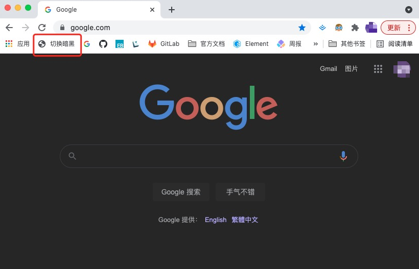
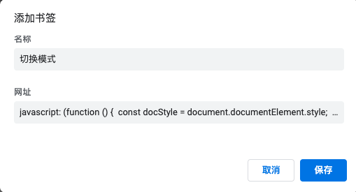

> @Author  : Lewis Tian (taseikyo@gmail.com)
>
> @Link    : github.com/taseikyo
>
> @Range   : 2024-05-26 - 2024-06-01

# Weekly #64

[readme](../README.md) | [previous](202405W3.md) | [next](202406W1.md)

本文总字数 1662 个，阅读时长约：2 分 18 秒，统计数据来自：[算筹字数统计](http://www.xiqei.com/tools?p=tj)。


\**Photo by [Valeriia Miller](https://unsplash.com/@valeriiamiller) on [Unsplash](https://unsplash.com/photos/a-person-is-taking-a-picture-of-a-city-GFqso6sfhus)*

## Table of Contents

- [algorithm](#algorithm-)
- [review](#review-)
- [tip](#tip-)
    - 一行代码 “黑” 掉任意网站
- [share](#share-)
    - 2 分钟规则

## algorithm [🔝](#weekly-64)

## review [🔝](#weekly-64)

## tip [🔝](#weekly-64)

### 1. [一行代码 “黑” 掉任意网站](https://xugaoyi.com/pages/dcebaf/)

实用技巧：只需一行代码，轻轻一点就可以把任意网站变成暗黑模式。



首先我们先做一个实验，在任意网站中，打开浏览器开发者工具 (F12)，在 Console 控制台输入如下代码并回车：

```js
document.documentElement.style.filter='invert(85%) hue-rotate(180deg)'
```

神奇的事情发生了，当前打开的网站变成了暗黑模式。

原理解释:

> document.documentElement 获取文档对象的根元素，即 <html> 元素
> 给 html 元素的.style 样式添加 filter 滤镜样式为 invert(85%) hue-rotate(180deg)
> invert() 反转图像。
> hue-rotate() 色相旋转。
>
> 更多滤镜知识：[filter](https://developer.mozilla.org/zh-CN/docs/Web/CSS/filter)

为了更方便实用，达到轻轻一点就可以对网页施加魔法🎉，

我们对代码做了一点点🤏🏻改动。（修正了滤镜对图片等元素的影响）

```js
javascript: (function () {  const docStyle = document.documentElement.style;  if (!window.modeIndex) {    window.modeIndex = 0;  }  const styleList = [    '',    'invert(85%) hue-rotate(180deg)',   'invert(100%) hue-rotate(180deg)',  ];  modeIndex = modeIndex >= styleList.length - 1 ? 0 : modeIndex + 1;  docStyle.filter = styleList[modeIndex];  document.body.querySelectorAll('img, picture, video').forEach(el => el.style.filter = modeIndex ? 'invert(1) hue-rotate(180deg)' : '');})();
```

然后打开浏览器书签管理器，添加新书签，在网址栏粘贴这段代码并保存：



以后在任意网站，只需要轻轻一点切换模式书签就可以让它变成 85% 的暗黑，再点一次就是 100% 的暗黑，再点一次变回正常模式。


## share [🔝](#weekly-64)

### 1. 2 分钟规则

- https://xugaoyi.com/pages/baaa02/

> 每当你发现很难开始执行某项任务时，可以试试将其缩减成 2 分钟的版本。
>
> 看一本书 → 看一页书
>
> 写一篇文章 → 写一句话
>
> 跑 10 公里 → 穿上跑鞋
>
> 做 100 次俯卧撑 → 做 1 次俯卧撑
>
> 多吃蔬菜水果 → 吃一个水果
>
> 编写一个程序 → 编写一个函数 → 编写一行代码
>
> 这样做的目的是使上手变得超级容易，让你先上手再说。一旦开始做了（这可能是最艰难的一步），你就会开始有动力，可能会继续做下去。
>
> 阅读一页 → 阅读 10 页 → 读完第一章
>
> 写一个句子 → 写文章的开头 → 写出正文
>
> 穿上跑鞋 → 步行 5 分钟 → 跑步 5 分钟
>
> 一旦开始，继续做下去就会容易得多。有时，你甚至会发现，自己在不知不觉间已经完成了任务。

[readme](../README.md) | [previous](202405W3.md) | [next](202406W1.md)
