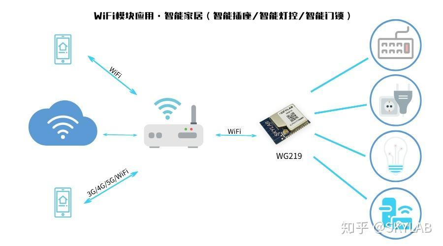

> @Author  : Lewis Tian (taseikyo@gmail.com)
>
> @Link    : github.com/taseikyo
>
> @Range   : 2024-06-02 - 2024-06-08

# Weekly #65

[readme](../README.md) | [previous](202405W4.md) | [next](202406W2.md)

本文总字数 8625 个，阅读时长约：13 分 18 秒，统计数据来自：[算筹字数统计](http://www.xiqei.com/tools?p=tj)。


\**Photo by [Tomáš Malík](https://unsplash.com/@malcoo) on [Unsplash](https://unsplash.com/photos/a-small-animal-sitting-on-top-of-a-tree-branch-iD6vjcgMoRo)*

## Table of Contents

- [algorithm](#algorithm-)
- [review](#review-)
    - 智能插座的原理
    - 智能插座（插排）的功能原理及 10 种用途
- [tip](#tip-)
    - 50 条有趣的 Python 一行代码
- [share](#share-)
    - 一个完美主义者的自我救赎

## algorithm [🔝](#weekly-65)

## review [🔝](#weekly-65)

### 1. [智能插座的原理](https://www.zhihu.com/question/305124186/answer/777038815)

WiFi 智能插座的工作原理：智能插座中内置 UART WiFi 模块，用户手机下载相关 APP，通过路由器连接 WiFi 与智能插座中的 WiFi 模块建立连接，获得智能插座的控制权限，也可以通过云端来实现控制。



[UART WiFi 模块](http://www.skylab.com.cn/productview-133-ESP8266_uartwifi_WG219.html)：模块内部集成了射频收发、MAC、基带处理、WiFi 协议和配置信息及网络协议栈，可将用户的物理设备连接到 WiFi 无线网络上，进行互联网或是局域网通信，实现联网功能。用户利用它可以轻松实现串口设备的无线网络功能，节省开发时间，使产品更快地投入市场，增强竞争力。UART WiFi 模块主要用于智能电网、智能交通、智能家居、手持设备、工业控制等领域。 目前市场上应用成熟 WiFi 智能插座解决方案还是比较多的，多是建立在 UART WiFi 模块的基础上，像 WU106,WG219 都是比较常用的两款智能插座 WiFi 模块，近期还有推出新的低成本串口 WiFi 模块，型号分别是 WG229 和 WG230。

目前市场上应用成熟 WiFi 智能插座解决方案还是比较多的，多是建立在 UART WiFi 模块的基础上，像 WU106,WG219 都是比较常用的两款智能插座 WiFi 模块，近期还有推出新的低成本串口 WiFi 模块，型号分别是 WG229 和 WG230。

### 2. [智能插座（插排）的功能原理及 10 种用途](https://yoyapai.com/smarthome/17662)

进行全屋智能家居装修改造过程中，使用智能插座是非常方法快捷的方法，可以让普通家用电器变成具有智能功能的电器，而且成本也很低。

例如，配合智能插座，普通的家用电器就可以具有以下智能功能：远程控制、语音控制、定时开关、倒计时开关、耗电统计、过流高温提醒、智能照明、智能防盗等功能，既让生活更方便，又消除了用电安全隐患。

如果将智能插座与其他智能硬件互联，则可以自定义更多的智能家居应用场景，并且还有无数有趣的玩法等待您探索。


1、智能插座的功能和原理

智能插座是什么？简单来说，就是可以通过 wifi、蓝牙或其他网络连接到互联网，可以使用手机 APP 进行远程操控，并且拥有智能芯片的插座。

智能插座的外形通常与普通插座没什么区别，一般都有插头，兼容普通插座，可以直接插在插座中使用；还具有一个或数个标准电源插孔，兼容普通的电器插头，可以将电器直接插入使用。有的还具有 USB 插孔，方便对手机等设备充电。

智能插座的外形及结构如下图所示：


上图中的智能插座不需要安装就可以直接使用，并且携带方便，可以灵活移动到任何房间的插座上使用，也可以在旅途中使用。

当然，还有其他类型的智能插座，比如面板式智能插座，可以代替普通插座固定到墙壁上来使用。

还有智能插排，通过手机 APP 就可以控制多个电源插口，数十组定时，保证多个电器互一影响，如下图所示：


另外，还有价格比较昂贵的办公、厨房专用的嵌入电动伸缩式多功能智能插排、轨道式智能插排、具有音箱功能的智能插排等等。总之，智能插座、插排的产品非常丰富，已经是非常成熟的智能家居产品。

2、智能插座（插排）的 10 种用途

通过手机远程智能操控智能插座，也就是同时在控制任何可以插到插座上使用的家用电器。因此，理论上智能插座的使用方法可以有无数种。以下例举几种智能插座的使用方法和思路，以启发大家探索、挖掘智能插座更多的用途。

- 定时、遥控智能照明

智能插座与普通的灯泡、台灯等照明设备连接，然后在手机 APP 上进行定时，可以在夜幕降临时自动开启照明设备。您也可以躺在舒适的被窝里，使用语音或手机 APP 遥控关闭或开启灯泡。在智能插座配合下，普通的灯泡也成为智能灯泡。

- 早上起床，就可以享用热腾腾的早餐

将普通烧水壶、豆浆机与智能插座相连，并通过手机 APP 定时在早上起床前的适当时间开启。当您醒来后，就会闻到新鲜豆浆的味道。或者在起来后，无需等待就可以来一杯热水。

- 安心入睡，让普通音箱自动关机

担心自己在听音乐时睡着，音箱等设备会连续开启一夜？那么可以将这些设备的电源线插入智能插座，并通过手机设置倒计时。这样，即使您已经入睡，音箱等设置也会在时间到时自动关闭。

- 还在下班的路上，家里已经有煲好的鸡汤等待您

对于一些耗时较长的美食，比如煲鸡汤、米粥，您可以提前将食材准备好，将普通电饭煲插入智能插座并打开开关，下班前，通过手机开启电源让电饭煲开始工作。当您进入家门，就能闻到饭香，温馨的感觉一扫工作的疲惫。

- 控制孩子们看电视、玩游戏的时间

在寒假暑假期间，孩子们常常会独自在家，没有节制地玩游戏、看电视，严重影响了孩子的健康成长。您可以将原来的普通插座，换成面板式智能插座固定在墙壁上，并将游戏机、电视机电源插头也固定到智能插座上。这样，您即使不在家里，也可以设置好时间，在每天的固定时间内让智能插座保持接通电源状态。

- 普通电热器变成智能电热器

这也是一个非常实用的智能插座应用场景。通过将普通电热器连接在智能插座上，您可以在回家之前通过手机遥控开启电源，让电热器提前工作。等您到家时，面对的不再是冰冷的家。

- 精准掌握电器耗电量

智能插座通常具有电量统计芯片。通过手机 APP 的统计功能，您可以了解电器每天、每月、每年的用电量。该功能的用途非常广泛，比如，可以帮助您了解电器的真实功耗，避免被商家欺诈；可以应用在出租房内，让每个人的用电量清晰透明。

- 智能电流报警

因电器有故障等原因造成了电流异常，导致电源线和插座过热时，智能插座会自动断电，并通过手机向您发送报警信息，以便您及时处理，避免火灾等安全隐患。

- 睡觉前彻底关闭厨房电源

您是否有睡觉前到厨房检查所有电器是否关闭的习惯？使用智能插座，可以让你从这一琐事是解脱。通过手机为智能插座定时，让它在每晚的十点自动切断电源。这样就避免了您每晚忍着睡意强打精神，痛苦地去厨房检查电源。此外，你还可以随时通过手机，检查电源是否已经关闭。

- 智能防盗功能

这是智能插座可以实现的一个有趣的功能。

您或许听说过有很多防盗小设备，可以在您不在家时，自动发光或发出声音，制造有人在家的假象，以吓阻小偷。

现在，您可以使用智能插座来实现这一效果，而且更智能。您可以将普通灯泡、音箱连接到智能插座，在手机上通过定时或者手动控制，让灯泡和音箱发出声音，营造出室内有人活动的假象。

## tip [🔝](#weekly-65)

### 1. [50 条有趣的 Python 一行代码](https://zhuanlan.zhihu.com/p/420029030)


1、字母异位词

两个单词如果包含相同的字母，次序不同，则称为字母易位词 (anagram)。

例如，“silent” 和 “listen” 是字母易位词，而 “apple” 和 “aplee” 不是易位词。

```python
from collections import Counter

s1 = 'below'
s2 = 'elbow'

print('anagram') if Counter(s1) == Counter(s2) else print('not an anagram')
```

使用一行 Python 代码，就能判断出来了。

2、二进制转十进制

```python
decimal = int('1010', 2)
print(decimal) #10
```

3、将字符串转换为小写

```python
print("Hi my name is XiaoF".lower())
# 'hi my name is xiaof'

print("Hi my name is XiaoF".casefold())
# 'hi my name is xiaof'
```

4、将字符串转换为大写

```python
print("hi my name is XiaoF".upper())
# 'HI MY NAME IS XIAOF'
```

5、将字符串转换为字节

```python
print("convert string to bytes using encode method".encode())
# b'convert string to bytes using encode method'
```

6、拷贝文件

```python
import shutil

shutil.copyfile('source.txt', 'dest.txt')
```

7、快速排序

```python
qsort = lambda l: l if len(l) <= 1 else qsort([x for x in l[1:] if x < l[0]]) + [l[0]] + qsort([x for x in l[1:] if x >= l[0]])

print(qsort([17, 29, 11, 97, 103, 5]))
# [5, 11, 17, 29, 97, 103]
```

8、n 个连续数的和

```python
n = 10

print(sum(range(0, n+1)))
# 55
```

9、交换两个变量的值

```python
a,b = b,a
```

10、斐波纳契数列

```python
fib = lambda x: x if x<=1 else fib(x-1) + fib(x-2)

print(fib(20))
# 6765
```

11、将嵌套列表合并为一个列表

```python
main_list = [[0, 1, 2], [11, 12, 13], [52, 53, 54]]

result = [item for sublist in main_list for item in sublist]
print(result)

>
[0, 1, 2, 11, 12, 13, 52, 53, 54]
```

12、运行一个 HTTP 服务器

```python
python3 -m http.server 8000
python2 -m SimpleHTTPServer
```

13、反转列表

```python
numbers = [0, 1, 2, 11, 12, 13, 52, 53, 54]

print(numbers[::-1])
# [54, 53, 52, 13, 12, 11, 2, 1, 0]
```

14、阶乘

```python
import math

fact_5 = math.factorial(5)
print(fact_5)
# 120
```

15、在列表推导式中使用 for 和 if

```python
even_list = [number for number in [1, 2, 3, 4] if number % 2 == 0]

print(even_list)
# [2, 4]
```

16、列表中最长的字符串

```python
words = ['This', 'is', 'a', 'list', 'of', 'words']

result = max(words, key=len)
print(result)
# 'words'
```

17、列表推导式

```python
li = [num for num in range(0, 10)]

print(li)
# [0, 1, 2, 3, 4, 5, 6, 7, 8, 9]
```

18、集合推导式

```python
num_set = {num for num in range(0, 10)}

print(num_set)
# {0, 1, 2, 3, 4, 5, 6, 7, 8, 9}
```

19、字典推导式

```python
dict_numbers = {x: x*x for x in range(1, 5)}

print(dict_numbers)
# {1: 1, 2: 4, 3: 9, 4: 16}
```

20、if-else

```python
print("even") if 4 % 2==0 else print("odd")
```

21、无限循环

```python
while 1:0
```

22、检查数据类型

```python
print(isinstance(2, int))
# True

print(isinstance("allwin", str))
# True

print(isinstance([3, 4, 1997], list))
# True
```

23、While 循环

```python
a = 5

while a > 0:
    a = a - 1

print(a)
# 0
```

24、使用 print 语句写入文件

```python
print("Hello, World!", file=open('file.txt', 'w'))
```

既可打印出信息，还能将信息保存文件。

25、计算一个字符在字符串中出现的频率

```python
print("umbrella".count('l'))
# 2
```

26、合并列表

```python
list1 = [1, 2, 4]
list2 = ['XiaoF']
list1.extend(list2)

print(list1)
# [1, 2, 4, 'XiaoF']
```

27、合并字典

```python
dict1 = {'name': 'weiwei', 'age': 23}
dict2 = {'city': 'Beijing'}
dict1.update(dict2)

print(dict1)
# {'name': 'weiwei', 'age': 23, 'city': 'Beijing'}
```

28、合并集合

```python
set1 = {0, 1, 2}
set2 = {11, 12, 13}
set1.update(set2)

print(set1)
# {0, 1, 2, 11, 12, 13}
```

29、时间戳

```python
import time

print(time.time())
```

30、列表中出现次数最多的元素

```python
test_list = [9, 4, 5, 4, 4, 5, 9, 5, 4]
most_frequent_element = max(set(test_list), key=test_list.count)

print(most_frequent_element)
# 4
```

31、嵌套列表

```python
numbers = [[num] for num in range(10)]

print(numbers)
# [[0], [1], [2], [3], [4], [5], [6], [7], [8], [9]]
```

32、八进制转十进制

```python
print(int('30', 8))
# 24
```

33、将键值对转换为字典

```python
result = dict(name='XiaoF', age=23)

print(result)
# {'name': 'XiaoF', 'age': 23}
```

34、求商和余数

```python
quotient, remainder = divmod(4, 5)

print(quotient, remainder)
# 0 4
```

divmod () 函数返回当参数 1 除以参数 2 时，包含商和余数的元组。

35、删除列表中的重复项

```python
print(list(set([4, 4, 5, 5, 6])))
# [4, 5, 6]
```

36、按升序排序列表

```python
print(sorted([5, 2, 9, 1]))
# [1, 2, 5, 9]
```

37、按降序排序列表

```python
print(sorted([5, 2, 9, 1], reverse=True))
# [9, 5, 2, 1]
```

38、获取小写字母表

```python
import string

print(string.ascii_lowercase)
# abcdefghijklmnopqrstuvwxyz
```

39、获取大写字母表

```python
import string

print(string.ascii_uppercase)
# ABCDEFGHIJKLMNOPQRSTUVWXYZ
```

40、获取 0 到 9 字符串

```python
import string

print(string.digits)
# 0123456789
```

41、十六进制转十进制

```python
print(int('da9', 16))
# 3497
```

42、日期时间

```python
import time

print(time.ctime())
# Thu Aug 13 20:00:00 2021
```

43、将列表中的字符串转换为整数

```python
print(list(map(int, ['1', '2', '3'])))
# [1, 2, 3]
```

44、用键对字典进行排序

```python
d = {'one': 1, 'four': 4, 'eight': 8}
result = {key: d[key] for key in sorted(d.keys())}

print(result)
# {'eight': 8, 'four': 4, 'one': 1}
```

45、用键值对字典进行排序

```python
x = {1: 2, 3: 4, 4: 3, 2: 1, 0: 0}
result = {k: v for k, v in sorted(x.items(), key=lambda item: item[1])}

print(result)
# {0: 0, 2: 1, 1: 2, 4: 3, 3: 4}
```

46、列表旋转

```python
li = [1, 2, 3, 4, 5]

# li[n:] + li[:n], 右变左
print(li[2:] + li[:2])
# [3, 4, 5, 1, 2]

# li[-n:] + li[:-n], 左变右
print(li[-1:] + li[:-1])
# [5, 1, 2, 3, 4]
```

47、将字符串中的数字移除

```python
message = ''.join(list(filter(lambda x: x.isalpha(), 'abc123def4fg56vcg2')))

print(message)
# abcdeffgvcg
```

48、矩阵变换

```python
old_list = [[1, 2, 3], [3, 4, 6], [5, 6, 7]]
result = list(list(x) for x in zip(*old_list))

print(result)
# [[1, 3, 5], [2, 4, 6], [3, 6, 7]]
```

49、列表过滤

```python
result = list(filter(lambda x: x % 2 == 0, [1, 2, 3, 4, 5, 6]))

print(result)
# [2, 4, 6]
```

50、解包

```python
a, *b, c = [1, 2, 3, 4, 5]

print(a) # 1
print(b) # [2, 3, 4]
print(c) # 5
```

## share [🔝](#weekly-65)

### 1. [一个完美主义者的自我救赎](https://xugaoyi.com/pages/2d615df9a36a98ed/)

最近，看到一个心理测试题是测试你是否有完美主义：

> （1）你是不是经常为自己设定目标，而且最终往往达不到那些目标？
>
> （2）当一件事件做得不够好时，你是否有再试一次的想法？
>
> （3）你是否休息时仍想着学习、工作、或者其他还没有解决的事？
>
> （4）如果遇到别人说话或打岔，破坏了你的注意力，你是否觉得不太高兴？
>
> （5）你是否常常会在事后想，如果当时能换成另一种方式来解决，也许会更加理想？

如果上面的问题，你的回答大部分是肯定的，那么你就有完美主义倾向。

对照自身，我就是那个完美主义者，时常会因为某件事做得不够好而感到痛苦，给我带来的后果就是：为了一件事想要达到 “完美” 的标准，付出了更多的成本，从而忽略真正需要优先处理的其他事情。最后，即使付出了成本，得到的结果也不一定是想要的 "完美"。

看过一篇文章，里面说到：

> 完美主义是一种压力，它让你为自己创造不切实际的期望。你明明做到了正常水平，但是因为设定的目标太高，所以看上去距离目的地仍然很遥远。你的心态变成了：这一切还不够好，依然可以改进。

完美主义消耗了我们最宝贵的资源和时间，让你将注意力从真正的优先事项上移开。

完美主义就是追求一个较高水平的目标，不接受一个较低水平的，但可用的结果。我一直告诫自己，改掉追求完美的毛病。

完美主义已经对我造成了一些压力，还会妨碍我开始进入某些事情，总想着万事俱备之后才开始，结果是没有万事俱备，也没有东风，这事就搁置了。

某个军事文章里说，他们特种部队的射击理念是：绝对快，相对准！

> 玩吃鸡游戏似乎也是这样，需要你有快速的反应能力，不管打不打到人，先开枪再说，即使打不到也可以吓到敌人啊，哈哈哈

这个理念似乎也适用于我这样的完美主义者，“做得快” 比 “做得好” 要好，不要太执着于 “完美”，就好像我开始写博客，我知道自己的写作水平并不好，但这并不妨碍我开始写博客，相信我会越写越好的～

最后，心理医生也说过追求完美并不利于身心健康，不要追求完美，随心所欲地生活吧！

[readme](../README.md) | [previous](202405W4.md) | [next](202406W2.md)
