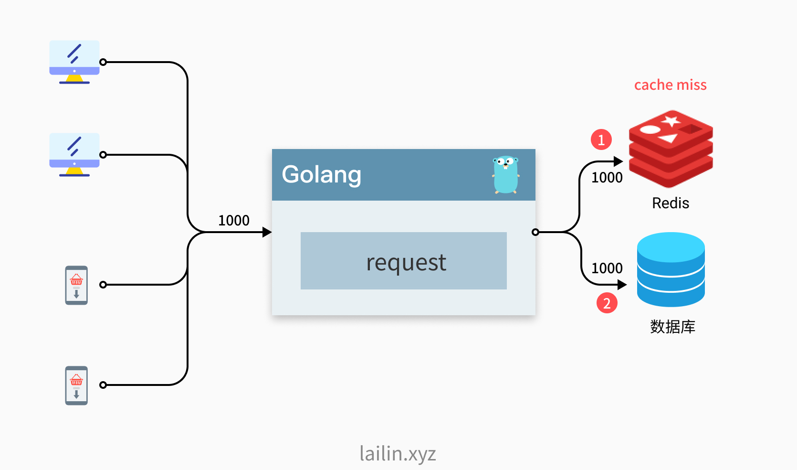
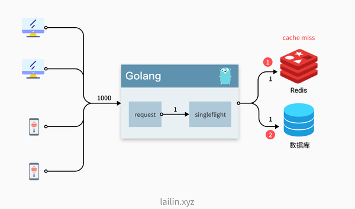
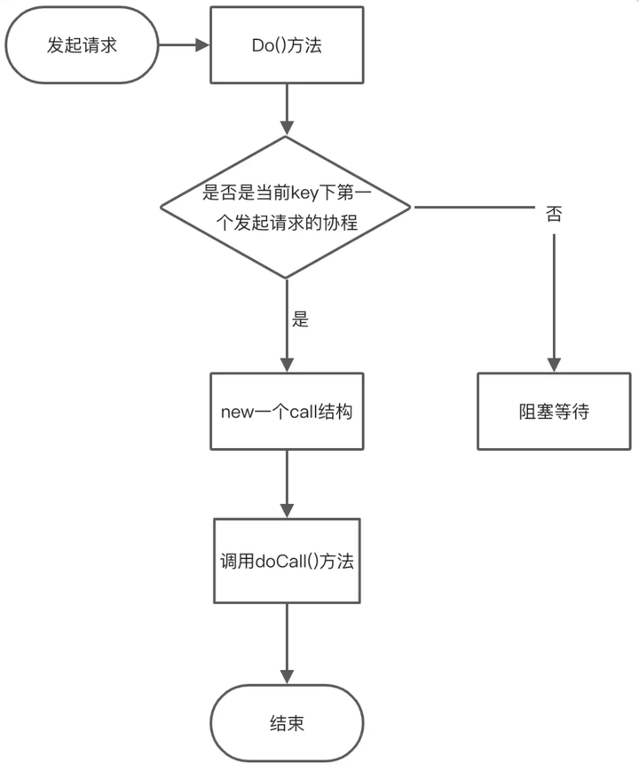
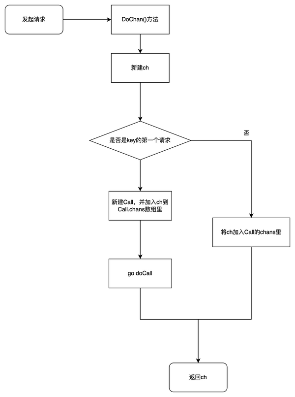
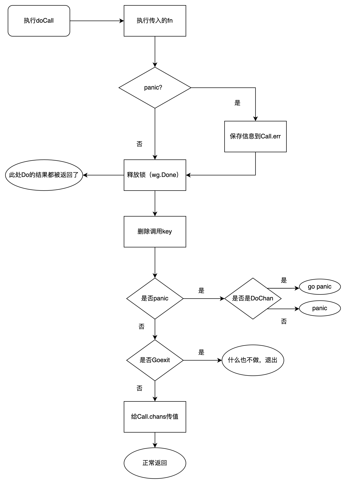
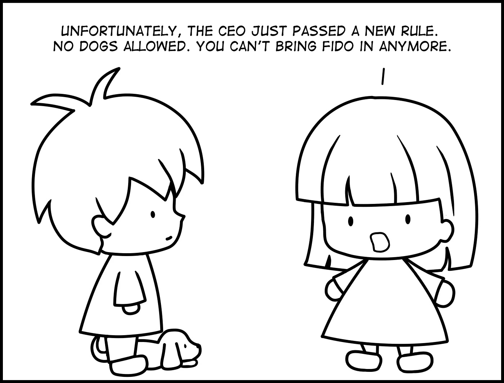

> @Author  : Lewis Tian (taseikyo@gmail.com)
>
> @Link    : github.com/taseikyo
>
> @Range   : 2024-06-16 - 2024-06-22

# Weekly #67

[readme](../README.md) | [previous](202406W2.md) | [next](202406W4.md)

本文总字数 24945 个，阅读时长约：22 分 53 秒，统计数据来自：[算筹字数统计](http://www.xiqei.com/tools?p=tj)。


\**Photo by [Clay Banks](https://unsplash.com/@claybanks) on [Unsplash](https://unsplash.com/photos/a-dining-room-table-with-a-vase-of-flowers-on-it-kfV2Dt5TbmA)*

## Table of Contents

- [algorithm](#algorithm-)
- [review](#review-)
    - Linux 启动和启动过程简介
    - Go 并发工具 SingleFlight 实现原理
- [tip](#tip-)
- [share](#share-)
    - Average Manager vs. Great Manager

## algorithm [🔝](#weekly-67)

## review [🔝](#weekly-67)

### 1. [Linux 启动和启动过程简介](https://opensource.com/article/17/2/linux-boot-and-startup)

Understanding the Linux boot and startup processes is important to being able to both configure Linux and to resolving startup issues. This article presents an overview of the bootup sequence using the [GRUB2 bootloader](https://en.wikipedia.org/wiki/GNU_GRUB) and the startup sequence as performed by the [systemd initialization system](https://en.wikipedia.org/wiki/Systemd).

In reality, there are two sequences of events that are required to boot a Linux computer and make it usable: *boot* and *startup*. The *boot* sequence starts when the computer is turned on, and is completed when the kernel is initialized and systemd is launched. The *startup* process then takes over and finishes the task of getting the Linux computer into an operational state.

Overall, the Linux boot and startup process is fairly simple to understand. It is comprised of the following steps which will be described in more detail in the following sections.

- BIOS POST
- Boot loader (GRUB2)
- Kernel initialization
- Start systemd, the parent of all processes.

Note that this article covers GRUB2 and systemd because they are the current boot loader and initialization software for most major distributions. Other software options have been used historically and are still found in some distributions.

1、The boot process

The boot process can be initiated in one of a couple ways. First, if power is turned off, turning on the power will begin the boot process. If the computer is already running a local user, including root or an unprivileged user, the user can programmatically initiate the boot sequence by using the GUI or command line to initiate a reboot. A reboot will first do a shutdown and then restart the computer.

1.1、BIOS POST

The first step of the Linux boot process really has nothing whatever to do with Linux. This is the hardware portion of the boot process and is the same for any operating system. When power is first applied to the computer it runs the POST (Power On Self Test) which is part of the BIOS (Basic I/O System).

When IBM designed the first PC back in 1981, BIOS was designed to initialize the hardware components. POST is the part of BIOS whose task is to ensure that the computer hardware functioned correctly. If POST fails, the computer may not be usable and so the boot process does not continue.

BIOS POST checks thebasic operability of the hardware and then it issues a BIOS [interrupt](https://en.wikipedia.org/wiki/BIOS_interrupt_call), INT 13H, which locates the boot sectors on any attached bootable devices. The first boot sector it finds that contains a valid boot record is loaded into RAM and control is then transferred to the code that was loaded from the boot sector.

The boot sector is really the first stageof the boot loader. There are three boot loaders used by most Linux distributions, GRUB, GRUB2, and LILO. GRUB2 is the newest and is used much more frequently these days than the other older options.

1.2、GRUB2

GRUB2 stands for "GRand Unified Bootloader, version 2" and it is now the primary bootloader for most current Linux distributions. GRUB2 is the program which makes the computer just smart enough to find the operating system kernel and load it into memory. Because it is easier to write and say GRUB than GRUB2, I may use the term GRUB in this document but I will be referring to GRUB2 unless specified otherwise.

GRUB has been designed to be compatible with the [multiboot specification](https://en.wikipedia.org/wiki/Multiboot_Specification) which allows GRUB to boot many versions of Linux and other free operating systems; it can also chain load the boot record of proprietary operating systems.

GRUB can also allow the user to choose to boot from among several different kernels for any given Linux distribution. This affords the ability to boot to a previous kernel version if an updated one fails somehow or is incompatible with an important piece of software. GRUB can be configured using the /boot/grub/grub.conf file.

GRUB1 is now considered to be legacy and has been replaced in most modern distributions with GRUB2, which is a rewrite of GRUB1. Red Hat based distros upgraded to GRUB2 around Fedora 15 and CentOS/RHEL 7. GRUB2 provides the same boot functionality as GRUB1 but GRUB2 is also a mainframe-like command-based pre-OS environment and allows more flexibility during the pre-boot phase. GRUB2 is configured with /boot/grub2/grub.cfg.

The primary function of either GRUB is to get the Linux kernel loaded into memory and running. Both versions of GRUB work essentially the same way and have the same three stages, but I will use GRUB2 for this discussion of how GRUB does its job. The configuration of GRUB or GRUB2 and the use of GRUB2 commands is outside the scope of this article.

Although GRUB2 does not officially use the stage notation for the three stages of GRUB2, it is convenient to refer to them in that way, so I will in this article.

1.2.1、Stage 1

As mentioned in the BIOS POST section, at the end of POST, BIOS searches the attached disks for a boot record, usually located in the Master Boot Record (MBR), it loads the first one it finds into memoryand then starts execution of the boot record. The bootstrap code, i.e., GRUB2 stage 1, is very small because it must fit into the first 512-byte sector on the hard drive along with the partition table. The total amount of space allocated for the actual bootstrap code in a [classic generic MBR](https://en.wikipedia.org/wiki/Master_boot_record) is 446 bytes. The 446 Byte file for stage 1 is named boot.img and does not contain the partition table which is added to the boot record separately.

Because the boot record must be so small, it is also not very smart and does not understand filesystem structures. Therefore the sole purpose of stage 1 is to locate and load stage 1.5. In order to accomplish this, stage 1.5 of GRUB must be located in the space between the boot record itself and the first partition on the drive. After loading GRUB stage 1.5 into RAM, stage 1 turns control over to stage 1.5.

1.2.2、Stage 1.5

As mentioned above, stage 1.5 of GRUB must be located in the space between the boot record itself and the first partition on the disk drive. This space was left unused historically for technical reasons. The first partition on the hard drive begins at sector 63 and with the MBR in sector 0, that leaves 62 512-byte sectors—31,744 bytes—in which to store the core.img file which is stage 1.5 of GRUB. The core.img file is 25,389 Bytes so there is plenty of space available between the MBR and the first disk partition in which to store it.

Because of the larger amount of code that can be accommodated for stage 1.5, it can have enough code to contain a few common filesystem drivers, such as the standard EXT and other Linux filesystems, FAT, and NTFS. The GRUB2 core.img is much more complex and capable than the older GRUB1 stage 1.5. This means that stage 2 of GRUB2 can be located on a standard EXT filesystem but it cannot be located on a logical volume. So the standard location for the stage 2 files is in the /boot filesystem, specifically /boot/grub2.

Note that the /boot directory must be located on a filesystem that is supported by GRUB. Not all filesystems are. The function of stage 1.5 is to begin execution with the filesystem drivers necessary to locate the stage 2 files in the /boot filesystem and load the needed drivers.

1.2.3、Stage 2

All of the files for GRUB stage 2 are located in the /boot/grub2 directory and several subdirectories. GRUB2 does not have an image file like stages 1 and 2. Instead, it consists mostly of runtime kernel modules that are loaded as needed from the /boot/grub2/i386-pc directory.

The function of GRUB2 stage 2 is to locate and load a Linux kernel into RAM and turn control of the computer over to the kernel. The kernel and its associated files are located in the /boot directory. The kernel files are identifiable as they are all named starting with vmlinuz. You can list the contents of the /boot directory to see the currently installed kernels on your system.

GRUB2, like GRUB1, supports booting from one of a selection of Linux kernels. The Red Hat package manager, DNF, supports keeping multiple versions of the kernel so that if a problem occurs with the newest one, an older version of the kernel can be booted. By default, GRUB provides a pre-boot menu of the installed kernels, including a rescue option and, if configured, a recovery option.

Stage 2 of GRUB2 loads the selected kernel into memory and turns control of the computer over to the kernel.

1.3、 Kernel

All of the kernels are in a self-extracting, compressed format to save space. The kernels are located in the /boot directory, along with an initial RAM disk image, and device maps of the hard drives.

After the selected kernel is loaded into memory and begins executing, it must first extract itself from the compressed version of the file before it can perform any useful work. Once the kernel has extracted itself, it loads [systemd](https://en.wikipedia.org/wiki/Systemd), which is the replacement for the old [SysV init](https://en.wikipedia.org/wiki/Init#SysV-style) program, and turns control over to it.

This is the end of the boot process. At this point, the Linux kernel and systemd are running but unable to perform any productive tasks for the end user because nothing else is running.

2、The startup process

The startup process follows the boot process and brings the Linux computer up to an operational state in which it is usable for productive work.

2.1、systemd

systemd is the mother of all processes and it is responsible for bringing the Linux host up to a state in which productive work can be done. Some of its functions, which are far more extensive than the old init program, are to manage many aspects of a running Linux host, including mounting filesystems, and starting and managing system services required to have a productive Linux host. Any of systemd's tasks that are not related to the startup sequence are outside the scope of this article.

First, systemd mounts the filesystems as defined by **/etc/fstab**, including any swap files or partitions. At this point, it can access the configuration files located in /etc, including its own. It uses its configuration file, **/etc/systemd/system/default.target**, to determine which state or target, into which it should boot the host. The **default.target** file is only a symbolic link to the true target file. For a desktop workstation, this is typically going to be the graphical.target, which is equivalent to **runlevel** **5** in the old SystemV init. For a server, the default is more likely to be the **multi-user.target** which is like **runlevel** **3** in SystemV. The **emergency.target** is similar to single user mode.

Note that targets and services are systemd units.

Table 1, below, is a comparison of the systemd targets with the old SystemV startup runlevels. The **systemd target aliases** are provided by systemd for backward compatibility. The target aliases allow scripts—and many sysadmins like myself—to use SystemV commands like **init 3** to change runlevels. Of course, the SystemV commands are forwarded to systemd for interpretation and execution.

> Table 1: Comparison of SystemV runlevels with systemd targets and some target aliases.

<table><tbody><tr><td><small><strong>SystemV Runlevel</strong></small></td><td><small><strong>systemd target</strong></small></td><td><small><strong>systemd target aliases</strong></small></td><td><small><strong>Description</strong></small></td></tr><tr><td><small>&nbsp;</small></td><td><small>halt.target</small></td><td><small>&nbsp;</small></td><td><small>Halts the system without powering it down.</small></td></tr><tr><td><small>0</small></td><td><small>poweroff.target</small></td><td><small>runlevel0.target</small></td><td><small>Halts the system and turns the power off.</small></td></tr><tr><td><small>S</small></td><td><small>emergency.target</small></td><td><small>&nbsp;</small></td><td><small>Single user mode. No services are running; filesystems are not mounted. This is the most basic level of operation with only an emergency shell running on the main console for the user to interact with the system.</small></td></tr><tr><td><small>1</small></td><td><small>rescue.target</small></td><td><small>runlevel1.target</small></td><td><small>A base system including mounting the filesystems with only the most basic services running and a rescue shell on the main console.</small></td></tr><tr><td><small>2</small></td><td><small>&nbsp;</small></td><td><small>runlevel2.target</small></td><td><small>Multiuser, without NFS but all other non-GUI services running.</small></td></tr><tr><td><small>3</small></td><td><small>multi-user.target</small></td><td><small>runlevel3.target</small></td><td><small>All services running but command line interface (CLI) only.</small></td></tr><tr><td><small>4</small></td><td><small>&nbsp;</small></td><td><small>runlevel4.target</small></td><td><small>Unused.</small></td></tr><tr><td><small>5</small></td><td><small>graphical.target</small></td><td><small>runlevel5.target</small></td><td><small>multi-user with a GUI.</small></td></tr><tr><td><small>6</small></td><td><small>reboot.target</small></td><td><small>runlevel6.target</small></td><td><small>Reboot</small></td></tr><tr><td><small>&nbsp;</small></td><td><small>default.target</small></td><td><small>&nbsp;</small></td><td><small>This target is always aliased with a symbolic link to either multi-user.target or graphical.target. systemd always uses the default.target to start the system. The default.target should never be aliased to halt.target, poweroff.target, or reboot.target.</small></td></tr></tbody></table>


Each target has a set of dependencies described in its configuration file. systemd starts the required dependencies. These dependencies are the services required to run the Linux host at a specific level of functionality. When all of the dependencies listed in the target configuration files are loaded and running, the system is running at that target level.

systemd also looks at the legacy SystemV init directories to see if any startup files exist there. If so, systemd used those as configuration files to start the services described by the files. The deprecated network service is a good example of one of those that still use SystemV startup files in Fedora.

Figure 1, below, is copied directly from the **bootup** [man page](http://man7.org/linux/man-pages/man7/bootup.7.html). It shows the general sequence of events during systemd startup and the basic ordering requirements to ensure a successful startup.

The **sysinit.target** and **basic.target** targets can be considered as checkpoints in the startup process. Although systemd has as one of its design goals to start system services in parallel, there are still certain services and functional targets that must be started before other services and targets can be started. These checkpoints cannot be passed until all of the services and targets required by that checkpoint are fulfilled.

So the **sysinit.target** is reached when all of the units on which it depends are completed. All of those units, mounting filesystems, setting up swap files, starting udev, setting the random generator seed, initiating low-level services, and setting up cryptographic services if one or more filesystems are encrypted, must be completed, but within the **sysinit****.target** those tasks can be performed in parallel.

The **sysinit.target** starts up all of the low-level services and units required for the system to be marginally functional and that are required to enable moving on to the basic.target.

```
local-fs-pre.target
            |
            v
   (various mounts and   (various swap   (various cryptsetup
    fsck services...)     devices...)        devices...)       (various low-level   (various low-level
            |                  |                  |             services: udevd,     API VFS mounts:
            v                  v                  v             tmpfiles, random     mqueue, configfs,
     local-fs.target      swap.target     cryptsetup.target    seed, sysctl, ...)      debugfs, ...)
            |                  |                  |                    |                    |
            \__________________|_________________ | ___________________|____________________/
                                                 \|/
                                                  v
                                           sysinit.target
                                                  |
             ____________________________________/|\________________________________________
            /                  |                  |                    |                    \
            |                  |                  |                    |                    |
            v                  v                  |                    v                    v
        (various           (various               |                (various          rescue.service
       timers...)          paths...)              |               sockets...)               |
            |                  |                  |                    |                    v
            v                  v                  |                    v              rescue.target
      timers.target      paths.target             |             sockets.target
            |                  |                  |                    |
            v                  \_________________ | ___________________/
                                                 \|/
                                                  v
                                            basic.target
                                                  |
             ____________________________________/|                                 emergency.service
            /                  |                  |                                         |
            |                  |                  |                                         v
            v                  v                  v                                 emergency.target
        display-        (various system    (various system
    manager.service         services           services)
            |             required for            |
            |            graphical UIs)           v
            |                  |           multi-user.target
            |                  |                  |
            \_________________ | _________________/
                              \|/
                               v
                     graphical.target
```

\**Figure 1: The systemd startup map.*

After the **sysinit.target** is fulfilled, systemd next starts the **basic.target**, starting all of the units required to fulfill it. The basic target provides some additional functionality by starting units that re required for the next target. These include setting up things like paths to various executable directories, communication sockets, and timers.

Finally, the user-level targets, **multi-user.target** or **graphical.target** can be initialized. Notice that the **multi-user.****target** must be reached before the graphical target dependencies can be met.

The underlined targets in Figure 1, are the usual startup targets. When one of these targets is reached, then startup has completed. If the **multi-user.target** is the default, then you should see a text mode login on the console. If **graphical.target** is the default, then you should see a graphical login; the specific GUI login screen you see will depend on the default [display manager](https://opensource.com/article/16/12/yearbook-best-couple-2016-display-manager-and-window-manager)you use.

1.4、Issues

I recently had a need to change the default boot kernel on a Linux computer that used GRUB2. I found that some of the commands did not seem to work properly for me, or that I was not using them correctly. I am not yet certain which was the case, and need to do some more research.

The grub2-set-default command did not properly set the default kernel index for me in the **/etc/default/grub** file so that the desired alternate kernel did not boot. So I manually changed /etc/default/grub **GRUB_DEFAULT=saved** to **GRUB_DEFAULT=****2** where 2 is the index of the installed kernel I wanted to boot. Then I ran the command **grub2-mkconfig** **> /boot/grub2/grub.cfg** to create the new grub configuration file. This circumvention worked as expected and booted to the alternate kernel.

1.5、Conclusions

GRUB2 and the systemd init system are the key components in the boot and startup phases of most modern Linux distributions. Despite the fact that there has been controversy surrounding systemd especially, these two components work together smoothly to first load the kernel and then to start up all of the system services required to produce a functional Linux system.

Although I do find both GRUB2 and systemd more complex than their predecessors, they are also just as easy to learn and manage. The man pages have a great deal of information about systemd, and freedesktop.org has the complete set of [systemd man pages](https://www.freedesktop.org/software/systemd/man/index.html) online. Refer to the resources, below, for more links.

1.6、Additional resources

- [GNU GRUB](https://en.wikipedia.org/wiki/GNU_GRUB)(Wikipedia)
- [GNU GRUB Manual](https://www.gnu.org/software/grub/manual/grub.html)(GNU.org)
- [Master Boot Record](https://en.wikipedia.org/wiki/Master_boot_record)(Wikipedia)
- [Multiboot specification](https://en.wikipedia.org/wiki/Multiboot_Specification)(Wikipedia)
- [systemd](https://en.wikipedia.org/wiki/Systemd)(Wikipedia)
- [sy](https://www.freedesktop.org/software/systemd/man/bootup.html)[stemd bootup process](https://www.freedesktop.org/software/systemd/man/bootup.html)(Freedesktop.org)
- [systemd index of man pages](https://www.freedesktop.org/software/systemd/man/index.html)(Freedesktop.org)

### 2. [Go 并发工具 SingleFlight 实现原理](https://zhuanlan.zhihu.com/p/668872683)

0、简介

这个是属于 Go 官方扩展同步包 (golang.org/x/sync/singleflight) 的一个库，直译过来就是单飞，singleflight 提供了一个重复的函数调用抑制机制，这个库的主要作用就是将一组相同的请求合并成一个请求，实际上只会去请求一次，然后对所有的请求返回相同的结果。其本质是对函数调用的结果进行复用。

1、为什么需要 SingleFlight

一般情况下我们对外的服务都会有一层 cache 作为缓存，用来减少底层数据库的压力，但是在遇到例如 redis 抖动或者其他情况可能会导致大量的 cache miss 出现。

如下图所示，可能存在来自桌面端和移动端的用户有 1000 的并发请求，他们都访问的获取文章列表的接口，获取前 20 条信息，如果这个时候我们服务直接去访问 redis 出现 cache miss 那么我们就会去请求 1000 次数据库，这时可能会给数据库带来较大的压力（这里的 1000 只是一个例子，实际上可能远大于这个值）导致我们的服务异常或者超时。



如下图所示，使用 singleflight 之后，我们在一个请求的时间周期内实际上只会向底层的数据库发起一次请求大大减少对数据库的压力。



2、使用场景

- 应对缓存击穿

缓存在某个时间点过期的时候，恰好在这个时间点对这个 Key 有大量的并发请求过来，这些请求发现缓存过期一般都会从后端 DB 加载数据并回设到缓存，这个时候大量的请求可能会瞬间把后端 DB 打垮。这时可以通过使用 singlefilght 可以有效合并重复请求，避免数据库被打爆。

- 去除重复请求

与一致性 hash 负载均衡配合组成一个特殊的服务。用户根据 key 使用一致性 hash 请求到特定的服务机器上，服务对请求执行 singlefilght 后，再去请求下游，以此收束重复请求。

3、设计思想

singleflight 为了解决请求去重的问题，使用了 `map [key]call` 结构，并且通过锁解决 call 访问的并发问题。每次请求到来，都会去根据 key 获取 call 的信息。

call 内部使用了 WaitGroup 来管理各个并发请求，首次请求执行 Add (1) 操作，请求完成后执行 Done () 操作，其他请求 wait 首次请求完成并共享结果。

对于异步控制，其对 chan 的使用非常经典。将 chan 的写接口传入 goroutine 进行写操作，读接口交由用户自己控制。

4、使用方法

- 简单用法

```Go
// 普通调用方法
func callFunc(i int) (int,error) {
    time.Sleep(500 * time.Millisecond)
    return i, nil
}

// 使用singleflight

// 1. 定义全局变量
var sf singleflight.Group

func callFuncBySF(key string, i int) (int, error) {
    // 2. 调用sf.Do方法
    value, err, shared := sf.Do(key, func() (interface{}, error) {
        return callFunc(i)
    })
    res, _ := value.(int)
    return res, err
}
```

- 进阶用法

singleflight 的本质是对某次函数调用的复用，只执行 1 次，并将执行期间相同的函数返回相同的结果。由此产生一个问题，如果实际执行的函数出了问题，比如超时，则在此期间的所有调用都会超时，由此需要一些额外的方法来控制。

超时控制：解决一个阻塞，全部阻塞

```Go
// 使用DoChan进行超时控制
func CtrTimeout(ctx context.Context, req interface{}){
    ch := g.DoChan(key, func() (interface{}, error) {
        return call(ctx, req)
    })

    select {
    case <-time.After(500 * time.Millisecond):
            return
    case <-ctx.Done()
        return
    case ret := <-ch:
        go handle(ret)
    }
}
```

在一些对可用性要求极高的场景下，往往需要一定的请求饱和度来保证业务的最终成功率。一次请求还是多次请求，对于下游服务而言并没有太大区别，此时使用 singleflight 只是为了降低请求的数量级，那么使用 `Forget()` 提高下游请求的并发。

频率控制：解决一个出错，全部出错

```Go
// 另外启用协程定时删除key，提高请求下游次数，提高成功率
func CtrRate(ctx context.Context, req interface{}){
    res, _, shared := g.Do(key, func() (interface{}, error) {
        // 另外其一个goroutine，等待一段时间后，删除key
        // 删除key后的调用，会重新执行Do
        go func() {
            time.Sleep(10 * time.Millisecond)
            g.Forget(key)
        }()

        return call(ctx, req)
        })

    handle(res)
}
```

使用此方法，原本要所有调用等待第一次执行完成，现在 10ms 后的调用会重新开始执行，频率被限制到了最慢 10ms 一次。

5、底层原理

```Go
// Group 对外的核心结构体
type Group struct {
    mu sync.Mutex       // 保护 m
    m  map[string]*call // lazily initialized
}

// Do 执行函数, 对同一个 key 多次调用的时候，在第一次调用没有执行完的时候
// 只会执行一次 fn，其他的调用会阻塞住等待这次调用返回
// v, err 是传入的 fn 的返回值
// shared 表示fn的结果是否被共享
func (g *Group) Do(key string, fn func() (interface{}, error)) (v interface{}, err error, shared bool)

// DoChan 和 Do 类似，只是 DoChan 返回一个 channel，也就是同步与异步的区别
func (g *Group) DoChan(key string, fn func() (interface{}, error)) <-chan Result

// Forget 用于通知 Group 删除某个 key 这样后面继续这个 key 的调用的时候就不会在阻塞等待了
func (g *Group) Forget(key string){
    g.mu.Lock()
    if c, ok := g.m[key]; ok {
        c.forgotten = true
    }
    delete(g.m, key)
    g.mu.Unlock()
}
```

其将调用对象封装为 call ，每个 key 对应一个 call：

```Go
// call is an in-flight or completed singleflight.Do call
type call struct {
    wg sync.WaitGroup

    // val 和 err 是用户调用返回的字段，（err包括panic err）
        // 其在 wg.done 之前只被写入一次
    // 在 wg.done 之后，只能被读取
    val interface{}
    err error

    // 如果执行过 Forget，则会被设置为true，避免重复delete
    forgotten bool

        // 此 call 被额外调用的次数，也是结果被额外共享的次数（不算首次）
    dups  int
        // DoChan 的结果数组，用于一次执行后，给所有结果传值
    chans []chan<- Result
}
```

`Group.Do()` 方法的流程：



```Go
// Do 内部没有额外的goroutine执行，故panic可以被捕获
func (g *Group) Do(key string, fn func() (interface{}, error)) (v interface{}, err error, shared bool) {
    // 1. 加锁并懒加载内部变量
    g.mu.Lock()
    if g.m == nil {
        g.m = make(map[string]*call)
    }

    // 2. 如果callMap里存在这个key，说明此函数正在被调用
    // c 为singleflight封装的call结构体
    if c, ok := g.m[key]; ok {
        c.dups++      // 2.1 记录此call被执行的次数+1
        g.mu.Unlock() // 2.2 释放锁，让之后被调用的函数也进来
        c.wg.Wait()   // 2.3 阻塞在这里，等待函数调用完成

        // 2.4 函数调用完成，进行错误处理，区分系统错误or用户错误
        if e, ok := c.err.(*panicError); ok {
            panic(e)
        } else if c.err == errGoexit {
            runtime.Goexit()
        }
        // 2.5 返回函数执行结果，其结果必定是共享的结果
        return c.val, c.err, true
    }

    // 3. 首次调用，新建call
    c := new(call)
    c.wg.Add(1)
    g.m[key] = c
    g.mu.Unlock() // 完成对map操作，释放锁

    // 4. 执行fn函数，并将执行结果返回，并调用c.wg.Done(), 也会删除 callMap 里对应的key
    g.doCall(c, key, fn)
    return c.val, c.err, c.dups > 0 // c.dups 代表此call被额外调用次数，>0 说明结果共享
}
```

`Group.DoChan()` 方法的流程，`DoChan()` 方法返回 Result 类型的 chan，以此提供异步调用的能力：



```Go
// 存放每次调用的结果
type Result struct {
    Val    interface{}
    Err    error
    Shared bool
}

func (g *Group) DoChan(key string, fn func() (interface{}, error)) <-chan Result {
    // 本次执行的结果，一次调用只有1个
    ch := make(chan Result, 1)

    // 1. 加锁并懒加载内部变量
    g.mu.Lock()
    if g.m == nil {
        g.m = make(map[string]*call)
    }

    // 2. 如果此key对应的函数已经在执行
    if c, ok := g.m[key]; ok {
        c.dups++
        // 将接收调用结果的channel 加入 call 的结果channel数组
        c.chans = append(c.chans, ch)
        g.mu.Unlock()
        return ch
    }

    // 3. 如果是首次执行，创建call，加入到Group的CallMap里
    // 之所以是结果数组，是为了用于doCall一次执行后，给所有结果传值
    c := &call{chans: []chan<- Result{ch}}  // doCall内部只准写入值
    c.wg.Add(1)
    g.m[key] = c
    g.mu.Unlock()

    // 4. 开goroutine通过doCall执行fn
    // 执行完成后会调用c.wg.Done(), 也会删除callMap里对应的key
    go g.doCall(c, key, fn)

    return ch
}
```

`Group.doCall()` 方法的流程，执行 fn 函数，返回结果：



```Go
// doCall handles the single call for a key.
func (g *Group) doCall(c *call, key string, fn func() (interface{}, error)) {
    normalReturn := false
    recovered := false

    // 3. 执行第二个defer，对panic或Goexit统一处理
    defer func() {
        // 既不是普通返回，也不是recover，排除法得到Goexit
        if !normalReturn && !recovered {
            c.err = errGoexit
        }

                // 3.1 执行完成，返阻塞在调用Group.Do调用
        // Group.Do的部分到这里就返回结果了
        c.wg.Done()

        // 3.2 加锁删除key
        g.mu.Lock()
        defer g.mu.Unlock()
                // 如果已经 forgot 过了，就不要重复删除这个 key 了
        if !c.forgotten {
            delete(g.m, key)
        }

        // 3.3 处理panic
        if e, ok := c.err.(*panicError); ok {
            // DoChan调用
            //    由于ch发生了panic，ch不会被写入，goroutine会一直阻塞，导致死锁
            //    这里通过go panic的方式保证必定panic，
            //    预防调用Group.DoChan后，外部recover导致死锁的问题
            if len(c.chans) > 0 {
                go panic(e)
                select {} // 保留这个goroutine到核心存储

            } else { // Do 调用，直接panic
                panic(e)
            }

        // 3.4 处理Goexit
        } else if c.err == errGoexit {
            // 已经准备退出了，没有啥要处理的，资源在之前就已经释放完成了

        // 3.5 处理正常情况下的DoChan结果
        } else {
            for _, ch := range c.chans {
                ch <- Result{c.val, c.err, c.dups > 0}
            }
        }
    }()

    // 1. 首次执行此函数
    func() {
        defer func() {
            // 1.3 判断是否为正常返回
            if !normalReturn {
                // 非正常返回则recover，保留堆栈信息
                // 在下一个defer里统一处理 panic or Goexit
                if r := recover(); r != nil {
                    c.err = newPanicError(r)
                }
            }
        }()

        // 1.1 执行fn
        c.val, c.err = fn()

        // 1.2 执行成功则设置正常返回
        normalReturn = true // 如果fn() panic 或者 Goexit则不会执行此步骤
    }()

    // 2. 由于panic被第一个defer recover了，可以执行到此
    // Goexit会直接执行下一个defer
    if !normalReturn {
        recovered = true
    }
}
```

```Go
// Forget tells the singleflight to forget about a key.  Future calls
// to Do for this key will call the function rather than waiting for
// an earlier call to complete.
func (g *Group) Forget(key string) {
    g.mu.Lock()
    delete(g.m, key)
    g.mu.Unlock()
}
```

## tip [🔝](#weekly-67)

## share [🔝](#weekly-67)

### 1. [Average Manager vs. Great Manager](https://medium.com/the-year-of-the-looking-glass/average-manager-vs-great-manager-cf8a2e30907d)

十年前（2015）的一篇文章，用图片作为对比，感官跟直接，可以看看

Assigning Tasks


Delivering News




Conducting 1:1s


Giving Feedback


Dealing with Turbulence


[readme](../README.md) | [previous](202406W2.md) | [next](202406W4.md)
