> @Author  : Lewis Tian (taseikyo@gmail.com)
>
> @Link    : github.com/taseikyo
>
> @Range   : 2024-06-23 - 2024-06-29

# Weekly #68

[readme](../README.md) | [previous](202406W3.md) | [next](202407W1.md)

本文总字数 10971 个，阅读时长约：13 分 31 秒，统计数据来自：[算筹字数统计](http://www.xiqei.com/tools?p=tj)。


\**Photo by [1AmFcS](https://unsplash.com/@1amfcs) on [Unsplash](https://unsplash.com/photos/a-train-traveling-over-a-bridge-over-a-river-E6QPnDDItHg)*

## Table of Contents

- [algorithm](#algorithm-)
- [review](#review-)
    - 一文深入搞懂ARM处理器架构
- [tip](#tip-)
    - github主页markdown文件输出数学公式注意事项
    - 探索PDF的奥秘:pdfrw库的神奇之旅
- [share](#share-)
    - 如何成为 -10x 工程师

## algorithm [🔝](#weekly-68)

## review [🔝](#weekly-68)

### 1. [一文深入搞懂ARM处理器架构](https://blog.csdn.net/youzhangjing_/article/details/134266202)

1、嵌入式处理器基础

典型的微处理器由控制单元、程序计数器（PC）、指令寄存器（IR）、数据通道、存储器等组成 。


指令执行过程一般分为：

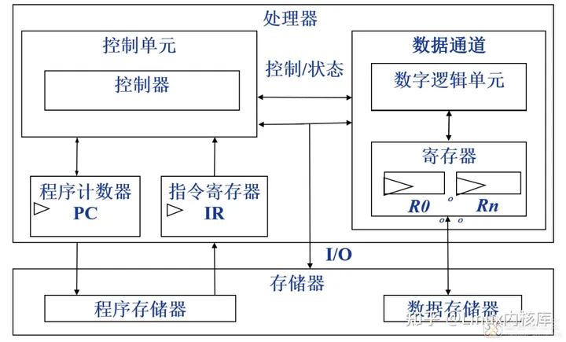

取指：
- 从存储器中获得下一条执行的指令读入指令寄存器；
- PC: [程序计数器, 总是指向下一条将要执行的指令；
- IR: 指令寄存器，用于保持已取得指令；如图：

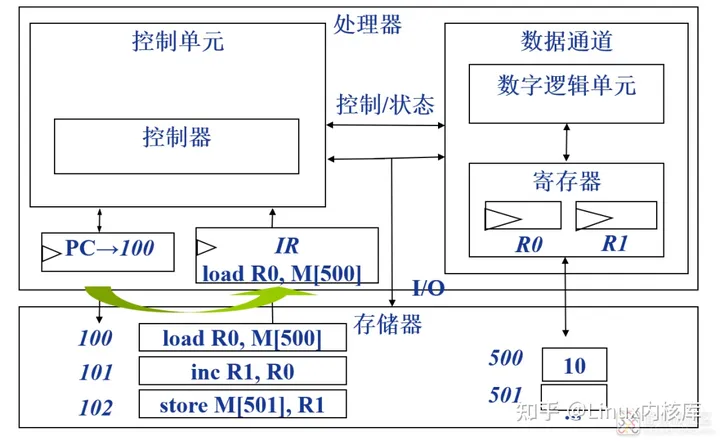

译码：解释指令，决定指令的执行意义；如图：

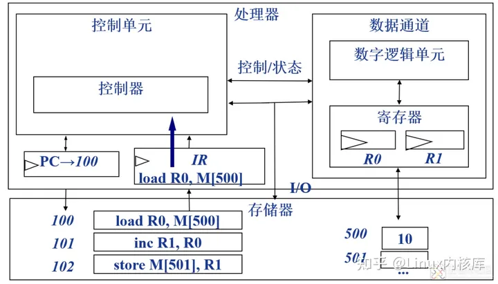

执行：
- 从存储器向数据通道寄存器移动数据；
- 通过算术逻辑单元 ALU 进行数据操作；如图：

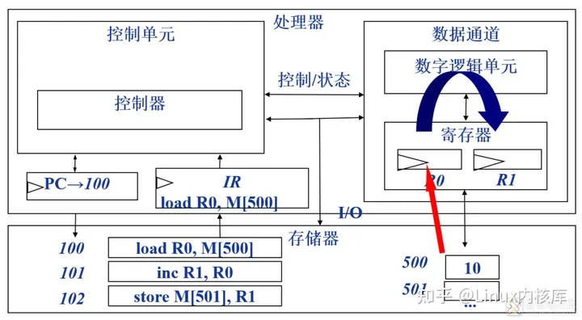

存储：
从寄存器向存储器写数据。如图：

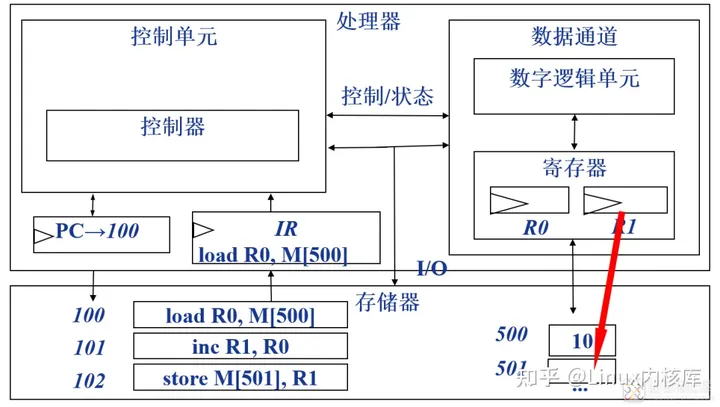

在一些微处理器上，如 ARM 系列处理器、DSP 等，指令实现流水线作业，指令过程按流水线的数目来进行划分。如 5 级流水线的处理器将指令分 5 个阶段执行。

按存储结构分：冯 · 诺依曼体系结构和哈佛体系结构

- 冯 · 诺伊曼结构也称普林斯顿结构，是一种将程序指令存储器和数据存储器合并在一起的存储器结构。

处理器，经由同一个总线传输来访问程序和数据存储器，程序指令和数据的宽度相同。如 X86 系列、ARM7 等，如图：

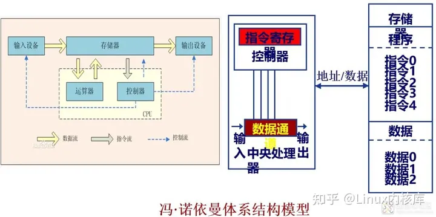

- 哈佛结构是一种将程序指令存储和数据存储分开的存储器结构，目的是为了减轻程序运行时的访存瓶颈。哈佛结构的微处理器通常具有较高的执行效率。

Microchip 公司的 PIC 系列芯片，摩托罗拉公司的 MC68 系列、Zilog 公司的 Z8 系列、ATMEL 公司的 AVR 系列和 ARM 公司的 ARM9、ARM10 和 ARM11
等。如图：

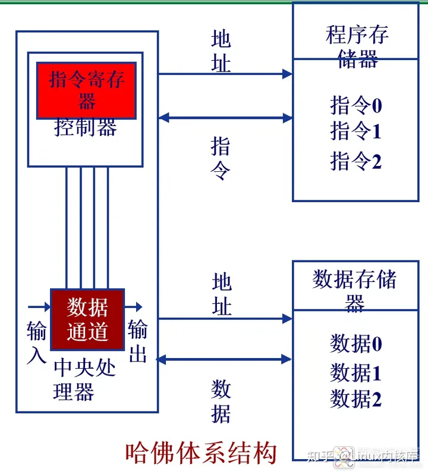


按指令类型可分为：复杂指令集（CISC）处理器和精简指令集（RISC）处理器 。

- CISC：复杂指令集（Complex Instruction Set Computer）；
    - 具有大量的指令和寻址方式，那么就需要更多的解释器。
    - 8/2 原则：80% 的程序只使用 20% 的指令；
    - 大多数程序只使用少量的指令就能够运行。
    - CISC 具有如下显著特点：
        1. 指令格式不固定，指令长度不一致，操作数可多可少；
        2. 寻址方式复杂多样，以利于程序的编写；
        3. 采用微程序结构，执行每条指令均需完成一个微指令序列；
        4. 每条指令需要若干个机器周期才能完成，指令越复杂，花费的机器周期越多。
- RISC：精简指令集（Reduced Instruction Set Computer)：指令数目少，在通道中只包含最有用的指令；执行时间短，确保数据通道快速执行每一条指令；使 CPU 硬件结构设计变得更为简单；每条指令都采用标准字长。

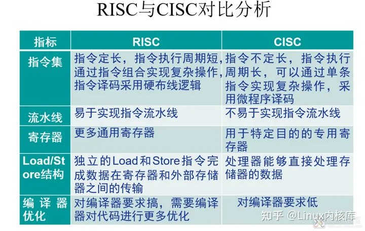

2、ARM 处理器体系架构

ARM 即 Advanced RISC Machines 的缩写。

1985 年 4 月 26 日，第一个 ARM 原型在英国剑桥的 Acorn 计算机有限公司诞生。20 世纪 80 年代后期，ARM 很快开发成 Acorn 的台式机产品，形成英国的计算机教育基础。1990 年成立了 Advanced RISC Machines Limited。20 世纪 90 年代，ARM32 位嵌人式 RISC（Reduced Instruction Set Computer）处理器扩展到世界范围，占据了低功耗、低成本和高性能的嵌入式系统应用领域的领先地位。目前己经占有 75% 以上的 32 位嵌入式产品市场。32 位 RISC 处理器受到青睐，领先的是 ARM 嵌入式微处理器系列。

ARM 公司虽然只成立 20 多年，但在 1999 年因移动电话火爆市场，其 32 位 RISC 处理器占市场份额超过了 50%，2001 年初，ARM 公司的 32 位 RISC 处理器市场占有率超过了 75%。ARM 公司是知识产权供应商，是设计公司。由合作伙伴公司来生产各具特色的芯片。

ARM 处理器特点：
1. ARM 指令是 32 位定长的（除 AArch64 架构部分增加指令为 64 位外）
2. 寄存器数量丰富（37 个寄存器）
3. 普通的 Load/Store 指令
4. 多寄存器的 Load/Store 指令
5. 指令的条件执行
6. 单时钟周期中的单条指令完成数据移位操作和 ALU 操作
7. 通过变种和协处理器来扩展 ARM 处理器的功能
8. 扩展了 16 位的 Thumb 指令来提高代码密度

ARM 的命名规则, 大致分成两类类：
- 基于 ARM Architecture 版本的 “处理器系列” 命名规则；
- 基于 ARM Architecture 版本的 “处理器型号” 命名规则。

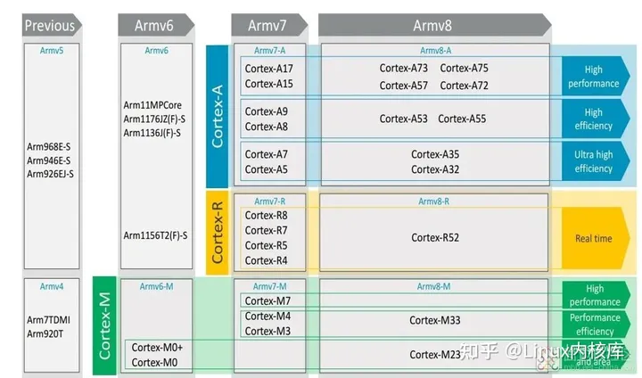

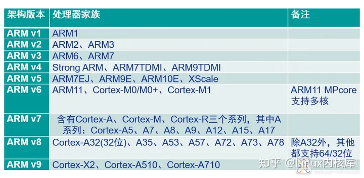


ARMv6 架构，引进了包括单指令多数据 (SIMD) 运算在内的一系列新功能。

ARMv6-M 架构，为低成本、高性能设备而设计，向以前由 8 位设备占主导地位的市场提供 32 位功能强大的解决方案。如 Cortex™-M0 和 Cortex-M1。

ARMv7 架构，所有 ARMv7 架构处理器都实现了 Thumb-2 技术（一个经过优化的 16/32 位混合指令集），此架构分为 3 类处理器：Cortex-A - 应用处理器、Cortex-R - 实时处理器、Cortex-M - 微控制器。

ARMv8 架构，ARMv8-A 将 64 位体系结构支持引入 ARM 体系结构中，其中包括：64 位通用寄存器、SP（堆栈指针）和 PC（程序计数器），64 位数据处理和扩展的虚拟寻址，兼容 32 位处理。

ARMv9 架构，最重大的升级在于 AI 和安全，在兼容 ARMv8 的基础上，提升了安全性，增加了矢量计算、机器学习和数据信号处理等多方面能力，性能表现也将得到极大幅度的提升。

1. ARM 数据类型
    1. 双字节（Double-Word）：64 位
    2. 字（Word）：在 ARM 体系结构中，字的长度为 32 位。
    3. 半字（Half-Word）：在 ARM 体系结构中，半字的长度为 16 位。
    4. 字节（Byte）：在 ARM 体系结构中，字节的长度为 8 位。

2. ARM 处理器存储格式

作为 32 位的微处理器，ARM 体系结构所支持的最大寻址空间为 4GB。ARM 体系结构可以用两种方法存储字数据，分别为大端模式和小端模式。

- 大端模式（高地高低）：字的高字节存储在低地址字节单元中，字的低字节存储在高地址字节单元中。

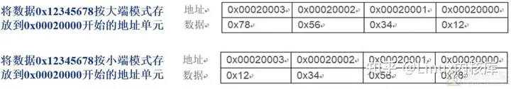

3. ARM 处理器工作状态

从编程的角度来看，ARM 微处理器的工作状态一般 ARM 和 Thumb 有两种，并可在两种状态之间切换。
（1）ARM 状态：此时处理器执行 32 位的字对齐 ARM 指令，绝大部分工作在此状态。
（2）Thumb 状态：此时处理器执行 16 位的半字对齐的 Thumb 指令。

THUMB 指令的特点：
- THUMB 代码所需空间为 ARM 代码的 70%；
- THUMB 代码所使用的指令数比 ARM 代码多 40%；
- 用 32 位存储器，ARM 代码比 THUMB 代码快 40%；
- 用 16 位存储器，THUMB 代码比 ARM 代码快 45%；
- 使用 THUMB 代码，外部存储器功耗比 ARM 代码少 30%

4. ARM 处理器工作模式

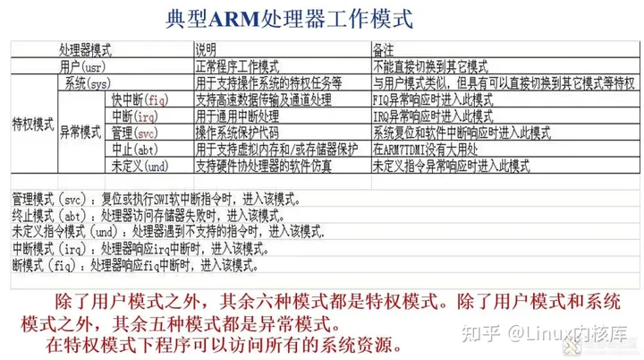

5. ARM Cortex-A 处理器工作模式

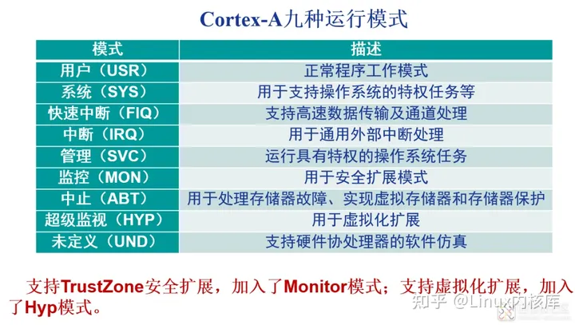

6. Cortex-A 寄存器组

34 个通用寄存器，包括各种模式下的 R0-R14 和共用的 R15 程序计数器 (PC)，这些寄存器都是 32 位的。8 个状态寄存器，Hyp 模式独有一个 ELR_Hyp 寄存器。

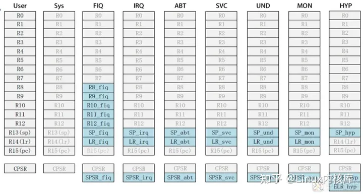

7. 程序状态寄存器 CPSR 和 SPSR

和其他处理器一样，ARM 有程序状态存储器来配置处理器工作模式和显示工作状态。ARM 处理器有两个程序状态寄存器 CPSR （Current Program Status Register，当前程序状态寄存器）和 SPSR （Saved Program Status Register，备份的程序状态寄存器）。

CPSR 可在任何运行模式下被访问，它包括条件标志位、中断禁止位、当前处理器模式标志位以及其他一些相关的控制和状态位。

每一种运行模式下都有一个专用的物理状态寄存器，称为 SPSR 为状态寄存器。

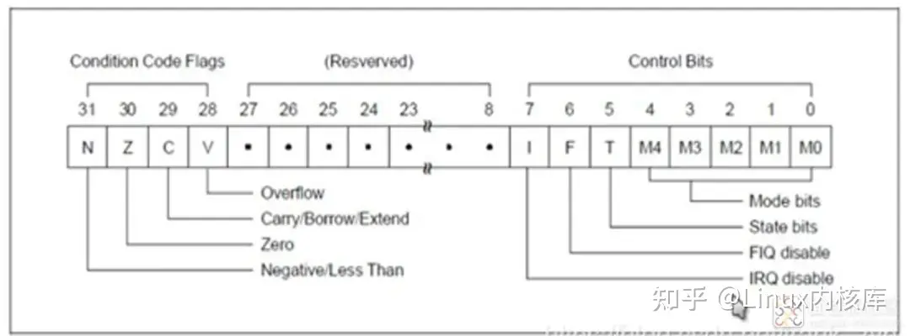

1. N（Negative）：当用两个补码表示的带符号数进行运算时，N=1 表示结果为负，N=0 表示结果为正数或零
2. Z（Zero）：Z=1 表示运算结果为 0，Z=0 表示运算结果非零
3. C（Carry）：有 4 种方法可以设置 C 的值：
    1. 加法指令（包括比较指令 CMP）
    2. 当运算产生进位时（无符号数溢出），C=1，否则 C=0
    3. 减法运算（包括比较指令 CMP）
    4. 当运算产生了借位（无符号数溢出），C=0，否则 C=1 对于包含移位操作的非加 / 减运算指令，C 为移出值的最后一位。对于其他的非加 / 减运算指令，C 的值通常不变。
4. V（Overflow）：有 2 种方法设置 V 的值：
    1. 对于加 / 减法运算指令，当操作数和运算结果为二进制的补码表示的带符号数时，V=1 表示符号位溢出。
    2. 对于其他的非加减法运算指令，V 的值通常不变。
5. I（Interrupt Request）：I=1 表示禁止响应 irq，I=0 表示允许响应
6. F（Fast Interrupt Request）：F=1 表示禁止响应 fiq，F=0 表示允许响应
7. T（Thumb）：T=0 表示当前状态位 ARM 状态，T=1 表示为 Thumb 状态
8. M4-M0：表示当前处理器的工作模式

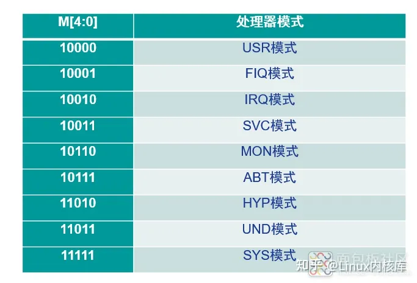

8. 工作模式的切换条件
    1. 执行软中断（SWI）或复位命令（Reset）指令。如果在用户模式下执行 SWI 指令，CPU 就进入管理（Supervisor）模式。
    2. 有外部中断发生。如果发生了外部中断，CPU 就会进入 IRQ 或 FIQ 模式。
    3. CPU 执行过程中产生异常。最典型的异常是由于 MMU 保护所引起的内存访问异常，此时 CPU 会切换到 Abort 模式。如果是无效指令，则会进入 Undefined 模式。
    4. 有一种模式是 CPU 无法自动进入的，这种模式就是 System 模式，要进入 System 模式必须由程序员编写指令来实现。要进入 System 模式只需改变 CPSR 的模式位为 System 模式对应的模式位即可。
    5. 在任何特权模式下，都可以通过修改 CPSR 的 MODE 域来进入其他模式。不过需要注意的是由于修改的 CPSR 是该模式下的影子 CPSR，即 SPSR，因此并不是实际的 CPSR，所以一般的做法是修改影子 CPSR，然后执行一个 MOVS 指令来恢复执行某个断点并切换到新模式。

3、ARM 处理器内存管理

1. 什么是内存映射

内存映射指的是在 ARM 存储系统中，使用内存管理单元 (MMU) 实现虚拟地址到实际物理地址的映射，如图所示。

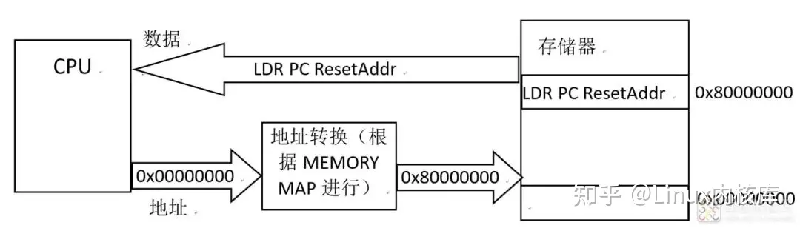

2. 为什么要内存映射

A32 架构的 ARM 的地址总线为 32 位，故 CPU 可寻址范围为 0x00000000~0xffffffff 寻址空间为 4GB，所有的内部和外部存储或者外设单元都需要通过对应的地址来操作，不同芯片外设的种类数量寻址空间都不一样，为了能让内核更方便的管理不同的芯片设计，ARM 内核会先给出预定义的存储映射。

芯片设计公司需要根据内核提供的预定义的存储器映射来定义芯片内部外设和外部的保留接口，这样做的好处是极大地减少了同一内核不同芯片间地址转化的麻烦（CPU 操作统一的虚拟地址，实际物理地址交由 MMU 管理）。

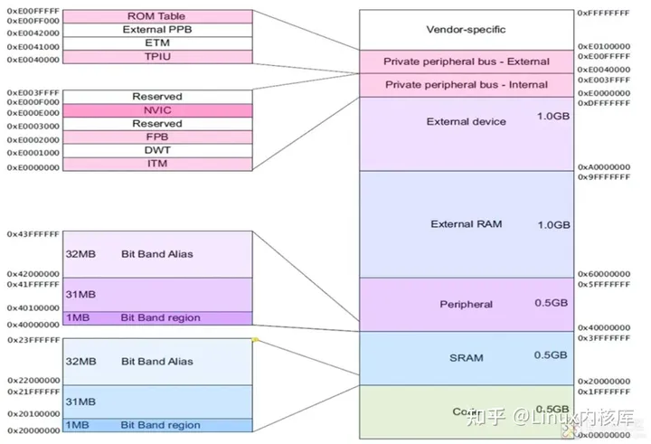

3. 位带操作

（1）什么是位带操作


举个简单的例子，在使用 51 单片机操作 P1.0 为低电平时我们知道这背后实际上就是往某个寄存器某个比特位中写 1 或 0 的过程，但在 CPU 操作的过程中每一个地址所对应的都是一个 8 位字节，怎么实现对其中某一位的直接操作，这就需要位带操作的帮助。

（2）哪些地址可以进行位带操作


上图中有两个区中实现了位带。其中一个是 SRAM 区的最低 1MB 范围（Bit band region），第二个则是片内外设区的最低 1MB 范围。

4. 寄存器的地址计算

在 ARM 中所有的外设地址基本都是挂载在 AHB 或者 APBx 总线上，因此我们往往采用基地址 + 偏移地址 + 结构体的方式，来快速明了计算某一外设具体寄存器的地址，如图所示。

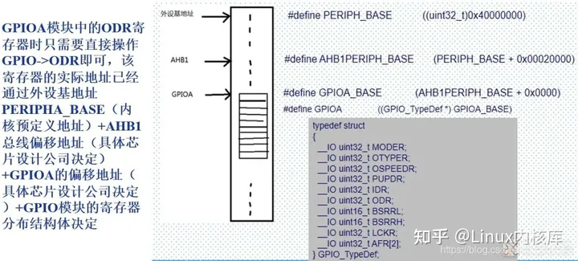

5. 集成外设寄存器访问方法

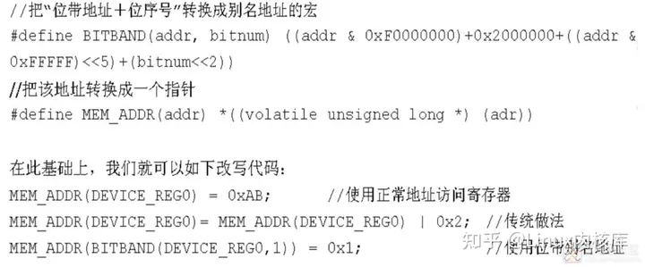

## tip [🔝](#weekly-68)

### 1. [github主页markdown文件输出数学公式注意事项](https://blog.csdn.net/NPU_Liuyuhang/article/details/135921167)

在 GitHub 上输入公式并不顺利，总结部分心得仅供参考。

1. 所有的下标符号 `'A_'` 都应该换成 `'A _'`，即空格 + 下划线或者使用反斜线 `\` 加空格
2. 上标依然使用符号 `^`
3. 公式块使用

   `$$\begin{align\\*}
   \end{align\\*}$$`

   且注意与前后文字内容预留一空行

4. 行内公式可使用 `$ $` 进行公式插入

5. 换行使用 6 个 `\`，即 `\\\\\\\\\\\\`

6. 公式块可同 latex 语言一致使用 & 进行对齐

7. 公式似乎无法自动添加序号，可使用 \ tag{1} 进行编号

8. 公式似乎无法使用 \ label 进行标签设定

9. 矩阵输入：

   `\\begin{array}{cc}
     a & b \\\\
     c & c
   \\end{array}`

10. 字符加粗可使用 \ boldsymbol 代替 \ bm

11. 暂时未找到输入大的圆括号的方法，大的中括号可以使用 `\ left \\[\right\\]`

12. 插入引用或者链接可以使用 `[] 内部 ^ + 字符` 的形式 `[^1]`，后在文中任意位置输入链接内容。

    `[^1]:http:cccccccccc`

其余内容大致与 latex 语言保持一致。

后续会给出参考链接，为个人 github 内容，仅供参考。

### 2. [探索PDF的奥秘:pdfrw库的神奇之旅](https://blog.csdn.net/east196/article/details/141832860)

1、pdfrw 是什么？

`pdfrw` 是一个 Python 库，专门用于读写 PDF 文件。它提供了一套简洁的 API 来处理 PDF 文档，包括但不限于添加页面、修改文本、插入图像等。

2、创建一个新的 PDF 文件

```Python
import pdfrw

new_pdf = pdfrw.PdfWriter()
new_pdf.write('new_document.pdf')
```

3、读取一个 PDF 文件

```Python
with pdfrw.PdfReader('example.pdf') as reader:
    pages = reader.pages
```

这里，我们打开了一个名为example.pdf的文件，并获取了它的页面列表。

4、添加页面到 PDF 文件

```Python
page = pdfrw.PageMerger().add_page()
new_pdf.add_page(page)
```

我们创建了一个新的页面，并将其添加到 PDF 文件中。

5、修改 PDF 页面的尺寸

```Python
page.set_size('A4')
```

将页面的尺寸设置为 A4。

6、保存修改后的 PDF 文件

```Python
new_pdf.write('modified_document.pdf')
```

7、合并多个 PDF 文件

```Python
from pdfrw import PdfReader, PdfWriter

reader1 = PdfReader('file1.pdf')
reader2 = PdfReader('file2.pdf')
writer = PdfWriter()

for page in reader1.pages:
    writer.add_page(page)
for page in reader2.pages:
    writer.add_page(page)

writer.write('merged.pdf')
```

8、从 PDF 中提取文本

提取第一个页面的文本内容。

```Python
from pdfrw import PdfReader

reader = PdfReader('document.pdf')
text = reader.pages[0].extract_text()
print(text)
```

9、添加水印到 PDF 页面

```Python
from pdfrw import PdfReader, PdfWriter, PageMerger

reader = PdfReader('original.pdf')
watermark = pdfrw.PageMerger().add_page()
watermark.merge_page(pdfrw.PageReader('watermark.pdf'))
writer = PdfWriter()

for page in reader.pages:
    writer.add_page(page)
    writer.add_page(watermark)

writer.write('watermarked.pdf')
```

为 PDF 的每一页添加水印

## share [🔝](#weekly-68)

### 1. [如何成为 -10x 工程师](https://taylor.town/-10x)

一个有趣的话题，注意到前面的负号，也即负效率

要成为一名 -10x 工程师，只需每周浪费 400 个工程小时即可。有以下表现：

Nullify the output of 10 engineers.

Change requirements as far into development as possible. To avoid blame, obfuscate requirements from the start.

Create 400 hours of busywork.

Ask your team to perform tasks that resemble work. Common examples include presentations, diagrams, and ticket management. Create pointless rituals.

Create 400 hours of burnout/turnover.

Be thankless. Foist blame. Sow confusion. Get angry. Cause others to work overtime.

Hold 10 engineers hostage in a technical discussion.

Let engineers discuss ideas. Encourage them to pursue elegance over pragmatism. Ensure nobody has the authority to make any decisions.

Add 400 hours of communication overhead.

Meetings wreck calendars. To inconspicuously waste others' time, write lengthy messages/documents and share as widely as possible. Welcome all opinions and aim for engagement.

Waste 10 weeks of wages on cloud costs.

Write slow programs. Avoid DB indexes. Run single-threaded programs on 16-core machines. Opt for exotic hardware with fancy RAM and GPUs. Store data on RAM/disk liberally. Don't compress anything. Pay no attention to data layouts.

Create useless tools.

Decide that existing solutions aren't quite what you need. Write scripts that only one person understands. If the script does something important, avoid documentation.

Add 400 hours of compilation/build time.

Slow builds waste time and incur compound interest. As build times increase, developers are more likely to distract themselves. To ensure developers are context-switching, recompilation should take at least 20 seconds. You can also write slow tests for similar effect.

Write pointless tests.

Create dependencies on particular variables without testing the underlying functionality. Mock function calls until no original code runs. Introduce subtle randomness into your tests so that they succeed/fail without cause.

Waste 400 hours of engineering on bad architecture.

Give zero consideration to how your system design will evolve over time. Alternatively, drive your team obsess over architecture decisions so that they don't have time to test their hypotheses.

Waste 400 hours on deployment.

Create as many environments as possible. Production and staging must differ wildly. Launch fragile code with fragile build systems. Migrate your databases frequently.

Lose 10 weeks of wages on unhappy customers.

Repeatedly fail to detect and address severe bugs. Pay no attention to security vulnerabilities.

Write worthless documentation.

Explain code in private messages. Write wikis that nobody uses.

Trap 10 engineers in a futile skunkworks project.

Attract bright engineers and waste their potential. Undersell the difficulty of the project to management; oversell the project's usefulness. Tell management it's"almost complete" until they scrap it.

Add dependencies that demand 400 hours of maintenance.

Engineers individually learn each library.

Delay pivoting.

Never admit failure. Drown your team in sunk-cost. Ignore 80/20 compromises that could improve your circumstances.

Hire 10 0x engineers.

Opportunity costs can kill. Dead-weights may not actively harm your team, but they sit in the chairs of people who could actively help.

Hire 5 -1x engineeers.

Don't settle for dead-weight. Actively hire engineers who cause catastrophies and resist learning.

Prevent 10 -1x engineers from getting fired.

Don't rock boats. Leave no paper trail of failures. Vouch for bad engineering.

Incur 400 hours of bug triage.

Make undebuggable programs. Plaster layers of abstraction over everything. Write spaghetti code. Make everything sensitive to initial conditions. Avoid pure functions. Use dependencies liberally. Say "it works on my machine" whenever possible.

[readme](../README.md) | [previous](202406W3.md) | [next](202407W1.md)
