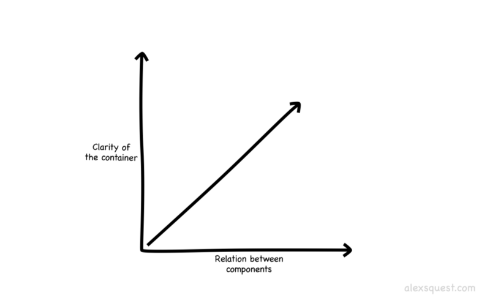
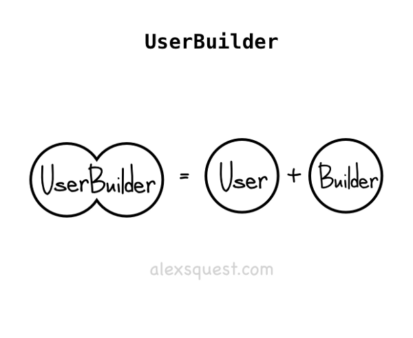
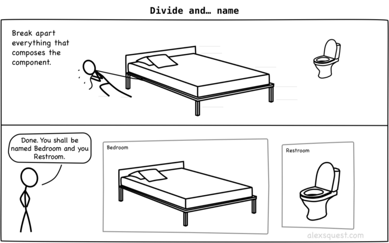
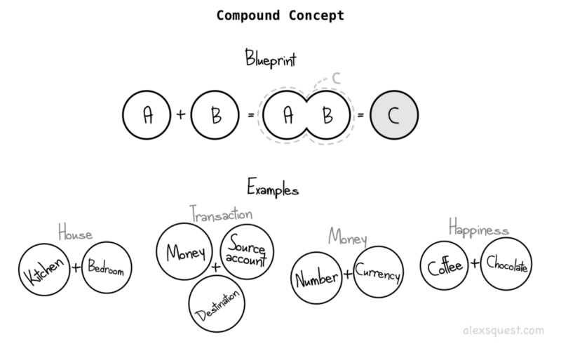
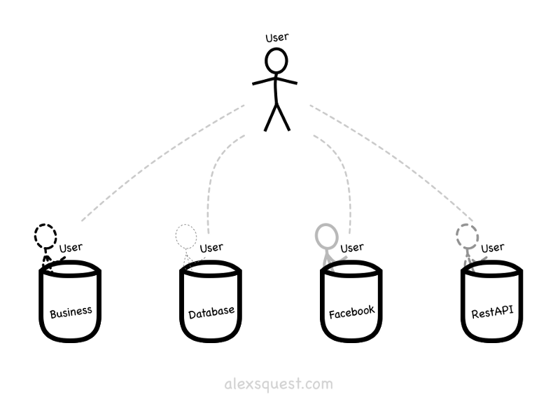

> @Author  : Lewis Tian (taseikyo@gmail.com)
>
> @Link    : github.com/taseikyo
>
> @Range   : 2024-06-30 - 2024-07-06

# Weekly #69

[readme](../README.md) | [previous](202406W4.md) | [next](202407W2.md)


\**Photo by [Josh Withers](https://unsplash.com/@joshwithers) on [Unsplash](https://unsplash.com/photos/a-man-standing-in-front-of-a-window-looking-out-at-a-city-FsFDZVeJ03U)*

## Table of Contents

- [algorithm](#algorithm-)
- [review](#review-)
    - Qt 5.14.2 深入理解 Qt 多线程编程
    - 软件的复杂性：命名的艺术
- [tip](#tip-)
- [share](#share-)
    - 好事，不排队，普通人

## algorithm [🔝](#weekly-69)

## review [🔝](#weekly-69)

### 1. [Qt 5.14.2 深入理解 Qt 多线程编程](https://blog.csdn.net/lizhong2008/article/details/136809143)

在高并发的软件系统中，多线程编程是解决性能瓶颈和提高系统吞吐量的有效手段。作为跨平台的应用程序开发框架，Qt 为我们提供了强大的多线程支持。本文将深入探讨 Qt 多线程编程的实现细节，并介绍线程池的设计思想，帮助读者彻底掌握 Qt 多线程编程技巧。

一、Qt 的两种多线程实现方式剖析

Qt 中实现多线程编程主要有两种方式：重写 QThread 类的 run() 函数和使用信号与槽。

1、重写 QThread 的 run() 函数

这种方式需要继承 QThread 类并重写虚函数 run()，将需要并发执行的代码逻辑放在 run() 函数中。例如:

```c++
class WorkThread : public QThread {
public:
    void run() override {
        //并发执行的代码
        qDebug() << "Current thread:" << QThread::currentThreadId();
        //执行耗时操作
        heavyWorkLoad();
    }
};
```

在主线程中，我们只需创建 WorkThread 对象并调用 start() 即可启动新线程:

```c++
WorkThread *worker = new WorkThread;
worker->start();
```

这种方法的优点是直观简单，缺点是 run() 函数作为线程执行体只能有一个入口，不太适合处理多个工作单元并发执行的场景。

2、使用信号与槽方式

Qt 的信号与槽机制也可以用于实现多线程编程，它的思路是:

（1）、创建 QThread 对象作为新线程

（2）、创建执行体对象，并使用 QObject::moveToThread() 将其移动到新线程

（3）、在主线程通过连接信号与槽的方式，间接调用执行体对象的槽函数，从而启动新线程中的任务


具体代码如下:

```c++
//ExecutionBody.h
class ExecutionBody : public QObject {
    Q_OBJECT
public slots:
    void execution() {
        //并发执行的代码
        qDebug() << "Executing in thread" << QThread::currentThreadId();
        heavyWorkLoad();
    }
};

//main.cpp
int main() {
    QThread *worker = new QThread;
    ExecutionBody *body = new ExecutionBody;
    body->moveToThread(worker);

    QObject::connect(worker， &QThread::started， body， &ExecutionBody::execution);
    worker->start();

    return app.exec();
}
```

相比第一种方法，信号与槽方式支持在新线程中执行多个函数，更加灵活。但也相对复杂一些，开发者需要清晰地理解信号连接、事件循环等概念。

二、突破瓶颈，构建高效线程池

前面介绍了 Qt 的基本多线程实现方式，不过在实际项目中，如果只是简单地启动固定数量的线程，可能会面临以下问题:

（1）、线程的创建和销毁代价较高

（2）、线程数量太多，会加重系统的线程调度开销

（3）、大量线程空转，造成 CPU 资源浪费

为了解决这些问题，我们需要引入线程池的概念，将闲置的线程资源统一管理和调度，避免频繁创建和销毁线程。Qt 提供了 QThreadPool 类实现了这一机制。

1、QThreadPool 设计原理

QThreadPool 内部管理了一组工作线程 (工作者线程)，当有任务投递时，线程池会将任务分配给空闲的工作线程执行，避免频繁创建和销毁线程。此外，QThreadPool 还支持设置活跃线程数上限，在线程全部忙碌时也不会盲目创建新的工作线程，从而避免过度占用系统资源。


QThreadPool 采用信号与槽的方式将任务分发给工作线程。具体来说，当我们调用 QThreadPool::start() 投递任务时，QThreadPool 会为任务创建一个 QRunnable 对象，并通过内部信号连接到某个工作线程，由工作线程执行 QRunnable 的 run() 函数。


2、QThreadPool 使用示例

下面通过一个简单的例子展示如何使用 QThreadPool:

```c++
//WorkerTask.h
class WorkerTask : public QRunnable {
public:
    void run() override {
        //执行任务逻辑
        qDebug() << "Executing task in thread" << QThread::currentThreadId();
        heavyWorkLoad();
    }
};

//main.cpp
int main() {
    QThreadPool *pool = QThreadPool::globalInstance();

    //设置最大线程数
    pool->setMaxThreadCount(QThread::idealThreadCount());

    //投递任务
    for(int i=0; i<200; ++i) {
        WorkerTask *task = new WorkerTask;
        pool->start(task);
    }

    return app.exec();
}
```

这个示例首先获取全局 QThreadPool 实例，并设置最大工作线程数为当前系统的理想线程数 (通常为 CPU 核心数)。然后循环构建 WorkerTask 对象并调用 QThreadPool::start() 投递，线程池会自动将任务分发给空闲的线程执行。


需要注意的是，QThreadPool 默认采用栈内存管理 QRunnable 对象，也就是说在 QRunnable 的 run() 函数执行完毕后，QThreadPool 会自动销毁对象。如果我们需要在 run() 函数执行完毕后继续访问 QRunnable 对象的数据成员，应该设置 QThreadPool 的 stackSize 属性 (即将对象放在堆内存分配)。

三、多线程开发中的注意事项

尽管 QThreadPool 大大简化了多线程编程流程，但在实际开发中，我们仍需注意一些潜在的安全隐患和性能风险:


1、线程间数据访问安全

当多个线程并发访问同一份数据时，很容易出现竞态条件。Qt 提供了 QMutex、QSemaphore、QReadWriteLock 等同步原语类，我们可以利用它们来保护线程间共享数据的完整性。


另外，Qt 还提供了 QAtomicInteger 和 QAtomicPointer 等原子操作类，能够确保基础数据类型的读写操作的原子性。对于简单的计数、状态位的读写，使用原子操作类可以避免加锁开销。

2、任务队列控制策略

使用 QThreadPool 虽然能避免频繁创建销毁线程，但如果任务投递过多且执行时间过长，任务队列会持续积压，可能导致响应延迟或内存占用過高。

因此，我们需要对任务队列的长度作出合理控制。QThreadPool 提供了两个相关的 API:

- QThreadPool::reserveThread() 可以为高优先级任务预留线程资源
- QThreadPool::setMaxThreadCount() 可以动态调整线程池的最大线程数

我们可以在投递任务前检查当前队列长度，对于优先级较高的任务使用 reserveThread() 保留资源，对于优先级较低的任务可以选择延迟投递或动态增加线程池大小。

3、避免死锁

在多线程编程中，如果多个线程互相持有对方所需要的锁资源，就会发生死锁。例如下面的代码:

```c++
QMutex mutex1， mutex2;

//线程1
mutex1.lock();
...
mutex2.lock(); //阻塞

//线程2
mutex2.lock();
...
mutex1.lock(); //阻塞
```

避免死锁的一个常用策略是: 对所有需要加锁的代码采用统一的加锁顺序，每个线程按相同顺序申请锁。

4、减少线程切换开销

线程切换是一个非常耗时的操作，会带来较大的性能开销。我们应该尽量减少线程切换的发生，例如:

- 将密集计算的代码块集中在一个或几个线程中，避免在多个线程间切换
- 避免线程中的循环中阻塞操作 (如休眠、加锁等)，这会使该线程长时间占用 CPU
- 采用无锁编程，利用原子操作和内存屏障指令实现线程安全操作

通过本文的介绍，希望你能够加深对 Qt 多线程编程的理解，在实际开发中合理使用多线程，提高应用程序的整体性能。下一篇文章将为你带来更多实战案例，进一步展示 Qt 多线程编程的实践技巧。

### 2. [软件的复杂性：命名的艺术](https://blog.csdn.net/weixin_34101784/article/details/89073494)

> 在计算机科学中只有两件困难的事情：缓存失效和命名规范。
> —— Phil Karlton

一、前言

编写优质代码本身是一件很困难的事情，为什么这么说？因为良好的编码风格是为了能更好的理解与阅读。通常我们会只注重前者，而忽略了后者的重要性。我们的代码虽然只编写一次，但是在阅读复审时会阅读许多次。

良好的编码习惯可以提高我们的阅读质量，比写作本身要轻松许多，我们可以站在宏观角度看待问题，远观大局，而不失细节。首先我们需要理解、分析清楚某个问题，然后用特有的，高效的，言简意赅的方式让更多人明白。对我来说，应该明确的把软件工程归属到社会科学领域。我们为谁编写代码，难道不是为了人类吗？（感觉原文作者装的有点过）

向其他人传递我们的想法以及编程思想，这就是我们在编码时要做的。

二、命名构造

为了说明我们的第一个概念，首先来做一个游戏，游戏名为 `“我们住在哪个房间？”`，如下会为你提供一张图片，请你说说看这是什么房间。

> 问题 1/3


从上面的图片不难看出，这肯定是客厅。基于一件物品，我们可以联想到一个房间的名称，这很简单，那么请看下图。

> 问题 2/3


基于这张图片，我们可以肯定的说，这是厕所。
通过上面两张图片，不难发现，房间的名称只是一个标签属性，有了这个标签，甚至我们不需要看它里面有什么东西。这样我们便可以建立第一个推论：

1、推论 1：容器（函数）的名称应包含其内部所有元素

可以将这个推论理解为 `鸭子类型`。如果有一张床？那么它就是卧室。我们也可以反过来进行分析。

**问题**：基于一个容器名称，我们可以推断出它的组成部分。如果我们以卧室为例，那么很有可能这个房间有一张床。这样我们便可以建立第二个推论：

2、推论 2：根据容器（函数）的名称推断其内部组成元素

现在我们有了两条推论，据此我们试着看下面这张图片。

> 问题 3/3


好吧，床和马桶在同一个房间？根据我们的推论，如上图片使我们很难立即做出判断，如果依然使用上述两条推论来给它下定义的话，那么我会称它为：怪物的房间。

这个问题并不在于同一个房间的物品数量上，而是完全不相关的物品被认作为具备同样的标签属性。在家中，我们通常会把有关联的，意图以及功能相近的东西放在一起，以免混淆视听，所以现在我们有了第三条推论：

3、推论 3：容器（函数）的明确度与其内部组件的密切程度成正比

这可能比较难理解，所以我们用下面这一张图来做说明：



如果容器内部元素属性关联性很强，那么我们更容易找到一个用来说明它的名字。反之，元素之间的无关性越强，越难以描述说明。属性维度可能会关系到他们的功能、目的、战略，类型等等。关于命名标准，需要关联到元素自身属性才有实际意义。跟着我的思路，我们将很快明白这一点。

在软件工程方面，这个观点也同样适用。例如我们熟知的 `组件`，`类`，`函数方法`，`服务`，`应用`。罗伯特 · 德拉奈曾说过：“我们的理解能力很大程度与我们的认知相关联”，那么在这种技术背景下，我们的代码是否可以使阅读者以最简单的方式感知到业务需求以及相关诉求？

三、Example 1：HTTP 域与汽车

HTTP 自身是一个域环境，它包含着我们的网络请求与响应状态。如果我们把一个 `Car` 的组件放入它的内部，那么我们不能再称它为 HTTP 了，在这种情况下，它会变得让人困惑。

```
public interface WhatIsAGoodNameForThis {
    /* methods for a car */
    public void gas();
    public void brake();

    /* methods for an HTTP client */
    public Response makeGetRequest(String param);
}
```


四、Example 2：单词的耦合

有一种常见的命名模式，在名称时后缀附加上 Builder 或 er 一类的结束词，例如：`SomethingBuilder`，`UserBuilder`，`AccountCreator`，`UserHelper`，`JobPerformer` 等等。



例如上图中的名字，我们可以推断出三件事情。第一，在类名中使用动词 `Build` 意味着它是具备功能性的。第二，它由两部分组成，一个是 `User 用户`，另一个的 `Builder 构造者`，这意味着它们之间可能在封装、维度归类上存在歧义。第三，`Builder 构造者` 可以在类内部访问 `User 用户` 的相关逻辑、数据，因为他们在同一纬度空间内。

这一点与工厂模式很相似，有自己的应用场景，当它在我们的工程中泛滥使用时，这将会是一个很麻烦的问题。另外，需要提醒大家，在工厂模式中，并不一定需要有一个类，通过一个 `createUser` 的方法足矣很好的实现工厂模式的功能。

五、Example 3: 基类

让我们先看几个生活中真实的例子。首先是 [i18n](https://github.com/svenfuchs/i18n/blob/master/lib/i18n.rb) `Ruby gem`（它的类与方法名称都是非常简练）。

```
class Base
    def config
    def translate
    def locale_available?(locale)
    def transliterate
end
```

这里，`Base` 这个命名本身并没有传达太多含义，其中内部结构包含了配置、翻译，区域设置，音译。它们可以看似无关的聚合在一起。

六、Example 4: 命名与构建

一个合理的命名可以引导我们构建出更为严瑾的组件容器。如下例所示。

```
class PostAlerter
    def notify_post_users
    def notify_group_summary
    def notify_non_pm_users
    def create_notification
    def unread_posts
    def unread_count
    def group_stats
end
```

`PostAlerter` 从这个名字本身可以发现，它意味着在内部会做一些类似提醒通知的功能。然而，其中 `unread_posts`，`unread_count`，`group_status` 并不在这个功能的主要范畴内，从这一点来看，这个类的名称并不是很理想。我们可以将这个三个方法移动到一个名为 `PostStatistics` 的类中，这样解耦后，事件功能会变得更加清晰，更可预测。

```
class PostAlerter
    def notify_post_users
    def notify_group_summary
    def notify_non_pm_users
    def create_notification
end

class PostsStatistics
     def unread_posts
     def unread_count
     def group_stats
end
```

七、Example 5: 奇怪的命名

在 Spring 框架中有一些例子，组件做的事情太多，其名称都非常冗长奇怪。这里只举一个例子（因为实在太多了）：

```
class SimpleBeanFactoryAwareAspectInstanceFactory {
    public ClassLoader getAspectClassLoader()
    public Object getAspectInstance()
    public int getOrder()
    public void setAspectBeanName(String aspectBeanName)
    public void setBeanFactory(BeanFactory beanFactory)
}
```

八、Example 6: 说说好的名称

我们聊了许多不太合理的命名，在 `D3` 的 [arc](https://github.com/d3/d3-shape/blob/master/src/arc.js) 中就有许多不错的命名定义，例如：

```
export default function() {
      /* ... */
      arc.centroid     = function() { /* ... */ }
      arc.innerRadius  = function() { /* ... */ }
      arc.outerRadius  = function() { /* ... */ }
      arc.cornerRadius = function() { /* ... */ }
      arc.padRadius    = function() { /* ... */ }
      arc.startAngle   = function() { /* ... */ }
      arc.endAngle     = function() { /* ... */ }
      arc.padAngle     = function() { /* ... */ }

      return arc;
}
```

上面这个例子中，每一个方法都是完全有意义的：他们都是以 `arc` 开头。并且他命名风格就像绘制下面的图片一样简练，令人欢喜。


九、方法 1: 拆解



**应用场景**：当你不能为类或方法找到一个合适的命名，但是你知道如何拆解它们，并且期望给他们的组合找到一个好的名称。

主要有两个步骤：

1.  分辨出他们之间的特点和概念

2.  将它们拆分开


在床和马桶这种特定耦合的场景下，为了拆解他们的不同之处，我们将床移动到左侧，将马桶移动到右侧。这样我们便将两个不同的事物分离开了。

当你不能为某个事物找到一个好的名称时，也许是因为你所面临的不止一件事物。不过现在我们已经知道，对多个事物进行命名是一件非常困难的事情，当我们遇到这类问题时，不妨确认一下构造这个事物的组成部分，以及动作行为。

**事例：**

我们现有一个未命名的类，其中包含了 `request`，`reponse`，`headers`，`URLs`，`body`，`caching`，`timeout`，把所有这些从类中拉取出来，我们剩下这样一些组件：`Request`，`Respone`，`Headers`，`URLs`，`ReponseBody`，`Cache`，`Timeout` 等。如果我们已知这些类的名称，那么我们可以确定这个类是用于处理 Web 请求的，HTTPClient 是一个不错的 Web 请求组件的命名。

当我们编码遇到困难时，先不要想着整体，先考虑一下局部细节。

十、方法 2: 发现新概念



**应用场景**：当一个类并不简单或者内容并不相干。

发现新的概念需要大量业务领域的知识，当软件的命名和业务保持一致时，一个普遍的语言便建立起来，它允许来自不同专业领域的人来使用相同的语言。

十一、方法 3: 分组标准

**应用场景**：当有一个好的命名，但是他们他们之间并不适合。

组件元素之前可以通过各种标准进行分组，譬如组件元素的物理性质，经济性，情感性，社会性以及软件中最常用的功能。

在软件工程中，我们倾向于按功能对组件元素进行分组。如果列出你的项目文件，你可能会看到像 `controller/`，`models/`，`adapters/`，`templates/` 等等目录名称，然后，有些时候，这些名称组合在一起并一定适合，这也是重新评估模块，重新定义，规划命名的时候。

每个应用程序都有自己不同的上下文环境，每个模块、每个类、每个方法也同样都有。`User` 这个词所代表的含义可以是操作系统用户，或是一张数据表，也可以是一个第三方的服务凭证，不同的上下文环境，它所表示的含义不尽相同。



十二、无意义的词与新词

多年以来，命名规范的演变上变得更具有意义，有更多的人来填补这个陈旧的空缺。

**Helper**，`helpers` 是一个支持应用程序实现的主要方式。应用程序实现与定义的标准是什么呢？应用程序中的所有内容都应该支持并实现其主要目标。

在实践中，它们被击中在一个非自然的分组中，为一写其他常用的操作提供可重用性。一般情况下，`helpers` 需要另一个组件元素的内部数据的依赖。这种命名一般会在找不到合适的名称时折中使用。

**Base**，许久之前，在 `C#` 中有需要继承类的命名方式都是以 `Base` 命名。例如：汽车和自行车的父类都是 `Base` 而不是 `Vehicle`。尽管微软提出建议去避免这类命名方式，但他依然影响了 `Ruby` 这门语言，其中最具代表性的是 `ActiveRecord` 类的继承。到目前为止，我们依然将 `Base` 看做为开发人员找不到合适命名的一种替代方式。

变动调整后的 `Base` 含括了 `Common` 和 `Utils`，例如，JSON Ruby gem 的 `Common` 类具有 `parse`，`generate`，`load` 以及 `jj` 等方法，但这里 `Common` 真的具备它的含义吗？

**Tasks**，在 `JavaScript` 社区兴起了一种通过异步调用函数的方式，这种方式起源于 `task.js`，即使目前这个开源库很少再被提使用，但是这个术语流传了下来。

如果团队中所有人都能清楚的理解它的含义，那是可喜的。但如果有新人加入团队，并且他遇到了被抛弃在垃圾堆中的 60 年代便存在的古怪命名，那又怎么办呢？

在我之前的项目工作中，曾遇到过这样的一个类的命名，你们猜猜看，`Atlanta`，是的，亚特兰大，操蛋的亚特兰大。没人知道或者可以告诉我为什么要起这么个名字，以及含义是什么。

十三、参考资料

- Cwalina，Krzysztof.2009，框架设计指南：可重用 .NET 库的约定、惯用语和模式，第二版。 Boston: Pearson Education, Inc. 206。
- Evans, Eric. 2003。域驱动设计：解决软件核心复杂性。Boston: Addison-Wesley Professional。

原文链接：https://medium.com/hacker-daily/software-complexity-naming-6e02e7e6c8cb

## tip [🔝](#weekly-69)

## share [🔝](#weekly-69)

### 1. 好事，不排队，普通人

> 好事，不排队，普通人，
>
> 这三个永远不可能同时出现。
>
> 牢记这一条。

[readme](../README.md) | [previous](202406W4.md) | [next](202407W2.md)
